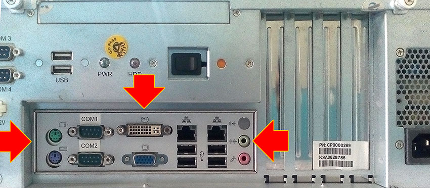
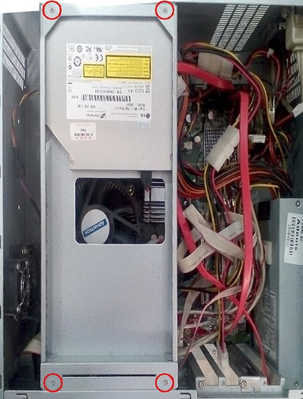
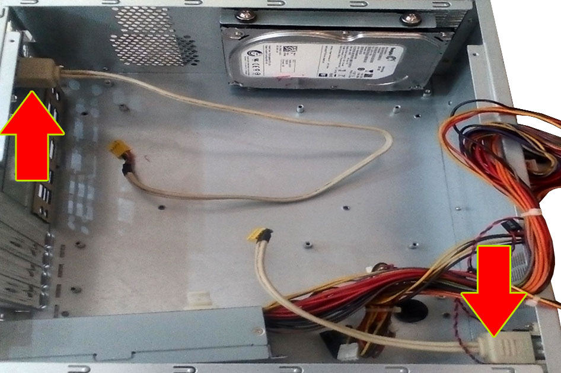
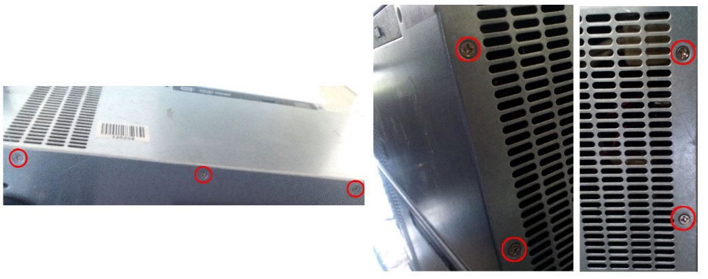
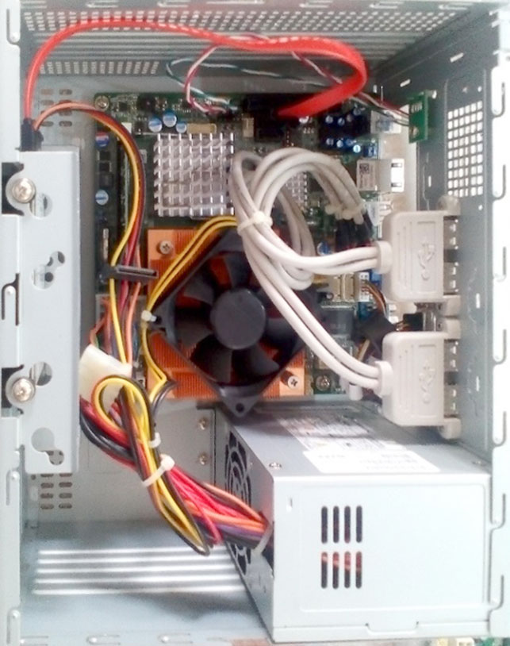
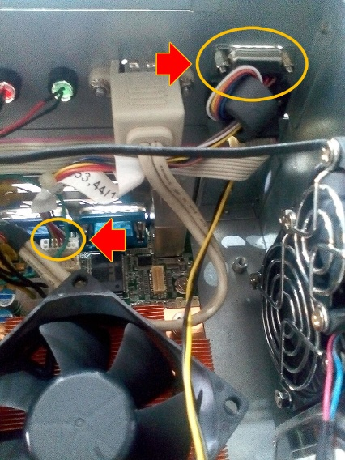
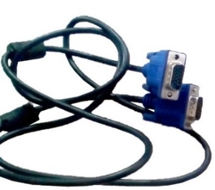

# Document metadata

- **Title:** دستورالعمل استفاده از مادربرد G41 در PCهای Advantech
- **Author:** Arash Tighbor
- **Last Modified By:** Amir Ali Eskandari
- **Created:** 2016-04-12T11:27:00Z
- **Modified:** 2026-09-21T09:04:00Z
- **Document Name:** 1-IT0005-397-00_Advantech to G41 edited.docx
- **Source File:** C:\Users\aa.eskandari\Desktop\input\1-IT0005-397-00_Advantech to G41 edited.docx

---

دستورالعمل استفاده از مادربرد G41 در PCهای Advantech

!{ **ver:1-IT0005-397-00**}

<!-- TABLE_OF_CONTENTS_START -->
**فهرست**

بررسی Shield I/O در PCهای Advantechو G41 ............................................................................................[1](1-IT0005-397-00_Advantech%20to%20G41.docx)

مراحل دمونتاژ کیس نوع ADVANTECH ..........................................................................................................[2](1-IT0005-397-00_Advantech%20to%20G41.docx)

مراحل دمونتاژ کیس نوع G41 ..................................................................................................................................[4](1-IT0005-397-00_Advantech%20to%20G41.docx)

مونتاژ مادربرد G41 در قاب کیس ADVANTECH ..............................................................................................[5](1-IT0005-397-00_Advantech%20to%20G41.docx)

کابل تصویر موردنیاز ..........................................................................................................................................................[6](1-IT0005-397-00_Advantech%20to%20G41.docx)

چک لیست .........................................................................................................................................................................[.7](1-IT0005-397-00_Advantech%20to%20G41.docx)

<!-- TABLE_OF_CONTENTS_END -->

پیش گفتار

این سند با عنوان «دستورالعمل استفاده از مادربرد G41درPCهای Advantech» در خرداد ماه 1400 در گروه پشتیبانی سطح 2 امور عملیات شرکت توسعه خدمات الکترونیکی آدونیس توسط آقای ولی الله حلال خور تهیه و تنظیم شده است. این دستورالعمل در واحد آموزش امور فناوری اطلاعات، توسط آرش تیغ بر ویرایش و باشماره نسخه ی**{!{ver:1-IT0005-397-00**آماده انتشار گردید.

سابقه ویرایش :!{edit:none} جدید، نسخه قبلی فاقد اعتبار خواهد بود.


# بررسی Shield I/O در PCهای Advantechو G41!{hvkeywords: pre installation}

در این سند نحوه ی استفاده از مادربرد G41در PC های Advantech شرح داده شده است.

قبل از انجام هر کاری، وضعیت Shield I/O در PCهای Advantechو G41را بررسی نمایید:


**Image analysis**

```json
{
 "image_name": "image1.jpeg",
 "rId": "rId15",
 "image_path": "img_folder/image_001_image1.jpg",
 "caption": "مقایسه پنل پشتی I/O برای مادربرد Advantec و G41 با برچسب ها و پورت ها",
 "ocr_text": "COM1\nCOM2\nI/O Advantec Shield\nI/O G41 Shield\nUV\nWX",
 "visual_description": [
 "دو تصویر از شیلد پنل پشتی I/O مادربرد نمایش داده شده است",
 "در تصویر بالا برچسب های COM1 و COM2 و متن I/O Advantec Shield دیده می شود",
 "در تصویر بالا آیکون USB و چندین بریدگی مستطیلی برای پورت ها وجود دارد",
 "در تصویر پایین متن I/O G41 Shield دیده می شود",
 "در تصویر پایین دو برچسب UV و WX در کنار بریدگی های پورت ها قرار دارد",
 "در تصویر پایین چند سوراخ دایره ای در سمت راست برای جک ها/اتصالات دیده می شود"
 ],
 "image_type": "photo"
}
```

G41-MOTHER BOARD I/O SHEILD

توجه داشته باشید؛ درصورتی که I/O Shield همانند تصویر زیر از نوع ثابت باشد، امکان انجام تغییرات فراهم نخواهد بود:


**Image analysis**

```json
{
 "image_name": "image2.jpeg",
 "rId": "rId16",
 "image_path": "img_folder/image_002_image2.jpg",
 "caption": "پنل داخلی کیس صنعتی با برچسب پورت های COM و USB و محفظه های کارت/اسلات",
 "ocr_text": "COM 3\nCOM 4\nDC 12V\nLCD POWER\nUSB\nPWR\nHDD\nCOM1\nCOM2\nPN-CP0000269\nKSA0854451",
 "visual_description": [
 "وجود برچسب های پورت COM 3 و COM 4 در سمت چپ",
 "وجود برچسب DC 12V و LCD POWER در بخش چپ پایین",
 "وجود برچسب USB و دو نشانگر با برچسب های PWR و HDD",
 "وجود برچسب های COM1 و COM2 در بخش پایین",
 "چهار محفظه/اسلات عمودی در سمت راست تصویر",
 "برچسب قطعه روی یکی از محفظه ها با متن PN-CP0000269 و KSA0854451"
 ],
 "image_type": "photo"
}
```

نمای ADVANTECH PC CASE

تنها در صورتی می توانید تغییرات مندرج در این سند را اعمال کنید که I/O shield همانند شکل زیر باشد:



**Image analysis**

```json
{
 "image_name": "image3.jpg",
 "rId": "rId17",
 "image_path": "img_folder/image_003_image3.jpg",
 "caption": "پنل پشتی کیس کامپیوتر با پورت های USB، سریال، DVI، VGA، شبکه و جک های صدا",
 "ocr_text": "USB\nPWR\nHDD\nCOM1\nCOM2\nPM:C000002809\nKSA0628786\nIII III III",
 "visual_description": [
 "دو پورت USB نوع A در بخش بالایی پنل دیده می شود",
 "چراغ ها/نشانگرهای با برچسب PWR و HDD مشاهده می شوند",
 "در پنل I/O دو پورت سریال DB9 با برچسب های COM1 و COM2 وجود دارد",
 "یک کانکتور DVI و یک کانکتور VGA (D-Sub) دیده می شود",
 "دو پورت شبکه RJ45 و چهار پورت USB نوع A در کنار آن ها قرار دارند",
 "سه جک 3.5 میلی متری صدا (آبی، سبز، صورتی) در سمت راست پنل وجود دارد",
 "سه فلش قرمز روی تصویر برای اشاره به بخش های پنل نمایش داده شده اند",
 "برچسب سفید با متن PM:C000002809 و KSA0628786 روی قسمت راست بدنه نصب شده است"
 ],
 "image_type": "photo"
}
```

ADVATECH PC – AFTER INSTALL G41 MOTHER BOARD I/O SHIELD

# مراحل دمونتاژ کیس نوع ADVANTECH

مراحل زیر را انجام دهید:

1. پلیت مربوط به DVD-ROM را بازکنید.



**Image analysis**

```json
{
 "image_name": "image4.jpeg",
 "rId": "rId18",
 "image_path": "img_folder/image_004_image4.jpg",
 "caption": "نمای داخل کیس رایانه با منبع تغذیه، کابل ها و پیچ های مشخص شده با دایره قرمز",
 "ocr_text": "",
 "visual_description": [
 "داخل کیس رایانه با منبع تغذیه فلزی در سمت چپ و قطعات مادربرد در سمت راست دیده می شود",
 "چهار دایره قرمز محل چهار پیچ را در گوشه های منبع تغذیه نشان می دهد",
 "کابل های برق چندرنگ و یک کابل نواری (Ribbon) سفید در سمت راست مشاهده می شود",
 "یک فن با برچسب آبی روی آن در بخش پایینی محفظه منبع تغذیه دیده می شود",
 "دو کابل قرمز (احتمالاً کابل های داده) به سمت پایین و راست کیس عبور داده شده اند"
 ],
 "image_type": "photo"
}
```

پیچ های نگهدارنده بخش DVD-ROM

2. کابل های متصل به مادربرد را خارج نمایید.
3. پیچ های مادربرد را بازکنید:


**Image analysis**

```json
{
 "image_name": "image5.jpg",
 "rId": "rId19",
 "image_path": "img_folder/image_005_image5.jpg",
 "caption": "نمای داخل کیس رایانه با مادربرد، فن پردازنده و فلش های قرمز روی نقاط مختلف",
 "ocr_text": "Foxconn\nFC\nCE",
 "visual_description": [
 "نمای داخلی کیس با مادربرد سبزرنگ، هیت سینک ها، اسلات های توسعه و کابل های برق/داده",
 "فن خنک کننده CPU در سمت راستِ میانی مادربرد نصب شده و روی هاب فن متن Foxconn دیده می شود",
 "دو اسلات حافظه RAM به رنگ قرمز در پایینِ سمت راست مادربرد قابل مشاهده است",
 "یک هارد دیسک 3.5 اینچی در سمت راست کیس نصب شده است",
 "چند فلش و دایره قرمز روی تصویر نقاطی از مادربرد/اتصالات را علامت گذاری کرده اند",
 "نشان های FC و CE روی برد در نزدیکی بخش میانی-پایینی قابل مشاهده است"
 ],
 "image_type": "photo"
}
```

پیچ های نگهدارنده مادربرد

4. مادربرد پی سی Advantech را همانند تصویر از جایش درآورید.
5. I/O Shield را خارج کنید:


**Image analysis**

```json
{
 "image_name": "image6.jpeg",
 "rId": "rId20",
 "image_path": "img_folder/image_006_image6.jpg",
 "caption": "داخل کیس کامپیوتر با مادربرد و پنل پشتی پورت ها",
 "ocr_text": "COM1\nCOM2\nADVANTECH",
 "visual_description": [
 "پنل پشتی مادربرد با برچسب های COM1 و COM2 دیده می شود",
 "روی فن خنک کننده پردازنده لوگوی ADVANTECH قابل مشاهده است",
 "داخل کیس مادربرد، فن CPU، اسلات های توسعه و یک هارد دیسک نصب شده دیده می شود"
 ],
 "image_type": "photo"
}
```

G41-MB-I/O SHEILD

6. محل USB Expanderهای تعبیه شده در پی سی Advantech را جابه جا نمایید:



**Image analysis**

```json
{
 "image_name": "image7.jpg",
 "rId": "rId21",
 "image_path": "img_folder/image_007_image7.jpg",
 "caption": "داخل کیس کامپیوتر با هارددیسک نصب شده و کابل های برق و داده؛ دو فلش محل اتصالات را نشان می دهند.",
 "ocr_text": "",
 "visual_description": [
 "نمای داخل کیس رایانه رومیزی با یک هارددیسک 3.5 اینچی نصب شده در بالای تصویر",
 "کابل های چندرنگ منبع تغذیه در سمت راست تصویر دیده می شوند",
 "دو کابل روشن (احتمالاً کابل داده/برق) در وسط کیس قرار دارند و سر کانکتورها قابل مشاهده است",
 "دو فلش قرمز با حاشیه زرد روی تصویر، یکی در سمت چپ و دیگری در پایین راست برای اشاره به نقاط اتصال/مسیر کابل ها"
 ],
 "image_type": "photo"
}
```

USB EXPANDER

7. به منظور باز کردن USB Expander، همانند تصویر زیر، پیچ های قاب خروجی بازکنید.



**Image analysis**

```json
{
 "image_name": "image8.jpeg",
 "rId": "rId22",
 "image_path": "img_folder/image_008_image8.jpg",
 "caption": "تصویر بدنه دستگاه با پیچ های مشخص شده و دریچه های تهویه",
 "ocr_text": "",
 "visual_description": [
 "سه نمای نزدیک از بدنه فلزی یک دستگاه نمایش داده شده است",
 "روی بدنه دریچه های تهویه مشبک (اسلات های افقی) دیده می شود",
 "چند پیچ با دایره قرمز علامت گذاری شده اند (در کناره ها و نزدیک دریچه های تهویه)",
 "یک برچسب بارکد روی سطح بالایی/پشتی دستگاه دیده می شود اما متن آن خوانا نیست"
 ],
 "image_type": "photo"
}
```

اتصالات USB EXPANDER

# مراحل دمونتاژ کیس نوع G41

1. پورت های USB را جابجا نمایید.
2. پی سی G41را بازکنید.
3. مادربرد، I/O Shield و پورت COM را از آن خارج نمایید:


**Image analysis**

```json
{
 "image_name": "image9.jpg",
 "rId": "rId23",
 "image_path": "img_folder/image_009_image9.jpg",
 "caption": "نمای پشت کیس با پورت COM مشخص شده با فلش",
 "ocr_text": "COM\nپورت",
 "visual_description": [
 "فلش قرمز به کانکتور سریال DB9 (پورت COM) اشاره می کند",
 "پنل پشتی مادربرد با چند پورت USB و یک پورت VGA قابل مشاهده است",
 "دو پورت PS/2 با رنگ های سبز و بنفش در پایین راست دیده می شود",
 "جک های صوتی 3.5 میلی متری در بالای پنل پشتی وجود دارد",
 "کلید پاور و ورودی برق AC پاور در پایین تصویر دیده می شود"
 ],
 "image_type": "photo"
}
```

g41-pc sheild & port



**Image analysis**

```json
{
 "image_name": "image10.jpg",
 "rId": "rId24",
 "image_path": "img_folder/image_010_image10.jpg",
 "caption": "نمای داخلی کیس کامپیوتر با مادربرد، کابل ها، فن پردازنده و منبع تغذیه",
 "ocr_text": "",
 "visual_description": [
 "عکس از داخل یک کیس رایانه با مادربرد نصب شده",
 "یک فن خنک کننده روی هیت سینک پردازنده در مرکز تصویر دیده می شود",
 "کابل های برق چندرنگ از منبع تغذیه به داخل کیس کشیده شده اند",
 "چند کابل سفید به صورت دسته بندی شده روی مادربرد قرار گرفته اند",
 "کابل های قرمز در بالای کیس (احتمالاً کابل های دیتا) قابل مشاهده هستند",
 "منبع تغذیه در پایین سمت راست کیس نصب است و دریچه های تهویه دارد"
 ],
 "image_type": "photo"
}
```

g41 -pc over view

# مونتاژ مادربرد G41 در قاب کیس ADVANTECH

I/O Shield مربوط پی سی G41 را روی پی سی Advantech سوار کنید و پیچ های آن را ببندید.

مادربرد G41 را روی پی سی Advantech جایگذاری کنید و پیچ های آن را ببندید.

کابل های دستگاه را متصل کنید:

<!-- TABLE_START -->
| | |
| --- | --- |
|

**Image analysis**

```json
{
 "image_name": "image11.jpeg",
 "rId": "rId25",
 "image_path": "img_folder/image_011_image11.jpg",
 "caption": "نمای داخلی کیس با مادربرد، کابل ها و فلش های راهنمای اتصالات",
 "ocr_text": "3.4.1",
 "visual_description": [
 "عکس از داخل یک کیس/محفظه فلزی با مادربرد و کابل کشی قابل مشاهده",
 "یک کانکتور D-sub چندپین در بالای تصویر با کابل چندرنگ متصل شده و با بیضی زرد مشخص شده است",
 "یک هدر پین روی مادربرد با بیضی زرد و فلش قرمز مشخص شده است",
 "کابل فلت خاکستری از روی مادربرد عبور کرده است",
 "فن خنک کننده در پایین تصویر و یک فن دیگر با گریل فلزی در سمت راست دیده می شود",
 "برچسب کوچک با متن «3.4.1» روی یکی از کابل ها/بخش ها دیده می شود"
 ],
 "image_type": "photo"
}
``` |

**Image analysis**

```json
{
 "image_name": "image12.jpg",
 "rId": "rId26",
 "image_path": "img_folder/image_012_image12.jpg",
 "caption": "نمای داخلی کیس کامپیوتر با مادربرد، هیت سینک و فن خنک کننده و هارد دیسک",
 "ocr_text": "",
 "visual_description": [
 "داخل یک کیس فلزی کامپیوتر دیده می شود",
 "یک مادربرد با چند هیت سینک آلومینیومی روی چیپ ها نصب شده است",
 "یک فن مربع شکل روی هیت سینک نارنجی رنگ قرار دارد",
 "پورت های پشت مادربرد شامل چند درگاه USB و یک پورت VGA آبی قابل مشاهده است",
 "یک کابل برق 24 پین ATX در لبه پایین مادربرد دیده می شود",
 "یک هارد دیسک 3.5 اینچی در سمت راست تصویر نصب شده است",
 "کابل های تغذیه رنگی در سمت چپ کیس مشاهده می شود"
 ],
 "image_type": "photo"
}
``` مادربرد جی41 |
<!-- TABLE_END -->

حتماً از عملکرد تمامی ماژول های متصل به مادربرد، اعم از فن کیس،
DVD-ROM، USB Port و HDD، اطمینان حاصل نمایید. همچنین کلید ON/OFF و LEDهای مربوط به کیس نیز باید غیرفعال باشند.

# کابل تصویر موردنیاز

به منظور بهره برداری PC های Advantech که در آنها از مادربرد G41 استفاده شده است، با توجه به مدل مانیتور و درصورتی که فقط خروجی DVI موجود است، از کابل دیتای استفاده شده در خودپرداز 285DY استفاده نمایید:


**Image analysis**

```json
{
 "image_name": "image13.jpeg",
 "rId": "rId27",
 "image_path": "img_folder/image_013_image13.jpg",
 "caption": "کابل خاکستری با کانکتورهای فلزی چندپین در دو سر",
 "ocr_text": "",
 "visual_description": [
 "یک کابل خاکستری به صورت حلقه شده دیده می شود",
 "در یک سر کابل یک کانکتور فلزی مستطیلی چندپین با پیچ های جانبی مشاهده می شود",
 "در سر دیگر یک کانکتور فلزی کوچک تر با بدنه مستطیلی دیده می شود",
 "نواحی نزدیک کانکتورها با روکش/نوار شفاف پوشانده شده اند"
 ],
 "image_type": "photo"
}
```

کابل DVI

در صورت وجود خروجی DVI در کنار VGA، باید از کابل VGA به طول 3 متر استفاده کنید:



**Image analysis**

```json
{
 "image_name": "image14.jpeg",
 "rId": "rId28",
 "image_path": "img_folder/image_014_image14.jpg",
 "caption": "کابل رابط با دو کانکتور D-sub شبیه VGA در یک سر کابل",
 "ocr_text": "",
 "visual_description": [
 "یک کابل مشکی پیچ خورده با دو کانکتور ۱۵ پین D-sub مادگی (نوع VGA) به صورت دوشاخه در یک سر کابل دیده می شود",
 "کانکتورها دارای بدنه آبی و پیچ های اتصال در دو طرف هستند"
 ],
 "image_type": "photo"
}
```

کابل VGA

# چک لیست

<!-- TABLE_START -->
| | |
| --- | --- |
| سلامتی ظاهری مادربرد g-41 mini beetle | [ ] |
| دسترسی به pc-advantech | [ ] |
| دسترسی به pc-g41 mini neetle | [ ] |
| کابل vga 3 متری | [ ] |
<!-- TABLE_END -->