# Document metadata

- **Author:** Arash Tighbor
- **Last Modified By:** Arash Tighbor
- **Created:** 2016-04-12T11:27:00Z
- **Modified:** 2021-08-09T06:38:00Z
- **Document Name:** 1-IT0005-397-00_Advantech to G41.docx
- **Source File:** C:\Users\aa.eskandari\Desktop\input\1-IT0005-397-00_Advantech to G41.docx

---

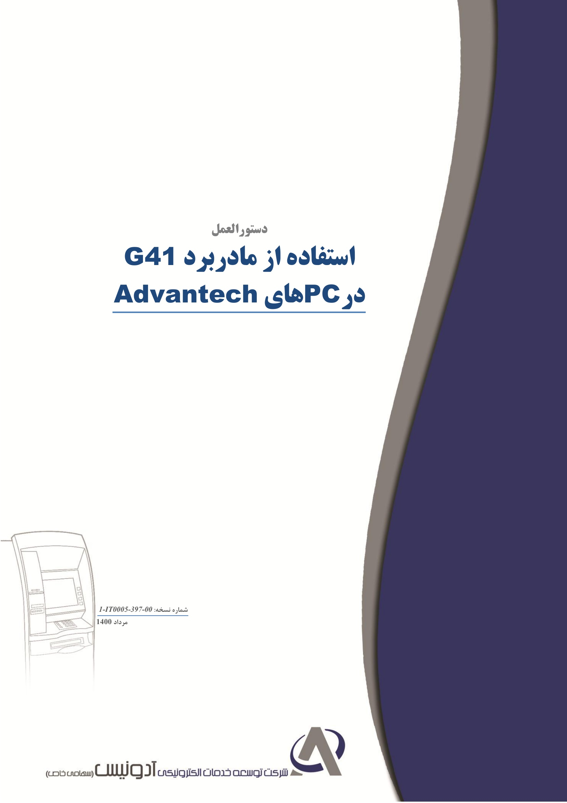

**Image analysis**

```json
{
 "image_name": "image1.jpg",
 "rId": "rId8",
 "image_path": "img_folder/image_001_image1.jpg",
 "caption": "جلد دستورالعمل استفاده از مادربرد G41 در PCهای Advantech",
 "ocr_text": "دستورالعمل\nاستفاده از مادربرد G41\nدرPCهای Advantech\nشماره نسخه: 1-IT0005-397-00\nمرداد 1400\nشرکت توسعه خدمات الکترونیکی آدونیس (سهامی خاص)",
 "visual_description": [
 "صفحه عنوان/جلد یک سند فارسی با تیتر اصلی مرتبط با مادربرد G41 و PCهای Advantech",
 "وجود شماره نسخه 1-IT0005-397-00 و تاریخ مرداد 1400",
 "نمایش نام شرکت «شرکت توسعه خدمات الکترونیکی آدونیس (سهامی خاص)» و لوگو در پایین صفحه",
 "طرح خطی یک دستگاه/کیوسک در گوشه پایین چپ"
 ],
 "image_type": "scan"
}
```

**دستورالعمل**

**استفاده از مادربرد G41**

**درPCهای Advantech**

**شماره نسخه: 1-IT0005-397-00**

**مرداد 1400**


**Image analysis**

```json
{
 "image_name": "image2.png",
 "rId": "rId9",
 "image_path": "img_folder/image_002_image2.png",
 "caption": "لوگوی شرکت آدونیس و عبارت شرکت توسعه خدمات الکترونیکی",
 "ocr_text": "آدونیس شرکت توسعه خدمات الکترونیکی",
 "visual_description": [
 "لوگوی تایپوگرافی فارسی «آدونیس» در سمت چپ با رنگ خاکستری",
 "متن «شرکت توسعه خدمات الکترونیکی» در میانه با رنگ آبی",
 "نشان گرافیکی شامل حرف A خاکستری در سمت راست با قوس/حلقه آبی پیرامون آن",
 "پس زمینه کاملاً مشکی"
 ],
 "image_type": "diagram"
}
```

این سند با عنوان «دستورالعمل استفاده از مادربرد G41درPCهای Advantech» در خرداد ماه 1400 در گروه پشتیبانی سطح 2 امور عملیات شرکت توسعه خدمات الکترونیکی آدونیس توسط آقای ولی الله حلال خور تهیه و تنظیم شده است.

این دستورالعمل در واحد آموزش امور فناوری اطلاعات، توسط آرش تیغ بر ویرایش و با شماره نسخه ی
1-IT0005-397-00 آماده انتشار گردید.

سابقه ویرایش :

<!-- TABLE_START -->
| | | | |
| --- | --- | --- | --- |
| **نام** **ویرایشگر** | **تاریخ** | **نام / سمت تاییدکننده** | **شماره نسخه قبلی**\* |
| | | | |
| | | | |
| | | | |
<!-- TABLE_END -->

\*با انتشار نسخه جدید، نسخه قبلی فاقد اعتبار خواهد بود.

<!-- TABLE_OF_CONTENTS_START -->
**فهرست**

[بررسی قبل از نصب 1](#_Toc79388371)

[استفاده از مادربرد G41در PC های Advantech 2](#_Toc79388372)

[نحوه ی بهره برداری 4](#_Toc79388373)

<!-- TABLE_OF_CONTENTS_END -->


**Image analysis**

```json
{
 "image_name": "image4.png",
 "rId": "rId17",
 "image_path": "img_folder/image_003_image4.png",
 "caption": "عبارت خوشنویسی شده «بنام خدا» روی پس زمینه سفید",
 "ocr_text": "بنام خدا",
 "visual_description": [
 "متن فارسی به صورت خوشنویسی سیاه رنگ روی زمینه سفید نمایش داده شده است"
 ],
 "image_type": "scan"
}
```

در این سند نحوه ی استفاده از مادربرد G41در PC های Advantech شرح داده شده است.

# بررسی قبل از نصب

قبل از انجام هر کاری، وضعیت Shield I/O در PCهای Advantechو G41را بررسی نمایید:

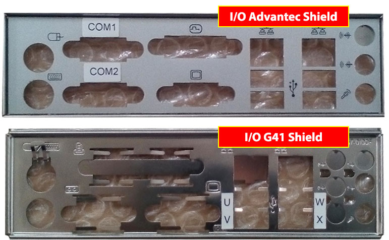

**Image analysis**

```json
{
 "image_name": "image5.jpg",
 "rId": "rId18",
 "image_path": "img_folder/image_004_image5.jpg",
 "caption": "مقایسه دو شیلد I/O مادربرد با برچسب های COM و حروف U تا X",
 "ocr_text": "COM1\nCOM2\nI/O Advantec Shield\nI/O G41 Shield\nU\nV\nW\nX",
 "visual_description": [
 "دو قطعه فلزی شیلد پنل پشتی I/O نمایش داده شده اند: بالایی با عنوان I/O Advantec Shield و پایینی با عنوان I/O G41 Shield",
 "روی شیلد بالایی برچسب های COM1 و COM2 در سمت چپ دیده می شود",
 "روی شیلد پایینی برچسب های عمودی U و V و W و X در کنار چند دهانه مستطیلی دیده می شود",
 "هر دو شیلد دارای چندین سوراخ دایره ای و دهانه های مستطیلی برای پورت ها هستند"
 ],
 "image_type": "photo"
}
```

توجه داشته باشید؛ درصورتی که I/O Shield همانند تصویر زیر از نوع ثابت باشد، امکان انجام تغییرات فراهم نخواهد بود:

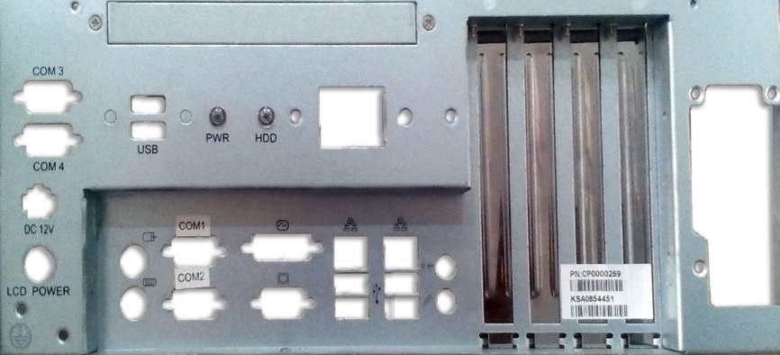

**Image analysis**

```json
{
 "image_name": "image6.jpeg",
 "rId": "rId19",
 "image_path": "img_folder/image_005_image6.jpg",
 "caption": "پنل پشتی یک دستگاه صنعتی با پورت های COM و USB و برچسب قطعه",
 "ocr_text": "COM 3\nCOM 4\nDC 12V\nLCD POWER\nUSB\nPWR\nHDD\nCOM1\nCOM2\nPN-CP0000269\nKSA0B54451",
 "visual_description": [
 "متن های چاپ شده روی بدنه شامل COM 3، COM 4، USB، PWR، HDD، COM1، COM2، DC 12V و LCD POWER دیده می شود",
 "در سمت راست چهار شیار عمودی بلند شبیه محفظه/براکت کارت یا ماژول مشاهده می شود",
 "یک برچسب سفید با شناسه های PN-CP0000269 و KSA0B54451 روی یکی از بخش های سمت راست نصب شده است",
 "چندین برش فلزی برای کانکتورهای پنل (مانند پورت های سریال COM) در قسمت پایین و چپ قابل مشاهده است"
 ],
 "image_type": "photo"
}
```

تنها در صورتی می توانید تغییرات مندرج در این سند را اعمال کنید که I/O shield همانند شکل زیر باشد:


**Image analysis**

```json
{
 "image_name": "image7.jpg",
 "rId": "rId20",
 "image_path": "img_folder/image_006_image7.jpg",
 "caption": "پنل پشتی کیس با پورت های USB، COM، DVI/VGA، شبکه و خروجی های صوتی با فلش های قرمز",
 "ocr_text": "USB\nPWR\nHDD\nCOM1\nCOM2\nPM:C000002809\nKSA0628786\nIIT",
 "visual_description": [
 "دو پورت USB نوع A در بالای پنل سمت چپ دیده می شود",
 "چراغ های وضعیت با برچسب های PWR و HDD قابل مشاهده است",
 "دو پورت سریال DB9 با برچسب های COM1 و COM2 وجود دارد",
 "یک پورت DVI و یک پورت VGA روی پنل دیده می شود",
 "دو پورت شبکه RJ45 همراه با چهار پورت USB زیر آنها قرار دارد",
 "سه جک صوتی 3.5mm با رنگ های سبز، صورتی و آبی در سمت راست پنل دیده می شود",
 "دو پورت PS/2 با رنگ سبز و بنفش در سمت چپ پنل وجود دارد",
 "فلش های قرمز روی تصویر به بخش های مختلف پنل پشتی اشاره می کنند",
 "برچسب سفید با متن PM:C000002809، KSA0628786 و IIT روی بدنه سمت راست دیده می شود"
 ],
 "image_type": "photo"
}
```

# استفاده از مادربرد G41در PC های Advantech

مراحل زیر را انجام دهید:

1. پلیت مربوط به DVD-ROM را بازکنید.

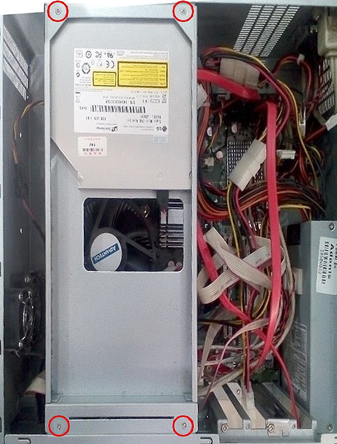

**Image analysis**

```json
{
 "image_name": "image8.jpg",
 "rId": "rId21",
 "image_path": "img_folder/image_007_image8.jpg",
 "caption": "نمای داخلی کیس رایانه با کابل ها، فن و پیچ های مشخص شده با دایره قرمز",
 "ocr_text": "",
 "visual_description": [
 "داخل کیس رایانه دیده می شود: کابل های قرمز و چندرنگ، برد اصلی و فن خنک کننده",
 "یک محفظه فلزی در سمت چپ با برچسب های متعدد روی آن قرار دارد",
 "چهار دایره قرمز روی تصویر محل پیچ ها/نقاط اتصال در گوشه های محفظه فلزی را نشان می دهند",
 "در پایین راست دو درایو/ماژول با پیچ های نصب روی شاسی قابل مشاهده است"
 ],
 "image_type": "photo"
}
```

2. کابل های متصل به مادربرد را خارج نمایید.
3. پیچ های مادربرد را بازکنید:

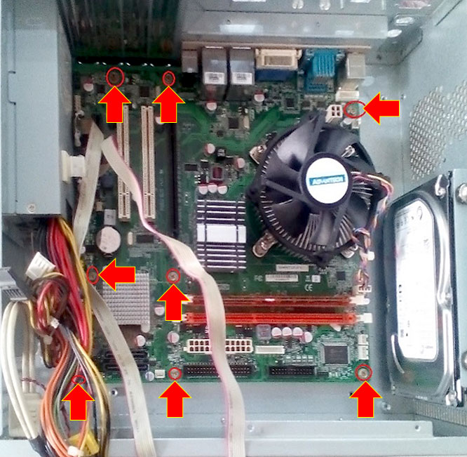

**Image analysis**

```json
{
 "image_name": "image9.jpg",
 "rId": "rId22",
 "image_path": "img_folder/image_008_image9.jpg",
 "caption": "نمای داخلی کیس رایانه با مادربرد، فن پردازنده و پیکان های قرمز روی نقاط مختلف.",
 "ocr_text": "",
 "visual_description": [
 "نمای داخل کیس با مادربرد نصب شده و چندین فلش قرمز که به نقاط مشخص روی برد اشاره می کنند",
 "فن خنک کننده پردازنده روی سوکت CPU در سمت راست-میانی دیده می شود",
 "یک هارد دیسک ۳.۵ اینچی در سمت راست کیس نصب شده است",
 "دو اسلات حافظه RAM (قرمز) روی مادربرد قابل مشاهده است",
 "چند اسلات توسعه (PCI/PCIe) در سمت چپ-میانی مادربرد دیده می شود",
 "کابل های برق و کابل نواری (Ribbon) در سمت چپ داخل کیس قرار دارند"
 ],
 "image_type": "photo"
}
```

4. مادربرد پی سی Advantech را همانند تصویر از جایش درآورید.
5. I/O Shield را خارج کنید:

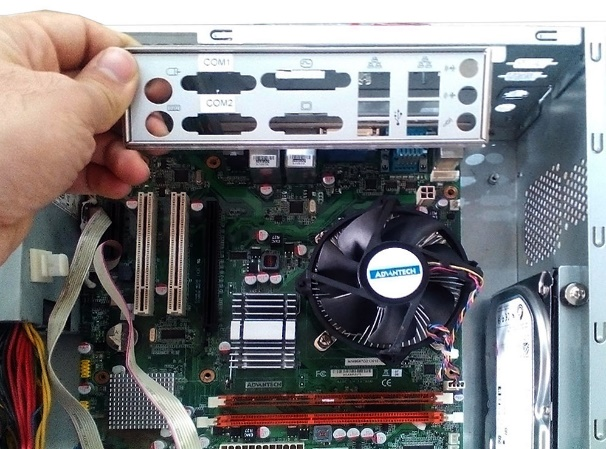

**Image analysis**

```json
{
 "image_name": "image10.jpeg",
 "rId": "rId23",
 "image_path": "img_folder/image_009_image10.jpg",
 "caption": "نمای داخل کیس با مادربرد و پنل پورت های پشت و فن پردازنده",
 "ocr_text": "COM1\nCOM2\nADVANTECH\nFC\nCE",
 "visual_description": [
 "پنل پشتی مادربرد با برچسب های COM1 و COM2",
 "وجود دو پورت مستطیلی (احتمالاً USB) روی پنل پشتی",
 "فن خنک کننده CPU با لوگوی ADVANTECH",
 "وجود دو اسلات توسعه سفید (PCI) روی مادربرد",
 "یک هارد دیسک 3.5 اینچی در سمت راست کیس دیده می شود",
 "نشان های FC و CE روی برد قابل مشاهده است"
 ],
 "image_type": "photo"
}
```

6. محل USB Expanderهای تعبیه شده در پی سی Advantech را جابه جا نمایید:


**Image analysis**

```json
{
 "image_name": "image11.jpg",
 "rId": "rId24",
 "image_path": "img_folder/image_010_image11.jpg",
 "caption": "داخل کیس کامپیوتر با هارد دیسک نصب شده، کابل های داده و برق و دو فلش قرمز راهنما",
 "ocr_text": "",
 "visual_description": [
 "نمای داخل کیس فلزی کامپیوتر با جایگاه ها و سوراخ های نصب روی سینی کف",
 "یک هارد دیسک 3.5 اینچی در بخش بالایی کیس با پیچ/براکت نصب شده است",
 "کابل های چندرنگ منبع تغذیه در سمت راست دیده می شوند",
 "دو فلش قرمز با حاشیه زرد روی تصویر وجود دارد؛ یکی سمت چپ و یکی سمت راست پایین",
 "یک کابل روشن رنگ از سمت چپ به سمت پایین کیس کشیده شده و در انتها به کانکتور سفید وصل است"
 ],
 "image_type": "photo"
}
```

7. به منظور باز کردن USB Expander، همانند تصویر زیر، پیچ های قاب خروجی بازکنید.

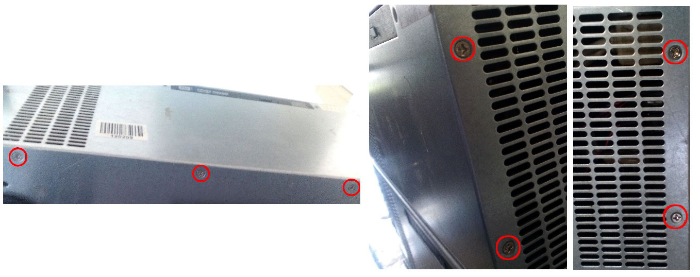

**Image analysis**

```json
{
 "image_name": "image12.jpg",
 "rId": "rId25",
 "image_path": "img_folder/image_011_image12.jpg",
 "caption": "نمای پشت دستگاه با دریچه های تهویه و چند پیچ مشخص شده با دایره قرمز",
 "ocr_text": "",
 "visual_description": [
 "سه تصویر از بدنه فلزی دستگاه با شیارهای تهویه دیده می شود",
 "چند پیچ روی پنل ها با دایره های قرمز علامت گذاری شده اند",
 "روی یکی از پنل ها یک برچسب بارکد وجود دارد اما متن آن خوانا نیست"
 ],
 "image_type": "photo"
}
```

8. پورت های USB را جابجا نمایید.
9. پی سی G41را بازکنید.
10. مادربرد، I/O Shield و پورت COM را از آن خارج نمایید:

<!-- TABLE_START -->
| | |
| --- | --- |
|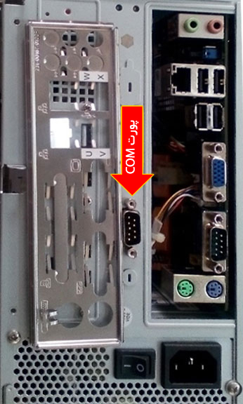

**Image analysis**

```json
{
 "image_name": "image13.jpg",
 "rId": "rId26",
 "image_path": "img_folder/image_012_image13.jpg",
 "caption": "پنل پشت کیس با فلش قرمز اشاره به پورت سریال COM",
 "ocr_text": "COM پورت",
 "visual_description": [
 "یک فلش قرمز با نوشته «COM پورت» به یک کانکتور سریال DB9 ماده اشاره می کند",
 "در تصویر پنل پشت رایانه با چند پورت USB، خروجی VGA آبی، جک های صوتی و پورت های PS/2 دیده می شود",
 "در سمت چپ یک شیلد/براکت فلزی I/O با شیارها و برچسب های کوچک نمایش داده شده است"
 ],
 "image_type": "photo"
}
``` |

**Image analysis**

```json
{
 "image_name": "image14.jpg",
 "rId": "rId27",
 "image_path": "img_folder/image_013_image14.jpg",
 "caption": "نمای داخل کیس کامپیوتر با مادربرد، فن پردازنده، منبع تغذیه و کابل ها",
 "ocr_text": "VGA\nVGA",
 "visual_description": [
 "نمای داخلی یک کیس کامپیوتر رومیزی با مادربرد نصب شده",
 "یک فن خنک کننده روی هیت سینک پردازنده در مرکز تصویر دیده می شود",
 "منبع تغذیه (PSU) در پایین کیس نصب است و کابل های برق چندرنگ دارد",
 "دو کانکتور/آداپتور با برچسب برجسته «VGA» در سمت راست دیده می شوند",
 "چند کابل سفید به صورت دسته بندی شده با بست پلاستیکی بسته شده اند",
 "کابل های قرمز در بخش بالایی کیس و روی مادربرد مشاهده می شوند",
 "یک هیت سینک آلومینیومی کوچک در قسمت بالای مادربرد دیده می شود"
 ],
 "image_type": "photo"
}
``` |
<!-- TABLE_END -->

11. I/O Shield مربوط پی سی G41 را روی پی سی Advantech سوار کنید و پیچ های آن را ببندید.
12. مادربرد G41 را روی پی سی Advantech جایگذاری کنید و پیچ های آن را ببندید.
13. کابل های دستگاه را متصل کنید:

<!-- TABLE_START -->
| | |
| --- | --- |
|

**Image analysis**

```json
{
 "image_name": "image15.jpeg",
 "rId": "rId28",
 "image_path": "img_folder/image_014_image15.jpg",
 "caption": "نمای داخلی کیس با کانکتورها و کابل ها، با فلش و دایره های زرد مشخص شده",
 "ocr_text": "S3\n3.4A17",
 "visual_description": [
 "عکس داخل یک کیس/محفظه فلزی با برد الکترونیکی و چند کابل رنگی",
 "یک کانکتور D-sub در بالای تصویر با دایره زرد مشخص شده است",
 "دو فلش قرمز جهت اشاره به کانکتورها/نقاط اتصال روی برد و بالای کیس دیده می شود",
 "یک کانکتور کوچک روی برد با دایره زرد مشخص شده است",
 "وجود فن خنک کننده در پایین تصویر و یک فن دیگر با محافظ فلزی در سمت راست",
 "برچسب کابل با متن «S3» و همچنین برچسب «3.4A17» قابل مشاهده است"
 ],
 "image_type": "photo"
}
``` |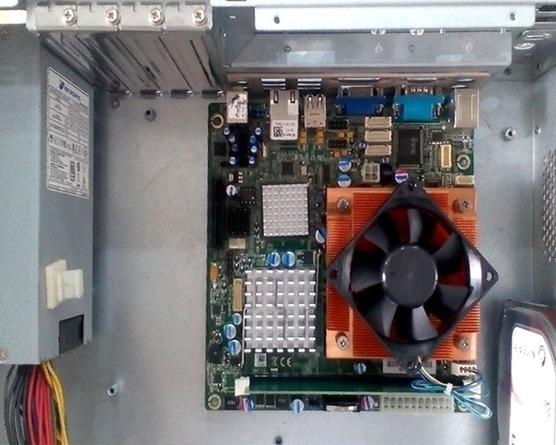

**Image analysis**

```json
{
 "image_name": "image16.jpg",
 "rId": "rId29",
 "image_path": "img_folder/image_015_image16.jpg",
 "caption": "داخل کیس کامپیوتر با مادربرد، هیت سینک ها، فن پردازنده و کابل ها",
 "ocr_text": "",
 "visual_description": [
 "نمای داخلی کیس فلزی با مادربرد نصب شده",
 "هیت سینک نارنجی با فن مربعی روی آن (خنک کننده پردازنده)",
 "دو هیت سینک آلومینیومی مربعی روی برد",
 "پورت های پنل پشت مادربرد شامل چند USB و یک پورت VGA آبی قابل مشاهده است",
 "یک کانکتور برق ATX چندپین روی مادربرد دیده می شود",
 "بخش منبع تغذیه در سمت چپ تصویر با دسته سیم های رنگی مشخص است",
 "یک هارد دیسک در سمت راست تصویر به صورت جزئی دیده می شود"
 ],
 "image_type": "photo"
}
``` |
<!-- TABLE_END -->

حتماً از عملکرد تمامی ماژول های متصل به مادربرد، اعم از فن کیس،
DVD-ROM، USB Port و HDD، اطمینان حاصل نمایید. همچنین کلید ON/OFF و LEDهای مربوط به کیس نیز باید غیرفعال باشند.

# نحوه ی بهره برداری

به منظور بهره برداری PC های Advantech که در آنها از مادربرد G41 استفاده شده است، با توجه به مدل مانیتور و درصورتی که فقط خروجی DVI موجود است، از کابل دیتای استفاده شده در خودپرداز 285DY استفاده نمایید:

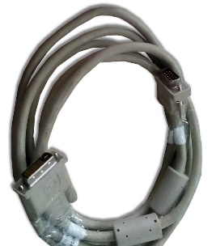

**Image analysis**

```json
{
 "image_name": "image17.jpeg",
 "rId": "rId30",
 "image_path": "img_folder/image_016_image17.jpg",
 "caption": "کابل ارتباطی خاکستری با کانکتور D-sub چندپین و یک کانکتور مستطیلی چندپین",
 "ocr_text": "",
 "visual_description": [
 "یک کابل به رنگ خاکستری به صورت حلقه شده دیده می شود",
 "در یک سر کابل یک کانکتور فلزی D-sub (چندپین) با دو پیچ جانبی قابل مشاهده است",
 "در سر دیگر کابل یک کانکتور مستطیلی چندپین با بدنه پلاستیکی خاکستری دیده می شود",
 "روی کابل یک قطعه/کاور پلاستیکی مستطیلی در نزدیکی انتهای کانکتورها مشاهده می شود"
 ],
 "image_type": "photo"
}
```

در صورت وجود خروجی DVI در کنار VGA، باید از کابل VGA به طول 3 متر استفاده کنید:

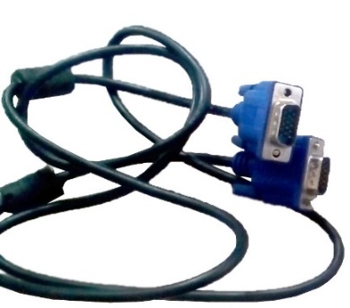

**Image analysis**

```json
{
 "image_name": "image18.jpeg",
 "rId": "rId31",
 "image_path": "img_folder/image_017_image18.jpg",
 "caption": "کابل VGA با دو کانکتور D‑Sub آبی و کابل مشکی",
 "ocr_text": "",
 "visual_description": [
 "دو کانکتور آبی نوع D-Sub با پیچ های ثابت کننده در دو طرف کانکتور دیده می شود",
 "یک کابل مشکی به هر دو کانکتور متصل است",
 "کانکتورها دارای بدنه فلزی جلویی هستند"
 ],
 "image_type": "photo"
}
```