# Document metadata

- **Author:** Arash Tighbor
- **Last Modified By:** Arash Tighbor
- **Created:** 2023-05-29T11:30:00Z
- **Modified:** 2025-06-10T06:14:00Z
- **Document Name:** 1-IT0403-508-00_Camera Cables Guide.docx
- **Source File:** C:\Users\aa.eskandari\Desktop\input\1-IT0403-508-00_Camera Cables Guide.docx

---


**Image analysis**

```json
{
 "image_name": "image1.jpg",
 "rId": "rId8",
 "image_path": "img_folder/image_001_image1.jpg",
 "caption": "جلد دستورالعمل نصب کابل دوربین با تغذیه مجزا",
 "ocr_text": "دستورالعمل\nنصب کابل دوربین باتغذیه مجزا\nشماره نسخه : 1-IT0403-508-00\nخرداد 1404\nشرکت توسعه خدمات الکترونیکی آدونیس (سهامی خاص)",
 "visual_description": [
 "صفحه عنوان/جلد یک سند فارسی با تیتر «دستورالعمل» و عنوان «نصب کابل دوربین باتغذیه مجزا»",
 "در پایین صفحه شماره نسخه «1-IT0403-508-00» و تاریخ «خرداد 1404» درج شده است",
 "نام سازمان «شرکت توسعه خدمات الکترونیکی آدونیس (سهامی خاص)» در پایین صفحه دیده می شود",
 "طرح خطی یک دستگاه خودپرداز/کیوسک در گوشه پایین چپ و یک لوگو در پایین سمت راست وجود دارد"
 ],
 "image_type": "scan"
}
```

**دستورالعمل**

**نصب کابل دوربین با تغذیه مجزا**

**شماره نسخه: 1-IT0403-508-00**

**خرداد 1404**


**Image analysis**

```json
{
 "image_name": "image2.png",
 "rId": "rId9",
 "image_path": "img_folder/image_002_image2.png",
 "caption": "لوگوی شرکت توسعه خدمات الکترونیکی آدونیس",
 "ocr_text": "شرکت توسعه خدمات الکترونیکی آدونیس",
 "visual_description": [
 "لوگو شامل متن فارسی و نماد گرافیکی شبیه حرف A است",
 "نماد گرافیکی در سمت راست و متن در امتداد افقی قرار دارد",
 "ترکیب رنگی شامل خاکستری و آبی تیره روی پس زمینه تیره است"
 ],
 "image_type": "diagram"
}
```

این سند با عنوان «دستورالعمل نصب کابل دوربین با تغذیه مجزا» در خردادماه 1404 در واحد توسعه محصول شرکت توسعه خدمات الکترونیکی آدونیس توسط خانم هدی عظیمی تهیه و تنظیم شده است.

این دستورالعمل در واحد آموزش، توسط آرش تیغ بر ویرایش و با شماره نسخه ی 1-IT0403-508-00 آماده ی انتشار گردید.

سابقه ویرایش :

<!-- TABLE_START -->
| | | | |
| --- | --- | --- | --- |
| **نام** **ویرایشگر** | **تاریخ** | **نام / سمت تاییدکننده** | **شماره نسخه قبلی**\* |
| | آبان 1403 | رضا اشرفی/واحد پشتیبانی عملیات | 1-IT0304-482-00 |
| | | |
| | | |
<!-- TABLE_END -->

\* با انتشار نسخه ی جدید، نسخه ی قبلی سند مذکور فاقد اعتبار خواهد شد.

<!-- TABLE_OF_CONTENTS_START -->
**فهرست**

[انواع کابل 2](#_Toc199672731)

[کابل USB Camera cable with external power – 280/285DY Series 3](#_Toc199672732)

[کابل USB Camera cable with external power – DZ Series 3](#_Toc199672733)

[کابل USB Camera cable with external power – WN 2100 Series 4](#_Toc199672734)

[کابل USB Camera cable with external power – General Series 4](#_Toc199672735)

[نصب فیزیکی کابل 5](#_Toc199672736)

[راه اندازی و تست دوربین 7](#_Toc199672737)
<!-- TABLE_OF_CONTENTS_END -->


**Image analysis**

```json
{
 "image_name": "image4.png",
 "rId": "rId17",
 "image_path": "img_folder/image_003_image4.png",
 "caption": "متن خوشنویسی «بنام خدا» روی پس زمینه سفید",
 "ocr_text": "بنام خدا",
 "visual_description": [
 "تصویر شامل نوشتهٔ فارسی/عربی با قلم خوشنویسی مشکی روی زمینهٔ سفید است."
 ],
 "image_type": "scan"
}
```

با توجه به مشکلات مشاهده شده در استفاده از دوربین های USB - اشکالاتی نظیر عدم پایداری ثبت تصاویر توسط دوربین، وجود نویز و اشکالات تامین ولتاژ موردنیاز دوربین از طریق کابل USB - لازم است کابل دوربین با تغذیه مجزا را به عنوان جایگزین کابل USB این دوربین ها استفاده نمایید.

این دستورالعمل نحوه ی نصب کابل دوربین با تغذیه مجزا را شامل می شود. طراحی این کابل به گونه ای است که ولتاژ موردنیاز دوربین توسط Power Supply و یا Voltage Distributor در قسمت Facsia خود پرداز (بسته به نوع دستگاه) تامین می شود.

مطابق روال مندرج در دستورالعمل پیش رو، عملیات نصب این کابل را انجام دهید.

# انواع کابل

<!-- TABLE_START -->
| | | | |
| --- | --- | --- | --- |
| **مدل دستگاه** | **نام کابل** | **تصویر کابل** | **کد انبار** |
| * **Eastcom 285 (DY)** * **Eastcom 280** | USB Camera cable with external power – **280/285DY Series** |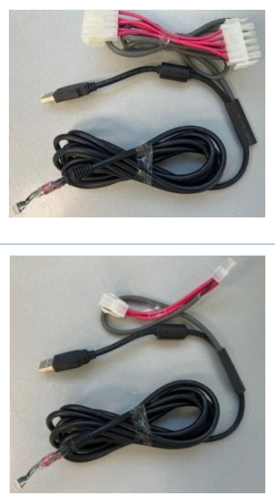

**Image analysis**

```json
{
 "image_name": "image5.jpeg",
 "rId": "rId18",
 "image_path": "img_folder/image_004_image5.jpg",
 "caption": "دو عکس از کابل تبدیل با کانکتور USB و سوکت چندپین همراه سیم های قرمز و مشکی",
 "ocr_text": "",
 "visual_description": [
 "در هر دو تصویر یک کابل USB-A نر مشکی دیده می شود",
 "یک دسته سیم با کانکتور سفید چندپین در بالا مشاهده می شود",
 "سیم های قرمز و مشکی در بخش کانکتور سفید قابل مشاهده است",
 "بخش زیادی از کابل مشکی به صورت حلقه ای جمع شده و با چسب شفاف بسته شده است",
 "در انتهای کابل یک سرسیم/کانکتور کوچک با ناحیه عایق شفاف دیده می شود"
 ],
 "image_type": "photo"
}
``` | **30102050230054** |
| * **Eastcom 285 (DZ)** * **Wincor 8050** | USB Camera cable with external power – **DZ Series** |

**Image analysis**

```json
{
 "image_name": "image6.jpeg",
 "rId": "rId19",
 "image_path": "img_folder/image_005_image6.jpg",
 "caption": "دو تصویر از کابل با کانکتور USB و سوکت چندپین همراه با سیم های قرمز و مشکی",
 "ocr_text": "",
 "visual_description": [
 "دو عکس از یک کابل روی سطح خاکستری دیده می شود",
 "یک کانکتور USB نوع A نری مشکی در هر تصویر قابل مشاهده است",
 "یک دسته سیم شامل سیم های قرمز و مشکی به یک کانکتور سفید چندپین وصل است",
 "بخش هایی از کابل با روکش/غلاف مشکی و یک قسمت جمع شده با نوار چسب شفاف دیده می شود"
 ],
 "image_type": "photo"
}
``` | **30102050230053** |
| * **Wincor 2100 (xe/USB)** | USB Camera cable with external power – **WN 2100 Series** |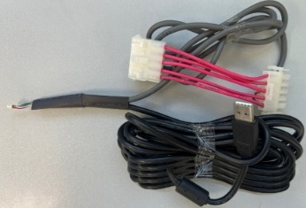

**Image analysis**

```json
{
 "image_name": "image7.jpeg",
 "rId": "rId20",
 "image_path": "img_folder/image_006_image7.jpg",
 "caption": "کابل رابط با کانکتورهای چندپین و کابل USB در کنار آن",
 "ocr_text": "",
 "visual_description": [
 "یک کابل چندرشته ای با چند سیم قرمز و یک سیم مشکی قابل مشاهده است",
 "دو کانکتور پلاستیکی سفید چندپین در دو سر دسته سیم دیده می شود",
 "یک کابل USB مشکی با کانکتور USB-A و یک کانکتور کوچک تر در تصویر وجود دارد",
 "بخشی از سیم ها لخت شده و انتهای چند رشته سیم رنگی قابل مشاهده است",
 "چند کابل با بست پلاستیکی شفاف جمع شده اند"
 ],
 "image_type": "photo"
}
``` | **30101053200195** |
| * **Wincor 1500 (xe/USB)** * **Wincor 2050 (xe/USB) 4C** * **Wincor 2050 (xe/USB) 6C** * **Wincor 2150 (xe/USB)** * **Eastcom 2000** * **Eastcom 2050** | USB Camera cable with external power – **General Series** |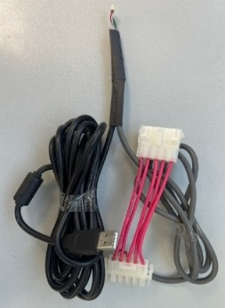

**Image analysis**

```json
{
 "image_name": "image8.jpeg",
 "rId": "rId21",
 "image_path": "img_folder/image_007_image8.jpg",
 "caption": "کابل USB با چند سیم و دو کانکتور سفید چندپین و یک روکش حرارتی روی اتصال",
 "ocr_text": "",
 "visual_description": [
 "یک کابل USB نوع A با سر نری و یک ماژول استوانه ای نزدیک کابل دیده می شود",
 "دو کانکتور سفید چندپین در دو سر مجموعه سیم ها وجود دارد",
 "چند سیم قرمز و چند سیم خاکستری بین کانکتورها متصل شده اند",
 "یک روکش حرارتی مشکی روی محل اتصال/انشعاب سیم ها قرار دارد",
 "کابل ها به صورت حلقه شده کنار هم قرار گرفته اند"
 ],
 "image_type": "photo"
}
``` | **30102050230052** |
<!-- TABLE_END -->

با توجه به مدل دستگاه، لازم است کابل با کد انبار مربوطه از انبار درخواست داده شود.

توضیحات مربوط به هر کابل در ادامه آمده است.

## کابل USB Camera cable with external power – 280/285DY Series

این کابل به منظور نصب روی خودپردازهای مدل EastCom 280 و EastCom 285 (DY) طراحی شده است.

بخش A، جهت اتصال به Power Supply، بخش B (کانکتور USB)، جهت اتصال به **پورت USB2.0 روی مادربورد IPC** دستگاه و بخش C، جهت اتصال به دوربین می باشد:

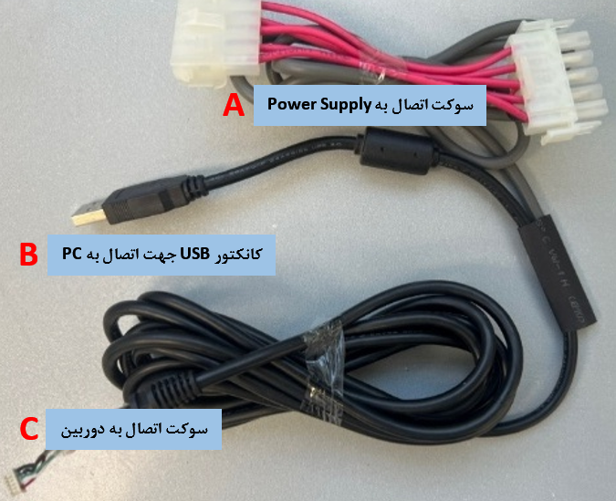

**Image analysis**

```json
{
 "image_name": "image9.tmp",
 "rId": "rId22",
 "image_path": "img_folder/image_008_image9.png",
 "caption": "کابل با برچسب های A، B، C برای اتصال پاور، USB به PC و سوکت دوربین",
 "ocr_text": "A\nPower Supply به سوکت اتصال\nB\nPC به کانکتور USB جهت اتصال به\nC\nدوربین به سوکت اتصال",
 "visual_description": [
 "کابل دارای سه بخش برچسب خورده A، B و C با متن فارسی روی کادرهای آبی است",
 "در بخش A یک دسته سیم قرمز/مشکی به دو کانکتور سفید چندپین متصل است",
 "در بخش B یک کانکتور USB Type-A نری روی کابل دیده می شود",
 "روی کابل یک قطعه استوانه ای فریت (نویزگیر) نزدیک بخش بالایی مشاهده می شود",
 "در بخش C انتهای کابل به یک سوکت/کانکتور کوچک چندسیمه ختم می شود",
 "حروف A، B و C به رنگ قرمز کنار هر قسمت قرار دارند"
 ],
 "image_type": "photo"
}
```

## کابل USB Camera cable with external power – DZ Series

این کابل به منظور نصب روی خودپردازهای مدل EastCom 285 (DZ) و Wincor 8050 طراحی شده است.

بخش A، جهت اتصال به Power Supply، بخش B (کانکتور USB)، جهت اتصال به **پورت USB2.0 روی مادربورد IPC** دستگاه و بخش C، جهت اتصال به دوربین می باشد:

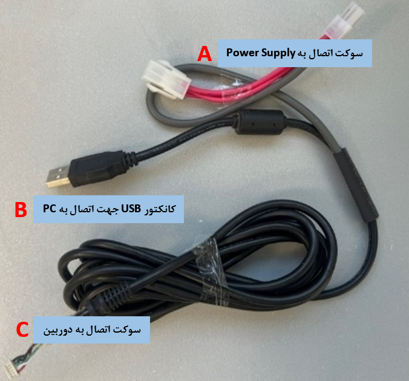

**Image analysis**

```json
{
 "image_name": "image10.tmp",
 "rId": "rId23",
 "image_path": "img_folder/image_009_image10.png",
 "caption": "کابل با سه بخش A، B و C برای اتصال پاور، USB به PC و دوربین",
 "ocr_text": "A\nسوکت اتصال به Power Supply\nB\nکانکتور USB جهت اتصال به PC\nC\nسوکت اتصال به دوربین",
 "visual_description": [
 "سه برچسب A، B و C روی تصویر مشخص شده اند",
 "بخش A: سوکت اتصال به Power Supply با کانکتور سفید چندپین و سیم های قرمز/خاکستری",
 "بخش B: کانکتور USB جهت اتصال به PC با فیش USB نوع A",
 "بخش C: سوکت اتصال به دوربین با کانکتور کوچک در انتهای کابل",
 "روی کابل یک استوانه فریت/نویزگیر نزدیک انشعاب دیده می شود"
 ],
 "image_type": "photo"
}
```

## کابل USB Camera cable with external power – WN 2100 Series

این کابل به منظور نصب روی خودپردازهای مدل Wincor 2100 (XE/USB) طراحی شده است.

بخش A، جهت اتصال به Voltage Distributor در قسمت Facsia، بخش B (کانکتور USB)، جهت اتصال به **پورت USB2.0 روی مادربورد IPC** دستگاه و بخش C، جهت اتصال به دوربین می باشد:

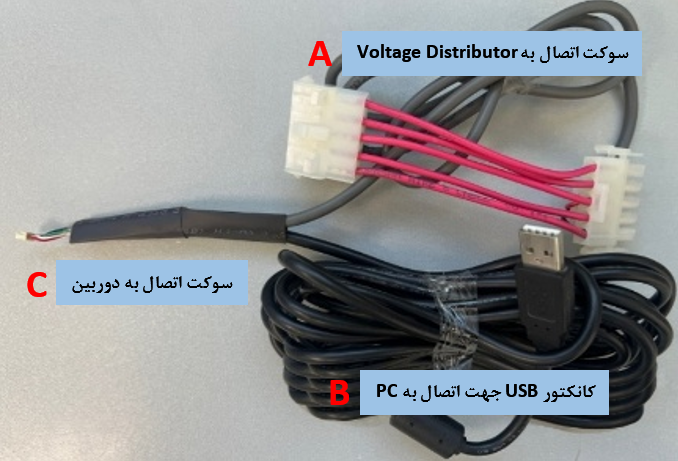

**Image analysis**

```json
{
 "image_name": "image11.tmp",
 "rId": "rId24",
 "image_path": "img_folder/image_010_image11.png",
 "caption": "کابل با کانکتور USB، سوکت دوربین و سوکت اتصال به توزیع کننده ولتاژ با برچسب های A، B، C",
 "ocr_text": "A\nVoltage Distributor سوکت اتصال به\nC\nسوکت اتصال به دوربین\nB\nکانکتور USB جهت اتصال به PC",
 "visual_description": [
 "یک کابل مشکی با کانکتور USB نوع A در سمت راست دیده می شود.",
 "دو سوکت پلاستیکی سفید چندپین با سیم های قرمز در بخش بالایی قرار دارند.",
 "در سمت چپ کابل، سرِ سیم لخت با چند رشته رنگی (قرمز، سفید، سبز و یک رشته دیگر) قابل مشاهده است.",
 "روی تصویر سه کادر متنی با زمینه آبی و حروف قرمز A، B و C برای برچسب گذاری اجزا وجود دارد."
 ],
 "image_type": "photo"
}
```

## کابل USB Camera cable with external power – General Series

این کابل به منظور نصب روی خودپرداز های زیر طراحی شده است:

<!-- TABLE_START -->
| | |
| --- | --- |
| * Wincor 2150 (xe/USB) * Eastcom 2000 * Eastcom 2050 | * Wincor 1500 (xe/USB) * Wincor 2050 (xe/USB) 4C * Wincor 2050 (xe/USB) 6C |
<!-- TABLE_END -->

بخش A، جهت اتصال به Voltage Distributor در قسمت Facsia، بخش B (کانکتور USB)، جهت اتصال به **پورت USB2.0 روی مادربورد IPC** دستگاه و بخش C، جهت اتصال به دوربین می باشد:

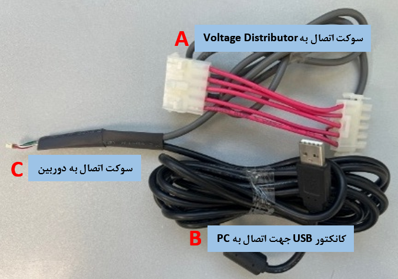

**Image analysis**

```json
{
 "image_name": "image12.tmp",
 "rId": "rId25",
 "image_path": "img_folder/image_011_image12.png",
 "caption": "کابل با کانکتور USB و دو سوکت، برچسب گذاری شده با A، B و C",
 "ocr_text": "A\nVoltage Distributor به\nسوکت اتصال به\nB\nPC به\nUSB کانکتور جهت اتصال\nC\nدرین\nسوکت اتصال به",
 "visual_description": [
 "یک کابل مشکی با کانکتور USB نوع A در سمت راست تصویر دیده می شود",
 "دو کانکتور پلاستیکی سفید چندپین در بخش بالای تصویر وجود دارد که با چند سیم صورتی/قرمز به هم متصل اند",
 "یک رشته سیم لخت شده در سمت چپ کابل دیده می شود",
 "سه برچسب متنی با پس زمینه آبی و حروف قرمز A، B، C روی تصویر قرار داده شده است"
 ],
 "image_type": "photo"
}
```

# نصب فیزیکی کابل

مراحل زیر را به ترتیب انجام دهید:

1. کابل قدیمی دوربین دستگاه را جمع آوری کنید. (این کابل باید به انبار تحویل داده شود.)
2. همانند تصویر زیر، سوکت اتصال به دوربین کابل جدید را به دستگاه متصل کنید. (با توجه به مدل خودپرداز، محل قرارگیری دوربین ممکن است متفاوت باشد.)

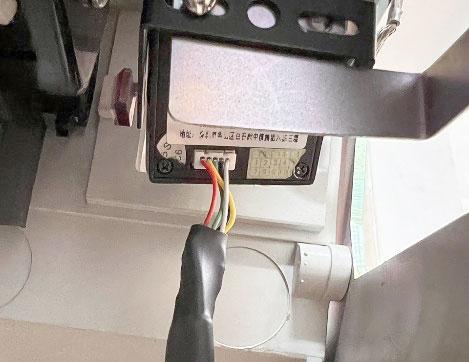

**Image analysis**

```json
{
 "image_name": "image13.jpg",
 "rId": "rId26",
 "image_path": "img_folder/image_012_image13.jpg",
 "caption": "نمای نزدیک یک ماژول الکترونیکی با چند سیم متصل درون محفظه",
 "ocr_text": "",
 "visual_description": [
 "یک جعبه/ماژول الکترونیکی مستطیلی مشکی داخل محفظه نصب شده است",
 "سه سیم رنگی (قرمز، زرد، سفید) از پایین ماژول خارج شده و به کابل مشکی متصل/روکش شده اند",
 "یک براکت فلزی در جلوی ماژول قرار دارد و بخشی از آن را می پوشاند",
 "روی بدنه ماژول برچسبی با نوشته بسیار ریز دیده می شود اما خوانا نیست"
 ],
 "image_type": "photo"
}
```

3. کابل USB را به نحوی که سوکت دوربین تحت فشار نباشد از داخل Chain دستگاه رد کنید و به PC دستگاه برسانید.
4. مشابه تصویر زیر، کانکتور USB را به پورت USB2.0 روی مادربورد IPC دستگاه متصل کنید.
 (تصویر دو مدل IPC به عنوان نمونه آورده شده است.)

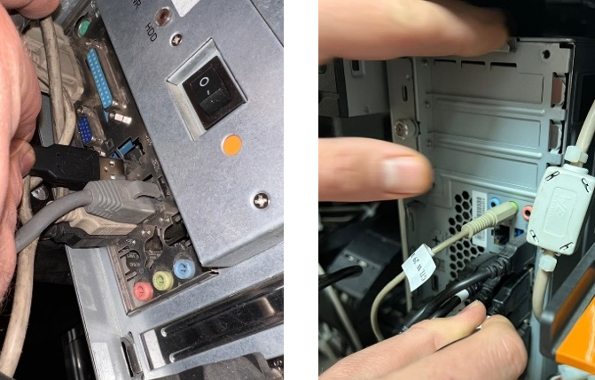

**Image analysis**

```json
{
 "image_name": "image14.tmp",
 "rId": "rId27",
 "image_path": "img_folder/image_013_image14.png",
 "caption": "پشت کیس رایانه با کلید روشن/خاموش و پورت های صدا و اتصالات کابل",
 "ocr_text": "I\nO\n100",
 "visual_description": [
 "کلید راکری با علامت های I و O روی یک محفظه فلزی دیده می شود",
 "نوشته «100» کنار کلید روی بدنه قابل مشاهده است",
 "پورت USB آبی و یک کانکتور D-sub با پیچ های طرفین در تصویر سمت چپ دیده می شود",
 "چند جک ۳.۵ میلی متری رنگی (آبی، سبز، صورتی) روی پنل پشتی وجود دارد",
 "در تصویر سمت راست کابل های جک ۳.۵ میلی متری به پورت های سبز و صورتی متصل هستند",
 "کابل های متصل و بخشی از شاسی/براکت فلزی پشت کیس قابل مشاهده است"
 ],
 "image_type": "photo"
}
```

5. بسته به نوع کابل، سوکت اتصال را به Power Supply و یا Voltage Distributor در قسمت Facsia متصل کنید. (برای نمونه، در صفحه ی بعد، تصویر 6 مدل دستگاه آورده شده است.)

درصورتی که سوکت دیگری به Power Supply و یا Voltage Distributor متصل است، باید آن را جدا کنید و به سر دیگر سوکت روی کابل دوربین متصل کنید. برای مثال، در تمام تصاویر زیر به جز تصویر 3، این نکته قابل مشاهده است (درواقع
بخش A کابل دوربین، بین مسیر قرار می گیرد.):

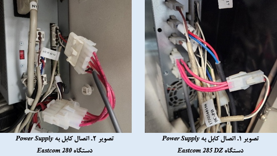

**Image analysis**

```json
{
 "image_name": "image15.tmp",
 "rId": "rId28",
 "image_path": "img_folder/image_014_image15.png",
 "caption": "اتصال کابل ها به پاورساپلای در دستگاه های Eastcom 280 و Eastcom 285 DZ",
 "ocr_text": "تصویر ۲. اتصال کابل به Power Supply\nدستگاه Eastcom 280\nتصویر ۱. اتصال کابل به Power Supply\nدستگاه Eastcom 285 DZ",
 "visual_description": [
 "دو تصویر از داخل محفظه دستگاه با منبع تغذیه (Power Supply) و اتصالات کابل ها نمایش داده شده است",
 "در تصویر چپ، یک کانکتور سفید چندپین با چند سیم قرمز متصل به پاورساپلای دیده می شود",
 "در تصویر راست، دسته ای از سیم های رنگی (قرمز، آبی، سفید و مشکی) به کانکتور/ترمینال پاورساپلای متصل هستند",
 "کانکتورهای پلاستیکی سفید و کابل های بسته بندی شده با بست پلاستیکی قابل مشاهده اند"
 ],
 "image_type": "photo"
}
```

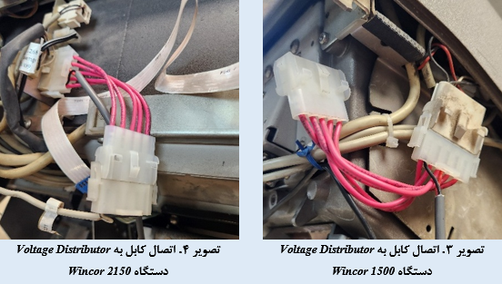

**Image analysis**

```json
{
 "image_name": "image16.tmp",
 "rId": "rId29",
 "image_path": "img_folder/image_015_image16.png",
 "caption": "اتصالات کابل به Voltage Distributor در دستگاه های Wincor 2150 و Wincor 1500",
 "ocr_text": "Voltage Distributor\nWincor 2150\nVoltage Distributor\nWincor 1500",
 "visual_description": [
 "دو تصویر از دسته سیم های چندرنگ و کانکتورهای پلاستیکی سفید متصل به ماژول/بخش با عنوان Voltage Distributor",
 "در تصویر چپ چند سیم قرمز به یک کانکتور چندپین سفید متصل شده اند و کابل فلت خاکستری در پس زمینه دیده می شود",
 "در تصویر راست دو کانکتور سفید مجزا با سیم های قرمز و سیم های روشن/کرم رنگ متصل هستند",
 "بست/گیره آبی روی یکی از دسته سیم ها در تصویر راست قابل مشاهده است"
 ],
 "image_type": "photo"
}
```

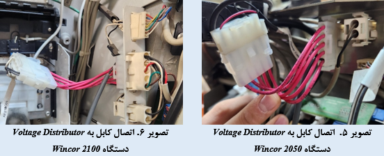

**Image analysis**

```json
{
 "image_name": "image17.tmp",
 "rId": "rId30",
 "image_path": "img_folder/image_016_image17.png",
 "caption": "دو تصویر از اتصال کابل های قرمز به کانکتور Voltage Distributor",
 "ocr_text": "Voltage Distributor تصویر ۱: اتصال کابل به\nVoltage Distributor تصویر ۲: اتصال کابل به",
 "visual_description": [
 "دو نمای نزدیک از محفظه داخلی دستگاه و یک ماژول با برچسب Voltage Distributor",
 "چندین سیم قرمز به یک کانکتور پلاستیکی سفید چندپین متصل شده اند",
 "در تصویر دوم، دست انسان کانکتور سفید و دسته سیم های قرمز را نگه داشته است",
 "در تصویر اول، کابل ها از سمت چپ وارد محفظه شده و به کانکتور روی ماژول متصل هستند"
 ],
 "image_type": "photo"
}
```

6. جانمایی کابل را به صورتی که مزاحم ماژول های دیگر و یا باز و بسته شدن درب و یا Facsia دستگاه نباشد (مانند سایر کابل های استفاده شده در دستگاه)، انجام دهید و کابل را با بست کمربندی در کنار سایر کابل ها مهار کنید. همچنین طول اضافی کابل را نیز در محل مناسب جمع آوری کنید.

# راه اندازی و تست دوربین

1. وضعیت تصویر را در نرم افزار Viewer دوربین بررسی کنید. تصویر لایو بدون نویز باید قابل مشاهده باشد. (تصویر نباید سیاه و یا فریز شده باشد.)
2. پس از مشاهده تصویر لایو استاندارد، دستگاه را In Service کنید و تراکنش انجام دهید.
3. بررسی کنید تصویر مربوط به تراکنش انجام شده در مسیر مربوطه وجود داشته باشد.

در صورت وجود اشکال به دستورالعمل های راه اندازی دوربین مراجعه نمایید.