# Document metadata

- **Author:** Arash Tighbor
- **Last Modified By:** Arash Tighbor
- **Created:** 2025-10-26T08:01:00Z
- **Modified:** 2025-10-28T06:06:00Z
- **Document Name:** 1-IT0408-511-00_Climate Package.docx
- **Source File:** C:\Users\aa.eskandari\Desktop\input\1-IT0408-511-00_Climate Package.docx

---


**Image analysis**

```json
{
 "image_name": "image1.jpg",
 "rId": "rId8",
 "image_path": "img_folder/image_001_image1.jpg",
 "caption": "جلد دستورالعمل نصب سیستم گرمایش برای EastCom و Wincor مدل 2050",
 "ocr_text": "دستورالعمل\nنصب سیستم گرمایش\nEastCom , Wincor\n2050\nشماره نسخه : 1-IT0408-511-00\nآبان 1404\nشرکت توسعه خدمات الکترونیکی آدونیس (سهامی خاص)",
 "visual_description": [
 "صفحه جلد یک سند راهنما با عنوان «دستورالعمل نصب سیستم گرمایش»",
 "ذکر نام EastCom و Wincor و عدد 2050 در مرکز صفحه",
 "نمایش شماره نسخه 1-IT0408-511-00 و تاریخ آبان 1404",
 "لوگوی شرکت و متن «شرکت توسعه خدمات الکترونیکی آدونیس (سهامی خاص)» در پایین صفحه",
 "طرح خطی یک دستگاه مشابه خودپرداز در پایینِ سمت چپ"
 ],
 "image_type": "scan"
}
```

**دستورالعمل**

**نصب سیستم گرمایش**

EastCom وWincor

2050

**شماره نسخه: 1-IT0408-511-00**

**آبان 1404**


**Image analysis**

```json
{
 "image_name": "image2.png",
 "rId": "rId9",
 "image_path": "img_folder/image_002_image2.png",
 "caption": "لوگوی شرکت توسعه خدمات الکترونیکی آدونیس",
 "ocr_text": "آدونیس شرکت توسعه خدمات الکترونیکی",
 "visual_description": [
 "لوگو شامل متن فارسی در سمت چپ و یک نشان گرافیکی شبیه حرف A در سمت راست است",
 "نشان گرافیکی از یک شکل خاکستری و یک قوس/حلقه آبی تشکیل شده است",
 "متن «آدونیس» با رنگ خاکستری و عبارت «شرکت توسعه خدمات الکترونیکی» با رنگ آبی نمایش داده شده است",
 "پس زمینه تصویر مشکی است"
 ],
 "image_type": "diagram"
}
```

این سند با عنوان «دستورالعمل نصب سیستم گرمایش در خودپردازهای EastCom وWincor مدل

2050» در آبان ماه 1404 در واحد پشتیبانی عملیات توسط محمدرضا آزاده آماده گردیده است.

این سند در واحد آموزش، ویرایش و با شماره نسخه ی 1-IT0408-511-00 آماده انتشار گردید.

سابقه ویرایش :

<!-- TABLE_START -->
| | | | |
| --- | --- | --- | --- |
| نام ویرایشگر | تاریخ | نام / سمت تاییدکننده | شماره نسخه قبلی\* |
| | | | |
| | | |
| | | |
| | |
| | | |
<!-- TABLE_END -->

\* با انتشار نسخه ی جدید، نسخه ی قبلی سند مذکور فاقد اعتبار خواهد شد.

<!-- TABLE_OF_CONTENTS_START -->
**فهرست**

[مقدمه 1](#_Toc212536384)

[اقلام لازم جهت نصب سیستم گرمایش 1](#_Toc212536385)

[معرفی ماژول Climate 2](#_Toc212536386)

[اجزای تشکیل دهنده ماژول Climate 2](#_Toc212536387)

[نحوه عملکرد برد کنترل 3](#_Toc212536388)

[1. محل اتصال کابل برق ورودی ماژول Climate 3](#_Toc212536389)

[2. محل اتصال برق هیتر (جهت روشن شدن المنت حرارتی) 4](#_Toc212536390)

[3. عملکرد نشانگرهای LED روی برد کنترل 4](#_Toc212536391)

[4. دکمه تست عملکرد صحیح هیتر 4](#_Toc212536392)

[نحوه نصب برد کنترل در دستگاه 4](#_Toc212536393)

[سنسور دما 5](#_Toc212536394)

[نصب ماژول هیتر و کانال انتقال گرما در خودپرداز وینکور 5](#_Toc212536395)

[نصب ماژول هیتر و کانال انتقال گرما در خودپرداز ایستکام 6](#_Toc212536396)

[بررسی درستی عملکرد ماژول گرمایشی هیتر 6](#_Toc212536397)
<!-- TABLE_OF_CONTENTS_END -->


**Image analysis**

```json
{
 "image_name": "image4.png",
 "rId": "rId17",
 "image_path": "img_folder/image_003_image4.png",
 "caption": "عبارت «به نام خدا» به خط خوشنویسی سیاه روی زمینه سفید",
 "ocr_text": "به نام خدا",
 "visual_description": [
 "متن فارسی به صورت خوشنویسی سیاه رنگ روی پس زمینه سفید قرار دارد",
 "هیچ نمودار، جدول، فلش یا کادر متنی دیگری دیده نمی شود"
 ],
 "image_type": "scan"
}
```

# مقدمه

این دستورالعمل باهدف معرفی قطعات و آموزش نحوه ی نصب سیستم گرمایش[[1]](#footnote-1) در خودپردازهای EastCom وWincor مدل 2050 جهت متعادل سازی دمای ماژول های رسیدمشتری، کارت خوان و شاتر در فصل سرما تهیه شده است.

# اقلام لازم جهت نصب سیستم گرمایش

قطعات موردنیاز جهت انجام این پروژه به شرح مندرج در جدول زیر می باشند:

<!-- TABLE_START -->
| | | | |
| --- | --- | --- | --- |
| ردیف | قطعه / ماژول | کد انبار | تعداد |
| 1 | ماژول هیتر به همراه فن (Heater 410W/230V With Fan 24V) | **20101074015** | 1 |
| 2 | برد کنترل (Heater Controller) | **20101074016** | 1 |
| 3 | سنسور دمای هیتر (Heater Temperature Sensor) | **30102050230056** | 1 |
| 4 | کابل 220 ولت برق (Power Cable Heater) | **30102050230023** | 1 |
| 5 | پایه نگهدارنده هیتر در خودپرداز وینکور )Heater Holder Mounting Bracket in WINCOR ATMs( | **30101053300165** | 1 |
| 6 | پایه نگهدارنده هیتر در خودپرداز ایستکام )Heater Holder Mounting Bracket in EASTCOM ATMs( | **30102050230055** | 1 |
| 7 | پیچ آلن خور T20 | **50305090** | 7 |
| 8 | بست کمربندی | **50304040** | به تعداد لازم |
<!-- TABLE_END -->

# معرفی ماژول Climate

پنل گرمایشی با اتصال به برق 220 ولت خودپرداز روشن می شود و از طریق یک سنسور تشخیص دما، دمای محیط را به برد کنترل اعلام می دارد؛ در دمای کمتر از 8 درجه، هیتر روشن می شود و فن تعبیه شده با وزش باد، حرارت را از طریق کانال های مربوطه، به ماژول های کارت خوان، رسیدمشتری و شاتر، منتقل می نماید.

# اجزای تشکیل دهنده ماژول Climate

اجزای تشکیل دهنده ماژول Climate در تصاویر زیر نشان داده شده اند:

<!-- TABLE_START -->
| | |
| --- | --- |
|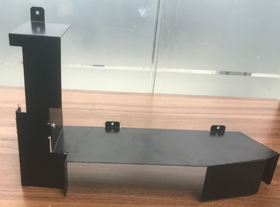

**Image analysis**

```json
{
 "image_name": "image5.jpeg",
 "rId": "rId18",
 "image_path": "img_folder/image_004_image5.jpg",
 "caption": "قطعه فلزی خم کاری شده با براکت عمودی و صفحه افقی دارای سوراخ های نصب",
 "ocr_text": "",
 "visual_description": [
 "یک قطعه فلزی مشکی با چند سطح خم کاری شده و لبه های زاویه دار دیده می شود",
 "براکت عمودی در سمت چپ با صفحه افقی بالایی و یک سوراخ دایره ای در زبانه نصب قرار دارد",
 "یک سوراخ دایره ای در بخش میانی براکت عمودی مشاهده می شود",
 "یک صفحه افقی بلند از سمت چپ به راست امتداد دارد و دو زبانه نصب با سوراخ دایره ای روی آن دیده می شود",
 "در سمت راست، قطعه دارای بخش خم شده رو به پایین (لبه/پایه) است"
 ],
 "image_type": "photo"
}
``` **کانال انتقال دما در دستگاه های ایستکام** |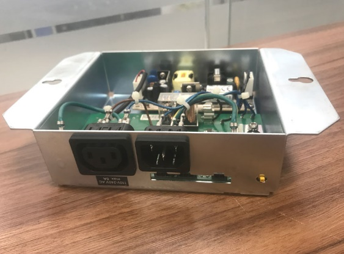

**Image analysis**

```json
{
 "image_name": "image6.jpeg",
 "rId": "rId19",
 "image_path": "img_folder/image_005_image6.jpg",
 "caption": "جعبه فلزی منبع تغذیه با دو سوکت AC و مدار داخلی قابل مشاهده",
 "ocr_text": "1 10A 250V~",
 "visual_description": [
 "محفظه فلزی با درپوش باز و برد الکترونیکی داخلی دیده می شود",
 "در پنل جلو دو ورودی/خروجی برق AC نوع IEC نصب شده است",
 "برچسب مشخصات روی یکی از سوکت ها شامل «10A 250V~» قابل مشاهده است",
 "سیم کشی داخلی با کابل های آبی و مشکی و اتصالات روی برد دیده می شود",
 "یک کانکتور یا درگاه کوچک مستطیلی روی پنل جلو و یک قطعه زردرنگ کوچک در سمت راست دیده می شود"
 ],
 "image_type": "photo"
}
``` **برد کنترل** |
|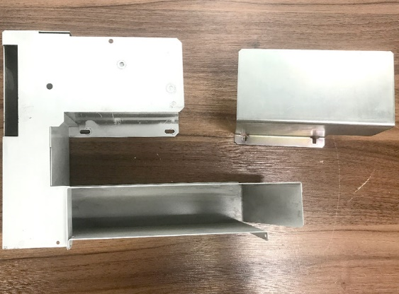

**Image analysis**

```json
{
 "image_name": "image7.jpeg",
 "rId": "rId20",
 "image_path": "img_folder/image_006_image7.jpg",
 "caption": "چند قطعه فلزی خم کاری شده و یک کاور مستطیلی روی سطح چوبی",
 "ocr_text": "",
 "visual_description": [
 "سه قطعه ورق فلزی خم کاری شده دیده می شود: یک براکت بزرگ L شکل، یک کانال U شکل و یک کاور مستطیلی",
 "روی براکت L شکل چند سوراخ و شیار بیضی برای پیچ/نصب وجود دارد",
 "کاور مستطیلی دارای یک زبانه/براکت کوچک در لبه پایینی است",
 "تمام قطعات روی یک سطح چوبی قرار گرفته اند"
 ],
 "image_type": "photo"
}
``` **کانال انتقال دما در دستگاه های وینکور** |

**Image analysis**

```json
{
 "image_name": "image8.jpeg",
 "rId": "rId21",
 "image_path": "img_folder/image_007_image8.jpg",
 "caption": "کابل سنسور دما با برچسب شماره و کانکتور دو سیمه",
 "ocr_text": "175018868\nTemp-sensor",
 "visual_description": [
 "یک کابل روکش دار خاکستری به صورت حلقه خورده روی سطح چوبی دیده می شود",
 "روی کابل یک برچسب سفید با متن «175018868» و «Temp-sensor» نصب شده است",
 "در یک انتها دو رشته سیم آبی و مشکی از روکش خارج شده اند",
 "در انتهای دیگر یک قطعه/کانکتور کوچک مشکی با دو سیم سفید و مشکی متصل است"
 ],
 "image_type": "photo"
}
``` **سنسور دما** |
|

**Image analysis**

```json
{
 "image_name": "image9.jpeg",
 "rId": "rId22",
 "image_path": "img_folder/image_008_image9.jpg",
 "caption": "کابل برق با دوشاخه سه پین و کانکتور سه سوراخ روی میز چوبی",
 "ocr_text": "",
 "visual_description": [
 "کابل برق مشکی با دوشاخه سه پین گرد در یک سر",
 "در سر دیگر کانکتور مادگی سه سوراخ مستطیلی (نوع IEC 60320 C13)",
 "کابل به صورت حلقه شده روی سطح چوبی قرار دارد"
 ],
 "image_type": "photo"
}
``` **کابل برق هیتر** |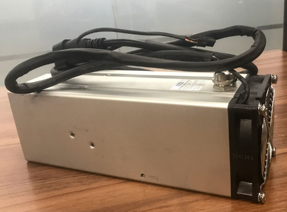

**Image analysis**

```json
{
 "image_name": "image10.jpeg",
 "rId": "rId23",
 "image_path": "img_folder/image_009_image10.jpg",
 "caption": "منبع تغذیه فلزی با فن های انتهایی و کابل برق در بالا",
 "ocr_text": "",
 "visual_description": [
 "محفظه مستطیلی فلزی شبیه منبع تغذیه/پاور",
 "دو فن دایره ای روی پنل انتهایی مشکی با پیچ های گوشه ها دیده می شود",
 "یک کابل مشکی روی بدنه قرار دارد و به کانکتور نزدیک پنل انتهایی متصل است",
 "روی بدنه یک برچسب کوچک وجود دارد اما متن آن خوانا نیست"
 ],
 "image_type": "photo"
}
``` **هیتر** |
<!-- TABLE_END -->

# نحوه عملکرد برد کنترل

برد کنترل، وظیفه کنترل عملکرد سیستم گرمایشی را بر عهده دارد. این برد از قسمت های زیر تشکیل شده است:

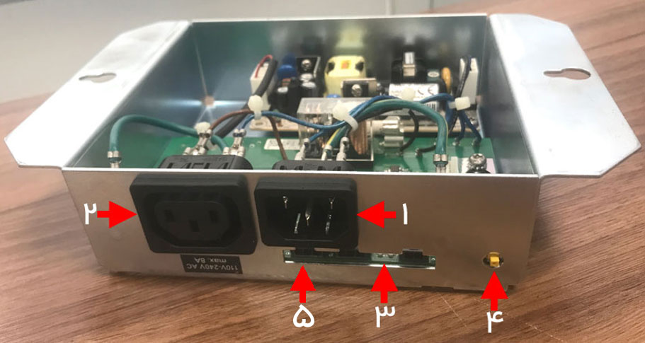

**Image analysis**

```json
{
 "image_name": "image11.jpg",
 "rId": "rId24",
 "image_path": "img_folder/image_010_image11.jpg",
 "caption": "نمای جلوی یک جعبه فلزی با سوکت های برق و شماره گذاری نقاط",
 "ocr_text": "۱\n۲\n۳\n۴\n۵\n110V-240V AC\nmax 5A",
 "visual_description": [
 "جعبه فلزی باز با برد الکترونیکی و سیم کشی داخلی قابل مشاهده است",
 "دو کانکتور برق پنلی مستطیلی در سمت چپ و مرکز پنل جلو دیده می شود",
 "پنج فلش قرمز با شماره های ۱ تا ۵ روی پنل جلو اجزا را مشخص کرده اند",
 "برچسب کنار سوکت چپ شامل متن «110V-240V AC» و «max 5A» است",
 "یک قطعه طلایی رنگ شبیه کانکتور/بوش در سمت راست پنل جلو دیده می شود"
 ],
 "image_type": "photo"
}
```

1. محل اتصال برق دستگاه جهت راه اندازی
2. اتصال برق هیتر (جهت روشن شدن المنت حرارتی)
3. نمایشگر LED
4. دکمه تست عملکرد صحیح هیتر
5. محل اتصال المنت هیتر

## 1. محل اتصال کابل برق ورودی ماژول Climate

برای راه اندازی این ماژول همان طور که در تصویر زیر نشان داده شده است لازم است کابل برق خروجی برد کنترل را به ورودی قسمت (NT) Non Switchبرق خودپرداز متصل نمایید:

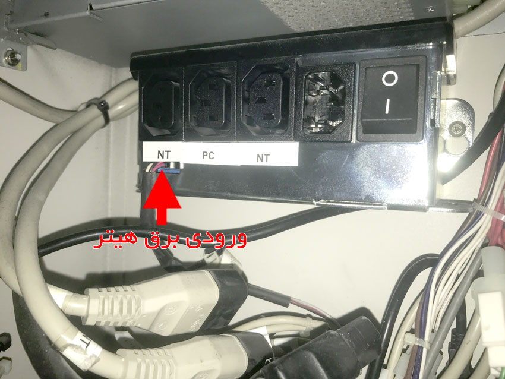

**Image analysis**

```json
{
 "image_name": "image12.jpg",
 "rId": "rId25",
 "image_path": "img_folder/image_011_image12.jpg",
 "caption": "چند پریز برق با کلید روشن/خاموش و برچسب های NT و PC",
 "ocr_text": "NT\nPC\nNT\nورودی برق هیتر",
 "visual_description": [
 "پنل شامل چهار پریز و یک کلید پاور با علائم O و I است",
 "زیر پریزها نوار برچسب سفید با متن های «NT»، «PC»، «NT» دیده می شود",
 "یک فلش قرمز به ناحیه برچسب NT اشاره می کند",
 "متن فارسی قرمز «ورودی برق هیتر» در پایین تصویر قرار دارد",
 "چند کابل برق و سوکت در پایین و اطراف پنل قابل مشاهده است"
 ],
 "image_type": "photo"
}
```

## 2. محل اتصال برق هیتر (جهت روشن شدن المنت حرارتی)

هیتر از دو کابل تشکیل شده است که یکی برق فن و دیگری برق المنت را تامین می کند؛ هردو کابل به شکلی که در تصویر زیر مشخص شده است به برد کنترل متصل می شوند:


**Image analysis**

```json
{
 "image_name": "image13.jpg",
 "rId": "rId26",
 "image_path": "img_folder/image_012_image13.jpg",
 "caption": "نمای پشت یک ماژول تغذیه با ورودی AC و کابل متصل به هیت سینک آلومینیومی",
 "ocr_text": "INPUT: 100-240V AC\n50/60Hz 5A",
 "visual_description": [
 "یک دستگاه فلزی با دو پورت مستطیلی و یک ورودی برق IEC در پنل پشتی دیده می شود",
 "روی پنل برچسب مشخصات ورودی برق با متن «INPUT: 100-240V AC 50/60Hz 5A» قابل مشاهده است",
 "یک کابل برق به ورودی IEC متصل شده است",
 "کابل ضخیم دیگری به یک بدنه آلومینیومی اکسترود شده شبیه هیت سینک متصل است",
 "دو نشانگر دایره ای قرمز با اعداد فارسی «۱» و «۲» روی تصویر قرار داده شده اند"
 ],
 "image_type": "photo"
}
```

## 3. *عملکرد نشانگرهای* LED *روی برد کنترل*

1. **چراغ قرمز ثابت**، نشان دهنده روشن بودن المنت تعبیه شده در داخل هیتر می باشد.
2. **چراغ سبز ثابت**، نشانگر اتصال به برق هیتر و اتصال سنسور دما به برد کنترل است.
3. **چراغ سبز چشمک زن**، نشان دهنده ی عدم اتصال سنسور دما به برد کنترل می باشد.

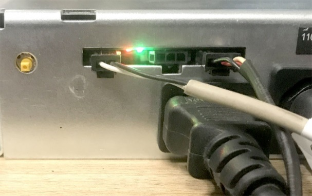

**Image analysis**

```json
{
 "image_name": "image14.jpeg",
 "rId": "rId27",
 "image_path": "img_folder/image_013_image14.jpg",
 "caption": "نمای نزدیک پورت شبکه RJ45 با کابل های متصل و چراغ های وضعیت روشن",
 "ocr_text": "11",
 "visual_description": [
 "یک پورت شبکه RJ45 با کابل متصل دیده می شود",
 "دو چراغ وضعیت (LED) در کنار پورت روشن هستند: یکی نارنجی و یکی سبز",
 "چند کابل و کانکتور در جلوی پورت قرار گرفته اند",
 "برچسب عددی «11» در گوشه سمت راست بالا روی بدنه دیده می شود"
 ],
 "image_type": "photo"
}
```

## 4. دکمه تست عملکرد صحیح هیتر

با فشار دادن دکمه ی تست، سیستم گرمایش به مدت ۵ دقیقه به طور خودکار فعال خواهد شد؛ در این وضعیت می توانید صحت عملکرد سیستم گرمایشی و سنسور متصل به دستگاه را در دمای بالاتر از ۸ درجه سانتی گراد بررسی نمایید.

# نحوه نصب برد کنترل در دستگاه

برد کنترل همانند تصویر زیر توسط دو پیچ در پشت اپراتور پنل (SOP) نصب می گردد:

<!-- TABLE_START -->
| | |
| --- | --- |
|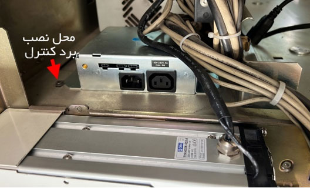

**Image analysis**

```json
{
 "image_name": "image15.jpg",
 "rId": "rId28",
 "image_path": "img_folder/image_014_image15.jpg",
 "caption": "نمای داخل دستگاه با محل نصب برد کنترل و ورودی برق AC",
 "ocr_text": "محل نصب\nبرد کنترل\nINPUT 100-240V AC\n50/60Hz\n4.0A",
 "visual_description": [
 "برچسب فارسی «محل نصب برد کنترل» با فلش قرمز به سمت یک بخش فلزی اشاره می کند",
 "پنل پشتی یک ماژول با دو ورودی/خروجی برق AC (یکی IEC C14 و یکی سوکت دیگر) دیده می شود",
 "روی پنل عبارت مشخصات برق «INPUT 100-240V AC 50/60Hz 4.0A» قابل مشاهده است",
 "چندین کابل و دسته سیم با بست پلاستیکی در سمت راست تصویر قرار دارد"
 ],
 "image_type": "photo"
}
``` |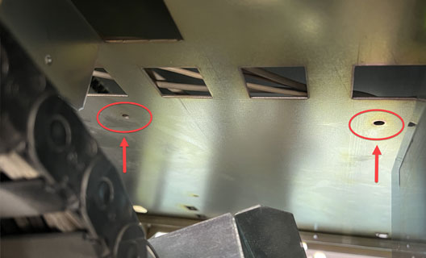

**Image analysis**

```json
{
 "image_name": "image16.jpg",
 "rId": "rId29",
 "image_path": "img_folder/image_015_image16.jpg",
 "caption": "نمای زیرِ یک صفحه فلزی با سوراخ ها و پنجره های مستطیلی، با فلش های قرمز به دو نقطه اشاره می کند",
 "ocr_text": "",
 "visual_description": [
 "یک صفحه فلزی با چند برش/پنجره مستطیلی دیده می شود",
 "دو ناحیه با دایره قرمز مشخص شده اند",
 "دو فلش قرمز رو به بالا به سوراخ های کوچک روی صفحه اشاره می کنند",
 "در سمت چپ تصویر یک زنجیر/کابل چین (chain) مشکی دیده می شود"
 ],
 "image_type": "photo"
}
``` |
<!-- TABLE_END -->

# سنسور دما

در تمام مدل ها، سنسور دما از یک سمت به برد کنترل متصل است و از سمت دیگر توسط یک پیچ T20 روی فشیا و در کنار صفحه کلید دستگاه مهار می گردد:

<!-- TABLE_START -->
| | |
| --- | --- |
|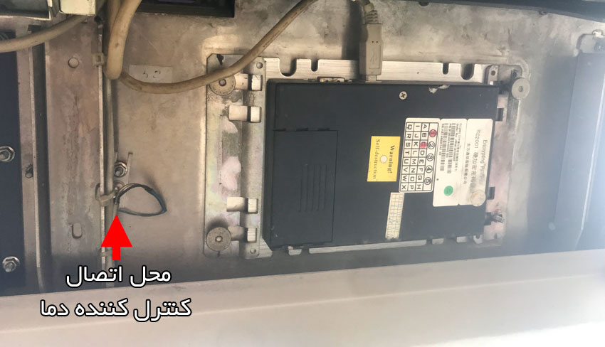

**Image analysis**

```json
{
 "image_name": "image17.jpg",
 "rId": "rId30",
 "image_path": "img_folder/image_016_image17.jpg",
 "caption": "نمای کنترل کننده دما و محل اتصال مشخص شده با فلش قرمز",
 "ocr_text": "محل اتصال\nکنترل کننده دما\nWarning\nSlide door\nEmergency open\nZotye Auto",
 "visual_description": [
 "فلش قرمز به یک سوکت/اتصال سیم در سمت چپ تصویر اشاره می کند",
 "یک ماژول مستطیلی مشکی با برچسب های «Warning»، «Slide door»، «Emergency open» و «Zotye Auto» دیده می شود",
 "متن فارسی «محل اتصال کنترل کننده دما» روی تصویر قرار داده شده است"
 ],
 "image_type": "photo"
}
``` |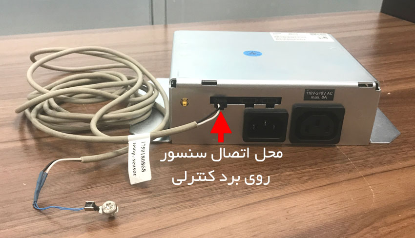

**Image analysis**

```json
{
 "image_name": "image18.jpg",
 "rId": "rId31",
 "image_path": "img_folder/image_017_image18.jpg",
 "caption": "محل اتصال سنسور دما روی برد کنترلی با فلش قرمز مشخص شده است",
 "ocr_text": "110V-240V AC\nmax. 8A\nمحل اتصال سنسور\nروی برد کنترلی\n1750180868\n(temp. sensor)",
 "visual_description": [
 "تصویر یک دستگاه/ماژول فلزی با کابل سنسور متصل در سمت چپ دیده می شود",
 "فلش قرمز به یک کانکتور روی پنل پشتی دستگاه اشاره می کند",
 "برچسب روی بدنه مشخصات ورودی برق «110V-240V AC» و «max. 8A» را نشان می دهد",
 "روی کابل برچسب «1750180868» و عبارت «(temp. sensor)» وجود دارد",
 "پنل پشتی شامل چند سوکت/کانکتور مستطیلی و یک ورودی برق AC است"
 ],
 "image_type": "photo"
}
``` |
<!-- TABLE_END -->

# نصب ماژول *هیتر و کانال انتقال گرما* در خودپرداز وینکور

برای نصب ماژول هیتر و کانال انتقال گرما در خودپردازهای وینکور مراحل زیر را انجام دهید:

1. کانال انتقال گرما را در محل تعبیه شده قرار دهید و دو عدد پیچ T20 که در شکل زیر مشخص شده اند را محکم کنید:

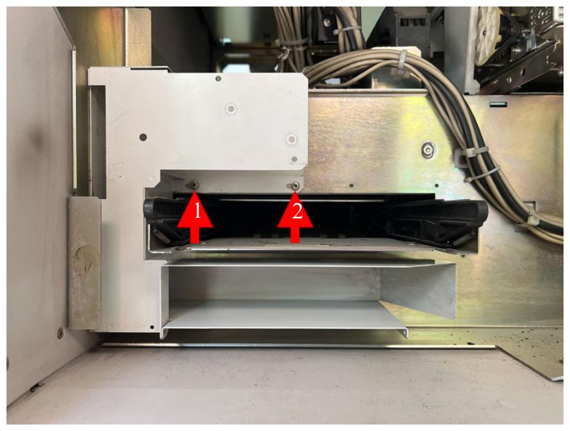

**Image analysis**

```json
{
 "image_name": "image19.jpg",
 "rId": "rId32",
 "image_path": "img_folder/image_018_image19.jpg",
 "caption": "نمای داخلی دستگاه با دو پیکان شماره دار روی قطعه مشکی",
 "ocr_text": "1\n2",
 "visual_description": [
 "دو پیکان قرمز رو به بالا با برچسب های «1» و «2» روی یک قطعه/درب مشکی داخل محفظه فلزی قرار دارند",
 "چند کابل خاکستری در سمت راست با بست کمربندی جمع شده اند",
 "سازه فلزی با پیچ ها و سوراخ های نصب و یک سینی/کانال فلزی در پایین دیده می شود"
 ],
 "image_type": "photo"
}
```

2

1

2. پایه نگهدارنده هیتر را در محلی که در شکل زیر مشخص شده است توسط دو عدد پیچ مهار کنید:

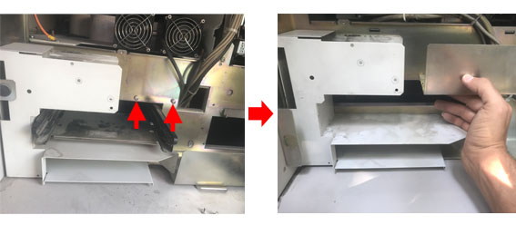

**Image analysis**

```json
{
 "image_name": "image20.jpg",
 "rId": "rId33",
 "image_path": "img_folder/image_019_image20.jpg",
 "caption": "دو تصویر از دستگاه صنعتی با پیکان های قرمز و دست در حال جابه جایی قطعه",
 "ocr_text": "",
 "visual_description": [
 "دو قاب کنارهم از یک دستگاه/محفظه صنعتی فلزی سفید",
 "در تصویر چپ دو پیکان قرمز به دو ناحیه زیر یک پنل فلزی اشاره می کنند",
 "در تصویر چپ دو فن خنک کننده در قسمت بالای دستگاه دیده می شود",
 "در تصویر راست یک دست در حال گرفتن/جابه جایی یک قطعه فلزی مستطیلی درون محفظه است",
 "یک پیکان قرمز بین دو قاب جهت حرکت از تصویر چپ به راست را نشان می دهد"
 ],
 "image_type": "photo"
}
```

3. هیتر را در جهتی که در شکل زیر (سمت چپ) نشان داده شده است قرار دهید و دو عدد پیچ آن را ببندید:

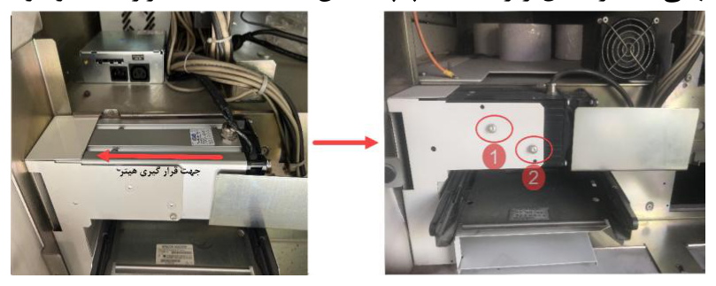

**Image analysis**

```json
{
 "image_name": "image21.emf",
 "rId": "rId34",
 "image_path": "img_folder/image_020_image21.png",
 "caption": "دو عکس از داخل دستگاه با فلش قرمز و مشخص کردن دو پیچ با دایره و شماره",
 "ocr_text": "چیپت ساز گریس میمبر",
 "visual_description": [
 "دو تصویر از داخل یک دستگاه با کابل ها و قطعات فلزی",
 "در تصویر چپ یک فلش قرمز افقی جهت حرکت/مسیر را نشان می دهد",
 "در تصویر راست دو پیچ با دایره قرمز مشخص شده اند و کنارشان برچسب های عددی 1 و 2 دیده می شود"
 ],
 "image_type": "diagram"
}
```

# نصب ماژول هیتر و کانال انتقال گرما در خودپرداز ایستکام

به منظور نصب ماژول هیتر و کانال انتقال گرما در خودپردازهای ایستکام مراحل زیر را انجام دهید:

1. کانال انتقال گرما را در محل تعبیه شده قرار دهید و مطابق شکل زیر با دو عدد پیچ (پیچ های شماره 3 و شماره 4) آن را در جایش محکم کنید:

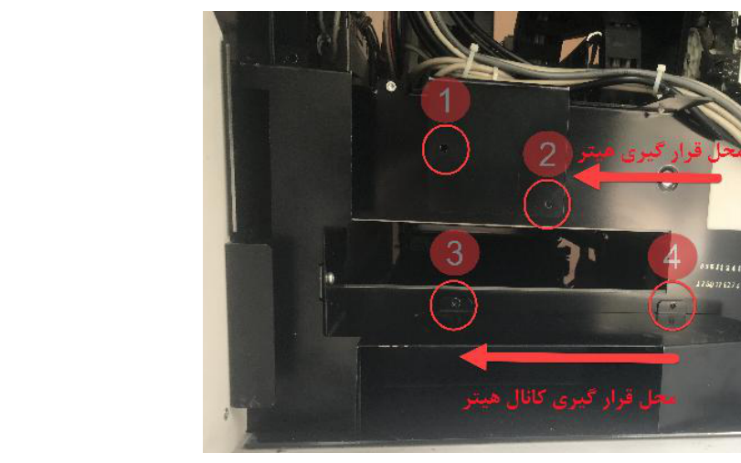

**Image analysis**

```json
{
 "image_name": "image22.emf",
 "rId": "rId35",
 "image_path": "img_folder/image_021_image22.png",
 "caption": "نمای داخلی دستگاه با نقاط شماره گذاری شده و محل قرارگیری فنر و کانال فنر",
 "ocr_text": "1\n2\n3\n4\nمحل قرار گیری فنر\nمحل قرار گیری کانال فنر",
 "visual_description": [
 "چهار دایره قرمز شماره گذاری شده 1 تا 4 روی پیچ ها/نقاط اتصال روی قطعات فلزی مشکی مشخص شده اند",
 "یک فلش قرمز در سمت راست به سمت چپ با برچسب «محل قرار گیری فنر» اشاره می کند",
 "یک فلش قرمز در پایین به سمت چپ با برچسب «محل قرار گیری کانال فنر» اشاره می کند",
 "کابل ها/سیم های متعدد در بخش بالایی تصویر روی محفظه قرار دارند"
 ],
 "image_type": "photo"
}
```

2. همانند تصویر بالا، هیتر را نیز توسط پیچ های شماره 1 و شماره 2 در جایش محکم کنید.

# بررسی درستی عملکرد ماژول گرمایشی هیتر

در پایان، لازم است یک شی سرد را روی سنسور تشخیص دما قرار دهید تا از عملکرد صحیح ماژول هیتر و همچنین درست بودن جهت انتقال باد فن اطمینان حاصل نمایید.

1. Climate Package [↑](#footnote-ref-1)