# Document metadata

- **Author:** Arash Tighbor
- **Last Modified By:** Arash Tighbor
- **Created:** 2016-04-12T11:27:00Z
- **Modified:** 2026-05-06T09:57:00Z
- **Document Name:** 1-IT0410-517-04_SamanSoft_Win10.docx
- **Source File:** C:\Users\aa.eskandari\Desktop\input\1-IT0410-517-04_SamanSoft_Win10.docx

---

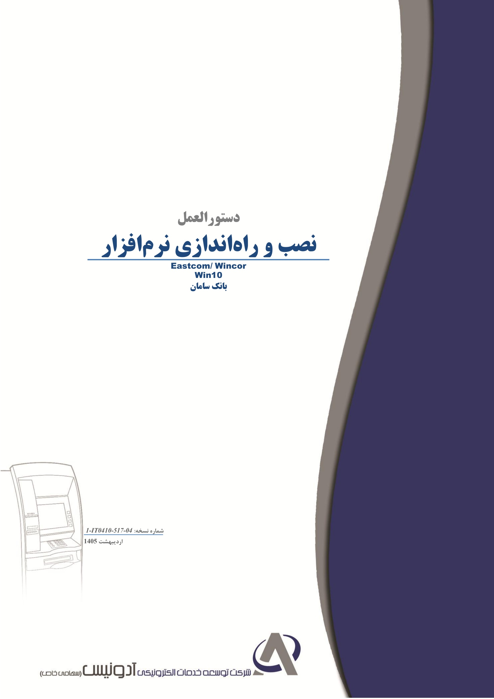

**Image analysis**

```json
{
 "image_name": "image1.jpg",
 "rId": "rId8",
 "image_path": "img_folder/image_001_image1.jpg",
 "caption": "جلد دستورالعمل نصب و راه اندازی نرم افزار Eastcom/Wincor روی Win10 برای بانک سامان",
 "ocr_text": "دستورالعمل\nنصب و راهاندازی نرم افزار\nEastcom/ Wincor\nWin10\nبانک سامان\nشماره نسخه : 1-IT0410-517-04\nاردیبهشت 1405\nشرکت توسعه خدمات الکترونیکی آدونیس (سهامی خاص)",
 "visual_description": [
 "صفحه جلد یک سند فارسی با عنوان «دستورالعمل نصب و راهاندازی نرم افزار»",
 "ذکر نام نرم افزار/سیستم: «Eastcom/ Wincor» و سیستم عامل «Win10»",
 "ذکر سازمان: «بانک سامان»",
 "اطلاعات نسخه: «شماره نسخه : 1-IT0410-517-04» و تاریخ «اردیبهشت 1405»",
 "نمایش لوگو و نام «شرکت توسعه خدمات الکترونیکی آدونیس (سهامی خاص)»",
 "تصویر خطی یک دستگاه خودپرداز در پایینِ سمت چپ جلد"
 ],
 "image_type": "scan"
}
```

**دستورالعمل**

**نصب و راه اندازی نرم افزار**

Eastcom/ Wincor

Win10

**بانک سامان**

**شماره نسخه: 1-IT0410-517-04**

**اردیبهشت 1405**


**Image analysis**

```json
{
 "image_name": "image2.png",
 "rId": "rId9",
 "image_path": "img_folder/image_002_image2.png",
 "caption": "لوگوی آدونیس و عبارت شرکت توسعه خدمات الکترونیکی",
 "ocr_text": "آدونیس\nشرکت توسعه خدمات الکترونیکی",
 "visual_description": [
 "تصویر شامل لوگوی گرافیکی حرف A خاکستری با منحنی آبی پیرامون آن است",
 "متن فارسی «آدونیس» در سمت چپ و عبارت «شرکت توسعه خدمات الکترونیکی» در کنار آن دیده می شود",
 "پس زمینه تصویر مشکی است و نوشته ها به رنگ های خاکستری و آبی هستند"
 ],
 "image_type": "unknown"
}
```

این سند با عنوان «دستورالعمل نصب و راه اندازی نرم افزار بانک سامان - Win10-Eastcom & Wincor » در آذرماه 1404 در گروه پشتیبانی عملیات شرکت توسعه خدمات الکترونیکی آدونیس توسط آقای رضا اشرفی تهیه و تنظیم شده است.

این دستورالعمل در واحد آموزش، ویرایش و آماده انتشار گردید.

سابقه ویرایش :

<!-- TABLE_START -->
| | | | |
| --- | --- | --- | --- |
| **نام** **ویرایشگر** | **تاریخ** | **نام / سمت تاییدکننده** | **شماره نسخه قبلی**\* |
| آرش تیغ بر | دی 1404 | رضا اشرفی/ کارشناس واحد پشتیبانی عملیات | 1-IT0410-517-00 |
| بهمن 1404 | 1-IT0410-517-01 |
| اردیبهشت 1405 | 1-IT0410-517-02 |
| 1-IT0410-517-03 |
<!-- TABLE_END -->

\*با انتشار نسخه جدید، نسخه قبلی فاقد اعتبار خواهد بود.

<!-- TABLE_OF_CONTENTS_START -->
**فهرست**

[اقلام موردنیاز 1](#_Toc227769985)

[سخت افزار موردنیاز 1](#_Toc227769986)

[اقدامات پیش از نصب 2](#_Toc227769987)

[تنظیمات اولیه در ADIPC 8](#_Toc227769988)

[نصب پکیج با استفاده از نرم افزار آکرونیس 9](#_Toc227769989)

[انجام تنظیمات راه اندازی ویندوز 22](#_Toc227769990)

[انجام تنظیمات کانفیگ سخت افزاری 28](#_Toc227769991)

[1. مجوز نصب و راه اندازی 28](#_Toc227769992)

[2. انجام تنظیمات سخت افزار 28](#_Toc227769993)

[3.راه اندازی EPP 30](#_Toc227769994)

[4.انجام تنظیمات شبکه 31](#_Toc227769995)

5.[کارت گرافیک 36](#_Toc227769996)

[تنظیم صفحه نمایش در خودپردازهای دارای پنل اپراتوری تاچ 39](#_Toc227769997)

[تنظیم مانیتور: سری Eastcom 285DY و Eastcom 285DZ 40](#_Toc227769998)

[ساخت درایو D 43](#_Toc227769999)

[نصب درایورEPP 48](#_Toc227770000)

[تعویض EPP 49](#_Toc227770001)

[انجام تنظیمات Computer Name 50](#_Toc227770002)

[Join to Domain 52](#_Toc227770003)

[اضافه نمودن یوزر ATM به یوزرهای ویندوز 57](#_Toc227770004)

[اکتیو نمودن سیستم عامل 59](#_Toc227770005)

[انجام تنظیمات Autologon 63](#_Toc227770006)

[ انجام تنظیمات مربوط به زبان محیط ویندوز 64](#_Toc227770007)

[راه اندازی دوربین BNC 66](#_Toc227770008)

[نصب نرم افزار پردازشگران 68](#_Toc227770009)

[هاتفیکس SamanPackageConfiguration 75](#_Toc227770010)

[اتصالات COM در PC های مدل ADIPC 76](#_Toc227770011)

[بررسی عملکرد دوربین 76](#_Toc227770012)

[بررسی بارکدخوان Honeywell N4680 در Device Manager 76](#_Toc227770013)

[اطمینان از عملکرد درست سیستم 79](#_Toc227770014)

[پیوست 1: چک لیست نصب نرم افزار 82](#_Toc227770015)

[پیوست 2 : موارد بیست گانه ی داخل شعبه (In Branch) 83](#_Toc227770017)

<!-- TABLE_OF_CONTENTS_END -->


**Image analysis**

```json
{
 "image_name": "image4.png",
 "rId": "rId17",
 "image_path": "img_folder/image_003_image4.png",
 "caption": "متن خوشنویسی فارسی «به نام خدا» روی پس زمینه سفید",
 "ocr_text": "به نام خدا",
 "visual_description": [
 "متن فارسی با فونت خوشنویسی مشکی روی زمینه سفید نمایش داده شده است"
 ],
 "image_type": "scan"
}
```

# اقلام موردنیاز

جهت انجام عملیات نصب نرم افزار اقلام زیر موردنیاز خواهد بود:

1. فلش یا هارد اکسترنال آدونیس حاوی آخرین پکیج عملیاتی و نرم افزارهای جانبی.
2. کیبورد

# سخت افزار موردنیاز

با توجه به اینکه نصب ویندوز 10 بر روی خودپردازهای مدل EastCom/Wincor نیازمند وجود سخت افزار مناسبی می باشد، ازاین رو لازم است قبل از شروع کار موارد زیر را بررسی و پس از حصول اطمینان از فراهم بودن شرایط، اقدامات بعدی را انجام دهید:

<!-- TABLE_START -->
| | | | | | | | | |
| --- | --- | --- | --- | --- | --- | --- | --- | --- |
| برند | مدل | PC | RAM | | | | هارددیسک (HDD) | |
| مدل | ظرفیت | تعداد | مجموع | مدل | ظرفیت |
| **EastCom** | 2050 | Advantech | DDR3 UDIMM | 2 GB | 2 | 4 GB | SSD SATA 2.5 | 480,500,512 GB |
| 2000 |
| 280 | G41 | DDR3 UDIMM | 4 GB | 1 | 4 GB |
| 285 DY |
| 285 DZ | 5G | DDR3 SODIMM | 8 GB | 2 | 16 GB |
| **Wincor** | 1500 | 3G | DDR2 UDIMM | 2 GB | 2 | 4 GB | SSD SATA 2.5 | 480,500,512 GB |
| 2050 |
| 2100 |
| 2150 |
| 8050 | EPC-A4 | DDR3 UDIMM | 4 GB | 2 | 8 GB |
<!-- TABLE_END -->

**مشخصات سخت افزاری IPC خودپرداز های بانک سامان در Win10**

درصورت تعویض هارد SSD، ظرفیت هارد جایگزین باید دقیقا مطابق با ظرفیت و مدل هارد قبلی باشد.

# اقدامات پیش از نصب

قبل از هر گونه اقدام، لازم است موارد زیر را انجام دهید:

در صورت عدم شناسایی هارد یا فلش آدونیسی تعریف شده، در محیط ویندوز 10 دستگاه، لازم است در مسیر زیر، روی فایل klmover by AMP to راست کلیک کنید و ازمنویی که گشوده می شود Run as administrator را انتخاب نمایید:

C:\ATM\UTILITY\KLmover\_Kasper

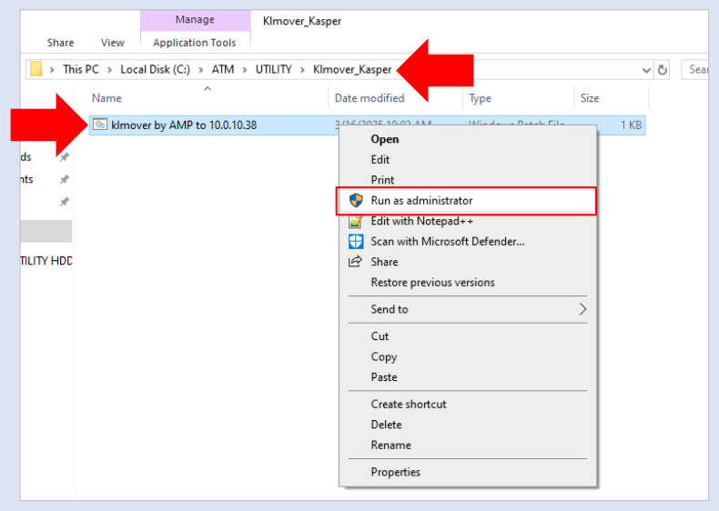

**Image analysis**

```json
{
 "image_name": "image5.png",
 "rId": "rId18",
 "image_path": "img_folder/image_004_image5.png",
 "caption": "نمایش فایل در File Explorer و منوی راست کلیک با گزینه Run as administrator",
 "ocr_text": "Share\nView\nManage\nApplication Tools\nKlmover_Kasper\nThis PC > Local Disk (C:) > ATM > UTILITY > Klmover_Kasper\nName\nDate modified\nType\nSize\nklmover by AMP to 10.0.10.38\nOpen\nEdit\nPrint\nRun as administrator\nEdit with Notepad++\nScan with Microsoft Defender...\nShare\nRestore previous versions\nSend to\nCut\nCopy\nPaste\nCreate shortcut\nDelete\nRename\nProperties\nSearch",
 "visual_description": [
 "اسکرین شات از Windows File Explorer در مسیر This PC > Local Disk (C:) > ATM > UTILITY > Klmover_Kasper",
 "یک فایل با نام «klmover by AMP to 10.0.10.38» انتخاب شده است",
 "منوی راست کلیک باز است و گزینه «Run as administrator» با کادر قرمز مشخص شده",
 "دو فلش قرمز به سمت فایل و مسیر پوشه اشاره می کنند"
 ],
 "image_type": "screenshot"
}
```

1. از موجودی دستگاه پرینت بگیرید و پس از پایان مراحل نصب نرم افزار، آن را بررسی و مطابقت دهید؛ در صورت وجود مغایرت، جهت انجام عملیات Add Cash مجدد، با اپراتور دستگاه تماس بگیرید.
2. از مسیر C:\Saman Soft پوشه یATMLog مربوط به یک ماه اخیر را بردارید؛ پس از اتمام عملیات نصب نرم افزار، پوشه ی فوق را در همین آدرس محل کپی نمایید.
3. تصاویر دوربین که در درایو D قرار دارند و مربوط به **6 ماه اخیر** هستند را بردارید. لازم است پس از اتمام عملیات نصب نرم افزار، پوشه ای با نام «Image Archive Old» را در درایو D ایجاد و تصاویر فوق را در آن کپی نمایید.

با توجه به وجود هارد دوم در پروژه Win10، نیازی به انجام این مرحله نخواهد بود.

4. جهت راه اندازی شبکه دستگاه، به مشخصات IP دستگاه نیاز خواهید داشت؛ در صورت راه اندازی اولیه این اطلاعات را باید از انفورماتیک دریافت کنید ولی در راه اندازی مجدد، بسته به نوع ویندوز می توانید با استفاده از روش زیر اقدام به استخراج مشخصات شبکه دستگاه نمایید:

* **Win7 :**
 A. در کادر جستجوی منوی Start کلمه ی network connection را تایپ و همانند تصویر زیر روی View network connections کلیک کنید:

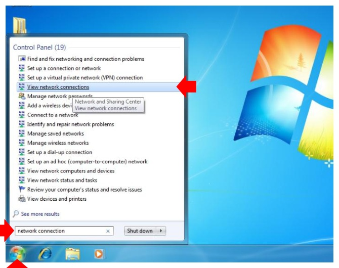

**Image analysis**

```json
{
 "image_name": "image6.jpeg",
 "rId": "rId19",
 "image_path": "img_folder/image_005_image6.jpg",
 "caption": "نمایش نتایج جستجوی کنترل پنل ویندوز 7 برای دسترسی به View network connections",
 "ocr_text": "Control Panel (19)\nFind and fix networking and connection problems\nSet up a connection or network\nSet up a virtual private network (VPN) connection\nView network connections\nManage network passwords\nAdd a wireless device\nConnect to a network\nIdentify and repair network problems\nManage saved networks\nManage wireless networks\nSet up a dial-up connection\nSet up an ad hoc (computer-to-computer) network\nView network computers and devices\nView network status and tasks\nReview your computer's status and resolve issues\nView devices and printers\nSee more results\nnetwork connection\nShut down\nPasswords\nNetwork and Sharing Center\nView network connections",
 "visual_description": [
 "اسکرین شات از ویندوز 7 با منوی Start باز و بخش نتایج جستجو",
 "عبارت جستجو شده در کادر پایین: network connection",
 "نتیجه «View network connections» هایلایت شده و یک فلش قرمز به آن اشاره می کند",
 "پنجره راهنما (tooltip) با متن «Network and Sharing Center» و «View network connections» نمایش داده شده است",
 "دکمه «Shut down» در پایین منو قابل مشاهده است"
 ],
 "image_type": "screenshot"
}
```

* B. روی کارت شبکه فعال راست کلیک و از منوی حاصله، گزینه ی Status را انتخاب نمایید:

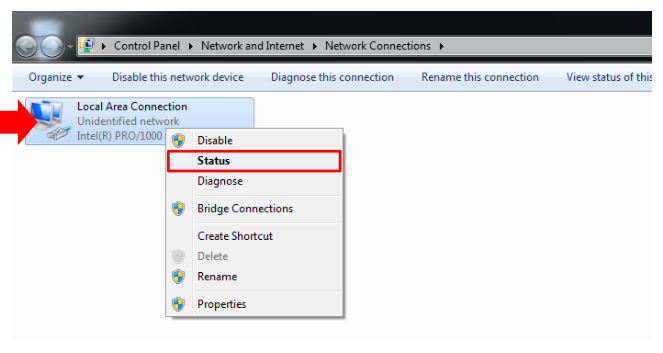

**Image analysis**

```json
{
 "image_name": "image7.png",
 "rId": "rId20",
 "image_path": "img_folder/image_006_image7.png",
 "caption": "پنجره Network Connections ویندوز با منوی راست کلیک روی Local Area Connection و گزینه Status",
 "ocr_text": "Control Panel > Network and Internet > Network Connections\nOrganize\nDisable this network device\nDiagnose this connection\nRename this connection\nView status of this\nLocal Area Connection\nUnidentified network\nIntel(R) PRO/1000\nDisable\nStatus\nDiagnose\nBridge Connections\nCreate Shortcut\nDelete\nRename\nProperties",
 "visual_description": [
 "اسکرین شات کنترل پنل ویندوز در مسیر Network Connections نمایش داده شده است",
 "اتصال «Local Area Connection» با وضعیت «Unidentified network» و آداپتور «Intel(R) PRO/1000» دیده می شود",
 "منوی راست کلیک روی اتصال باز است و گزینه «Status» با کادر قرمز برجسته شده",
 "یک فلش قرمز در سمت چپ به ناحیه اتصال Local Area Connection اشاره می کند"
 ],
 "image_type": "screenshot"
}
```

* C. در پنجره ای که باز می شود، روی گزینه Details کلیک کنید:

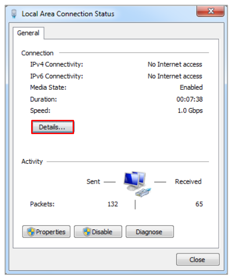

**Image analysis**

```json
{
 "image_name": "image8.png",
 "rId": "rId21",
 "image_path": "img_folder/image_007_image8.png",
 "caption": "پنجره وضعیت اتصال شبکه محلی با نمایش عدم دسترسی اینترنت و سرعت ۱.۰ گیگابیت",
 "ocr_text": "Local Area Connection Status\nGeneral\nConnection\nIPv4 Connectivity: No Internet access\nIPv6 Connectivity: No Internet access\nMedia State: Enabled\nDuration: 00:07:38\nSpeed: 1.0 Gbps\nDetails...\nActivity\nSent — Received\nPackets: 132 65\nProperties\nDisable\nDiagnose\nClose",
 "visual_description": [
 "پنجره Windows با عنوان Local Area Connection Status و تب General نمایش داده شده است",
 "در بخش Connection، IPv4 Connectivity و IPv6 Connectivity هر دو مقدار No Internet access دارند",
 "Media State برابر Enabled است",
 "Duration مقدار 00:07:38 را نشان می دهد",
 "Speed مقدار 1.0 Gbps را نشان می دهد",
 "دکمه Details... با کادر قرمز مشخص شده است",
 "در بخش Activity، تعداد Packets برای Sent برابر 132 و برای Received برابر 65 است",
 "دکمه های Properties، Disable، Diagnose و Close در پایین پنجره دیده می شوند"
 ],
 "image_type": "screenshot"
}
```

از پنجره ی Network Connection Details می توانید مشخصات شبکه دستگاه را استخراج نمایید:

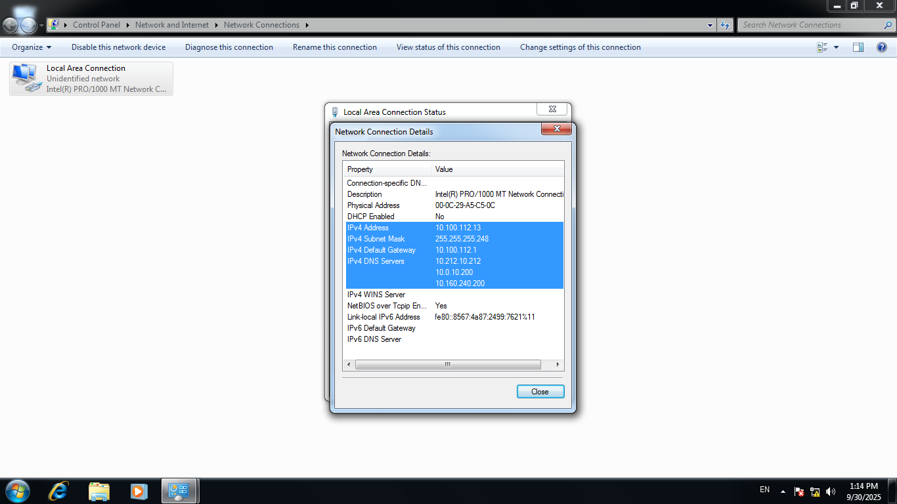

**Image analysis**

```json
{
 "image_name": "image9.png",
 "rId": "rId22",
 "image_path": "img_folder/image_008_image9.png",
 "caption": "جزئیات اتصال شبکه محلی در ویندوز شامل IP، ماسک، گیت وی و DNS",
 "ocr_text": "Control Panel > Network and Internet > Network Connections\nOrganize\nDisable this network device\nDiagnose this connection\nRename this connection\nView status of this connection\nChange settings of this connection\nSearch Network Connections\nLocal Area Connection\nUnidentified network\nIntel(R) PRO/1000 MT Network C...\nLocal Area Connection Status\nNetwork Connection Details\nNetwork Connection Details:\nProperty\nValue\nConnection-specific DN...\nDescription\nIntel(R) PRO/1000 MT Network Connecti...\nPhysical Address\n00-0C-29-A5-C5-0C\nDHCP Enabled\nNo\nIPv4 Address\n10.100.112.13\nIPv4 Subnet Mask\n255.255.255.248\nIPv4 Default Gateway\n10.100.112.1\nIPv4 DNS Servers\n10.212.10.212\n10.0.10.200\n10.160.240.200\nIPv4 WINS Server\nNetBIOS over Tcpip En...\nYes\nLink-local IPv6 Address\nfe80::8567:4a87:2499:7621%11\nIPv6 Default Gateway\nIPv6 DNS Server\nClose\nEN\n1:14 PM\n6/11/2017",
 "visual_description": [
 "پنجره Network Connection Details برای Local Area Connection نمایش داده شده است.",
 "DHCP Enabled مقدار No دارد.",
 "IPv4 Address برابر 10.100.112.13 است.",
 "IPv4 Subnet Mask برابر 255.255.255.248 است.",
 "IPv4 Default Gateway برابر 10.100.112.1 است.",
 "IPv4 DNS Servers شامل 10.212.10.212، 10.0.10.200 و 10.160.240.200 است.",
 "Physical Address برابر 00-0C-29-A5-C5-0C است.",
 "Link-local IPv6 Address برابر fe80::8567:4a87:2499:7621%11 است.",
 "NetBIOS over Tcpip Enabled مقدار Yes دارد."
 ],
 "image_type": "screenshot"
}
```

مشخصات IP هر دستگاه یکتا و مختص همان دستگاه است، اما DNS ها مقادیری ثابت هستند.

* **Win10**
 A. در گوشه ی سمت چپ صفحه روی دکمه ی Start (

**Image analysis**

```json
{
 "image_name": "image10.tmp",
 "rId": "rId23",
 "image_path": "img_folder/image_009_image10.png",
 "caption": "آیکون سادهٔ یک تصویر یا پنجره با خطوط عمودی در سمت چپ",
 "ocr_text": "",
 "visual_description": [
 "یک آیکون تک رنگ با شکل مستطیل شبیه پنجره یا قاب نمایش دیده می شود",
 "در سمت چپ آیکون چند نوار عمودی باریک و متوالی وجود دارد",
 "در بخش راست، یک مستطیل بزرگ تر با زمینهٔ روشن تر نسبت به پس زمینه دیده می شود"
 ],
 "image_type": "unknown"
}
```) کلیک کنید تا منوی آن گشوده شود. عبارت network connection را تایپ و همانند تصویر زیر روی
 View network connections کلیک نمایید:

**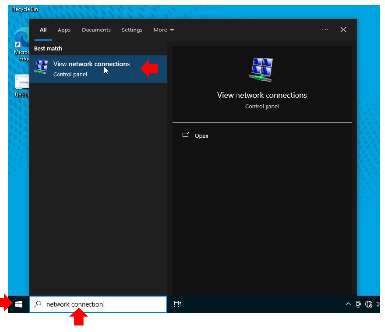

**Image analysis**

```json
{
 "image_name": "image11.png",
 "rId": "rId24",
 "image_path": "img_folder/image_010_image11.png",
 "caption": "جستجوی «View network connections» در منوی استارت ویندوز",
 "ocr_text": "Recycle Bin\nMicrosoft\nEdge\nUntitle\nAll\nApps\nDocuments\nSettings\nMore\nBest match\nView network connections\nControl panel\nView network connections\nControl panel\nOpen\nnetwork connection",
 "visual_description": [
 "پنجره جستجوی منوی Start ویندوز باز است و عبارت «network connection» در کادر جستجو تایپ شده",
 "نتیجه Best match با عنوان «View network connections» و برچسب «Control panel» نمایش داده می شود",
 "پنل سمت راست جزئیات «View network connections» و گزینه «Open» را نشان می دهد",
 "چند فلش قرمز به دکمه Start، کادر جستجو و نتیجه «View network connections» اشاره می کنند"
 ],
 "image_type": "screenshot"
}
```**

* B. روی کارت شبکه فعال راست کلیک و از منوی حاصله، گزینه ی Status را انتخاب نمایید:

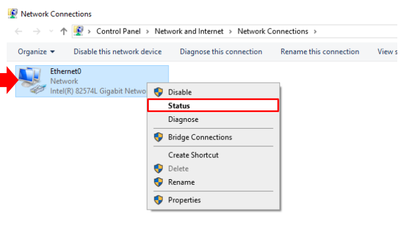

**Image analysis**

```json
{
 "image_name": "image12.png",
 "rId": "rId25",
 "image_path": "img_folder/image_011_image12.png",
 "caption": "پنجره Network Connections ویندوز با منوی راست کلیک روی Ethernet0 و گزینه Status مشخص شده است.",
 "ocr_text": "Network Connections\nControl Panel > Network and Internet > Network Connections\nOrganize\nDisable this network device\nDiagnose this connection\nRename this connection\nView s\nEthernet0\nNetwork 2\nIntel(R) 82574L Gigabit Netwo\nDisable\nStatus\nDiagnose\nBridge Connections\nCreate Shortcut\nDelete\nRename\nProperties",
 "visual_description": [
 "اسکرین شات از Windows Control Panel مسیر Network Connections",
 "آداپتور شبکه Ethernet0 (Network 2) با نام Intel(R) 82574L Gigabit Netwo نمایش داده شده است",
 "منوی راست کلیک روی Ethernet0 باز است و گزینه Status با کادر قرمز برجسته شده",
 "فلش قرمز به آیکن/آیتم Ethernet0 اشاره می کند"
 ],
 "image_type": "screenshot"
}
```

* C. در پنجره ای که باز می شود، روی گزینه Details کلیک کنید:

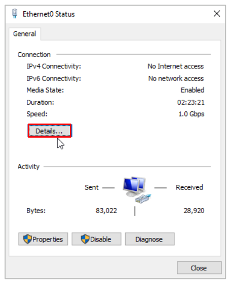

**Image analysis**

```json
{
 "image_name": "image13.png",
 "rId": "rId26",
 "image_path": "img_folder/image_012_image13.png",
 "caption": "پنجره وضعیت Ethernet0 با نمایش اتصال IPv4/IPv6، سرعت ۱.۰Gbps و دکمه Details",
 "ocr_text": "Ethernet0 Status\nGeneral\nConnection\nIPv4 Connectivity:\nNo Internet access\nIPv6 Connectivity:\nNo network access\nMedia State:\nEnabled\nDuration:\n02:23:21\nSpeed:\n1.0 Gbps\nDetails...\nActivity\nSent\nReceived\nBytes:\n83,022\n28,920\nProperties\nDisable\nDiagnose\nClose",
 "visual_description": [
 "پنجره Windows با عنوان «Ethernet0 Status» و تب «General» نمایش داده شده است",
 "در بخش Connection، IPv4 Connectivity برابر «No Internet access» است",
 "در بخش Connection، IPv6 Connectivity برابر «No network access» است",
 "Media State مقدار «Enabled» دارد",
 "Duration برابر «02:23:21» نمایش داده شده است",
 "Speed برابر «1.0 Gbps» است",
 "دکمه «Details...» با کادر قرمز مشخص شده است",
 "بخش Activity با آیکون شبکه و برچسب های «Sent» و «Received» دیده می شود",
 "Bytes ارسال شده «83,022» و دریافت شده «28,920» نمایش داده شده است",
 "دکمه های «Properties»، «Disable»، «Diagnose» و «Close» در پایین پنجره وجود دارد"
 ],
 "image_type": "screenshot"
}
```

از پنجره ی Network Connection Details می توانید مشخصات شبکه دستگاه را استخراج نمایید:

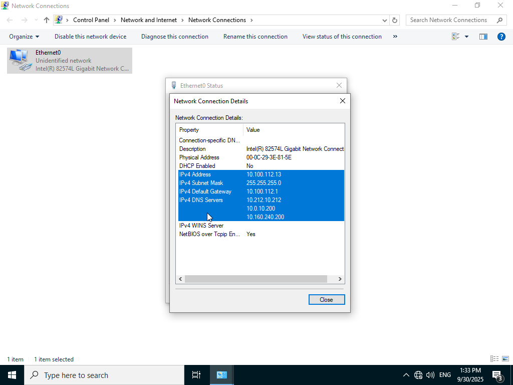

**Image analysis**

```json
{
 "image_name": "image14.png",
 "rId": "rId27",
 "image_path": "img_folder/image_013_image14.png",
 "caption": "پنجره جزئیات اتصال شبکه اترنت در ویندوز با آدرس IP، درگاه پیش فرض و DNS",
 "ocr_text": "Network Connections\nControl Panel > Network and Internet > Network Connections\nSearch Network Connections\nOrganize\nDisable this network device\nDiagnose this connection\nRename this connection\nView status of this connection\nEthernet0\nUnidentified network\nIntel(R) 82574L Gigabit Network C...\nEthernet0 Status\nNetwork Connection Details\nNetwork Connection Details:\nProperty\nValue\nConnection-specific DN...\nDescription\nIntel(R) 82574L Gigabit Network Connect\nPhysical Address\n00-0C-29-3E-81-5E\nDHCP Enabled\nNo\nIPv4 Address\n10.100.112.13\nIPv4 Subnet Mask\n255.255.255.0\nIPv4 Default Gateway\n10.100.112.1\nIPv4 DNS Servers\n10.212.10.212\n10.0.10.200\n10.160.240.200\nIPv4 WINS Server\nNetBIOS over Tcpip En...\nYes\nClose\nType here to search\nENG\n1:33 PM\n9/3/2016\n1 item\n1 item selected",
 "visual_description": [
 "اسکرین شات از Control Panel > Network Connections با اتصال Ethernet0 (Unidentified network)",
 "پنجره Network Connection Details باز است و مشخصات کارت شبکه Intel(R) 82574L Gigabit Network Connect نمایش داده می شود",
 "DHCP Enabled مقدار No دارد",
 "IPv4 Address برابر 10.100.112.13 است",
 "IPv4 Subnet Mask برابر 255.255.255.0 است",
 "IPv4 Default Gateway برابر 10.100.112.1 است",
 "IPv4 DNS Servers شامل 10.212.10.212، 10.0.10.200 و 10.160.240.200 است",
 "Physical Address (MAC) برابر 00-0C-29-3E-81-5E است",
 "دکمه Close در پایین پنجره وجود دارد"
 ],
 "image_type": "screenshot"
}
```

5. مشخصات Computer Name دستگاه را در صورت راه اندازی اولیه - تغییر ترمینال، کد شعبه وIP - از انفورماتیک دریافت نمایید. در صورت راه اندازی مجدد نیز بسته به نوع ویندوز،
 Computer Name را به شرح زیر استخراج کنید:

* **Win7**

در منوی Start، روی Computer راست کلیک و از منویی که گشوده می شود روی Properties کلیک نمایید در پنجره ای نمایش داده می شود، Computer Name را یادداشت نمایید.

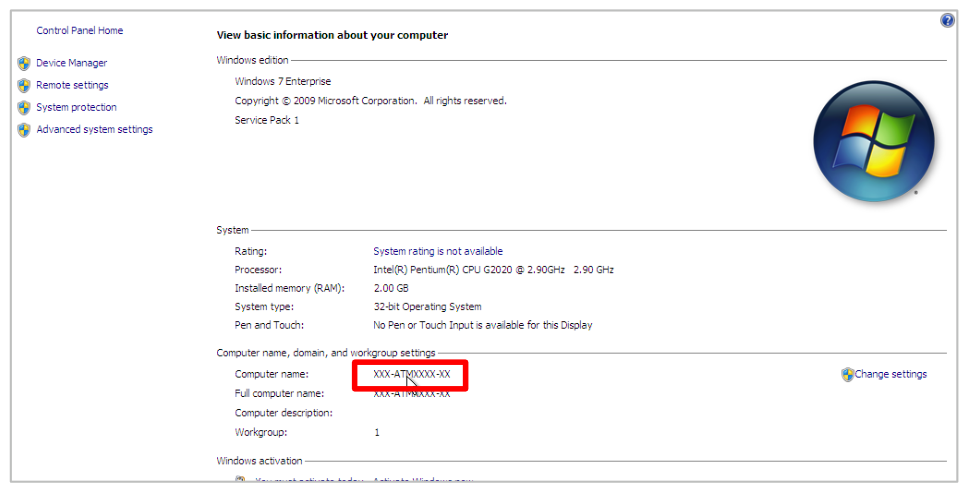

**Image analysis**

```json
{
 "image_name": "image15.png",
 "rId": "rId28",
 "image_path": "img_folder/image_014_image15.png",
 "caption": "نمایش اطلاعات سیستم در ویندوز ۷ اینترپرایز با مشخصات CPU و RAM و نوع سیستم",
 "ocr_text": "Control Panel Home\nDevice Manager\nRemote settings\nSystem protection\nAdvanced system settings\nView basic information about your computer\nWindows edition\nWindows 7 Enterprise\nCopyright © 2009 Microsoft Corporation. All rights reserved.\nService Pack 1\nSystem\nRating:\nSystem rating is not available\nProcessor:\nIntel(R) Pentium(R) CPU G2020 @ 2.90GHz 2.90 GHz\nInstalled memory (RAM):\n2.00 GB\nSystem type:\n32-bit Operating System\nPen and Touch:\nNo Pen or Touch Input is available for this Display\nComputer name, domain, and workgroup settings\nComputer name:\nXXX-AT\\T9XXX-XX\nChange settings\nFull computer name:\nXXX-AT\\T9XXX-XX\nComputer description:\nWorkgroup:\n1\nWindows activation",
 "visual_description": [
 "اسکرین شات پنجره System در Control Panel ویندوز 7",
 "Windows edition: Windows 7 Enterprise, Service Pack 1",
 "پردازنده: Intel(R) Pentium(R) CPU G2020 @ 2.90GHz",
 "حافظه نصب شده (RAM): 2.00 GB",
 "نوع سیستم: 32-bit Operating System",
 "متن «No Pen or Touch Input is available for this Display» نمایش داده شده است",
 "نام کامپیوتر در یک کادر قرمز مشخص شده است",
 "لینک «Change settings» در بخش Computer name, domain, and workgroup settings دیده می شود"
 ],
 "image_type": "screenshot"
}
```

* **Win10**

در گوشه ی سمت چپ صفحه روی دکمه ی Start (

**Image analysis**

```json
{
 "image_name": "image10.tmp",
 "rId": "rId23",
 "image_path": "img_folder/image_009_image10.png",
 "caption": "آیکون سادهٔ یک تصویر یا پنجره با خطوط عمودی در سمت چپ",
 "ocr_text": "",
 "visual_description": [
 "یک آیکون تک رنگ با شکل مستطیل شبیه پنجره یا قاب نمایش دیده می شود",
 "در سمت چپ آیکون چند نوار عمودی باریک و متوالی وجود دارد",
 "در بخش راست، یک مستطیل بزرگ تر با زمینهٔ روشن تر نسبت به پس زمینه دیده می شود"
 ],
 "image_type": "unknown"
}
```) کلیک کنید تا منوی آن گشوده شود. عبارت System setting را تایپ و همانند تصویر زیر روی
Veiw advanced system settings کلیک نمایید:

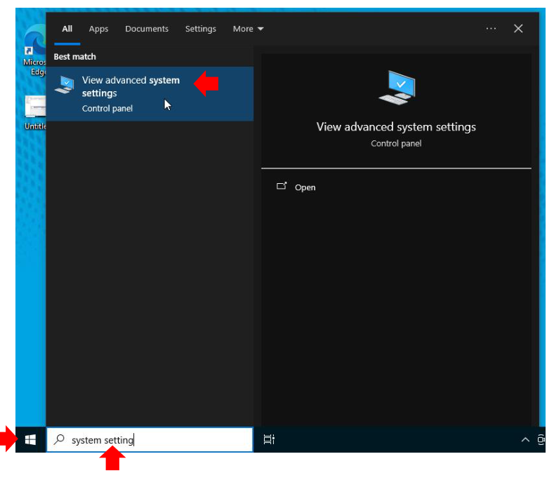

**Image analysis**

```json
{
 "image_name": "image16.png",
 "rId": "rId29",
 "image_path": "img_folder/image_015_image16.png",
 "caption": "اسکرین شات جستجوی ویندوز برای گزینه View advanced system settings در Control Panel",
 "ocr_text": "All\nApps\nDocuments\nSettings\nMore\nBest match\nView advanced system settings\nControl panel\nView advanced system settings\nControl panel\nOpen\nsystem settin",
 "visual_description": [
 "پنجره جستجوی ویندوز با تب های All، Apps، Documents، Settings و More نمایش داده شده است.",
 "نتیجه Best match شامل گزینه «View advanced system settings» با زیرنویس «Control panel» است.",
 "در پنل سمت راست عنوان «View advanced system settings» و دکمه «Open» دیده می شود.",
 "کادر جستجو در نوار وظیفه شامل متن «system settin» است.",
 "سه فلش قرمز به دکمه استارت، کادر جستجو و نتیجه «View advanced system settings» اشاره می کنند."
 ],
 "image_type": "screenshot"
}
```

در پنجره ای که باز می شود، از تب Computer Name و بخش Full Computer Name، مشخصات Computer Name دستگاه را یادداشت نمایید:

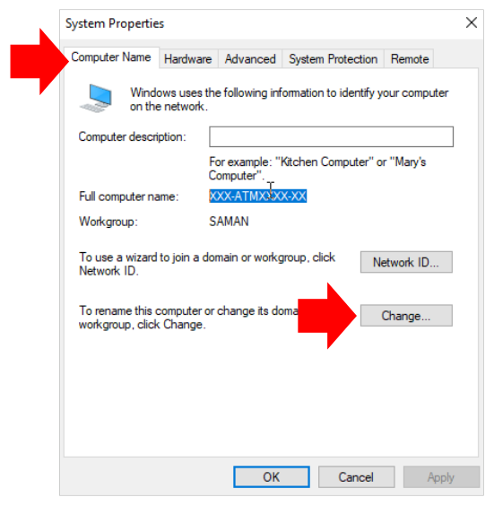

**Image analysis**

```json
{
 "image_name": "image17.png",
 "rId": "rId30",
 "image_path": "img_folder/image_016_image17.png",
 "caption": "پنجره System Properties ویندوز برای مشاهده نام کامل رایانه و Workgroup و دکمه Change",
 "ocr_text": "System Properties\nComputer Name Hardware Advanced System Protection Remote\nWindows uses the following information to identify your computer on the network.\nComputer description:\nFor example: \"Kitchen Computer\" or \"Mary's Computer\".\nFull computer name:\nXXX-ATMXX-XX-XX\nWorkgroup:\nSAMAN\nTo use a wizard to join a domain or workgroup, click Network ID.\nNetwork ID...\nTo rename this computer or change its domain or workgroup, click Change.\nChange...\nOK Cancel Apply",
 "visual_description": [
 "اسکرین شات پنجره System Properties در تب Computer Name با چند تب بالای پنجره",
 "نام کامل رایانه به صورت انتخاب شده: XXX-ATMXX-XX-XX",
 "Workgroup نمایش داده شده: SAMAN",
 "دو فلش قرمز به تب Computer Name و دکمه Change... اشاره می کنند",
 "دکمه های Network ID... و Change... در سمت راست پنجره دیده می شوند",
 "دکمه های OK، Cancel و Apply در پایین پنجره موجود است"
 ],
 "image_type": "screenshot"
}
```

6. در صورت راه اندازی مجدد، به مسیر C:\Program Files\atmapp بروید، فایل Config را با استفاده از برنامه ی NotePad++ باز کنید و با توجه به شکل زیر دسته گردش و پذیرنده را استخراج نمایید:

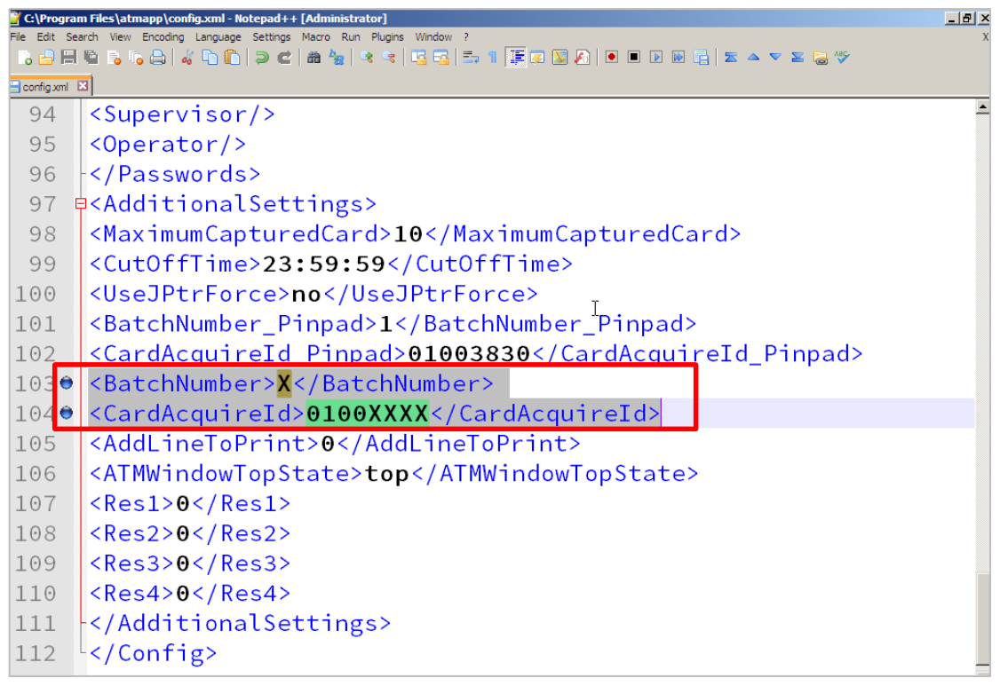

**Image analysis**

```json
{
 "image_name": "image18.png",
 "rId": "rId31",
 "image_path": "img_folder/image_017_image18.png",
 "caption": "اسکرین شات ویرایش فایل config.xml در Notepad++ با مقادیر BatchNumber و CardAcquireId مشخص شده",
 "ocr_text": "C:\\Program Files\\atmapp\\config.xml - Notepad++ [Administrator]\nFile Edit Search View Encoding Language Settings Macro Run Plugins Window ?\nconfig.xml\n94 <Supervisor/>\n95 <Operator/>\n96 </Passwords>\n97 <AdditionalSettings>\n98 <MaximumCapturedCard>10</MaximumCapturedCard>\n99 <CutOffTime>23:59:59</CutOffTime>\n100 <UseJPtrForce>no</UseJPtrForce>\n101 <BatchNumber_Pinpad>1</BatchNumber_Pinpad>\n102 <CardAcquireId_Pinpad>01003830</CardAcquireId_Pinpad>\n103 <BatchNumber>X</BatchNumber>\n104 <CardAcquireId>0100XXXX</CardAcquireId>\n105 <AddLineToPrint>0</AddLineToPrint>\n106 <ATMWindowTopState>top</ATMWindowTopState>\n107 <Res1>0</Res1>\n108 <Res2>0</Res2>\n109 <Res3>0</Res3>\n110 <Res4>0</Res4>\n111 </AdditionalSettings>\n112 </Config>",
 "visual_description": [
 "پنجره Notepad++ با فایل C:\\Program Files\\atmapp\\config.xml باز است",
 "بخش XML با تگ <AdditionalSettings> نمایش داده شده است",
 "مقادیر <MaximumCapturedCard>10</MaximumCapturedCard> و <CutOffTime>23:59:59</CutOffTime> قابل مشاهده اند",
 "مقادیر <BatchNumber_Pinpad>1</BatchNumber_Pinpad> و <CardAcquireId_Pinpad>01003830</CardAcquireId_Pinpad> موجود است",
 "یک کادر قرمز دو خط را هایلایت کرده: <BatchNumber>X</BatchNumber> و <CardAcquireId>0100XXXX</CardAcquireId>",
 "دو نقطه/نشانگر دایره ای آبی در حاشیه چپ کنار خطوط هایلایت شده دیده می شود"
 ],
 "image_type": "screenshot"
}
```

7. در صورت راه اندازی مجدد، جهت پاک کردن Computer Name با **شماره تلفن 67642270-021** تماس بگیرید.

# تنظیمات اولیه در ADIPC

در خودپردازهای مجهز به ADIPC برای روشن شدن IPC پس از هر بار خاموش و روشن شدن دستگاه، به صفحه تنظیمات بایوس و سربرگ Chipset بروید، روی PCH-IO Configuration کلیک کنید:

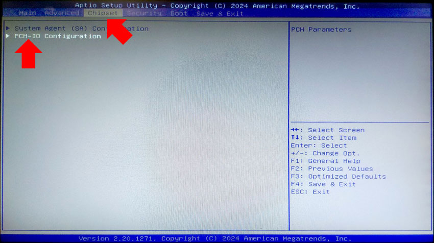

**Image analysis**

```json
{
 "image_name": "image19.jpg",
 "rId": "rId32",
 "image_path": "img_folder/image_018_image19.jpg",
 "caption": "صفحه BIOS Aptio در تب Chipset با گزینه های System Agent و PCH-IO و راهنمای کلیدها",
 "ocr_text": "Aptio Setup Utility - Copyright (C) 2024 American Megatrends, Inc.\nMain Advanced Chipset Security Boot Save & Exit\n> System Agent (SA) Configuration\n> PCH-IO Configuration\nPCH Parameters\n←→: Select Screen\n↑↓: Select Item\nEnter: Select\n+/-: Change Opt.\nF1: General Help\nF2: Previous Values\nF3: Optimized Defaults\nF4: Save & Exit\nESC: Exit\nVersion 2.20.1271. Copyright (C) 2024 American Megatrends, Inc.",
 "visual_description": [
 "رابط کاربری BIOS/UEFI با عنوان Aptio Setup Utility و منوی تب ها (Main، Advanced، Chipset، Security، Boot، Save & Exit) نمایش داده شده است.",
 "در پنل سمت چپ زیر تب Chipset دو آیتم قابل انتخاب دیده می شود: System Agent (SA) Configuration و PCH-IO Configuration.",
 "پنل سمت راست با عنوان PCH Parameters و بخش راهنمای کلیدها شامل ←→، ↑↓، Enter، +/-، F1، F2، F3، F4 و ESC است.",
 "دو فلش قرمز روی بخش های System Agent (SA) Configuration و PCH-IO Configuration قرار گرفته اند."
 ],
 "image_type": "screenshot"
}
```

سپس گزینه Restore AC Power Loss را روی Power On تنظیم نمایید:

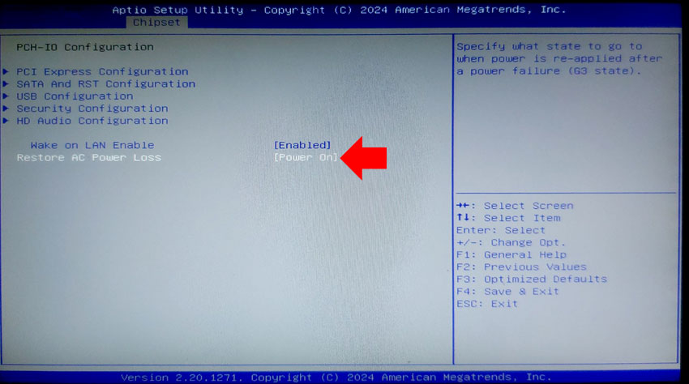

**Image analysis**

```json
{
 "image_name": "image20.jpg",
 "rId": "rId33",
 "image_path": "img_folder/image_019_image20.jpg",
 "caption": "صفحه تنظیمات BIOS Aptio برای گزینه های Wake on LAN و Restore AC Power Loss",
 "ocr_text": "Aptio Setup Utility - Copyright (C) 2024 American Megatrends, Inc.\nChipset\nPCH-IO Configuration\nPCI Express Configuration\nSATA And RST Configuration\nUSB Configuration\nSecurity Configuration\nHD Audio Configuration\nWake on LAN Enable [Enabled]\nRestore AC Power Loss [Power On]\nSpecify what state to go to\nwhen power is re-applied after\na power failure (G3 state).\n←→: Select Screen\n↑↓: Select Item\nEnter: Select\n+/-: Change Opt.\nF1: General Help\nF2: Previous Values\nF3: Optimized Defaults\nF4: Save & Exit\nESC: Exit\nVersion 2.20.1271. Copyright (C) 2024 American Megatrends, Inc.",
 "visual_description": [
 "نمایش منوی Chipset در Aptio Setup Utility با لیست گزینه های PCH-IO، PCI Express، SATA And RST، USB، Security و HD Audio",
 "گزینه Wake on LAN Enable روی مقدار [Enabled] قرار دارد",
 "گزینه Restore AC Power Loss روی مقدار [Power On] قرار دارد و با فلش قرمز مشخص شده است",
 "پنل راهنما در سمت راست توضیح می دهد حالت پس از قطع و وصل برق (G3 state) تعیین می شود",
 "راهنمای کلیدها شامل Enter، +/-، F1، F2، F3، F4 و ESC در پایین پنل راست دیده می شود"
 ],
 "image_type": "photo"
}
```

تغییرات را ذخیره و از صفحه ی تنظیمات بایوس خارج شوید.

# نصب پکیج با استفاده از نرم افزار آکرونیس

به منظور نصب پکیج با استفاده از نرم افزار Acronis2017، مراحل زیر را به ترتیب انجام دهید:

1. فلش یا هارد حاوی نرم افزار آکرونیس را به PC متصل کنید.
2. دستگاه را Restart کنید و بسته به نوع PC دستگاه، با زدن کلید Delete یا F2 به صفحه ی تنظیمات BIOS بروید.

حتماً تاریخ و ساعت را در بایوس، بررسی و در صورت لزوم، آنها را تنظیم نمایید.

3. تنظیمات لازم را جهت بوت IPC با نرم افزار آکرونیس 2017 انجام دهید.
4. پس از انجام تنظیمات مربوطه و نمایش پنجره زیر، روی گزینه Acronis True Image کلیک نمایید:

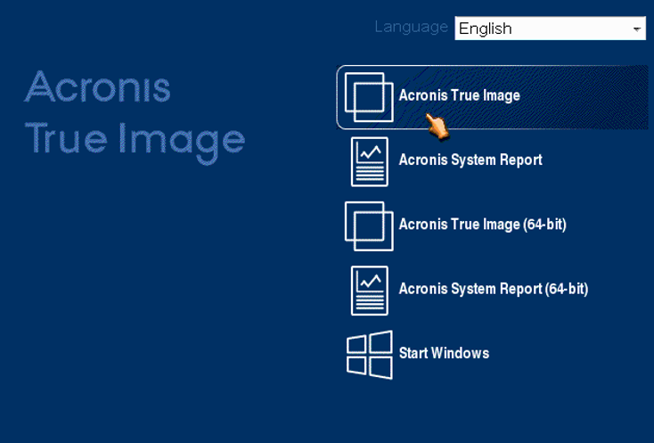

**Image analysis**

```json
{
 "image_name": "image21.tmp",
 "rId": "rId34",
 "image_path": "img_folder/image_020_image21.png",
 "caption": "منوی بوت Acronis True Image با گزینه های ۶۴ بیتی و شروع ویندوز",
 "ocr_text": "Acronis\nTrue Image\nLanguage English\nAcronis True Image\nAcronis System Report\nAcronis True Image (64-bit)\nAcronis System Report (64-bit)\nStart Windows",
 "visual_description": [
 "صفحه منوی راه انداز Acronis True Image با پس زمینه آبی نمایش داده شده است",
 "گزینه های قابل انتخاب: Acronis True Image، Acronis System Report، نسخه های (64-bit)، و Start Windows",
 "بالا گزینه Language با مقدار English و یک فلش کشویی دیده می شود",
 "کنار هر گزینه آیکون های برنامه/گزارش و آیکون ویندوز برای Start Windows قرار دارد",
 "نشانگر ماوس روی گزینه Acronis True Image قرار گرفته است"
 ],
 "image_type": "screenshot"
}
```

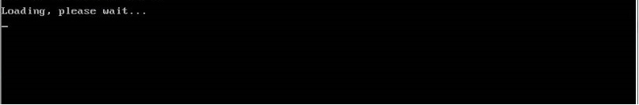

**Image analysis**

```json
{
 "image_name": "image22.tmp",
 "rId": "rId35",
 "image_path": "img_folder/image_021_image22.png",
 "caption": "نمایش پیام بارگذاری روی صفحه تیره",
 "ocr_text": "Loading, please wait...",
 "visual_description": [
 "متن سفید «Loading, please wait...» روی پس زمینه سیاه نمایش داده شده است",
 "یک کادر/حاشیه مستطیلی روشن در اطراف ناحیه نمایش دیده می شود"
 ],
 "image_type": "screenshot"
}
```

در محیط نرم افزار آکرونیس، از کلید های ترکیبی Ctrl+M جهت تبدیل کیبورد به ماوس یا بالعکس استفاده نمایید.

5. در صورت نصب اولیه پکیج، تعویض IPC یا هارد دستگاه، لازم است از قسمت Tools & Utilities، گزینه Add New Disk را جهت فرمت نمودن هارددیسک، انتخاب نمایید. **در صورت، انجام عملیات نصب مجدد نرم افزار و وجود اطلاعات، لاگ فایل و تصاویر دوربین روی هارد دستگاه، بدون انجام این مرحله، به مرحله 12 بروید.**

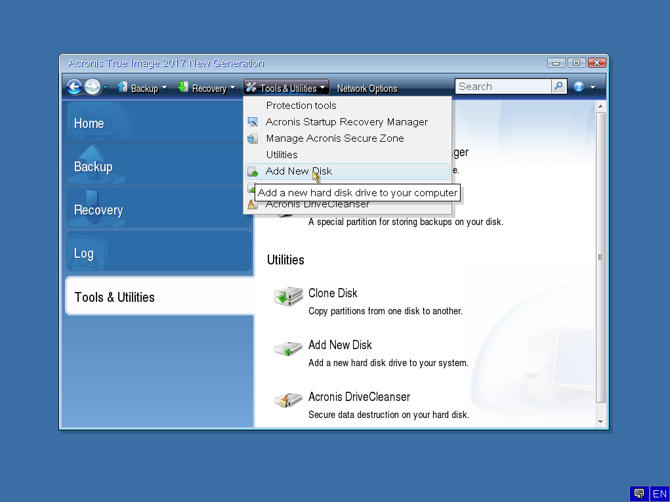

**Image analysis**

```json
{
 "image_name": "image23.tmp",
 "rId": "rId36",
 "image_path": "img_folder/image_022_image23.png",
 "caption": "منوی Tools & Utilities در Acronis True Image با گزینه Add New Disk باز است",
 "ocr_text": "Acronis True Image 2017 New Generation\nBackup\nRecovery\nTools & Utilities\nNetwork Options\nSearch\nHome\nBackup\nRecovery\nLog\nTools & Utilities\nProtection tools\nAcronis Startup Recovery Manager\nManage Acronis Secure Zone\nUtilities\nAdd New Disk\nAdd a new hard disk drive to your computer\nAcronis DriveCleanser\nUtilities\nClone Disk\nCopy partitions from one disk to another.\nAdd New Disk\nAdd a new hard disk drive to your system.\nAcronis DriveCleanser\nSecure data destruction on your hard disk.\nEN",
 "visual_description": [
 "اسکرین شات نرم افزار Acronis True Image 2017 New Generation با منوی کشویی Tools & Utilities باز",
 "در منو بخش Protection tools شامل Acronis Startup Recovery Manager و Manage Acronis Secure Zone دیده می شود",
 "در منو بخش Utilities شامل Add New Disk و Acronis DriveCleanser دیده می شود",
 "تولتیپ روی گزینه Add New Disk با متن «Add a new hard disk drive to your computer» نمایش داده شده است",
 "پنل سمت چپ گزینه های Home، Backup، Recovery، Log و Tools & Utilities را نشان می دهد",
 "در بخش Utilities صفحه، گزینه های Clone Disk، Add New Disk و Acronis DriveCleanser با توضیحات متنی نمایش داده شده اند",
 "نوار بالا شامل Backup، Recovery، Tools & Utilities و Network Options و کادر Search است"
 ],
 "image_type": "screenshot"
}
```

6. با نمایش پنجره زیر، هارد دستگاه را انتخاب و روی دکمه ی Next کلیک کنید:

در این پنجره، تمامی تجهیزات ذخیره سازی متصل به IPC (هارددیسک، فلش و ...) نمایش داده می شوند. لذا از اینکه هارد اصلی دستگاه را انتخاب می کنید، اطمینان حاصل نمایید.

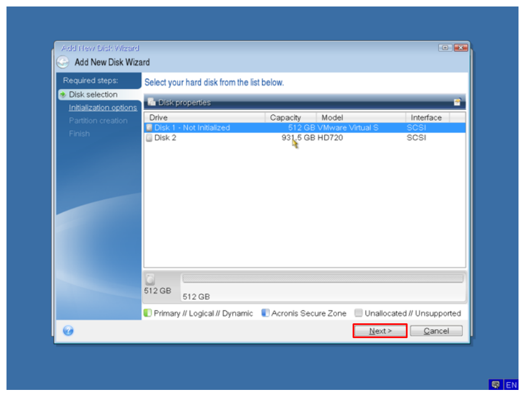

**Image analysis**

```json
{
 "image_name": "image24.tmp",
 "rId": "rId37",
 "image_path": "img_folder/image_023_image24.png",
 "caption": "صفحه انتخاب دیسک در Add New Disk Wizard با فهرست دیسک ها و دکمه Next",
 "ocr_text": "Add New Disk Wizard\nRequired steps:\nDisk selection\nInitialization options\nPartition creation\nFinish\nSelect your hard disk from the list below.\nDisk properties\nDrive\nCapacity\nModel\nInterface\nDisk 1 - Not Initialized\n512 GB\nVMware Virtual S\nSCSI\nDisk 2\n931.5 GB\nHD720\nSCSI\n512 GB\n512 GB\nPrimary // Logical // Dynamic\nAcronis Secure Zone\nUnallocated // Unsupported\nNext >\nCancel\nEN",
 "visual_description": [
 "پنجره «Add New Disk Wizard» با مراحل سمت چپ: Disk selection، Initialization options، Partition creation، Finish",
 "جدول «Disk properties» با ستون های Drive، Capacity، Model، Interface",
 "ردیف انتخاب شده: «Disk 1 - Not Initialized» با ظرفیت 512 GB، مدل «VMware Virtual S»، رابط «SCSI»",
 "ردیف دیگر: «Disk 2» با ظرفیت 931.5 GB، مدل «HD720»، رابط «SCSI»",
 "دکمه های پایین پنجره: «Next >» و «Cancel»"
 ],
 "image_type": "screenshot"
}
```

7. در صورت نمایش پیام زیر، روی دکمه ی OK کلیک نمایید:

در این مرحله، با کلیک روی دکمه ی OK، تمامی اطلاعات ذخیره شده در هارددیسک، به طور کامل پاک خواهد شد. لذا پیش از انجام این کار، از اینکه از اطلاعات موردنیاز موجود روی هارددیسک یک نسخه ی کپی تهیه نموده اید اطمینان حاصل نمایید.

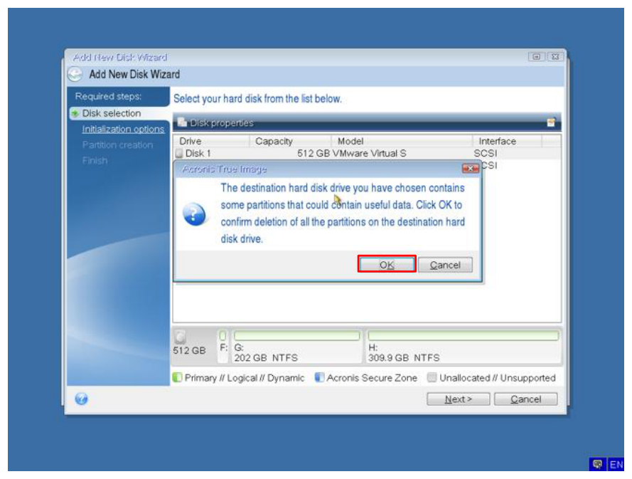

**Image analysis**

```json
{
 "image_name": "image25.tmp",
 "rId": "rId38",
 "image_path": "img_folder/image_024_image25.png",
 "caption": "اسکرین شات پنجره Add New Disk Wizard و هشدار حذف پارتیشن ها در Acronis True Image",
 "ocr_text": "Add New Disk Wizard\nRequired steps:\nDisk selection\nInitialization options\nPartition creation\nFinish\nSelect your hard disk from the list below.\nDisk properties\nDrive\nCapacity\nModel\nInterface\nDisk 1\n512 GB VMware Virtual S\nSCSI\nAcronis True Image\nThe destination hard disk drive you have chosen contains\nsome partitions that could contain useful data. Click OK to\nconfirm deletion of all the partitions on the destination hard\ndisk drive.\nOK\nCancel\n512 GB\nF:\nG:\n202 GB NTFS\nH:\n309.9 GB NTFS\nPrimary // Logical // Dynamic\nAcronis Secure Zone\nUnallocated // Unsupported\nNext >\nCancel\nEN",
 "visual_description": [
 "پنجره Add New Disk Wizard با مراحل Disk selection، Initialization options، Partition creation و Finish نمایش داده شده است.",
 "لیست دیسک ها شامل Disk 1 با ظرفیت 512 GB و مدل VMware Virtual S و رابط SCSI است.",
 "پنجره هشدار Acronis True Image درباره حذف همه پارتیشن های دیسک مقصد با دکمه های OK و Cancel دیده می شود.",
 "نمایش پارتیشن ها شامل G: با 202 GB NTFS و H: با 309.9 GB NTFS است.",
 "در پایین پنجره دکمه های Next > و Cancel وجود دارد."
 ],
 "image_type": "screenshot"
}
```

8. در پنجره ی زیر، پس از انتخاب گزینه Initiallze disk in MBR layout، روی Next کلیک نمایید:

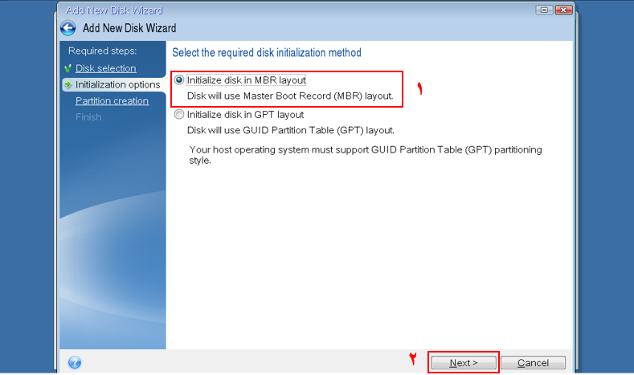

**Image analysis**

```json
{
 "image_name": "image26.tmp",
 "rId": "rId39",
 "image_path": "img_folder/image_025_image26.png",
 "caption": "پنجره Add New Disk Wizard برای انتخاب روش مقداردهی اولیه دیسک (MBR یا GPT)",
 "ocr_text": "Add New Disk Wizard\nAdd New Disk Wizard\nRequired steps:\nDisk selection\nInitialization options\nPartition creation\nFinish\nSelect the required disk initialization method\nInitialize disk in MBR layout\nDisk will use Master Boot Record (MBR) layout.\nInitialize disk in GPT layout\nDisk will use GUID Partition Table (GPT) layout.\nYour host operating system must support GUID Partition Table (GPT) partitioning style.\nNext >\nCancel",
 "visual_description": [
 "اسکرین شات ویزارد Add New Disk Wizard با مراحل Disk selection، Initialization options، Partition creation و Finish در پنل سمت چپ",
 "بخش Select the required disk initialization method شامل دو گزینه رادیویی: Initialize disk in MBR layout و Initialize disk in GPT layout",
 "گزینه Initialize disk in MBR layout انتخاب شده است (دایره پر)",
 "توضیح متنی برای MBR: Disk will use Master Boot Record (MBR) layout.",
 "توضیح متنی برای GPT: Disk will use GUID Partition Table (GPT) layout. و هشدار پشتیبانی سیستم عامل میزبان",
 "دکمه های پایین پنجره: Next > و Cancel",
 "کادر قرمز دور گزینه MBR و فلش های قرمز که به دکمه Next > اشاره می کنند"
 ],
 "image_type": "screenshot"
}
```

9. در این مرحله، روی دکمه ی Next کلیک کنید:

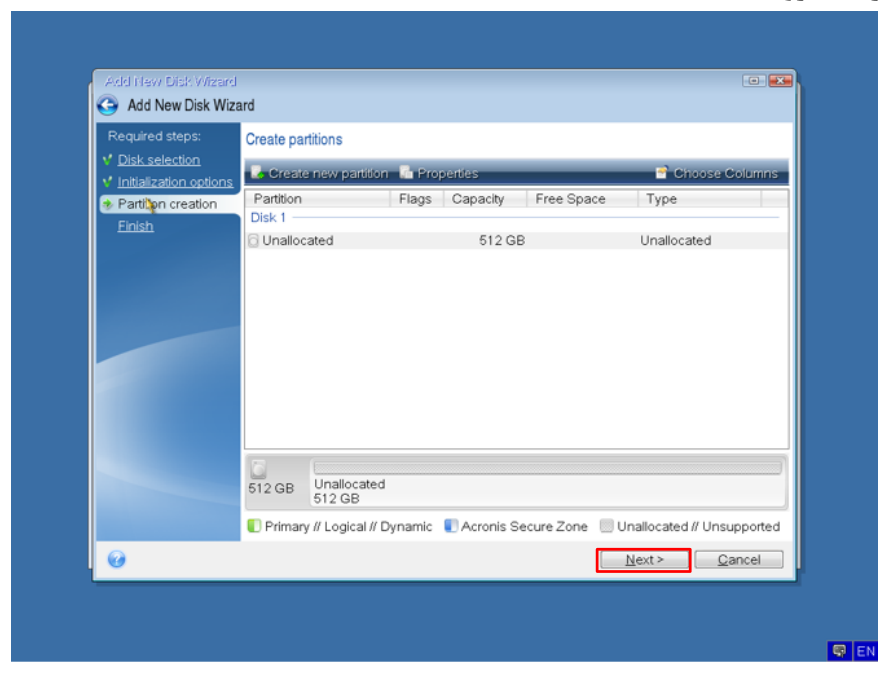

**Image analysis**

```json
{
 "image_name": "image27.tmp",
 "rId": "rId40",
 "image_path": "img_folder/image_026_image27.png",
 "caption": "نمای جادوگر افزودن دیسک جدید برای ایجاد پارتیشن و نمایش فضای Unallocated",
 "ocr_text": "Add New Disk Wizard\nRequired steps:\nDisk selection\nInitialization options\nPartition creation\nFinish\nCreate partitions\nCreate new partition\nProperties\nChoose Columns\nPartition\nFlags\nCapacity\nFree Space\nType\nDisk 1\nUnallocated\n512 GB\nUnallocated\n512 GB\nUnallocated\n512 GB\nPrimary // Logical // Dynamic\nAcronis Secure Zone\nUnallocated // Unsupported\nNext >\nCancel\nEN",
 "visual_description": [
 "پنجره نرم افزار با عنوان Add New Disk Wizard نمایش داده شده است",
 "نوار مراحل سمت چپ شامل Disk selection، Initialization options، Partition creation و Finish است",
 "بخش Create partitions جدول با ستون های Partition، Flags، Capacity، Free Space و Type دارد",
 "Disk 1 با وضعیت Unallocated و ظرفیت 512 GB نمایش داده شده است",
 "دکمه های Next > و Cancel در پایین پنجره وجود دارند"
 ],
 "image_type": "screenshot"
}
```

10. در پنجره ی زیر روی دکمه ی Proceed کلیک نمایید:

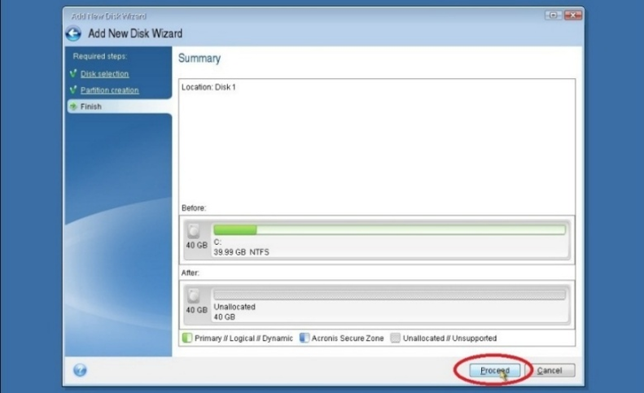

**Image analysis**

```json
{
 "image_name": "image28.tmp",
 "rId": "rId41",
 "image_path": "img_folder/image_027_image28.png",
 "caption": "پنجره خلاصهٔ Add New Disk Wizard با نمایش وضعیت قبل/بعد پارتیشن و دکمه Proceed",
 "ocr_text": "Add New Disk Wizard\nRequired steps:\nDisk selection\nPartition creation\nFinish\nSummary\nLocation: Disk 1\nBefore:\n40 GB\nC:\n39.99 GB NTFS\nAfter:\n40 GB\nUnallocated\n40 GB\nPrimary // Logical // Dynamic\nAcronis Secure Zone\nUnallocated // Unsupported\nProceed\nCancel",
 "visual_description": [
 "اسکرین شات ویزارد Add New Disk Wizard با مراحل Disk selection، Partition creation و Finish در ستون چپ",
 "بخش Summary با Location: Disk 1 نمایش داده شده است",
 "وضعیت Before شامل درایو C: با 39.99 GB NTFS از دیسک 40 GB است",
 "وضعیت After کل دیسک 40 GB را به صورت Unallocated نشان می دهد",
 "راهنمای رنگ/نوع شامل Primary // Logical // Dynamic، Acronis Secure Zone و Unallocated // Unsupported است",
 "دکمه Proceed در پایین سمت راست با یک بیضی قرمز مشخص شده و کنار آن Cancel قرار دارد"
 ],
 "image_type": "screenshot"
}
```

11. روی دکمه ی OK کلیک کنید تا عملیات جاری پایان پذیرد:

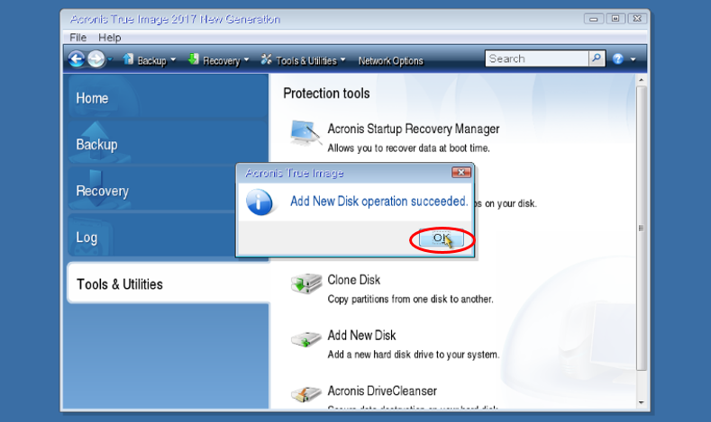

**Image analysis**

```json
{
 "image_name": "image29.tmp",
 "rId": "rId42",
 "image_path": "img_folder/image_028_image29.png",
 "caption": "پنجره Acronis True Image با پیام موفقیت افزودن دیسک جدید و دکمه OK",
 "ocr_text": "Acronis True Image 2017 New Generation\nFile Help\nBackup\nRecovery\nTools & Utilities\nNetwork Options\nSearch\nHome\nBackup\nRecovery\nLog\nTools & Utilities\nProtection tools\nAcronis Startup Recovery Manager\nAllows you to recover data at boot time.\nAcronis True Image\nAdd New Disk operation succeeded.\nOK\nClone Disk\nCopy partitions from one disk to another.\nAdd New Disk\nAdd a new hard disk drive to your system.\nAcronis DriveCleanser",
 "visual_description": [
 "اسکرین شات نرم افزار Acronis True Image 2017 New Generation با منوی بالا و نوار جستجو",
 "پنل ناوبری سمت چپ شامل Home، Backup، Recovery، Log و Tools & Utilities",
 "بخش Protection tools با گزینه Acronis Startup Recovery Manager",
 "پنجره پیام با عنوان Acronis True Image و متن «Add New Disk operation succeeded.»",
 "دکمه «OK» در پنجره پیام با بیضی قرمز علامت گذاری شده است",
 "فهرست ابزارها شامل Clone Disk، Add New Disk و Acronis DriveCleanser"
 ],
 "image_type": "screenshot"
}
```

12. جهت نصب ایمیج، از منوی Recovery، گزینه ی Disk & Partition Recovery را انتخاب کنید:

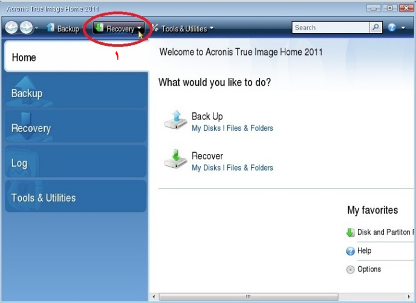

**Image analysis**

```json
{
 "image_name": "image30.tmp",
 "rId": "rId43",
 "image_path": "img_folder/image_029_image30.png",
 "caption": "اسکرین شات نرم افزار Acronis True Image Home 2011 با منوی Recovery هایلایت شده",
 "ocr_text": "Acronis True Image Home 2011\nBackup\nRecovery\nTools & Utilities\nSearch\nHome\nBackup\nRecovery\nLog\nTools & Utilities\nWelcome to Acronis True Image Home 2011\nWhat would you like to do?\nBack Up\nMy Disks | Files & Folders\nRecover\nMy Disks | Files & Folders\nMy favorites\nHelp\nOptions",
 "visual_description": [
 "رابط کاربری برنامه Acronis True Image Home 2011 نمایش داده شده است",
 "نوار بالایی شامل دکمه های Backup، Recovery و Tools & Utilities و کادر Search است",
 "دکمه Recovery در نوار بالا با بیضی قرمز دورگیری و با فلش/علامت قرمز مشخص شده است",
 "پنل کناری گزینه های Home، Backup، Recovery، Log و Tools & Utilities را نشان می دهد",
 "در بخش اصلی دو گزینه عملیاتی Back Up و Recover همراه با مسیرهای My Disks | Files & Folders دیده می شود",
 "ستون My favorites شامل Help و Options است"
 ],
 "image_type": "screenshot"
}
```

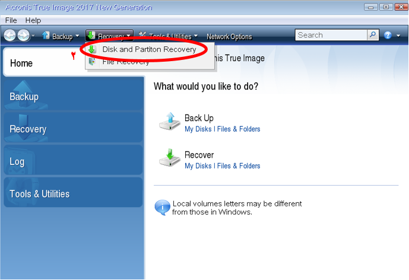

**Image analysis**

```json
{
 "image_name": "image31.tmp",
 "rId": "rId44",
 "image_path": "img_folder/image_030_image31.png",
 "caption": "اسکرین شات Acronis True Image با منوی Recovery و گزینه Disk and Partition Recovery مشخص شده",
 "ocr_text": "Acronis True Image 2017 New Generation\nFile Help\nBackup\nRecover\nTools & Utilities\nNetwork Options\nSearch\nDisk and Partition Recovery\nFile Recovery\nHome\nBackup\nRecovery\nLog\nTools & Utilities\nWhat would you like to do?\nBack Up\nMy Disks I Files & Folders\nRecover\nMy Disks I Files & Folders\nLocal volumes letters may be different\nfrom those in Windows.",
 "visual_description": [
 "نرم افزار Acronis True Image 2017 New Generation در ویندوز نمایش داده شده است",
 "منوی کشویی Recover باز است و گزینه Disk and Partition Recovery با بیضی قرمز هایلایت شده",
 "گزینه File Recovery زیر Disk and Partition Recovery در منو دیده می شود",
 "نوار کناری شامل Home، Backup، Recovery، Log و Tools & Utilities است",
 "در بخش اصلی گزینه های Back Up و Recover با زیرعنوان My Disks I Files & Folders نمایش دارد",
 "پیام اطلاع رسانی درباره متفاوت بودن حروف درایوها نسبت به Windows نمایش داده شده است",
 "یک پیکان/فلش قرمز به سمت گزینه هایلایت شده در منو اشاره می کند"
 ],
 "image_type": "screenshot"
}
```

13. در پنجره ی زیر،جهت انتخاب ایمیج، روی دکمه ی Browse کلیک نمایید:

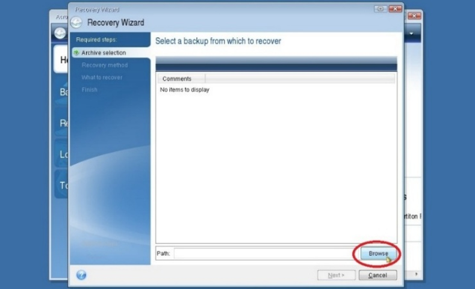

**Image analysis**

```json
{
 "image_name": "image32.tmp",
 "rId": "rId45",
 "image_path": "img_folder/image_031_image32.png",
 "caption": "پنجره Recovery Wizard برای انتخاب فایل پشتیبان با دکمه Browse مشخص شده",
 "ocr_text": "Recovery Wizard\nRequired steps:\nArchive selection\nRecovery method\nWhat to recover\nFinish\nSelect a backup from which to recover\nComments\nNo items to display\nPath:\nBrowse\nNext >\nCancel",
 "visual_description": [
 "پنجره نرم افزاری با عنوان Recovery Wizard نمایش داده شده است",
 "در نوار کناری مراحل: Archive selection، Recovery method، What to recover، Finish دیده می شود",
 "بخش اصلی عنوان Select a backup from which to recover را نشان می دهد",
 "جدول/لیست با ستون Comments و پیام No items to display نمایش داده شده است",
 "فیلد Path: در پایین پنجره وجود دارد",
 "دکمه Browse در پایین راست با دایره قرمز مشخص شده است",
 "دکمه های Next > و Cancel در پایین سمت راست دیده می شوند"
 ],
 "image_type": "screenshot"
}
```

14. از فلش یا هارد آدونیسی جدیدترین پکیج عملیاتی را انتخاب و سپس روی دکمه ی OK کلیک کنید:

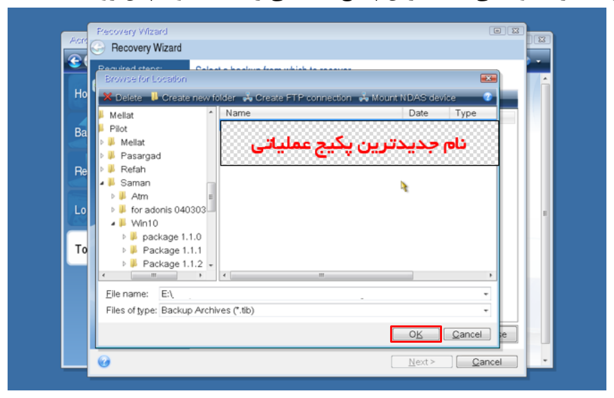

**Image analysis**

```json
{
 "image_name": "image33.tmp",
 "rId": "rId46",
 "image_path": "img_folder/image_032_image33.png",
 "caption": "نمای پنجره انتخاب مسیر در Recovery Wizard با متن فارسی روی ناحیه لیست فایل ها",
 "ocr_text": "Recovery Wizard\nBrowse for Location\nDelete\nCreate new folder\nCreate FTP connection\nMount NDAS device\nName\nDate\nType\nMellat\nPilot\nMellat\nPasargad\nRefah\nSaman\nAtm\nfor adonis 040303\nWin10\npackage 1.1.0\nPackage 1.1.1\nPackage 1.1.2\nFile name:\nE:\\\nFiles of type: Backup Archives (*.tib)\nOK\nCancel\nNext >\nCancel\nنام جدیدترین پکیج عملیاتی",
 "visual_description": [
 "اسکرین شات از پنجره Recovery Wizard با دیالوگ Browse for Location",
 "نوار ابزار شامل گزینه های Delete، Create new folder، Create FTP connection و Mount NDAS device",
 "پنل درختی سمت چپ با پوشه های Mellat، Pasargad، Refah، Saman و زیرپوشه Win10 و packageها",
 "فیلتر نوع فایل روی Backup Archives (*.tib) تنظیم شده است",
 "فیلد File name مقدار E:\\ را نشان می دهد",
 "دکمه OK با کادر قرمز مشخص شده است",
 "متن قرمز فارسی «نام جدیدترین پکیج عملیاتی» روی بخش لیست فایل ها قرار دارد"
 ],
 "image_type": "screenshot"
}
```

15. پس از انتخاب جدیدترین ایمیج ارائه شده از هارد یا فلش آدونیسی، جهت ادامه فرآیند نصب، روی دکمه ی Next کلیک نمایید:

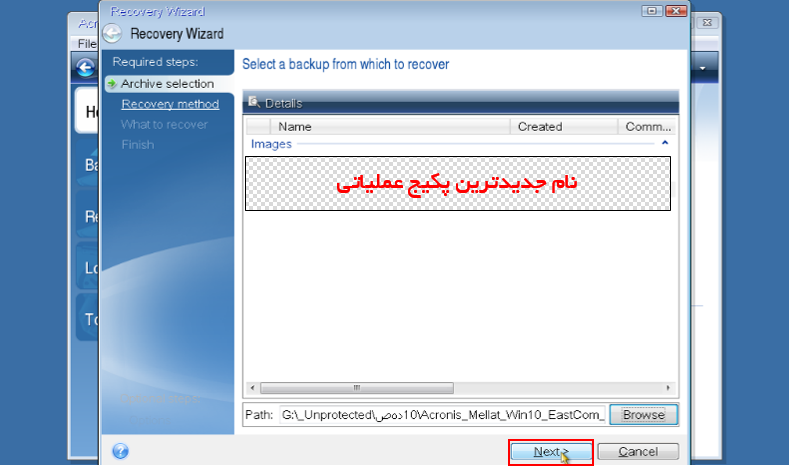

**Image analysis**

```json
{
 "image_name": "image34.tmp",
 "rId": "rId47",
 "image_path": "img_folder/image_033_image34.png",
 "caption": "پنجره Recovery Wizard برای انتخاب بکاپ و نمایش مسیر فایل در بخش Path",
 "ocr_text": "Recovery Wizard\nRecovery Wizard\nRequired steps:\nArchive selection\nRecovery method\nWhat to recover\nFinish\nSelect a backup from which to recover\nDetails\nName\nCreated\nComm...\nImages\nنام جدیدترین پکیج عملیاتی\nPath: C:\\_Unprotected\\دهه10\\Acronis_Mellat_Win10_EastCom...\nBrowse\nNext >\nCancel",
 "visual_description": [
 "نمای برنامه Recovery Wizard با مراحل سمت چپ: Archive selection، Recovery method، What to recover، Finish",
 "در پنل Details ستون ها شامل Name، Created و Comm... دیده می شود",
 "بخش Images با یک ردیف شامل متن فارسی قرمز نمایش داده شده است",
 "فیلد Path مسیر ویندوزی با پیشوند C:\\ و دکمه Browse کنار آن دارد",
 "دکمه های Next > و Cancel در پایین پنجره قرار دارند"
 ],
 "image_type": "screenshot"
}
```

16. در این مرحله، پس از حصول اطمینان از انتخاب گزینه ی Recovery whole disks and partitions، روی دکمه ی Next کلیک کنید:

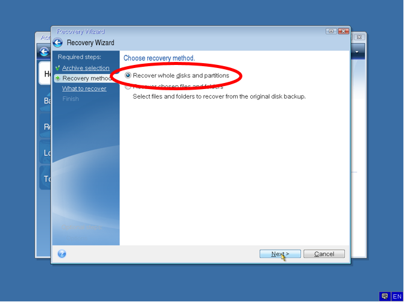

**Image analysis**

```json
{
 "image_name": "image35.tmp",
 "rId": "rId48",
 "image_path": "img_folder/image_034_image35.png",
 "caption": "پنجره Recovery Wizard برای انتخاب روش بازیابی دیسک یا فایل",
 "ocr_text": "Recovery Wizard\nRequired steps:\nArchive selection\nRecovery method\nWhat to recover\nFinish\nChoose recovery method.\nRecover whole disks and partitions\nRecover chosen files and folders\nSelect files and folders to recover from the original disk backup.\nNext >\nCancel\nEN",
 "visual_description": [
 "اسکرین شات نرم افزار با عنوان Recovery Wizard",
 "مرحله «Recovery method» در نوار مراحل سمت چپ انتخاب شده است",
 "دو گزینه رادیویی برای روش بازیابی نمایش داده شده است",
 "گزینه «Recover whole disks and partitions» با دایره قرمز مشخص شده است",
 "دکمه های «Next >» و «Cancel» در پایین پنجره دیده می شوند",
 "نشانگر زبان «EN» در گوشه پایین راست تصویر دیده می شود"
 ],
 "image_type": "screenshot"
}
```

17. در این مرحله:

* **در صورت انجام عملیات نصب نرم افزار اولیه**، رویDisk 1 کلیک کنید تا علامت تیک در کنار آن به نمایش درآید؛ با انجام این کار، تمامی موارد زیرمجموعه آن نیز فعال خواهد شد:

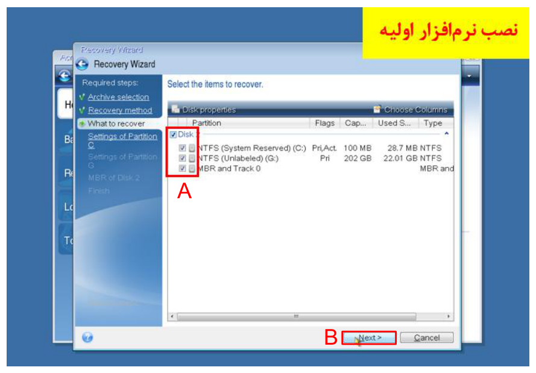

**Image analysis**

```json
{
 "image_name": "image36.tmp",
 "rId": "rId49",
 "image_path": "img_folder/image_035_image36.png",
 "caption": "پنجره Recovery Wizard برای انتخاب پارتیشن های بازیابی و دکمه Next",
 "ocr_text": "نصب نرم افزار اولیه\nRecovery Wizard\nRequired steps:\nArchive selection\nRecovery method\nWhat to recover\nSettings of Partition\nSettings of Partition\nG\nMBR of Disk 2\nFlash\nSelect the items to recover.\nDisk properties\nChoose Columns\nPartition\nFlags\nCap...\nUsed S...\nType\nDisk 1\nNTFS (System Reserved) (C:)\nPri,Act\n100 MB\n28.7 MB\nNTFS\nNTFS (Unlabeled) (G:)\nPri\n202 GB\n22.01 GB\nNTFS\nMBR and Track 0\nA\nB\nNext >\nCancel",
 "visual_description": [
 "پنجره نرم افزار Recovery Wizard با مرحله «What to recover» نمایش داده شده است.",
 "لیست موارد بازیابی شامل «Disk 1» و گزینه های NTFS و «MBR and Track 0» است.",
 "دو پارتیشن NTFS با برچسب های (C:) و (G:) و اندازه های 100 MB و 202 GB دیده می شود.",
 "در پایین پنجره دکمه های «Next >» و «Cancel» وجود دارد.",
 "یک کادر قرمز دور چک باکس های انتخاب دیسک و پارتیشن ها و حروف نشانه گذاری A و B دیده می شود."
 ],
 "image_type": "screenshot"
}
```

B

A

* **در صورت نصب مجدد نرم افزار**، همانند تصویر زیر، گزینه ی اول و دوم را فعال کنید (تیک داشته باشند) و روی MBR and Track 0 کلیک کنید تا غیرفعال گردد (تیک آن برداشته شود):

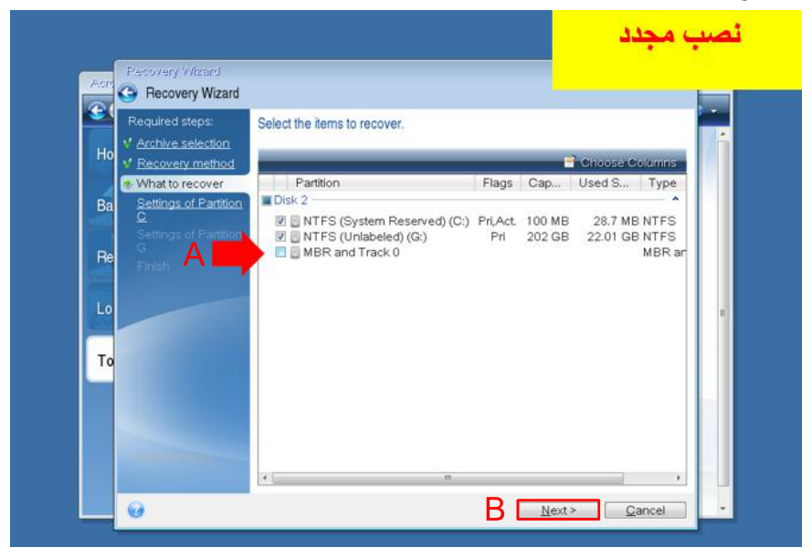

**Image analysis**

```json
{
 "image_name": "image37.tmp",
 "rId": "rId50",
 "image_path": "img_folder/image_036_image37.png",
 "caption": "اسکرین شات ویزارد بازیابی با انتخاب پارتیشن ها و دکمه Next",
 "ocr_text": "نصب مجدد\nRecovery Wizard\nRequired steps:\nArchive selection\nRecovery method\nWhat to recover\nSettings of Partition\nC:\nFinish\nSelect the items to recover.\nChoose Columns\nPartition\nFlags\nCap...\nUsed S...\nType\nDisk 2\nNTFS (System Reserved) (C:)\nNTFS (Unlabeled) (G:)\nMBR and Track 0\nPri,Act\nPri\n100 MB\n202 GB\n28.7 MB\n22.01 GB\nNTFS\nNTFS\nMBR an\nA\nB\nNext >\nCancel",
 "visual_description": [
 "پنجره نرم افزار Recovery Wizard با مراحل Required steps در ستون چپ نمایش داده شده است",
 "مرحله What to recover انتخاب شده و متن Select the items to recover. در بالای پنجره دیده می شود",
 "جدول پارتیشن ها برای Disk 2 شامل NTFS (System Reserved) (C:) و NTFS (Unlabeled) (G:) و MBR and Track 0 است",
 "ستون های جدول شامل Partition، Flags، Cap...، Used S... و Type هستند",
 "فلش قرمز با برچسب A به ناحیه انتخاب آیتم های بازیابی اشاره می کند",
 "کادر قرمز با برچسب B دکمه Next > را در پایین پنجره مشخص کرده است"
 ],
 "image_type": "screenshot"
}
```

B

A

18. روی دکمه ی Next کلیک نمایید.
19. در پنجره ی زیر، روی لینک New Location کلیک نمایید:

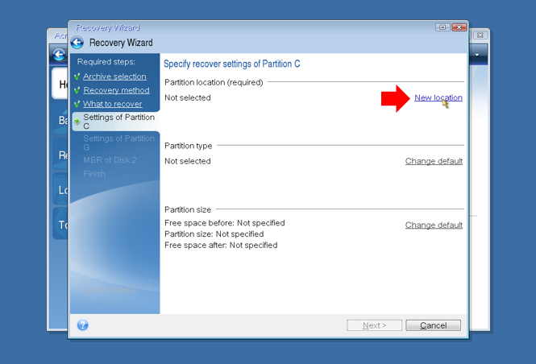

**Image analysis**

```json
{
 "image_name": "image38.tmp",
 "rId": "rId51",
 "image_path": "img_folder/image_037_image38.png",
 "caption": "پنجره Recovery Wizard برای تنظیمات بازیابی پارتیشن C با گزینه انتخاب محل جدید",
 "ocr_text": "Recovery Wizard\nRequired steps:\nArchive selection\nRecovery method\nWhat to recover\nSettings of Partition\nC\nSettings of Partition\nG\nMBR of Disk 2\nFinish\nSpecify recover settings of Partition C\nPartition location (required)\nNot selected\nNew location\nPartition type\nNot selected\nChange default\nPartition size\nFree space before: Not specified\nPartition size: Not specified\nFree space after: Not specified\nChange default\nNext >\nCancel",
 "visual_description": [
 "اسکرین شات یک پنجره نرم افزاری با عنوان Recovery Wizard",
 "بخش کناری شامل مراحل Required steps و آیتم های Archive selection، Recovery method و What to recover",
 "صفحه اصلی عنوان Specify recover settings of Partition C را نشان می دهد",
 "فیلد Partition location با وضعیت Not selected و لینک New location نمایش داده شده است",
 "فیلد Partition type با وضعیت Not selected و لینک Change default وجود دارد",
 "بخش Partition size شامل Free space before، Partition size و Free space after با مقدار Not specified است",
 "یک فلش قرمز به سمت متن New location اشاره می کند",
 "دکمه های Next > و Cancel در پایین پنجره دیده می شوند"
 ],
 "image_type": "screenshot"
}
```

20. در این مرحله:

* در صورت نصب اولیه نرم افزار، تنها یک پارتیشن در پنجره ی زیر نمایش داده خواهد شد که لازم است آن را انتخاب نمایید:

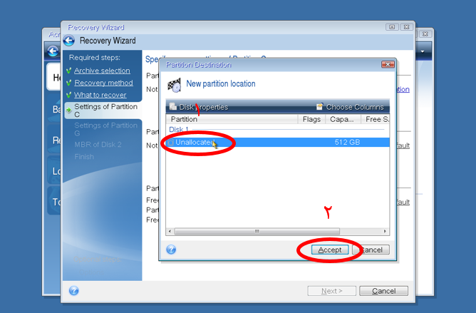

**Image analysis**

```json
{
 "image_name": "image39.tmp",
 "rId": "rId52",
 "image_path": "img_folder/image_038_image39.png",
 "caption": "پنجره Partition Destination در Recovery Wizard با انتخاب فضای Unallocated و دکمه Accept",
 "ocr_text": "Recovery Wizard\nRequired steps:\nArchive selection\nRecovery method\nWhat to recover\nSettings of Partition\nOptional steps:\nFinish\nPartition Destination\nNew partition location\nDisk properties\nChoose Columns\nPartition\nFlags\nCapa...\nFree S\nDisk 1\nUnallocated\n512 GB\nAccept\nCancel\nNext >\nCancel",
 "visual_description": [
 "پنجره «Partition Destination» روی «Recovery Wizard» نمایش داده شده است.",
 "در لیست دیسک ها «Disk 1» با وضعیت «Unallocated» انتخاب شده و ظرفیت «512 GB» دیده می شود.",
 "دکمه «Accept» با بیضی قرمز مشخص شده است.",
 "عبارت «Unallocated» با بیضی قرمز مشخص شده است.",
 "در سمت چپ مراحل «Archive selection»، «Recovery method»، «What to recover» و «Settings of Partition» دیده می شود."
 ],
 "image_type": "screenshot"
}
```

* در صورت نصب مجدد نرم افزار، تمامی پارتیشن های دستگاه نمایش داده می شوند که فقط باید پارتیشن **Reserved هارد دستگاه** را انتخاب کنید:

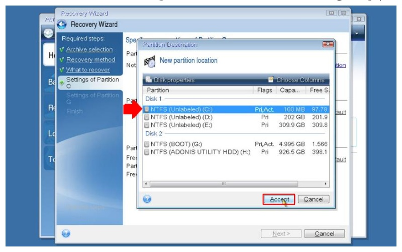

**Image analysis**

```json
{
 "image_name": "image40.jpeg",
 "rId": "rId53",
 "image_path": "img_folder/image_039_image40.jpg",
 "caption": "پنجره Recovery Wizard برای انتخاب پارتیشن مقصد و تایید با دکمه Accept",
 "ocr_text": "Recovery Wizard\nRequired steps:\nArchive selection\nRecovery method\nWhat to recover\nSettings of partition\nFinish\nPartition Destination\nNew partition location\nDisk properties\nChoose Columns\nPartition\nFlags\nCapa...\nFree S...\nDisk 1\nNTFS (Unlabeled) (C:)\nNTFS (Unlabeled) (D:)\nNTFS (Unlabeled) (E:)\nDisk 2\nNTFS (BOOT) (G:)\nNTFS (ADONIS UTILITY HDD) (H:)\nAccept\nCancel\nNext >\nCancel",
 "visual_description": [
 "اسکرین شات از نرم افزار Recovery Wizard با پنجره Partition Destination و لیست پارتیشن های NTFS",
 "بخش Required steps در سمت چپ شامل Archive selection، Recovery method، What to recover، Settings of partition و Finish",
 "پنجره New partition location دارای جدول با ستون های Partition، Flags، Capa... و Free S...",
 "نمایش Disk 1 با پارتیشن های NTFS (Unlabeled) با درایوهای C:، D: و E:",
 "نمایش Disk 2 با پارتیشن های NTFS (BOOT) (G:) و NTFS (ADONIS UTILITY HDD) (H:)",
 "یک فلش قرمز به ردیف NTFS (Unlabeled) (C:) اشاره می کند",
 "دکمه Accept با کادر قرمز مشخص شده و کنار آن دکمه Cancel وجود دارد"
 ],
 "image_type": "screenshot"
}
```

21. پس از انتخاب پارتیشن، جهت ادامه ی فرآیند روی دکمه ی **Accept** کلیک کنید.
22. پس از انتخاب پارتیشن مناسب مطابق با **مرحله 19**، اطمینان حاصل کنید که در بخش
 **Partition size** مقدار **100 MB** درج شده باشد. درصورتی که حجم نمایش داده شده
 معادل **100 MB** نیست، ابتدا روی گزینه ی **Change default** کلیک کنید:

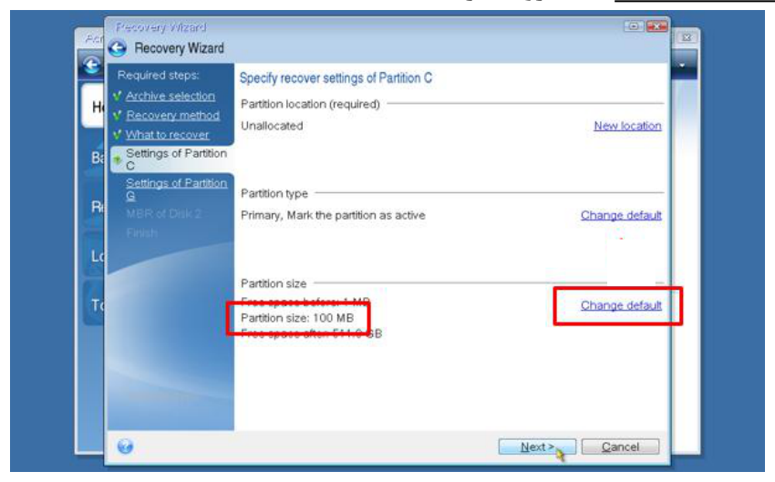

**Image analysis**

```json
{
 "image_name": "image41.tmp",
 "rId": "rId54",
 "image_path": "img_folder/image_040_image41.png",
 "caption": "پنجره Recovery Wizard برای تنظیمات بازیابی پارتیشن C و تعیین اندازه پارتیشن",
 "ocr_text": "Recovery Wizard\nRequired steps:\nArchive selection\nRecovery method\nWhat to recover\nSettings of Partition\nC\nSettings of Partition\nG\nMBR of Disk 2\nFinish\nSpecify recover settings of Partition C\nPartition location (required)\nUnallocated\nNew location\nPartition type\nPrimary, Mark the partition as active\nChange default\nPartition size\nPartition size: 100 MB\nChange default\nNext >\nCancel",
 "visual_description": [
 "اسکرین شات نرم افزار Recovery Wizard با مراحل لازم در ستون سمت چپ",
 "صفحه «Specify recover settings of Partition C» با گزینه های Partition location، Partition type و Partition size",
 "Partition location مقدار «Unallocated» و لینک «New location» دارد",
 "Partition type مقدار «Primary, Mark the partition as active» و لینک «Change default» دارد",
 "Partition size مقدار «Partition size: 100 MB» نمایش می دهد و لینک «Change default» کنار آن دیده می شود",
 "دو کادر قرمز دور متن «Partition size: 100 MB» و لینک «Change default» کشیده شده است",
 "دکمه های پایین پنجره شامل «Next >» و «Cancel» هستند"
 ],
 "image_type": "screenshot"
}
```

23. در پنجره ا ی که باز می شود، حجم پارتیشن مربوطه را به **100 MB** تغییر دهید و روی دکمه ی Accept کلیک نمایید:

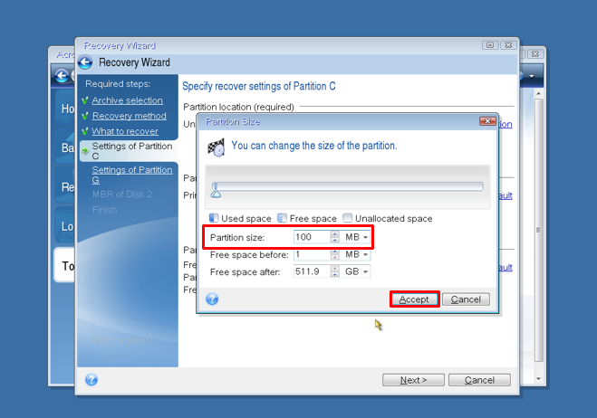

**Image analysis**

```json
{
 "image_name": "image42.tmp",
 "rId": "rId55",
 "image_path": "img_folder/image_041_image42.png",
 "caption": "پنجره تنظیم اندازه پارتیشن در Recovery Wizard با گزینه Accept و مقدار Partition size",
 "ocr_text": "Recovery Wizard\nRequired steps:\nArchive selection\nRecovery method\nWhat to recover\nSettings of Partition\nC\nSettings of Partition\nG\nMBR of Disk 2\nFinish\nSpecify recover settings of Partition C\nPartition location (required)\nPartition Size\nYou can change the size of the partition.\nUsed space\nFree space\nUnallocated space\nPartition size:\n100\nMB\nFree space before:\n1\nMB\nFree space after:\n511.9\nGB\nAccept\nCancel\nNext >\nCancel",
 "visual_description": [
 "اسکرین شات نرم افزار Recovery Wizard با پنجره Partition Size روی آن",
 "در پنجره Partition Size یک نوار لغزنده برای تغییر اندازه پارتیشن نمایش داده شده است",
 "گزینه های راهنما برای Used space، Free space و Unallocated space به صورت چک باکس دیده می شوند",
 "فیلد Partition size مقدار 100 و واحد MB را نشان می دهد",
 "فیلد Free space before مقدار 1 MB را نشان می دهد",
 "فیلد Free space after مقدار 511.9 GB را نشان می دهد",
 "دکمه های Accept و Cancel در پنجره Partition Size وجود دارند",
 "در پس زمینه مرحله های Required steps شامل Archive selection، Recovery method، What to recover، Settings of Partition و Finish دیده می شود"
 ],
 "image_type": "screenshot"
}
```

24. روی دکمه ی Next کلیک نمایید:

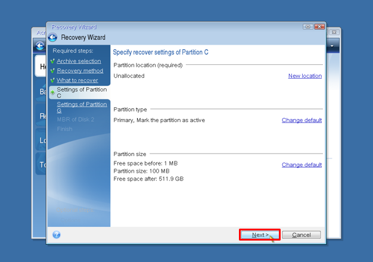

**Image analysis**

```json
{
 "image_name": "image43.tmp",
 "rId": "rId56",
 "image_path": "img_folder/image_042_image43.png",
 "caption": "پنجره Recovery Wizard برای تنظیمات بازیابی پارتیشن C و اندازه پارتیشن",
 "ocr_text": "Recovery Wizard\nRequired steps:\nArchive selection\nRecovery method\nWhat to recover\nSettings of Partition C\nSettings of Partition G\nMBR of Disk 2\nFinish\nSpecify recover settings of Partition C\nPartition location (required)\nUnallocated\nNew location\nPartition type\nPrimary, Mark the partition as active\nChange default\nPartition size\nFree space before: 1 MB\nPartition size: 100 MB\nFree space after: 511.9 GB\nChange default\nNext >\nCancel",
 "visual_description": [
 "اسکرین شات نرم افزار Recovery Wizard با مرحله «Specify recover settings of Partition C» نمایش داده شده است",
 "مکان پارتیشن به صورت «Unallocated» و گزینه «New location» دیده می شود",
 "نوع پارتیشن «Primary, Mark the partition as active» نمایش داده شده و لینک «Change default» وجود دارد",
 "بخش اندازه پارتیشن شامل «Free space before: 1 MB»، «Partition size: 100 MB»، «Free space after: 511.9 GB» است",
 "دکمه های «Next >» و «Cancel» در پایین پنجره موجود هستند"
 ],
 "image_type": "screenshot"
}
```

25. جهت انتخاب پارتیشن محل نصب سیستم عامل، روی لینک New Location کلیک نمایید:

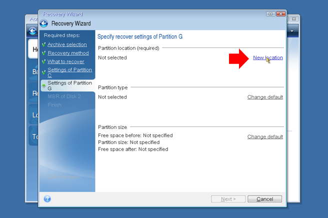

**Image analysis**

```json
{
 "image_name": "image44.tmp",
 "rId": "rId57",
 "image_path": "img_folder/image_043_image44.png",
 "caption": "پنجره Recovery Wizard برای تنظیمات بازیابی پارتیشن G و انتخاب مکان جدید",
 "ocr_text": "Recovery Wizard\nRequired steps:\nArchive selection\nRecovery method\nWhat to recover\nSettings of Partition C\nSettings of Partition G\nMBR of Disk 2\nFinish\nSpecify recover settings of Partition G\nPartition location (required)\nNot selected\nNew location\nPartition type\nNot selected\nChange default\nPartition size\nFree space before: Not specified\nPartition size: Not specified\nFree space after: Not specified\nChange default\nNext >\nCancel",
 "visual_description": [
 "نمایش پنجره نرم افزار Recovery Wizard با مراحل لازم در ستون چپ",
 "صفحه تنظیمات بازیابی پارتیشن G با بخش Partition location و گزینه New location",
 "وجود دکمه های Change default برای Partition type و Partition size",
 "دکمه های Next > (غیرفعال) و Cancel در پایین پنجره",
 "یک فلش قرمز به سمت گزینه New location اشاره می کند"
 ],
 "image_type": "screenshot"
}
```

26. در این مرحله:

* در صورت نصب اولیه، فضای Unallocated را جهت نصب سیستم عامل، انتخاب و روی Accept کلیک کنید:


**Image analysis**

```json
{
 "image_name": "image45.tmp",
 "rId": "rId58",
 "image_path": "img_folder/image_044_image45.png",
 "caption": "نمای پنجره Partition Destination برای انتخاب محل پارتیشن در Recovery Wizard",
 "ocr_text": "Recovery Wizard\nRequired steps:\nArchive selection\nRecovery method\nWhat to recover\nSettings of Partition\nSettings of Partition\nMBR of Disk 2\nFinish\nPartition Destination\nNew partition location\nDisk properties\nChoose Columns\nPartition\nFlags\nCapa...\nFree S...\nDisk 1\nNTFS (System Reserved) (F:)\nPriAct\n100 MB\n71.3\nUnallocated\n511.9 GB\nDisk 2\nNTFS (BOOT) (D:)\nPriAct\n4.995 GB\n1.566\nNTFS (ADONIS UTILITY HDD) (E:)\nPri\n926.5 GB\n407.1\nAccept\nCancel\nNext >\nCancel",
 "visual_description": [
 "پنجره Partition Destination لیست دیسک ها و پارتیشن ها را نمایش می دهد.",
 "گزینه Unallocated با اندازه 511.9 GB در Disk 1 انتخاب شده است.",
 "Disk 1 شامل NTFS (System Reserved) (F:) با اندازه 100 MB است.",
 "Disk 2 شامل NTFS (BOOT) (D:) با اندازه 4.995 GB و NTFS (ADONIS UTILITY HDD) (E:) با اندازه 926.5 GB است.",
 "دکمه Accept با کادر قرمز مشخص شده و یک فلش قرمز به سطر انتخاب شده اشاره می کند."
 ],
 "image_type": "screenshot"
}
```

* در صورت نصب مجدد، پارتیشن محل نصب سیستم عامل با ظرفیت 202 GB را انتخاب و سپس گزینه ی Accept را انتخاب کنید:

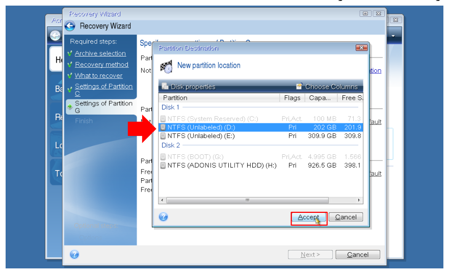

**Image analysis**

```json
{
 "image_name": "image46.png",
 "rId": "rId59",
 "image_path": "img_folder/image_045_image46.png",
 "caption": "پنجره Recovery Wizard و انتخاب مقصد پارتیشن با تاکید روی درایو D و دکمه Accept",
 "ocr_text": "Recovery Wizard\nRecovery Wizard\nRequired steps:\nArchive selection\nRecovery method\nWhat to recover\nSettings of Partition\nC\nSettings of Partition\nG\nFinish\nPartition Destination\nNew partition location\nDisk properties\nChoose Columns\nPartition\nFlags\nCapa...\nFree S...\nDisk 1\nNTFS (System Reserved) (C:)\nPri,Act\n100 MB\n71.3\nNTFS (Unlabeled) (D:)\nPri\n202 GB\n201.9\nNTFS (Unlabeled) (E:)\nPri\n309.9 GB\n309.8\nDisk 2\nNTFS (BOOT) (G:)\nPri,Act\n4.995 GB\n1.566\nNTFS (ADONIS UTILITY HDD) (H:)\nPri\n926.5 GB\n398.1\nAccept\nCancel\nNext >\nCancel",
 "visual_description": [
 "اسکرین شات نرم افزار Recovery Wizard با پنجره «Partition Destination» برای انتخاب محل پارتیشن جدید",
 "فهرست پارتیشن ها بر اساس Disk 1 و Disk 2 نمایش داده شده است",
 "ردیف «NTFS (Unlabeled) (D:)» انتخاب شده و ظرفیت 202 GB و Free S... برابر 201.9 نشان می دهد",
 "پیکان قرمز به سمت ردیف درایو D اشاره می کند",
 "دکمه «Accept» در پایین پنجره با کادر قرمز مشخص شده است"
 ],
 "image_type": "screenshot"
}
```

27. همانند مرحله 22، اطمینان حاصل نمایید که در بخش Partition size مقدار 202 GB درج شده باشد. درصورتی که حجم نمایش داده شده معادل 202 GB نیست، ابتدا روی لینک
 Change default کلیک کنید:

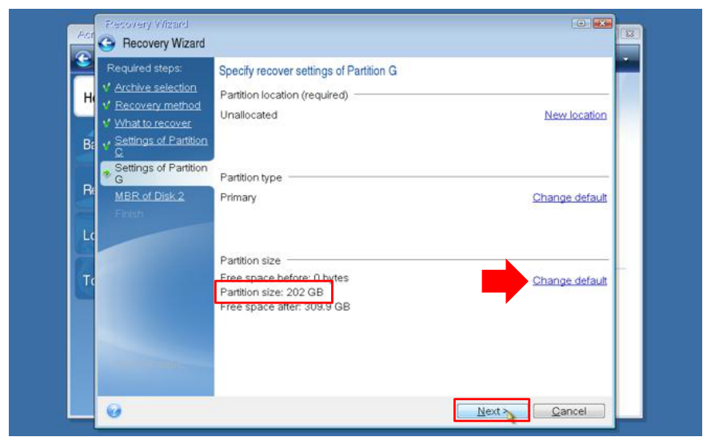

**Image analysis**

```json
{
 "image_name": "image47.tmp",
 "rId": "rId60",
 "image_path": "img_folder/image_046_image47.png",
 "caption": "تنظیمات بازیابی پارتیشن G در Recovery Wizard و نمایش اندازه پارتیشن 202 گیگابایت",
 "ocr_text": "Recovery Wizard\nRequired steps:\nArchive selection\nRecovery method\nWhat to recover\nSettings of Partition C\nSettings of Partition G\nMBR of Disk 2\nFinish\nSpecify recover settings of Partition G\nPartition location (required)\nUnallocated\nNew location\nPartition type\nPrimary\nChange default\nPartition size\nFree space before: 0 bytes\nPartition size: 202 GB\nFree space after: 303.9 GB\nChange default\nNext >\nCancel",
 "visual_description": [
 "اسکرین شات پنجره Recovery Wizard با مرحله «Specify recover settings of Partition G»",
 "بخش Partition location مقدار «Unallocated» را نشان می دهد و لینک «New location» دارد",
 "نوع پارتیشن «Primary» نمایش داده شده و گزینه «Change default» کنار آن است",
 "در بخش Partition size مقدار «Partition size: 202 GB» با کادر قرمز مشخص شده است",
 "فلش قرمز به لینک «Change default» در سمت راست اشاره می کند",
 "دکمه «Next >» در پایین با کادر قرمز مشخص شده و «Cancel» کنار آن است",
 "پنل سمت چپ مراحل موردنیاز را با تیک سبز نمایش می دهد"
 ],
 "image_type": "screenshot"
}
```

در پنجره ا ی که باز می شود، حجم پارتیشن مربوطه را به **202 GB** تغییر دهید و سپس روی دکمه ی Accept کلیک نمایید:

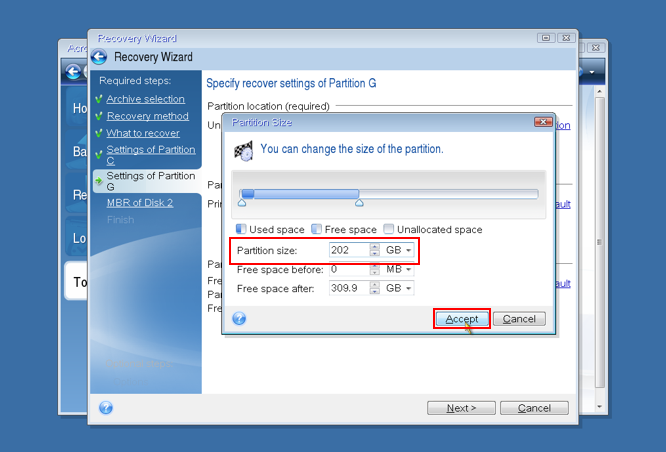

**Image analysis**

```json
{
 "image_name": "image48.tmp",
 "rId": "rId61",
 "image_path": "img_folder/image_047_image48.png",
 "caption": "پنجره Partition Size در Recovery Wizard برای تغییر اندازه پارتیشن و دکمه Accept",
 "ocr_text": "Recovery Wizard\nRequired steps:\nArchive selection\nRecovery method\nWhat to recover\nSettings of Partition\nSettings of Partition G\nMBR of Disk 2\nFinish\nSpecify recover settings of Partition G\nPartition location (required)\nPartition Size\nYou can change the size of the partition.\nUsed space\nFree space\nUnallocated space\nPartition size:\n202\nGB\nFree space before:\n0\nMB\nFree space after:\n309.9\nGB\nAccept\nCancel",
 "visual_description": [
 "اسکرین شات از نرم افزار Recovery Wizard با ویزارد چندمرحله ای در پنل چپ",
 "پنجره شناور با عنوان Partition Size و پیام «You can change the size of the partition.»",
 "نمایش اسلایدر تغییر اندازه پارتیشن و گزینه های Used space، Free space و Unallocated space",
 "فیلد Partition size مقدار 202 GB را نشان می دهد",
 "فیلد Free space before مقدار 0 MB و Free space after مقدار 309.9 GB را نشان می دهد",
 "دکمه های Accept و Cancel در پایین پنجره دیده می شوند"
 ],
 "image_type": "screenshot"
}
```

28. روی دکمه ی Next کلیک نمایید:

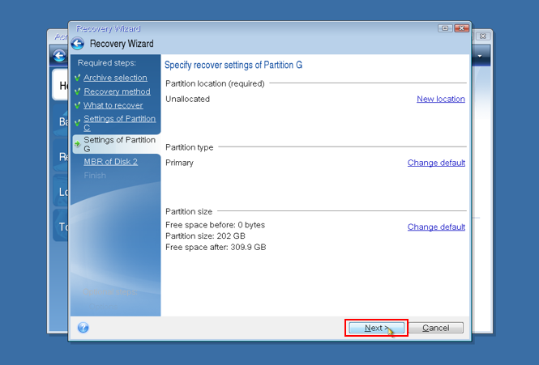

**Image analysis**

```json
{
 "image_name": "image49.tmp",
 "rId": "rId62",
 "image_path": "img_folder/image_048_image49.png",
 "caption": "پنجره Recovery Wizard برای تنظیمات بازیابی پارتیشن G با گزینه Next و Cancel",
 "ocr_text": "Recovery Wizard\nRequired steps:\nArchive selection\nRecovery method\nWhat to recover\nSettings of Partition C\nSettings of Partition G\nMBR of Disk 2\nFinish\nSpecify recover settings of Partition G\nPartition location (required)\nUnallocated\nNew location\nPartition type\nPrimary\nChange default\nPartition size\nFree space before: 0 bytes\nPartition size: 202 GB\nFree space after: 309.9 GB\nChange default\nNext >\nCancel",
 "visual_description": [
 "پنجره نرم افزار Recovery Wizard با مراحل سمت چپ و مرحله «Settings of Partition G» انتخاب شده",
 "بخش Partition location مقدار «Unallocated» و لینک «New location» دارد",
 "بخش Partition type مقدار «Primary» و لینک «Change default» دارد",
 "بخش Partition size شامل «Free space before: 0 bytes»، «Partition size: 202 GB»، «Free space after: 309.9 GB» است",
 "دکمه های پایین پنجره شامل «Next >» و «Cancel» هستند و دکمه Next با کادر قرمز مشخص شده است"
 ],
 "image_type": "screenshot"
}
```

29. در این مرحله، همانند شکل زیر، روی دکمه ی Next کلیک کنید:

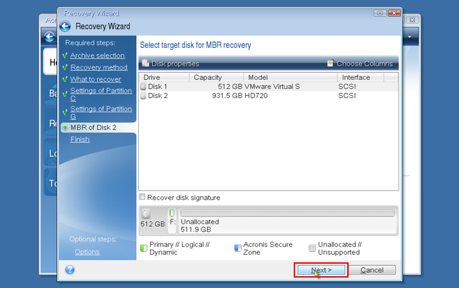

**Image analysis**

```json
{
 "image_name": "image50.tmp",
 "rId": "rId63",
 "image_path": "img_folder/image_049_image50.png",
 "caption": "صفحه Recovery Wizard برای انتخاب دیسک هدف در بازیابی MBR و نمایش فهرست دیسک ها",
 "ocr_text": "Recovery Wizard\nRequired steps:\nArchive selection\nRecovery method\nWhat to recover\nSettings of Partition\nC\nSettings of Partition\nG\nMBR of Disk 2\nFinish\nOptional steps:\nOptions\nSelect target disk for MBR recovery\nDisk properties\nChoose Columns\nDrive\nCapacity\nModel\nInterface\nDisk 1\n512 GB\nVMware Virtual S\nSCSI\nDisk 2\n931.5 GB\nHD720\nSCSI\nRecover disk signature\n512 GB\nUnallocated\n511.9 GB\nPrimary // Logical // Dynamic\nAcronis Secure Zone\nUnallocated // Unsupported\nNext >\nCancel",
 "visual_description": [
 "پنجره نرم افزار Recovery Wizard با مرحله «Select target disk for MBR recovery» نمایش داده شده است",
 "نوار مراحل سمت چپ شامل Archive selection، Recovery method، What to recover، Settings of Partition C و G، MBR of Disk 2 و Finish است",
 "جدول دیسک ها دو ردیف دارد: Disk 1 با ظرفیت 512 GB مدل VMware Virtual S و Disk 2 با ظرفیت 931.5 GB مدل HD720، هر دو با رابط SCSI",
 "گزینه «Recover disk signature» به صورت چک باکس دیده می شود",
 "نمایش گرافیکی پارتیشن/فضای دیسک با برچسب های «Unallocated 511.9 GB» و راهنمای رنگی شامل Primary/Logical/Dynamic، Acronis Secure Zone و Unallocated/Unsupported وجود دارد",
 "دکمه های «Next >» و «Cancel» در پایین پنجره قرار دارند"
 ],
 "image_type": "screenshot"
}
```

30. در نهایت، روی دکمه ی Proceed کلیک کنید تا عملیات نصب ایمیج آغاز گردد:

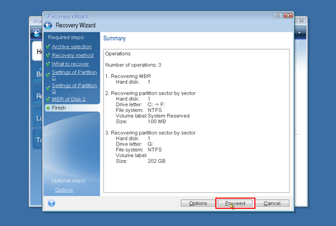

**Image analysis**

```json
{
 "image_name": "image51.tmp",
 "rId": "rId64",
 "image_path": "img_folder/image_050_image51.png",
 "caption": "پنجره Summary در Recovery Wizard با فهرست عملیات بازیابی و دکمه Proceed",
 "ocr_text": "Recovery Wizard\nRequired steps:\nArchive selection\nRecovery method\nWhat to recover\nSettings of Partition\nSettings of Partition\nMBR of Disk 2\nFinish\nOptional steps:\nOptions\nSummary\nOperations\nNumber of operations: 3\n1. Recovering MBR\nHard disk:\n1\n2. Recovering partition sector by sector\nHard disk:\n1\nDrive letter:\nC: -> F:\nFile system:\nNTFS\nVolume label: System Reserved\nSize:\n100 MB\n3. Recovering partition sector by sector\nHard disk:\n1\nDrive letter:\nG:\nFile system:\nNTFS\nVolume label:\nSize:\n202 GB\nOptions\nProceed\nCancel",
 "visual_description": [
 "اسکرین شات نرم افزار Recovery Wizard با پنل مراحل در سمت چپ و مرحله Finish انتخاب شده",
 "بخش Summary شامل 3 عملیات: Recovering MBR و دو مورد Recovering partition sector by sector",
 "ذکر Hard disk: 1 برای همه عملیات",
 "عملیات 2: تبدیل Drive letter از C: به F: با File system: NTFS و Volume label: System Reserved و Size: 100 MB",
 "عملیات 3: Drive letter: G: با File system: NTFS و Size: 202 GB",
 "در پایین پنجره دکمه های Options، Proceed و Cancel دیده می شود"
 ],
 "image_type": "screenshot"
}
```

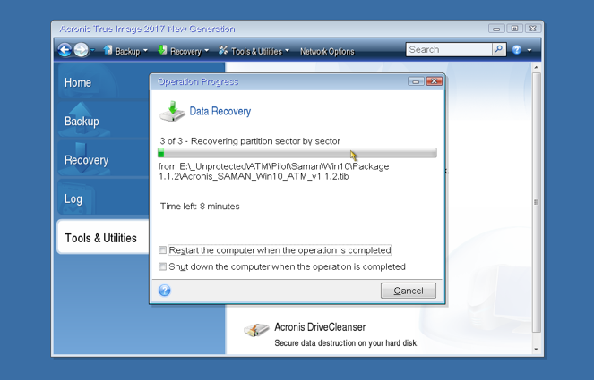

**Image analysis**

```json
{
 "image_name": "image52.tmp",
 "rId": "rId65",
 "image_path": "img_folder/image_051_image52.png",
 "caption": "پنجره پیشرفت بازیابی داده در Acronis True Image با زمان باقی مانده و گزینه های خاموش/ریست",
 "ocr_text": "Acronis True Image 2017 New Generation\nBackup\nRecovery\nTools & Utilities\nNetwork Options\nSearch\nHome\nBackup\nRecovery\nLog\nTools & Utilities\nOperation Progress\nData Recovery\n3 of 3 - Recovering partition sector by sector\nfrom E:\\_Unprotected\\ATM\\Pilot\\Saman\\Win10\\Package\n1.1.2\\Acronis_SAMAN_Win10_ATM_v1.1.2.tib\nTime left: 8 minutes\nRestart the computer when the operation is completed\nShut down the computer when the operation is completed\nCancel\nAcronis DriveCleanser\nSecure data destruction on your hard disk.",
 "visual_description": [
 "اسکرین شات نرم افزار Acronis True Image 2017 New Generation با منوی کناری Home/Backup/Recovery/Log/Tools & Utilities",
 "پنجره Operation Progress مربوط به Data Recovery نمایش داده شده است",
 "وضعیت مرحله 3 از 3: Recovering partition sector by sector",
 "مسیر فایل ورودی با پسوند .tib نمایش داده شده است: E:\\_Unprotected\\ATM\\Pilot\\Saman\\Win10\\Package\\1.1.2\\Acronis_SAMAN_Win10_ATM_v1.1.2.tib",
 "زمان باقی مانده 8 دقیقه نمایش داده شده است",
 "دو چک باکس برای Restart و Shut down پس از اتمام عملیات و دکمه Cancel قابل مشاهده است",
 "در پایین صفحه گزینه Acronis DriveCleanser با توضیح Secure data destruction on your hard disk دیده می شود"
 ],
 "image_type": "screenshot"
}
```

31. نمایش پیغام Recover operation succeeded، بیانگر پایان موفقیت آمیز عملیات خواهد بود؛ روی دکمه یOK کلیک کنید:

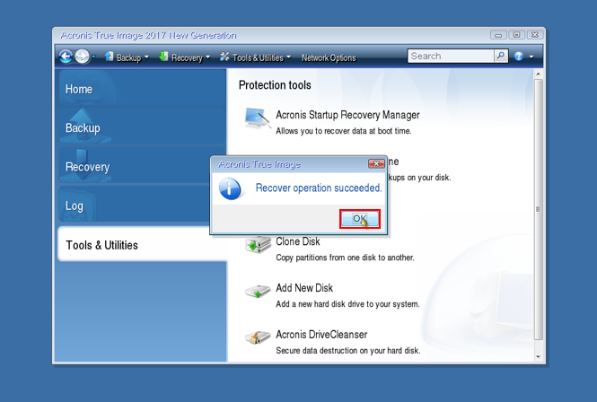

**Image analysis**

```json
{
 "image_name": "image53.tmp",
 "rId": "rId66",
 "image_path": "img_folder/image_052_image53.png",
 "caption": "پنجره موفقیت بازیابی در Acronis True Image 2017 با دکمه OK",
 "ocr_text": "Acronis True Image 2017 New Generation\nBackup\nRecovery\nTools & Utilities\nNetwork Options\nSearch\nHome\nBackup\nRecovery\nLog\nTools & Utilities\nProtection tools\nAcronis Startup Recovery Manager\nAllows you to recover data at boot time.\nClone Disk\nCopy partitions from one disk to another.\nAdd New Disk\nAdd a new hard disk drive to your system.\nAcronis DriveCleanser\nSecure data destruction on your hard disk.\nAcronis True Image\nRecover operation succeeded.\nOK",
 "visual_description": [
 "اسکرین شات از رابط Acronis True Image 2017 New Generation با منوی سمت چپ شامل Home، Backup، Recovery، Log و Tools & Utilities",
 "نمایش بخش Protection tools و گزینه های Acronis Startup Recovery Manager، Clone Disk، Add New Disk و Acronis DriveCleanser",
 "پنجره پیام با عنوان Acronis True Image و متن «Recover operation succeeded.» و دکمه OK"
 ],
 "image_type": "screenshot"
}
```

32. **حتماً** هارد اکسترنال یا فلش خود را از دستگاه جدا نمایید.
33. نرم افزار Acronis را ببندید. با بسته شدن برنامه Acronis، صفحه ی زیرنمایان خواهد شد:

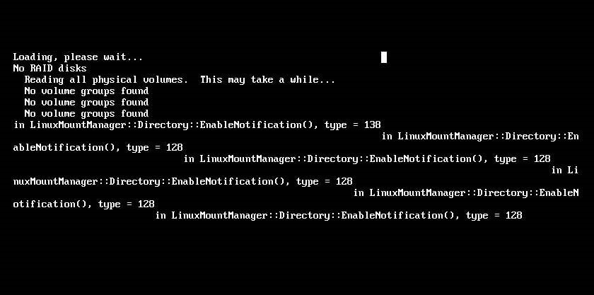

**Image analysis**

```json
{
 "image_name": "image54.jpeg",
 "rId": "rId67",
 "image_path": "img_folder/image_053_image54.jpg",
 "caption": "نمایش پیام های کنسول درباره RAID و volume group و خطاهای LinuxMountManager",
 "ocr_text": "Loading, please wait...\nNo RAID disks\nReading all physical volumes. This may take a while...\nNo volume groups found\nNo volume groups found\nNo volume groups found\n in LinuxMountManager::Directory::EnableNotification(), type = 138\nableNotification(), type = 128\n in LinuxMountManager::Directory::EnableNotification(), type = 128\n in Li\nnuxMountManager::Directory::EnableNotification(), type = 128\n in LinuxMountManager::Directory::EnableN\notification(), type = 128\n in LinuxMountManager::Directory::EnableNotification(), type = 128",
 "visual_description": [
 "پس زمینه مشکی با متن سفید شبیه خروجی کنسول/ترمینال",
 "پیام «No RAID disks» نمایش داده شده است",
 "پیام «Reading all physical volumes. This may take a while...» نمایش داده شده است",
 "چند بار پیام «No volume groups found» نمایش داده شده است",
 "چند خط شامل «LinuxMountManager::Directory::EnableNotification(), type = 128» و یک خط با «type = 138» دیده می شود"
 ],
 "image_type": "screenshot"
}
```

34. با فشار کلیدهای Ctrl+Alt+Delete دستگاه را Restart نمایید.
35. به صفحه ی تنظیمات **BIOS** بروید و تنظیمات بوت را به گونه ای که دستگاه از روی **هارددیسک** بوت شود، انجام دهید.
36. دستگاه را Restart نمایید.

# انجام تنظیمات راه اندازی ویندوز

1. در پنجره زیر Iran را انتخاب و روی دکمه ی Yes کلیک کنید:

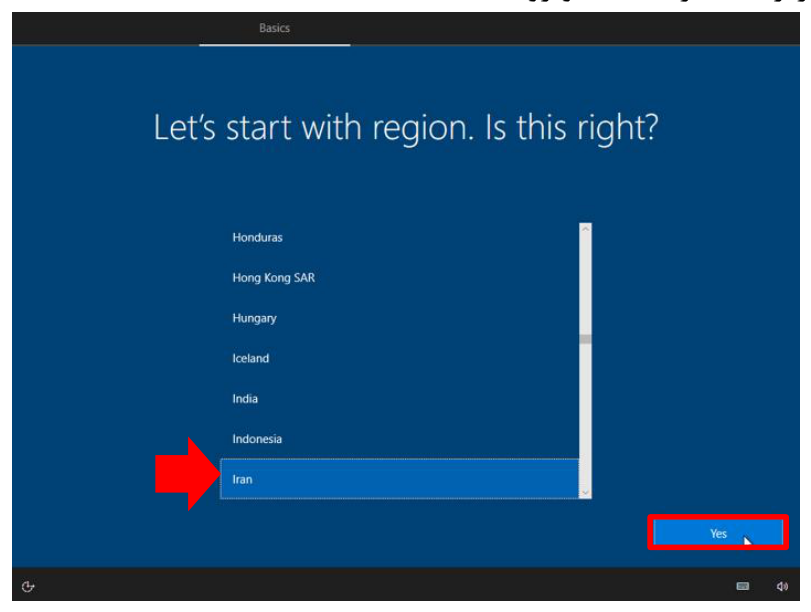

**Image analysis**

```json
{
 "image_name": "image55.tmp",
 "rId": "rId68",
 "image_path": "img_folder/image_054_image55.png",
 "caption": "صفحه انتخاب منطقه با انتخاب «Iran» و دکمه «Yes» برای تایید",
 "ocr_text": "Basics\nLet's start with region. Is this right?\nHonduras\nHong Kong SAR\nHungary\nIceland\nIndia\nIndonesia\nIran\nYes",
 "visual_description": [
 "پنجره تنظیمات با عنوان Basics نمایش داده شده است",
 "متن راهنما: Let's start with region. Is this right?",
 "فهرست کشورها با اسکرول بار عمودی در سمت راست دیده می شود",
 "گزینه Iran در لیست هایلایت شده است",
 "یک فلش قرمز به گزینه Iran اشاره می کند",
 "دکمه Yes در پایین سمت راست با کادر قرمز مشخص شده است"
 ],
 "image_type": "screenshot"
}
```

در صورت نمایش پیغام زیر در PC های 3G، باید به صفحه ی تنظیمات BIOS بروید و همه ی تنظیمات را به حالت Defaultبرگردانید:

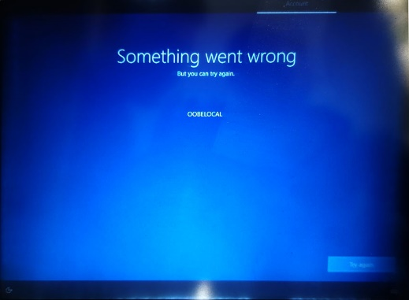

**Image analysis**

```json
{
 "image_name": "image56.jpeg",
 "rId": "rId69",
 "image_path": "img_folder/image_055_image56.jpg",
 "caption": "صفحه خطای ویندوز با پیام «Something went wrong» و دکمه «Try again»",
 "ocr_text": "Something went wrong\nBut you can try again.\nOOBELOCAL\nTry again",
 "visual_description": [
 "نمایش صفحه آبی رابط کاربری با پیام خطا در مرکز",
 "وجود دکمه «Try again» در پایین سمت راست",
 "نمایش کد/برچسب «OOBELOCAL» زیر پیام اصلی"
 ],
 "image_type": "photo"
}
```

2. در پنجره زیر، US را انتخاب و روی دکمه ی Yes کلیک نمایید:

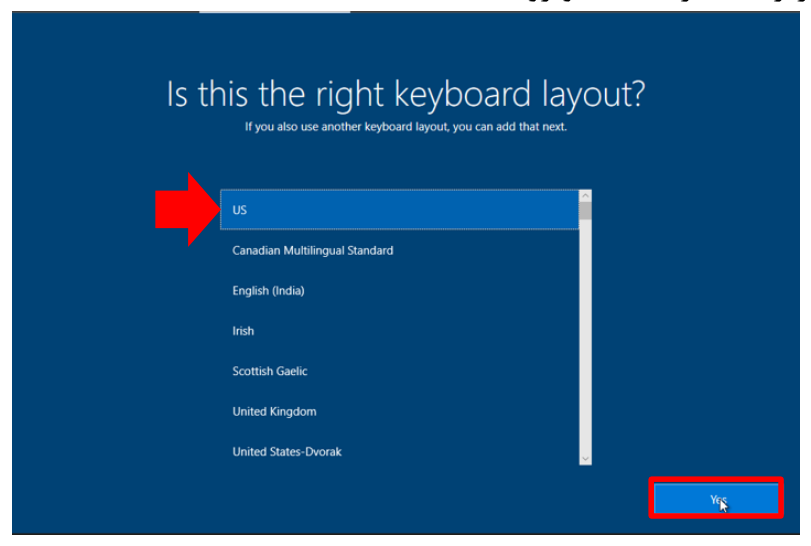

**Image analysis**

```json
{
 "image_name": "image57.tmp",
 "rId": "rId70",
 "image_path": "img_folder/image_056_image57.png",
 "caption": "صفحه انتخاب چیدمان صفحه کلید با گزینه US و دکمه Yes",
 "ocr_text": "Is this the right keyboard layout?\nIf you also use another keyboard layout, you can add that next.\nUS\nCanadian Multilingual Standard\nEnglish (India)\nIrish\nScottish Gaelic\nUnited Kingdom\nUnited States-Dvorak\nYes",
 "visual_description": [
 "صفحه تنظیمات با عنوان «Is this the right keyboard layout?» نمایش داده شده است",
 "یک فهرست انتخاب چیدمان صفحه کلید با نوار اسکرول عمودی دیده می شود",
 "گزینه «US» در بالای فهرست انتخاب/هایلایت شده است",
 "یک فلش قرمز به گزینه «US» اشاره می کند",
 "دکمه «Yes» در پایین سمت راست با کادر قرمز مشخص شده است"
 ],
 "image_type": "screenshot"
}
```

3. روی Add Layout کلیک نمایید:

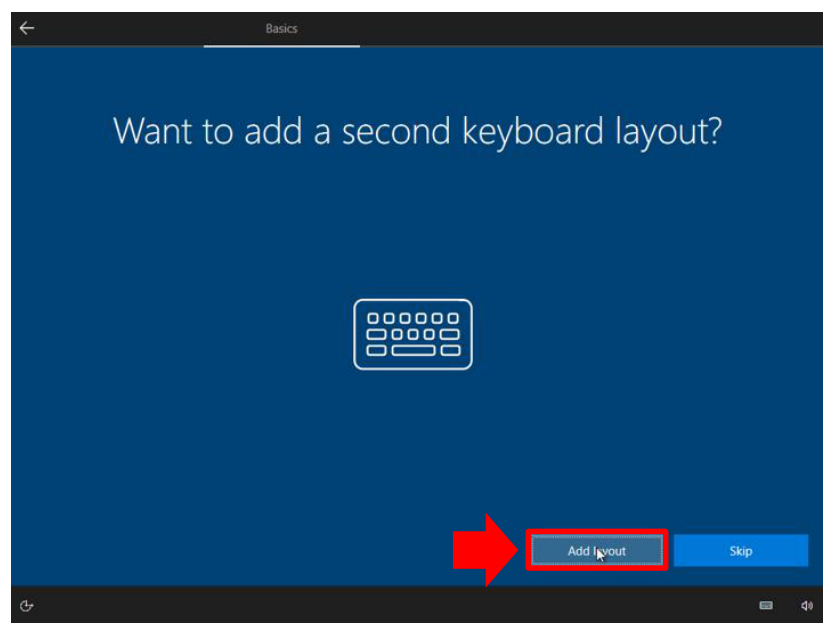

**Image analysis**

```json
{
 "image_name": "image58.tmp",
 "rId": "rId71",
 "image_path": "img_folder/image_057_image58.png",
 "caption": "صفحه تنظیمات افزودن چیدمان دوم کیبورد با دکمه Add layout و Skip",
 "ocr_text": "Basics\nWant to add a second keyboard layout?\nAdd layout\nSkip",
 "visual_description": [
 "نمای یک صفحه راه اندازی با پس زمینه آبی و عنوان بالایی \"Basics\"",
 "متن راهنما: \"Want to add a second keyboard layout?\"",
 "آیکون کیبورد در مرکز صفحه",
 "دو دکمه در پایین: \"Add layout\" و \"Skip\"",
 "یک فلش قرمز و کادر قرمز دکمه \"Add layout\" را مشخص کرده است"
 ],
 "image_type": "screenshot"
}
```

4. در پنجره زیر، Persian(Iran) را انتخاب و سپس روی Next کلیک کنید:

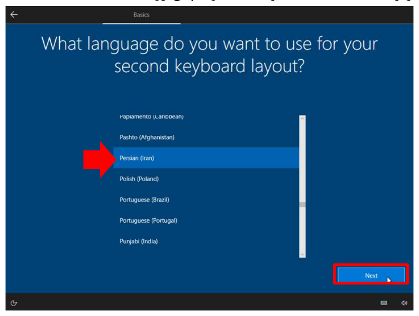

**Image analysis**

```json
{
 "image_name": "image59.tmp",
 "rId": "rId72",
 "image_path": "img_folder/image_058_image59.png",
 "caption": "انتخاب زبان برای چیدمان دوم صفحه کلید با گزینه Persian (Iran) و دکمه Next",
 "ocr_text": "Basics\nWhat language do you want to use for your\nsecond keyboard layout?\nPapiamento (Caribbean)\nPashto (Afghanistan)\nPersian (Iran)\nPolish (Poland)\nPortuguese (Brazil)\nPortuguese (Portugal)\nPunjabi (India)\nNext",
 "visual_description": [
 "صفحه تنظیمات با عنوان Basics و پرسش انتخاب زبان برای چیدمان دوم کیبورد نمایش داده شده است",
 "فهرست زبان ها شامل Papiamento (Caribbean)، Pashto (Afghanistan)، Persian (Iran)، Polish (Poland)، Portuguese (Brazil)، Portuguese (Portugal)، Punjabi (India) است",
 "گزینه Persian (Iran) در حالت انتخاب و با نوار آبی هایلایت شده است",
 "نوار اسکرول عمودی در سمت راست فهرست زبان ها دیده می شود",
 "دکمه Next در پایین سمت راست قرار دارد و با کادر قرمز مشخص شده است",
 "یک پیکان قرمز به سمت گزینه Persian (Iran) اشاره می کند"
 ],
 "image_type": "screenshot"
}
```

5. پس از نمایش پنجره زیر، Persian را انتخاب و روی Add Layout کلیک نمایید:

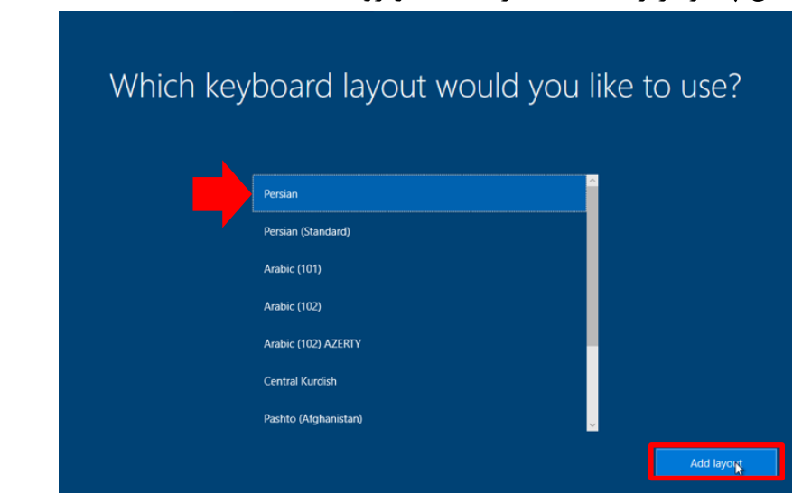

**Image analysis**

```json
{
 "image_name": "image60.tmp",
 "rId": "rId73",
 "image_path": "img_folder/image_059_image60.png",
 "caption": "انتخاب چیدمان صفحه کلید فارسی در ویندوز و افزودن آن با دکمه Add layout",
 "ocr_text": "Which keyboard layout would you like to use?\nPersian\nPersian (Standard)\nArabic (101)\nArabic (102)\nArabic (102) AZERTY\nCentral Kurdish\nPashto (Afghanistan)\nAdd layout",
 "visual_description": [
 "صفحه تنظیمات با عنوان «Which keyboard layout would you like to use?» نمایش داده شده است.",
 "یک فهرست قابل اسکرول از چیدمان های صفحه کلید شامل Persian، Persian (Standard)، Arabic (101)، Arabic (102)، Arabic (102) AZERTY، Central Kurdish و Pashto (Afghanistan) دیده می شود.",
 "گزینه Persian در فهرست هایلایت شده است.",
 "یک فلش قرمز به سمت گزینه Persian اشاره می کند.",
 "دکمه «Add layout» در پایین سمت راست با کادر قرمز مشخص شده است."
 ],
 "image_type": "screenshot"
}
```

6. روی لینک I don’t have internet کلیک کنید:

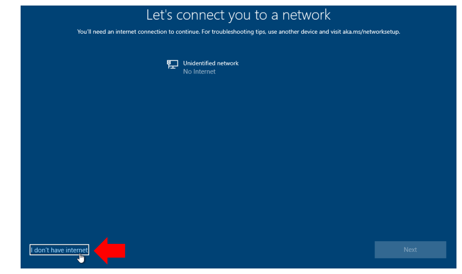

**Image analysis**

```json
{
 "image_name": "image61.png",
 "rId": "rId74",
 "image_path": "img_folder/image_060_image61.png",
 "caption": "صفحه اتصال به شبکه در ویندوز با وضعیت شبکه ناشناس و بدون اینترنت",
 "ocr_text": "Let's connect you to a network\nYou'll need an internet connection to continue. For troubleshooting tips, use another device and visit aka.ms/networksetup.\nUnidentified network\nNo Internet\nI don't have internet\nNext",
 "visual_description": [
 "نمایش صفحه راه اندازی شبکه ویندوز با عنوان «Let's connect you to a network»",
 "پیام نیاز به اتصال اینترنت و لینک aka.ms/networksetup نمایش داده شده است",
 "شبکه «Unidentified network» با وضعیت «No Internet» نشان داده می شود",
 "دکمه/لینک «I don't have internet» در پایین چپ با نشانگر ماوس و فلش قرمز مشخص شده است",
 "دکمه «Next» در پایین راست به صورت غیرفعال/کم رنگ دیده می شود"
 ],
 "image_type": "screenshot"
}
```

7. روی گزینه Continue with limited setup کلیک نمایید:

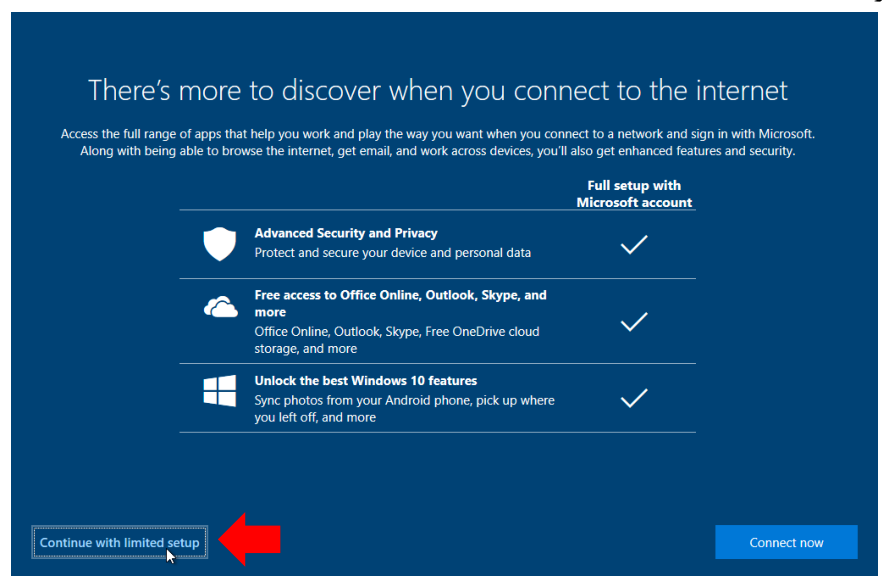

**Image analysis**

```json
{
 "image_name": "image62.png",
 "rId": "rId75",
 "image_path": "img_folder/image_061_image62.png",
 "caption": "صفحه راه اندازی ویندوز ۱۰ برای اتصال به اینترنت و ورود با حساب مایکروسافت",
 "ocr_text": "There’s more to discover when you connect to the internet\n\nAccess the full range of apps that help you work and play the way you want when you connect to a network and sign in with Microsoft.\nAlong with being able to browse the internet, get email, and work across devices, you’ll also get enhanced features and security.\n\nFull setup with\nMicrosoft account\n\nAdvanced Security and Privacy\nProtect and secure your device and personal data\n\nFree access to Office Online, Outlook, Skype, and\nmore\nOffice Online, Outlook, Skype, Free OneDrive cloud\nstorage, and more\n\nUnlock the best Windows 10 features\nSync photos from your Android phone, pick up where\nyou left off, and more\n\nContinue with limited setup\n\nConnect now",
 "visual_description": [
 "صفحه با پس زمینه آبی و متن سفید مربوط به راه اندازی Windows 10 نمایش داده شده است",
 "سه بخش مزایا با آیکن های سپر، ابر و لوگوی ویندوز و علامت تیک در سمت راست دیده می شود",
 "دکمه «Continue with limited setup» در پایین چپ و دکمه «Connect now» در پایین راست قرار دارد",
 "یک فلش قرمز به سمت دکمه «Continue with limited setup» اشاره می کند"
 ],
 "image_type": "screenshot"
}
```

در این مرحله دستگاه Restart می شود و مجدداً پنجره ی مراحل 6 و 7 به نمایش گذاشته می شوند و تکرار خواهند شد.

8. روی دکمه یAccept کلیک کنید:

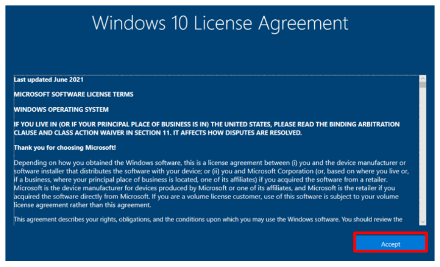

**Image analysis**

```json
{
 "image_name": "image63.tmp",
 "rId": "rId76",
 "image_path": "img_folder/image_062_image63.png",
 "caption": "اسکرین شات پنجره توافق نامه مجوز ویندوز ۱۰ با دکمه Accept",
 "ocr_text": "Windows 10 License Agreement\n\nLast updated June 2021\n\nMICROSOFT SOFTWARE LICENSE TERMS\n\nWINDOWS OPERATING SYSTEM\n\nIF YOU LIVE IN (OR IF YOUR PRINCIPAL PLACE OF BUSINESS IS IN) THE UNITED STATES, PLEASE READ THE BINDING ARBITRATION CLAUSE AND CLASS ACTION WAIVER IN SECTION 11. IT AFFECTS HOW DISPUTES ARE RESOLVED.\n\nThank you for choosing Microsoft!\n\nDepending on how you obtained the Windows software, this is a license agreement between (i) you and the device manufacturer or software installer that distributes the software with your device, or (ii) you and Microsoft Corporation (or, based on where you live or, if a business, where your principal place of business is located, one of its affiliates) if you acquired the software from a retailer. Microsoft is the device manufacturer for devices produced by Microsoft or one of its affiliates, and Microsoft is the retailer if you acquired the software directly from Microsoft. If you are a volume license customer, use of this software is subject to your volume license agreement rather than this agreement.\n\nThis agreement describes your rights, obligations, and the conditions upon which you may use the Windows software. You should review the\n\nAccept",
 "visual_description": [
 "پنجره متنی «Windows 10 License Agreement» با نوار اسکرول عمودی در سمت راست",
 "متن شامل «Last updated June 2021» و عنوان «MICROSOFT SOFTWARE LICENSE TERMS» و «WINDOWS OPERATING SYSTEM»",
 "دکمه «Accept» در پایین سمت راست با کادر قرمز مشخص شده است"
 ],
 "image_type": "screenshot"
}
```

9. در کادری که در پنجره ی زیر وجود دارد عبارت ATMUser را جهت تعریف یوزر اکانت درج و روی Next کلیک نمایید:

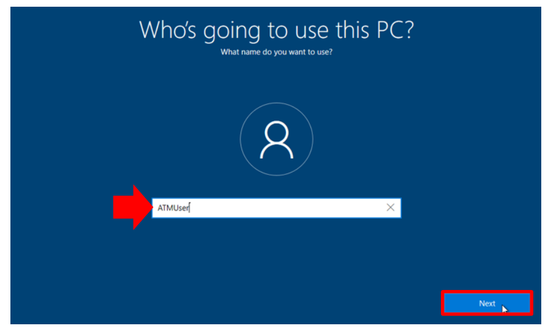

**Image analysis**

```json
{
 "image_name": "image64.tmp",
 "rId": "rId77",
 "image_path": "img_folder/image_063_image64.png",
 "caption": "صفحه ایجاد کاربر ویندوز با وارد کردن نام ATMUser و دکمه Next",
 "ocr_text": "Who’s going to use this PC?\nWhat name do you want to use?\nATMUser\nNext",
 "visual_description": [
 "اسکرین شات از صفحه راه اندازی ویندوز برای انتخاب نام کاربر (Who’s going to use this PC?)",
 "یک کادر ورودی متن با مقدار تایپ شده «ATMUser» نمایش داده شده است",
 "یک فلش قرمز به سمت کادر ورودی نام کاربر اشاره می کند",
 "دکمه «Next» در پایین سمت راست با کادر قرمز برجسته شده است",
 "آیکون کاربر به صورت شکل آدمک بالای کادر ورودی نمایش داده می شود"
 ],
 "image_type": "screenshot"
}
```

10. در کادر خالی پنجره ی زیر عبارت ZXCvbn@123 را جهت تعریف پسورد یوزر اکانت تایپ و سپس روی Next کلیک کنید:

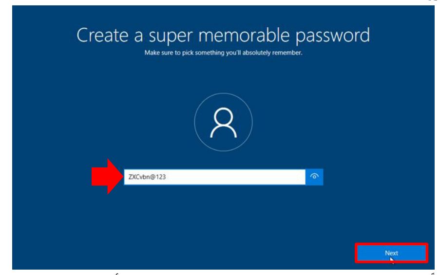

**Image analysis**

```json
{
 "image_name": "image65.tmp",
 "rId": "rId78",
 "image_path": "img_folder/image_064_image65.png",
 "caption": "صفحه ایجاد گذرواژه با فیلد ورود رمز و دکمه Next",
 "ocr_text": "Create a super memorable password\nMake sure to pick something you’ll absolutely remember.\nZXCvbn@123\nNext",
 "visual_description": [
 "نمایش رابط کاربری ایجاد گذرواژه با عنوان و متن راهنما در بالای صفحه",
 "یک فیلد ورودی گذرواژه شامل متن «ZXCvbn@123»",
 "آیکون چشم در سمت راست فیلد گذرواژه برای نمایش/پنهان سازی",
 "دکمه «Next» در پایین سمت راست صفحه",
 "یک فلش قرمز به سمت فیلد گذرواژه اشاره می کند",
 "کادر قرمز دور دکمه «Next» کشیده شده است"
 ],
 "image_type": "screenshot"
}
```

11. مجدداً در کادر خالی پنجره ی زیر ZXCvbn@123 را جهت تایید پسورد یوزر اکانت درج و سپس روی Next کلیک نمایید:

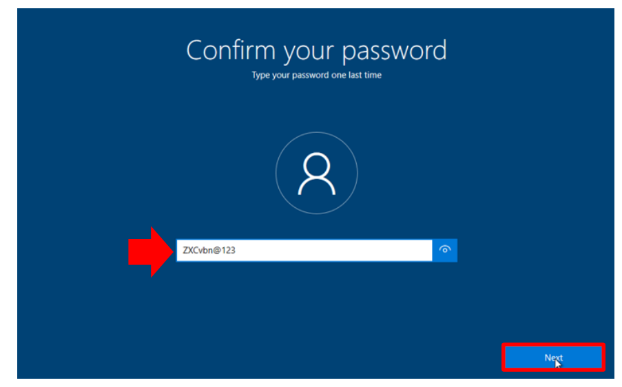

**Image analysis**

```json
{
 "image_name": "image66.tmp",
 "rId": "rId79",
 "image_path": "img_folder/image_065_image66.png",
 "caption": "صفحه تایید رمز عبور با فیلد ورود و دکمه Next",
 "ocr_text": "Confirm your password\nType your password one last time\nZXCvbn@123\nNext",
 "visual_description": [
 "صفحه آبی با عنوان «Confirm your password» و زیرعنوان «Type your password one last time»",
 "آیکن کاربر در مرکز صفحه نمایش داده شده است",
 "یک کادر ورودی رمز عبور شامل متن «ZXCvbn@123» دیده می شود",
 "در سمت راست کادر ورودی، آیکن نمایش/پنهان سازی رمز قرار دارد",
 "یک فلش قرمز به سمت کادر ورودی اشاره می کند",
 "دکمه «Next» در پایین سمت راست با کادر قرمز مشخص شده است"
 ],
 "image_type": "screenshot"
}
```

12. به منظور ایجاد سؤال های امنیتی در صورت فراموشی رمز یوزر اکانت، به ترتیبی که در شکل های زیر نشان داده شده است عمل نمایید و در هر مرحله در کادر پاسخ **کلمه ا ی** **که در شکل درج شده است** را تایپ کنید:

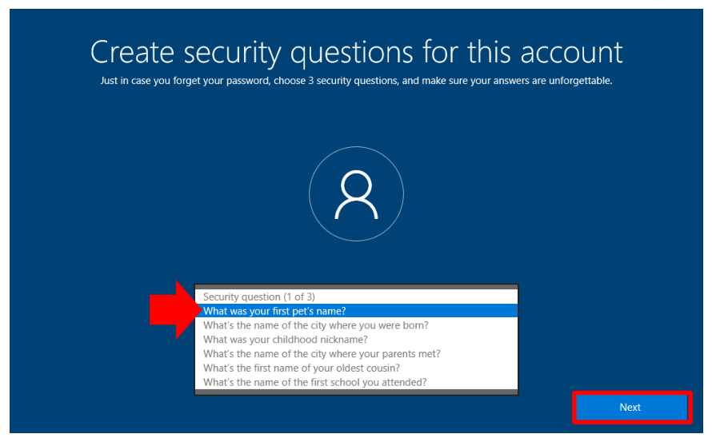

**Image analysis**

```json
{
 "image_name": "image67.png",
 "rId": "rId80",
 "image_path": "img_folder/image_066_image67.png",
 "caption": "صفحه تنظیم پرسش های امنیتی حساب با فهرست سوالات و دکمه Next",
 "ocr_text": "Create security questions for this account\nJust in case you forget your password, choose 3 security questions, and make sure your answers are unforgettable.\nSecurity question (1 of 3)\nWhat was your first pet’s name?\nWhat’s the name of the city where you were born?\nWhat was your childhood nickname?\nWhat’s the name of the city where your parents met?\nWhat’s the first name of your oldest cousin?\nWhat’s the name of the first school you attended?\nNext",
 "visual_description": [
 "صفحه آبی با عنوان «Create security questions for this account» و متن راهنما در بالا",
 "در مرکز آیکن کاربر داخل یک دایره دیده می شود",
 "یک کادر کشویی با برچسب «Security question (1 of 3)» نمایش داده شده است",
 "گزینه «What was your first pet’s name?» در لیست انتخاب شده است",
 "یک فلش قرمز به سمت کادر کشویی اشاره می کند",
 "دکمه «Next» در پایین سمت راست با کادر قرمز مشخص شده است"
 ],
 "image_type": "screenshot"
}
```

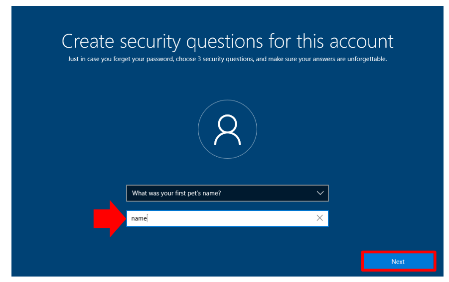

**Image analysis**

```json
{
 "image_name": "image68.png",
 "rId": "rId81",
 "image_path": "img_folder/image_067_image68.png",
 "caption": "صفحه تنظیم سوال امنیتی حساب با انتخاب سوال و واردکردن پاسخ و دکمه Next",
 "ocr_text": "Create security questions for this account\nJust in case you forget your password, choose 3 security questions, and make sure your answers are unforgettable.\nWhat was your first pet's name?\nname\nNext",
 "visual_description": [
 "رابط کاربری با عنوان «Create security questions for this account» روی پس زمینه آبی",
 "متن راهنما برای انتخاب 3 سوال امنیتی نمایش داده شده است",
 "یک منوی کشویی با متن «What was your first pet's name?» وجود دارد",
 "یک فیلد ورودی زیر منو با متن واردشده «name» و آیکون ضربدر (پاک کردن) در سمت راست دیده می شود",
 "یک دکمه «Next» در پایین سمت راست قرار دارد",
 "یک فلش قرمز به سمت فیلد ورودی اشاره می کند و یک کادر قرمز دور دکمه Next کشیده شده است"
 ],
 "image_type": "screenshot"
}
```

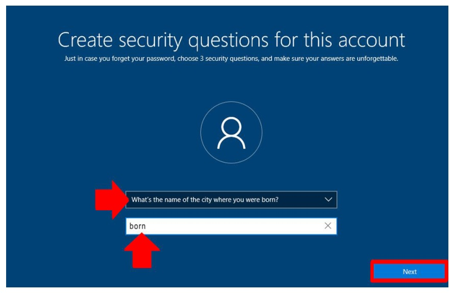

**Image analysis**

```json
{
 "image_name": "image69.jpg",
 "rId": "rId82",
 "image_path": "img_folder/image_068_image69.jpg",
 "caption": "صفحه ایجاد سوالات امنیتی حساب با انتخاب سوال و وارد کردن پاسخ",
 "ocr_text": "Create security questions for this account\nJust in case you forget your password, choose 3 security questions, and make sure your answers are unforgettable.\nWhat’s the name of the city where you were born?\nborn\nNext",
 "visual_description": [
 "اسکرین شات رابط کاربری با عنوان ایجاد سوالات امنیتی برای حساب",
 "یک فهرست کشویی برای انتخاب سوال امنیتی نمایش داده شده است",
 "سوال انتخاب شده: “What’s the name of the city where you were born?”",
 "یک کادر ورودی پاسخ با متن واردشده “born” دیده می شود",
 "دکمه «Next» در پایین سمت راست وجود دارد",
 "دو فلش قرمز به فهرست کشویی و کادر ورودی اشاره می کنند"
 ],
 "image_type": "screenshot"
}
```

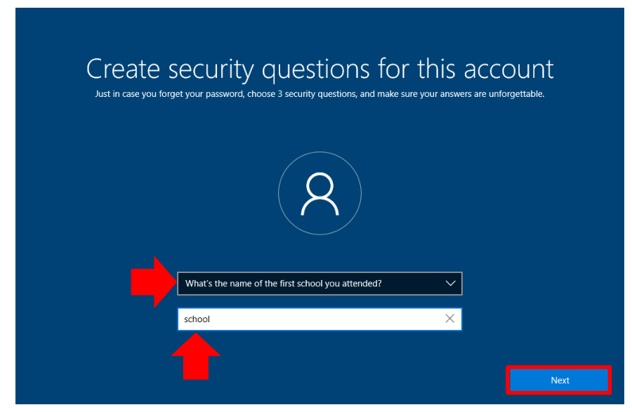

**Image analysis**

```json
{
 "image_name": "image70.png",
 "rId": "rId83",
 "image_path": "img_folder/image_069_image70.png",
 "caption": "صفحه تنظیم سوال امنیتی حساب با انتخاب سوال و وارد کردن پاسخ و دکمه Next",
 "ocr_text": "Create security questions for this account\nJust in case you forget your password, choose 3 security questions, and make sure your answers are unforgettable.\nWhat’s the name of the first school you attended?\nschool\nNext",
 "visual_description": [
 "اسکرین شات صفحه «Create security questions for this account» با پس زمینه آبی",
 "یک فهرست کشویی برای انتخاب سوال امنیتی نمایش داده شده است",
 "سوال انتخاب شده: «What’s the name of the first school you attended?»",
 "کادر ورودی پاسخ با متن «school» پر شده است و آیکون ضربدر برای پاک کردن دارد",
 "دکمه «Next» در پایین سمت راست قرار دارد و با کادر قرمز مشخص شده است",
 "دو فلش قرمز به فهرست کشویی و کادر ورودی اشاره می کنند"
 ],
 "image_type": "screenshot"
}
```

13. در پنجره زیر تمامی تیک ها را غیرفعال و سپس روی دکمه ی Accept کلیک کنید:

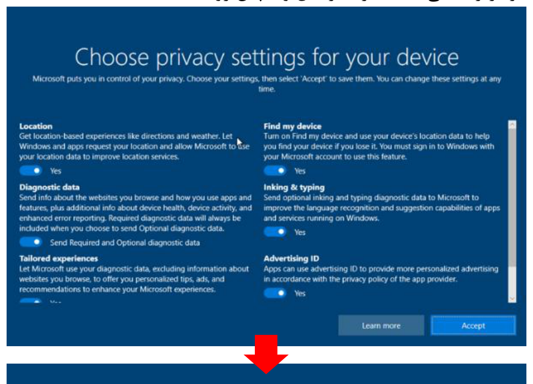

**Image analysis**

```json
{
 "image_name": "image71.png",
 "rId": "rId84",
 "image_path": "img_folder/image_070_image71.png",
 "caption": "صفحه انتخاب تنظیمات حریم خصوصی ویندوز با گزینه های مکان، داده های تشخیصی و دکمه Accept",
 "ocr_text": "Choose privacy settings for your device\nMicrosoft puts you in control of your privacy. Choose your settings, then select “Accept” to save them. You can change these settings at any time.\n\nLocation\nGet location-based experiences like directions and weather. Let Windows and apps request your location and allow Microsoft to use your location data to improve location services.\nYes\n\nDiagnostic data\nSend info about the websites you browse and how you use apps and features, plus additional info about device health, device activity, and enhanced error reporting. Required diagnostic data will always be included when you choose to send Optional diagnostic data.\nSend Required and Optional diagnostic data\n\nTailored experiences\nLet Microsoft use your diagnostic data, excluding information about the websites you browse, to offer you personalized tips, ads, and recommendations to enhance your Microsoft experiences.\n\nFind my device\nTurn on Find my device and use your device’s location data to help you find your device if you lose it. You must sign in to Windows with your Microsoft account to use this feature.\nYes\n\nInking & typing\nSend optional inking and typing diagnostic data to Microsoft to improve the language recognition and suggestion capabilities of apps and services running on Windows.\nYes\n\nAdvertising ID\nApps can use advertising ID to provide more personalized advertising in accordance with the privacy policy of the app provider.\nYes\n\nLearn more\nAccept",
 "visual_description": [
 "اسکرین شات صفحه «Choose privacy settings for your device» در ویندوز با پس زمینه آبی",
 "نمایش گزینه های Location، Diagnostic data، Tailored experiences، Find my device، Inking & typing، Advertising ID با کلیدهای روشن/خاموش",
 "وجود دکمه های «Learn more» و «Accept» در پایین صفحه",
 "وجود نوار پیمایش عمودی در سمت راست صفحه"
 ],
 "image_type": "screenshot"
}
```

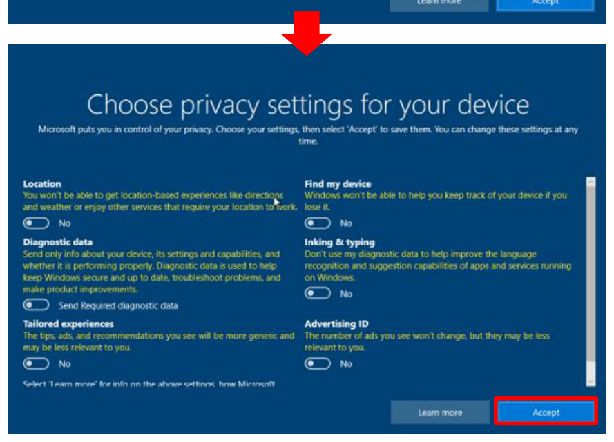

**Image analysis**

```json
{
 "image_name": "image72.png",
 "rId": "rId85",
 "image_path": "img_folder/image_071_image72.png",
 "caption": "صفحه تنظیمات حریم خصوصی ویندوز با گزینه های مکان، داده های تشخیصی و دکمه Accept",
 "ocr_text": "Learn more\nAccept\nChoose privacy settings for your device\nMicrosoft puts you in control of your privacy. Choose your settings, then select \"Accept\" to save them. You can change these settings at any time.\nLocation\nYou won't be able to get location-based experiences like directions and weather or enjoy other services that require your location to work.\nNo\nDiagnostic data\nSend only info about your device, its settings and capabilities, and whether it is performing properly. Diagnostic data is used to help keep Windows secure and up to date, troubleshoot problems, and make product improvements.\nSend Required diagnostic data\nTailored experiences\nThe tips, ads, and recommendations you see will be more generic and may be less relevant to you.\nNo\nFind my device\nWindows won't be able to help you keep track of your device if you lose it.\nNo\nInking & typing\nDon't use my diagnostic data to help improve the language recognition and suggestion capabilities of apps and services running on Windows.\nNo\nAdvertising ID\nThe number of ads you see won't change, but they may be less relevant to you.\nNo\nLearn more\nAccept",
 "visual_description": [
 "صفحه راه اندازی/تنظیمات با عنوان «Choose privacy settings for your device» نمایش داده شده است.",
 "چند گزینه حریم خصوصی با کلیدهای تغییر وضعیت (toggle) شامل Location، Find my device، Inking & typing، Advertising ID و Tailored experiences دیده می شود.",
 "بخش «Diagnostic data» شامل گزینه «Send Required diagnostic data» نمایش داده شده است.",
 "در پایین صفحه دو دکمه «Learn more» و «Accept» وجود دارد و دکمه Accept با کادر قرمز مشخص شده است.",
 "یک فلش قرمز در بالای صفحه به سمت عنوان/بخش بالایی اشاره می کند.",
 "نوار پیمایش عمودی در سمت راست صفحه دیده می شود."
 ],
 "image_type": "screenshot"
}
```

با انجام این کار تنظیمات اولیه قبل از راه اندازی سیستم عامل انجام و دستگاه Restart خواهد شد.

# انجام تنظیمات کانفیگ سخت افزاری

## 1. مجوز نصب و راه اندازی

پس از انجام مراحل مندرج در قسمت قبل، در پنجره ای که باز می شود، ID و Verification Code که قبلاً در اختیارتان قرارداده شده است را وارد و روی دکمه ی Log in کلیک نمایید:

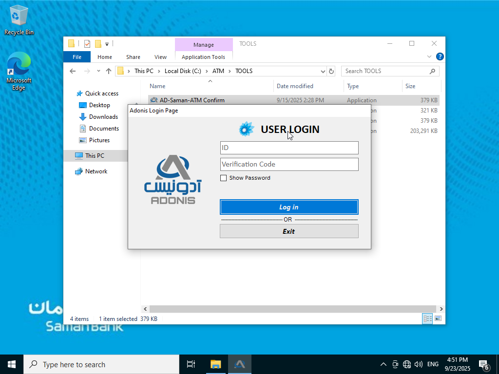

**Image analysis**

```json
{
 "image_name": "image73.png",
 "rId": "rId86",
 "image_path": "img_folder/image_072_image73.png",
 "caption": "پنجره ورود کاربر Adonis روی دسکتاپ ویندوز با فیلدهای ID و کد تایید",
 "ocr_text": "Recycle Bin\nMicrosoft Edge\nFile\nHome\nShare\nView\nManage\nTOOLS\nApplication Tools\nThis PC\nLocal Disk (C:)\nATM\nTOOLS\nSearch TOOLS\nQuick access\nDesktop\nDownloads\nDocuments\nPictures\nThis PC\nNetwork\nName\nDate modified\nType\nSize\nAD-Saman-ATM Confirm\n9/15/2025 2:28 PM\nApplication\n379 KB\nAdonis Login Page\nUSER LOGIN\nID\nVerification Code\nShow Password\nLog in\nOR\nExit\nAdonis\nADONIS\n4 items\n1 item selected\n379 KB\nType here to search\nENG\n4:51 PM\n9/15/2025\nSamanBank",
 "visual_description": [
 "اسکرین شات از File Explorer مسیر This PC > Local Disk (C:) > ATM > TOOLS",
 "یک فایل با نام AD-Saman-ATM Confirm با نوع Application و اندازه 379 KB نمایش داده شده است",
 "یک پنجره برنامه با عنوان Adonis Login Page باز است",
 "در پنجره ورود، متن USER LOGIN و دو فیلد ورودی با برچسب های ID و Verification Code دیده می شود",
 "یک چک باکس Show Password موجود است",
 "دو دکمه Log in و Exit با جداکننده OR نمایش داده شده اند",
 "لوگوی ADONIS/آدونیس در سمت چپ پنجره ورود دیده می شود",
 "نوار وظیفه ویندوز زبان ENG و زمان 4:51 PM و تاریخ 9/15/2025 را نشان می دهد"
 ],
 "image_type": "screenshot"
}
```

حتماً لازم است ساعت و تاریخ را از طریق مراجعه به صفحه تنظیمات بایوس تنظیم کرده باشید.

## 2. انجام تنظیمات سخت افزار

1. در منوی اصلی نرم افزار Bank Saman ATM Config،
 عدد 1 یعنی 1- Eastcom-Wincor Config را جهت انتخاب پیکربندی دستگاه، درج و سپس کلید Enter کیبورد را فشار دهید:

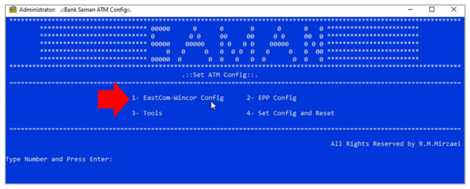

**Image analysis**

```json
{
 "image_name": "image74.tmp",
 "rId": "rId87",
 "image_path": "img_folder/image_073_image74.png",
 "caption": "منوی متنی تنظیمات ATM با گزینه های پیکربندی و پیام «Type Number and Press Enter»",
 "ocr_text": "Administrator: ::Bank Saman ATM Config::\n\n::Set ATM Config::\n\n1- EastCom-Wincor Config 2- EPP Config\n3- Tools 4- Set Config and Reset\n\nAll Rights Reserved by R.M.Mirzaei\n\nType Number and Press Enter:",
 "visual_description": [
 "پنجره برنامه ویندوز با عنوان «Administrator: ::Bank Saman ATM Config::» نمایش داده شده است.",
 "رابط کاربری به سبک کنسولی با پس زمینه آبی و متن سفید است.",
 "عنوان مرکزی «::Set ATM Config::» در صفحه دیده می شود.",
 "چهار گزینه منو شماره گذاری شده 1 تا 4 شامل EastCom-Wincor Config، EPP Config، Tools و Set Config and Reset وجود دارد.",
 "یک فلش قرمز به سمت گزینه «1- EastCom-Wincor Config» اشاره می کند.",
 "نشانگر ماوس سفید نزدیک متن «EastCom-Wincor Config» قرار دارد.",
 "متن «All Rights Reserved by R.M.Mirzaei» در پایین سمت راست دیده می شود.",
 "پیام ورودی «Type Number and Press Enter:» در پایین سمت چپ نمایش داده شده است."
 ],
 "image_type": "screenshot"
}
```

2. با توجه به کانفیگ دستگاه، شماره مشخصات و مدل موردنظر را وارد و پس از فشار کلید Enter، تا پایان عملیات نصب که بسته به نوع سخت افزار دستگاه، حداقل 3 الی 4 دقیقه به طول می انجامد، صبر نمایید.

تنظیمات دستگاهEastCom 280 با چاپگر TP07 و بارکدخوانHoneywell N4680 در کانفیگ های یک بعدی موجود است لذا لازم است پس از نصب نرم افزار، بارکدخوان
Honeywell N4680 را با مراجعه به ادامه ی این سند به صورت جداگانه فعال نمایید.

نکته مهم: در صورت انتخاب شماره اشتباه، دستگاه راه اندازی نخواهد **شد** و تمام مراحل نصب تا این مرحله را باید مجدداً تکرار نمایید. بنابراین، پیش از انتخاب شماره موردنظر، از صحت آن، اطمینان حاصل نمایید.

**کانفیگ مناسب جهت نصب ProBase در دستگاه های ۸۰۵۰:**

**- OP04- 2DBCR دستگاه های دارای اپراتور پنل مشابه ۲۰۵۰**

**- OP05- 2DBCR دستگاه های دارای اپراتور پنل مشابه ۲۸۵**

**- OP06- 2DBCR دستگاه های دارای اپراتورپنل Touch مشکی**

3. **این مرحله را تنها در صورتی که بارکدخوان از نوع Honeywell N4680 است، انجام دهید در غیر این صورت بدون انجام هیچگونه اقدامی به مرحله بعد بروید**:

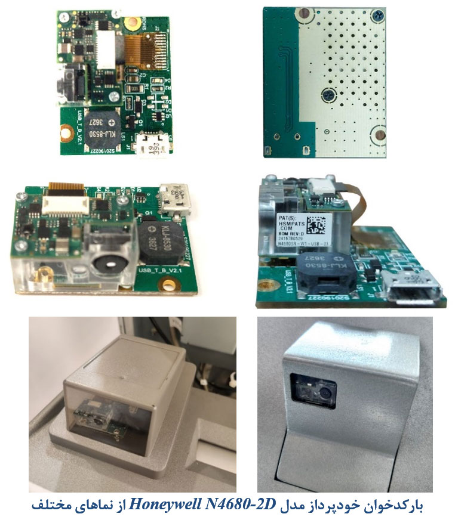

**Image analysis**

```json
{
 "image_name": "image75.jpg",
 "rId": "rId88",
 "image_path": "img_folder/image_074_image75.jpg",
 "caption": "نمای نزدیک از برد و ماژول بارکدخوان Honeywell N4680-2D با پورت USB و برچسب های فنی",
 "ocr_text": "USB_T_B_V2.1\nKLJ-085D\n(+) 3627\nKJL-0530\n(+) 3627\nS2 S1 P0\nXLI-0530\n(+) 3627\n20190227\nUSB_T_B_V2.1\nPAT(S):\nHSM/ PATS\nPEND\nROH REV D\n241678529\nN4603SR-W1-USB -03\nHoneywell N4680-2D\nبارکدخوان خودپرداز مدل از نماهای مختلف",
 "visual_description": [
 "کلاژ شامل چند نمای مختلف از یک برد الکترونیکی و ماژول بارکدخوان با قاب پلاستیکی",
 "روی برد کانکتور micro-USB و یک کانکتور فلت (FFC/FPC) دیده می شود",
 "برچسب ماژول شامل متن PAT(S)، ROH REV D و شماره N4603SR-W1-USB -03 است",
 "روی PCB متن USB_T_B_V2.1 و تاریخ 20190227 چاپ شده است",
 "روی برد نقاط تست/پین های علامت گذاری شده با S2 S1 P0 مشاهده می شود",
 "نمای پشت برد دارای صفحه فلزی/شیلد با سوراخ های متعدد و چند محل پیچ است"
 ],
 "image_type": "photo"
}
```

برای نصب درایور به مسیر زیر بروید:

**1.Eastcom-Wincor Config 🡪 2. DBCR🡪3.\*\*BCR N4680\*\***

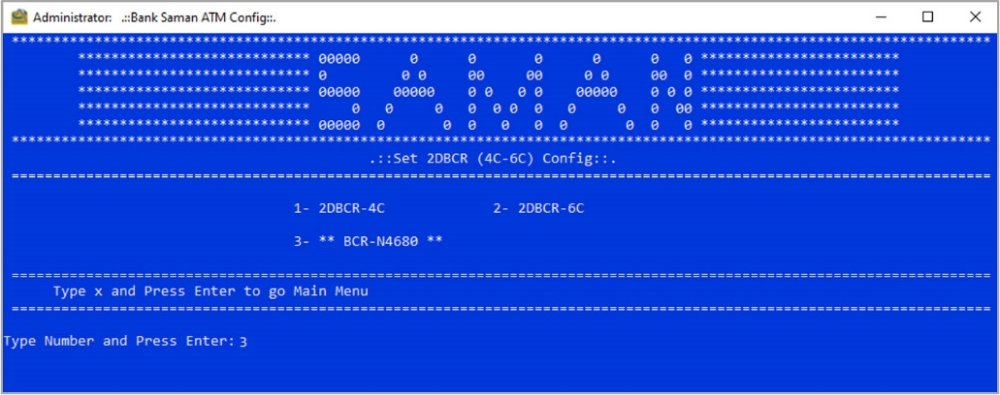

**Image analysis**

```json
{
 "image_name": "image76.jpeg",
 "rId": "rId89",
 "image_path": "img_folder/image_075_image76.jpg",
 "caption": "اسکرین شات منوی تنظیمات ATM برای انتخاب پیکربندی 2DBCR و BCR-N4680",
 "ocr_text": "Administrator: :::Bank Saman ATM Config:::\n\n:::Set 2DBCR (4C-6C) Config:::\n\n1- 2DBCR-4C 2- 2DBCR-6C\n\n3- ** BCR-N4680 **\n\nType x and Press Enter to go Main Menu\n\nType Number and Press Enter: 3",
 "visual_description": [
 "پنجره کنسولی با پس زمینه آبی و متن سفید نمایش داده شده است",
 "عنوان بالای صفحه: :::Bank Saman ATM Config:::",
 "بخش :::Set 2DBCR (4C-6C) Config::: شامل گزینه های 1- 2DBCR-4C و 2- 2DBCR-6C است",
 "گزینه 3- ** BCR-N4680 ** در منو دیده می شود",
 "راهنمای ورود: Type x and Press Enter to go Main Menu",
 "در خط فرمان پایین: Type Number and Press Enter: 3"
 ],
 "image_type": "screenshot"
}
```

## 3.راه اندازی EPP

1. در منوی اصلی نرم افزار Set ATM Config، عدد 2 یعنی 2- EPP Config را جهت انتخاب نوع EPP و نصب درایور های مربوطه، وارد و سپس کلید Enter را فشار دهید.

در صورت نصب EPP مدل Sunson، از انجام این مرحله صرف نظر نموده و سایر مراحل را مطابق دستورالعمل ادامه دهید. پس از انجام مرحله «ساخت پارتیشن D» و بر اساس دستورالعمل مربوطه، آخرین نسخه ی درایور EPP Sunson را نصب نمایید.

در هر مرحله می توانید با فشار کلید X و سپس کلید Enter، به منوی اصلی بازگردید.

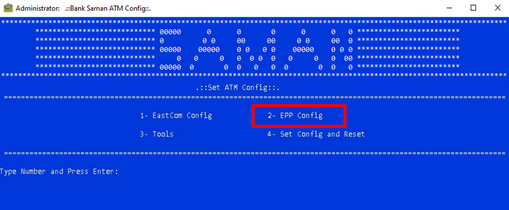

**Image analysis**

```json
{
 "image_name": "image77.jpg",
 "rId": "rId90",
 "image_path": "img_folder/image_076_image77.jpg",
 "caption": "منوی تنظیمات ATM بانک سامان با گزینه EPP Config مشخص شده",
 "ocr_text": "Administrator: ::Bank Saman ATM Config::\n\n::Set ATM Config::\n\n1- EastCom Config 2- EPP Config\n3- Tools 4- Set Config and Reset\n\nType Number and Press Enter:",
 "visual_description": [
 "پنجره کنسولی با عنوان «Administrator: ::Bank Saman ATM Config::» نمایش داده شده است",
 "بخش «::Set ATM Config::» شامل چهار گزینه شماره دار است",
 "گزینه «2- EPP Config» با یک کادر قرمز برجسته شده است",
 "در پایین صفحه پیام «Type Number and Press Enter:» برای ورود شماره گزینه نمایش داده می شود"
 ],
 "image_type": "screenshot"
}
```

2. با توجه به فهرستی که نمایش داده می شود، شماره مدل EPP نصب شده روی دستگاه را درج و سپس کلید Enter را فشار دهید.

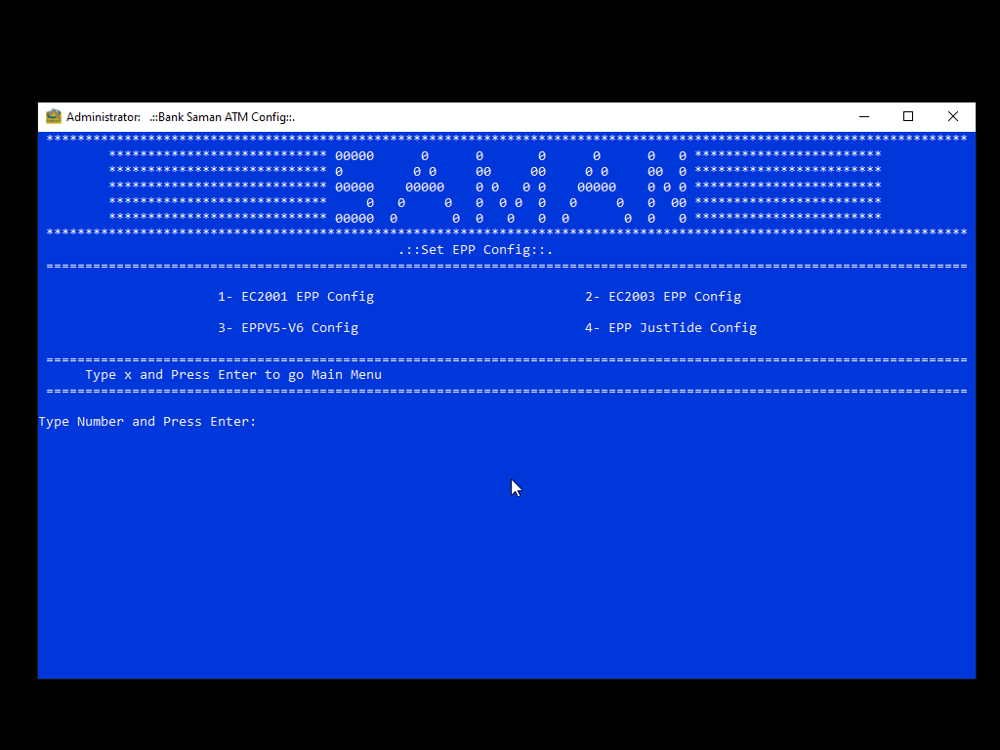

**Image analysis**

```json
{
 "image_name": "image78.png",
 "rId": "rId91",
 "image_path": "img_folder/image_077_image78.png",
 "caption": "منوی تنظیمات EPP در نرم افزار Bank Saman ATM Config با گزینه های انتخاب پیکربندی",
 "ocr_text": "Administrator: ::Bank Saman ATM Config::\n\n\n...::Set EPP Config::.\n\n1- EC2001 EPP Config 2- EC2003 EPP Config\n\n3- EPPV5-V6 Config 4- EPP JustTide Config\n\nType X and Press Enter to go Main Menu\n\nType Number and Press Enter:",
 "visual_description": [
 "اسکرین شات یک پنجره کنسولی با پس زمینه آبی و متن سفید",
 "عنوان پنجره شامل «Administrator: ::Bank Saman ATM Config::» است",
 "بخش «...::Set EPP Config::.» نمایش داده می شود",
 "چهار گزینه منویی شماره دار برای پیکربندی EPP وجود دارد: EC2001، EC2003، EPPV5-V6، EPP JustTide",
 "راهنمایی «Type X and Press Enter to go Main Menu» و ورودی «Type Number and Press Enter:» دیده می شود"
 ],
 "image_type": "screenshot"
}
```

3. در منوی اصلی نرم افزار Set ATM Config، عدد 3 یعنی 3- Tools را جهت انجام تنظیمات شبکه و نصب درایور کارت گرافیک، وارد و سپس کلید Enter را فشار دهید:

در هر مرحله می توانید با فشار کلید X و سپس کلید Enter، به منوی اصلی بازگردید.

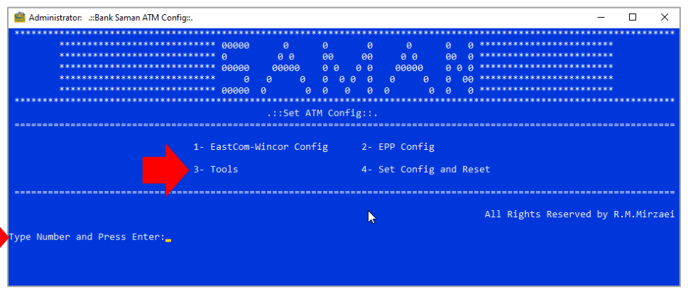

**Image analysis**

```json
{
 "image_name": "image79.png",
 "rId": "rId92",
 "image_path": "img_folder/image_078_image79.png",
 "caption": "منوی متنی تنظیمات ATM با گزینه های پیکربندی و ابزارها",
 "ocr_text": "Administrator: ::Bank Saman ATM Config::\n\n00000 0 0 0 0 0\n00000 00000 0 0 0 00000 0 0\n00000 0 0 0 0 0 0 0 0 0 0\n\n:::Set ATM Config:::\n\n1- EastCom-Wincor Config 2- EPP Config\n3- Tools 4- Set Config and Reset\n\nType Number and Press Enter:\n\nAll Rights Reserved by R.M.Mirzaei",
 "visual_description": [
 "پنجره کنسول ویندوز با پس زمینه آبی و منوی Set ATM Config نمایش داده شده است",
 "چهار گزینه شماره گذاری شده شامل EastCom-Wincor Config، EPP Config، Tools و Set Config and Reset دیده می شود",
 "یک فلش قرمز بزرگ به سمت گزینه «3- Tools» اشاره می کند",
 "پایین صفحه پیام «Type Number and Press Enter:» برای دریافت ورودی کاربر وجود دارد",
 "متن حق نشر «All Rights Reserved by R.M.Mirzaei» در سمت راست پایین نمایش داده شده است"
 ],
 "image_type": "screenshot"
}
```

## 4.انجام تنظیمات شبکه

1. از منوی 3- Tools، گزینه ی 1- Windows IP Config را انتخاب کنید:

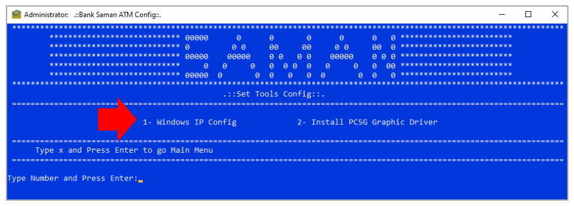

**Image analysis**

```json
{
 "image_name": "image80.png",
 "rId": "rId93",
 "image_path": "img_folder/image_079_image80.png",
 "caption": "صفحه تنظیمات ابزار با گزینه های تنظیم IP ویندوز و نصب درایور گرافیک PC5G",
 "ocr_text": "Administrator: ::Bank Saman ATM Config::\n\n::Set Tools Config::\n\n1- Windows IP Config 2- Install PC5G Graphic Driver\n\nType x and Press Enter to go Main Menu\n\nType Number and Press Enter:",
 "visual_description": [
 "پنجره کنسولی با عنوان «Administrator: ::Bank Saman ATM Config::» نمایش داده شده است",
 "عنوان منو «::Set Tools Config::» در مرکز صفحه دیده می شود",
 "دو گزینه منو وجود دارد: «1- Windows IP Config» و «2- Install PC5G Graphic Driver»",
 "دستور «Type x and Press Enter to go Main Menu» برای بازگشت به منوی اصلی نمایش داده شده است",
 "پرامپت «Type Number and Press Enter:» در پایین صفحه دیده می شود",
 "یک فلش قرمز به سمت گزینه «1- Windows IP Config» اشاره می کند"
 ],
 "image_type": "screenshot"
}
```

2. روی کارت شبکه فعال دستگاه راست کلیک کنید و از منویی که گشوده می شود، گزینه ی Properties را انتخاب نمایید:

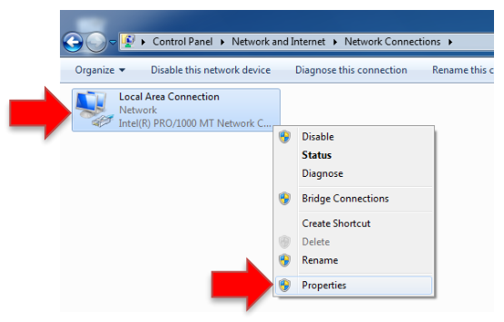

**Image analysis**

```json
{
 "image_name": "image81.png",
 "rId": "rId94",
 "image_path": "img_folder/image_080_image81.png",
 "caption": "پنجره Network Connections ویندوز با منوی راست کلیک و گزینه Properties برای Local Area Connection",
 "ocr_text": "Control Panel > Network and Internet > Network Connections\nOrganize\nDisable this network device\nDiagnose this connection\nRename this c\nLocal Area Connection\nNetwork\nIntel(R) PRO/1000 MT Network C...\nDisable\nStatus\nDiagnose\nBridge Connections\nCreate Shortcut\nDelete\nRename\nProperties",
 "visual_description": [
 "مسیر ناوبری بالای پنجره: Control Panel > Network and Internet > Network Connections",
 "یک اتصال با نام Local Area Connection انتخاب شده است",
 "زیر نام اتصال، متن Network و نام آداپتور Intel(R) PRO/1000 MT Network C... نمایش داده می شود",
 "منوی راست کلیک باز است و گزینه های Disable, Status, Diagnose, Bridge Connections, Create Shortcut, Delete, Rename, Properties دیده می شوند",
 "گزینه Properties در منو هایلایت شده است",
 "دو فلش قرمز یکی به سمت اتصال و دیگری به سمت گزینه Properties اشاره می کنند"
 ],
 "image_type": "screenshot"
}
```

در بعضی از شعب، Port Security فعال است و در صورت تعویض PC یا کارت شبکه، دستگاه غیر فعال خواهد شد. جهت فعالسازی کارت شبکه لازم است با انفورماتیک بانک تماس بگیرید.

3. از بخش This connection uses the following items، گزینه ی
 Internet Protocol Version 4(TCP/IPv4) را انتخاب و روی دکمه ی Properties کلیک کنید:

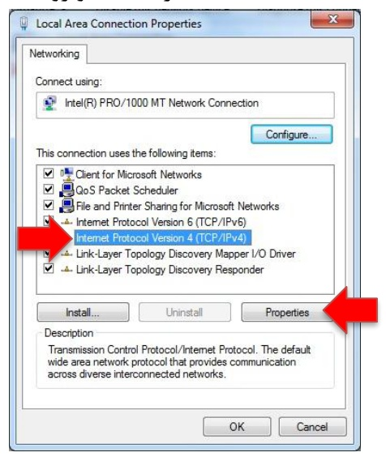

**Image analysis**

```json
{
 "image_name": "image82.jpeg",
 "rId": "rId95",
 "image_path": "img_folder/image_081_image82.jpg",
 "caption": "پنجره تنظیمات کارت شبکه و انتخاب Internet Protocol Version 4 (TCP/IPv4) برای باز کردن Properties",
 "ocr_text": "Local Area Connection Properties\nNetworking\nConnect using:\nIntel(R) PRO/1000 MT Network Connection\nConfigure...\nThis connection uses the following items:\nClient for Microsoft Networks\nQoS Packet Scheduler\nFile and Printer Sharing for Microsoft Networks\nInternet Protocol Version 6 (TCP/IPv6)\nInternet Protocol Version 4 (TCP/IPv4)\nLink-Layer Topology Discovery Mapper I/O Driver\nLink-Layer Topology Discovery Responder\nInstall...\nUninstall\nProperties\nDescription\nTransmission Control Protocol/Internet Protocol. The default\nwide area network protocol that provides communication\nacross diverse interconnected networks.\nOK\nCancel",
 "visual_description": [
 "پنجره Windows با عنوان «Local Area Connection Properties» در تب Networking نمایش داده شده است.",
 "بخش «Connect using» شامل «Intel(R) PRO/1000 MT Network Connection» و دکمه «Configure...» است.",
 "لیست آیتم های اتصال شامل گزینه های Client for Microsoft Networks، QoS Packet Scheduler و File and Printer Sharing است.",
 "گزینه «Internet Protocol Version 4 (TCP/IPv4)» در لیست هایلایت شده است.",
 "دکمه های «Install...»، «Uninstall» و «Properties» در پایین لیست وجود دارند.",
 "دو فلش قرمز به «Internet Protocol Version 4 (TCP/IPv4)» و دکمه «Properties» اشاره می کنند.",
 "بخش Description متن توضیحی درباره Transmission Control Protocol/Internet Protocol نمایش می دهد.",
 "دکمه های «OK» و «Cancel» در پایین پنجره قرار دارند."
 ],
 "image_type": "screenshot"
}
```

4. در پنجره ای که گشوده می شود، گزینه ی Use the following IP address را انتخاب و مقادیر مربوط به IP address، Subnet mask، Default gateway را بر اساس جدول های صفحه بعد وارد نمایید:

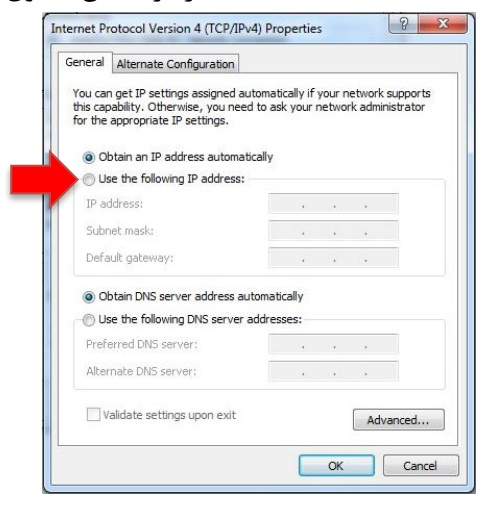

**Image analysis**

```json
{
 "image_name": "image83.jpeg",
 "rId": "rId96",
 "image_path": "img_folder/image_082_image83.jpg",
 "caption": "پنجره تنظیمات TCP/IPv4 ویندوز برای انتخاب IP و DNS خودکار یا دستی",
 "ocr_text": "Internet Protocol Version 4 (TCP/IPv4) Properties\nGeneral Alternate Configuration\nYou can get IP settings assigned automatically if your network supports\nthis capability. Otherwise, you need to ask your network administrator\nfor the appropriate IP settings.\nObtain an IP address automatically\nUse the following IP address:\nIP address:\nSubnet mask:\nDefault gateway:\nObtain DNS server address automatically\nUse the following DNS server addresses:\nPreferred DNS server:\nAlternate DNS server:\nValidate settings upon exit\nAdvanced...\nOK\nCancel",
 "visual_description": [
 "اسکرین شات پنجره Windows با عنوان Internet Protocol Version 4 (TCP/IPv4) Properties",
 "تب های General و Alternate Configuration در بالای پنجره دیده می شوند",
 "گزینه رادیویی «Use the following IP address:» انتخاب شده و با فلش قرمز به آن اشاره شده است",
 "فیلدهای IP address، Subnet mask و Default gateway در بخش IP نمایش داده شده اند",
 "بخش DNS شامل گزینه های Obtain DNS server address automatically و Use the following DNS server addresses است",
 "دکمه های Advanced..., OK و Cancel در پایین پنجره قرار دارند"
 ],
 "image_type": "screenshot"
}
```

توجه داشته باشید که اطلاعات IP Address و Default gateway انحصاری و مختص همان دستگاه می باشند.

**خودپرداز های داخل شعبه**

<!-- TABLE_START -->
| | |
| --- | --- |
| IP استخراجی از دستگاه یا اعلام شده توسط انفورماتیک | IP address |
| 255.255.255.128 | Subnet Mask |
| X.X.X.1\* | Default Gateway |
| 10.212.10.212 | Preferred DNS Server |
| 10.0.10.200 | Alternate DNS Server |
| 10.160.240.200 | Third DNS Server |
<!-- TABLE_END -->

**\*** در Default Gateway حرف X همان سه بخش اول IP address است.

**خودپردازهای خارج شعبه**

<!-- TABLE_START -->
| | |
| --- | --- |
| IP استخراجی از دستگاه یا اعلام شده توسط انفورماتیک | IP address |
| 255.255.255.248 | Subnet Mask |
| X.X.X.(X-1) \*\* | Default Gateway |
| 10.212.10.212 | Preferred DNS Server |
| 10.0.10.200 | Alternate DNS Server |
| 10.160.240.200 | Third DNS Server |
<!-- TABLE_END -->

**\*\*** قسمت چهارم IP address منهای 1: به عنوان مثال، اگر IP معادل 172.20.63.142 باشد، مقدار
 Default Gateway معادل 172.20.163.141 خواهد بود.

5. در این پنجره ای که باز است، گزینه ی Use the following DNS address را انتخاب و مقادیر خواسته شده را بر اساس جدول زیر وارد نمایید:

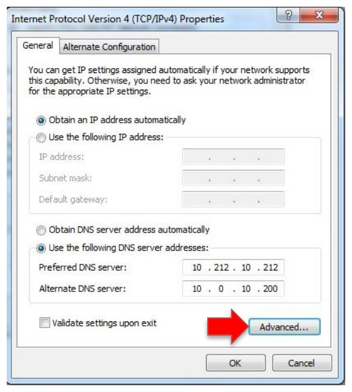

**Image analysis**

```json
{
 "image_name": "image84.jpeg",
 "rId": "rId97",
 "image_path": "img_folder/image_083_image84.jpg",
 "caption": "پنجره تنظیمات IPv4 ویندوز با وارد کردن DNS ترجیحی و جایگزین",
 "ocr_text": "Internet Protocol Version 4 (TCP/IPv4) Properties\nGeneral Alternate Configuration\nYou can get IP settings assigned automatically if your network supports this capability. Otherwise, you need to ask your network administrator for the appropriate IP settings.\nObtain an IP address automatically\nUse the following IP address:\nIP address:\nSubnet mask:\nDefault gateway:\nObtain DNS server address automatically\nUse the following DNS server addresses:\nPreferred DNS server: 10 . 212 . 10 . 212\nAlternate DNS server: 10 . 0 . 10 . 200\nValidate settings upon exit\nAdvanced...\nOK Cancel",
 "visual_description": [
 "اسکرین شات پنجره Internet Protocol Version 4 (TCP/IPv4) Properties با تب های General و Alternate Configuration",
 "گزینه Obtain an IP address automatically انتخاب شده و فیلدهای IP/Subnet/Default gateway غیرفعال هستند",
 "گزینه Use the following DNS server addresses انتخاب شده است",
 "Preferred DNS server برابر 10.212.10.212 نمایش داده می شود",
 "Alternate DNS server برابر 10.0.10.200 نمایش داده می شود",
 "یک فلش قرمز به دکمه Advanced... اشاره می کند"
 ],
 "image_type": "screenshot"
}
```

<!-- TABLE_START -->
| | |
| --- | --- |
| 10.212.10.212 | Preferred DNS Server |
| 10.0.10.200 | Alternate DNS Server |
| 10.160.240.200 | Third DNS Server |
<!-- TABLE_END -->

6. با توجه به اینکه در بانک سامان 3 سرور DNS با IP های متفاوت وجود دارد، برای اضافه کردن IP سوم، لازم است همانند تصویر زیر در پنجره ی
 Internet Protocol Version 4(TCP/IPv4) Properties روی دکمه Advanced کلیک نمایید:


**Image analysis**

```json
{
 "image_name": "image84.jpeg",
 "rId": "rId97",
 "image_path": "img_folder/image_083_image84.jpg",
 "caption": "پنجره تنظیمات IPv4 ویندوز با وارد کردن DNS ترجیحی و جایگزین",
 "ocr_text": "Internet Protocol Version 4 (TCP/IPv4) Properties\nGeneral Alternate Configuration\nYou can get IP settings assigned automatically if your network supports this capability. Otherwise, you need to ask your network administrator for the appropriate IP settings.\nObtain an IP address automatically\nUse the following IP address:\nIP address:\nSubnet mask:\nDefault gateway:\nObtain DNS server address automatically\nUse the following DNS server addresses:\nPreferred DNS server: 10 . 212 . 10 . 212\nAlternate DNS server: 10 . 0 . 10 . 200\nValidate settings upon exit\nAdvanced...\nOK Cancel",
 "visual_description": [
 "اسکرین شات پنجره Internet Protocol Version 4 (TCP/IPv4) Properties با تب های General و Alternate Configuration",
 "گزینه Obtain an IP address automatically انتخاب شده و فیلدهای IP/Subnet/Default gateway غیرفعال هستند",
 "گزینه Use the following DNS server addresses انتخاب شده است",
 "Preferred DNS server برابر 10.212.10.212 نمایش داده می شود",
 "Alternate DNS server برابر 10.0.10.200 نمایش داده می شود",
 "یک فلش قرمز به دکمه Advanced... اشاره می کند"
 ],
 "image_type": "screenshot"
}
```

7. در پنجره ای که گشوده می شود از تب DNS و بخش DNS server address, in order of use: روی دکمه Add کلیک کنید:

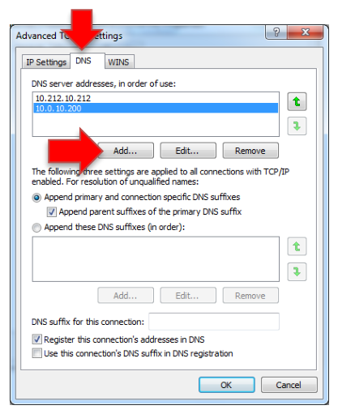

**Image analysis**

```json
{
 "image_name": "image85.png",
 "rId": "rId98",
 "image_path": "img_folder/image_084_image85.png",
 "caption": "پنجره Advanced TCP/IP Settings با تب DNS و فهرست آدرس های DNS",
 "ocr_text": "Advanced TCP/IP Settings\nIP Settings DNS WINS\nDNS server addresses, in order of use:\n10.212.10.212\n10.0.10.200\nAdd...\nEdit...\nRemove\nThe following three settings are applied to all connections with TCP/IP enabled. For resolution of unqualified names:\nAppend primary and connection specific DNS suffixes\nAppend parent suffixes of the primary DNS suffix\nAppend these DNS suffixes (in order):\nAdd...\nEdit...\nRemove\nDNS suffix for this connection:\nRegister this connection's addresses in DNS\nUse this connection's DNS suffix in DNS registration\nOK\nCancel",
 "visual_description": [
 "پنجره تنظیمات Advanced TCP/IP Settings در ویندوز با تب های IP Settings، DNS و WINS نمایش داده شده است",
 "در تب DNS، بخش «DNS server addresses, in order of use» شامل دو آدرس 10.212.10.212 و 10.0.10.200 است",
 "دکمه های Add...، Edit... و Remove برای مدیریت سرورهای DNS قابل مشاهده اند",
 "گزینه های مربوط به suffix شامل سه رادیوباتن و یک کادر متنی «DNS suffix for this connection» وجود دارد",
 "دو چک باکس «Register this connection's addresses in DNS» و «Use this connection's DNS suffix in DNS registration» دیده می شود",
 "دو فلش قرمز به قسمت تب DNS و لیست DNS server addresses اشاره می کنند"
 ],
 "image_type": "screenshot"
}
```

8. در پنجره بعدی، IP آدرس DNS سوم (Third DNS Server) را وارد و روی دکمه Add کلیک کنید:

**Third DNS Server : 10.160.240.200**

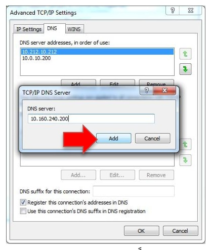

**Image analysis**

```json
{
 "image_name": "image86.jpeg",
 "rId": "rId99",
 "image_path": "img_folder/image_085_image86.jpg",
 "caption": "پنجره تنظیم DNS در Advanced TCP/IP Settings ویندوز با افزودن آدرس سرور DNS",
 "ocr_text": "Advanced TCP/IP Settings\nIP Settings DNS WINS\nDNS server addresses, in order of use:\n10.212.10.212\n10.0.10.200\nAdd Edit Remove\nTCP/IP DNS Server\nDNS server:\n10.160.240.200\nAdd Cancel\nDNS suffix for this connection:\nRegister this connection's addresses in DNS\nUse this connection's DNS suffix in DNS registration\nOK Cancel",
 "visual_description": [
 "اسکرین شات پنجره Advanced TCP/IP Settings با تب DNS فعال است",
 "لیست DNS server addresses شامل 10.212.10.212 و 10.0.10.200 است",
 "دیالوگ TCP/IP DNS Server نمایش داده شده و فیلد DNS server مقدار 10.160.240.200 دارد",
 "فلش قرمز به دکمه Add در دیالوگ اشاره می کند",
 "گزینه های Register this connection's addresses in DNS و Use this connection's DNS suffix in DNS registration قابل مشاهده اند",
 "دکمه های OK و Cancel در پایین پنجره اصلی دیده می شوند"
 ],
 "image_type": "screenshot"
}
```

9. بررسی نمایید که سه IP آدرس DNS دقیقاً به ترتیبی که در شکل زیر آورده شده اند باشند و در نهایت جهت اعمال تغییرات روی دکمه ی OK کلیک کنید:

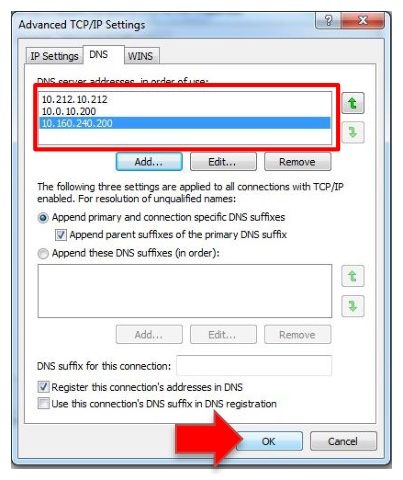

**Image analysis**

```json
{
 "image_name": "image87.jpeg",
 "rId": "rId100",
 "image_path": "img_folder/image_086_image87.jpg",
 "caption": "پنجره Advanced TCP/IP Settings در ویندوز با فهرست DNS سرورها و دکمه OK",
 "ocr_text": "Advanced TCP/IP Settings\nIP Settings DNS WINS\nDNS server addresses, in order of use:\n10.212.10.212\n10.0.10.200\n10.160.240.200\nAdd...\nEdit...\nRemove\nThe following three settings are applied to all connections with TCP/IP enabled. For resolution of unqualified names:\nAppend primary and connection specific DNS suffixes\nAppend parent suffixes of the primary DNS suffix\nAppend these DNS suffixes (in order):\nAdd...\nEdit...\nRemove\nDNS suffix for this connection:\nRegister this connection's addresses in DNS\nUse this connection's DNS suffix in DNS registration\nOK\nCancel",
 "visual_description": [
 "پنجره تنظیمات Advanced TCP/IP Settings با تب DNS فعال است",
 "سه آدرس DNS به ترتیب استفاده نمایش داده شده اند: 10.212.10.212، 10.0.10.200، 10.160.240.200",
 "دکمه های Add..., Edit..., Remove برای مدیریت DNS server addresses وجود دارد",
 "گزینه های Append primary and connection specific DNS suffixes و Append parent suffixes of the primary DNS suffix قابل انتخاب هستند",
 "گزینه Register this connection's addresses in DNS تیک خورده است و گزینه Use this connection's DNS suffix in DNS registration نیز تیک خورده است",
 "یک فلش قرمز به دکمه OK اشاره می کند و کادر قرمز دور بخش فهرست DNS کشیده شده است"
 ],
 "image_type": "screenshot"
}
```

**در صورت وجود مغایرت، DNS ها را مطابق ترتیب زیر وارد نمایید:**

**: Preferred DNS Server: 10.212.10.212اول**

**Alternate DNS Server: 10.0.10.200: دوم**

**Third DNS Server: 10.160.240.200: سوم**

10. در پنجره ی زیر روی دکمه ی OK کلیک کنید:

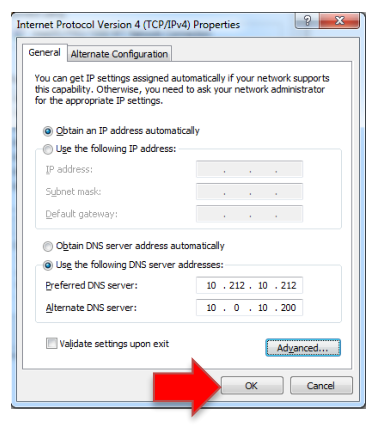

**Image analysis**

```json
{
 "image_name": "image88.png",
 "rId": "rId101",
 "image_path": "img_folder/image_087_image88.png",
 "caption": "پنجره تنظیمات IPv4 با واردکردن DNS ترجیحی و جایگزین و دکمه OK",
 "ocr_text": "Internet Protocol Version 4 (TCP/IPv4) Properties\nGeneral Alternate Configuration\nYou can get IP settings assigned automatically if your network supports this capability. Otherwise, you need to ask your network administrator for the appropriate IP settings.\nObtain an IP address automatically\nUse the following IP address:\nIP address:\nSubnet mask:\nDefault gateway:\nObtain DNS server address automatically\nUse the following DNS server addresses:\nPreferred DNS server:\n10 . 212 . 10 . 212\nAlternate DNS server:\n10 . 0 . 10 . 200\nValidate settings upon exit\nAdvanced...\nOK\nCancel",
 "visual_description": [
 "اسکرین شات پنجره Windows با عنوان Internet Protocol Version 4 (TCP/IPv4) Properties",
 "تب های General و Alternate Configuration نمایش داده شده اند",
 "گزینه Use the following DNS server addresses فعال است",
 "Preferred DNS server برابر 10.212.10.212 و Alternate DNS server برابر 10.0.10.200 وارد شده اند",
 "فلش قرمز بزرگ به دکمه OK اشاره می کند"
 ],
 "image_type": "screenshot"
}
```

11. روی دکمه ی Close کلیک کنید:

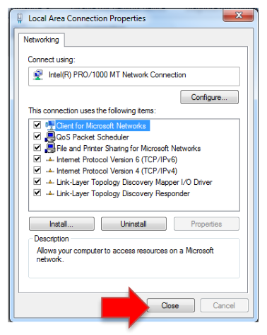

**Image analysis**

```json
{
 "image_name": "image89.png",
 "rId": "rId102",
 "image_path": "img_folder/image_088_image89.png",
 "caption": "پنجره ویژگی های اتصال شبکه محلی با فهرست اجزای شبکه و دکمه Close",
 "ocr_text": "Local Area Connection Properties\nNetworking\nConnect using:\nIntel(R) PRO/1000 MT Network Connection\nConfigure...\nThis connection uses the following items:\nClient for Microsoft Networks\nQoS Packet Scheduler\nFile and Printer Sharing for Microsoft Networks\nInternet Protocol Version 6 (TCP/IPv6)\nInternet Protocol Version 4 (TCP/IPv4)\nLink-Layer Topology Discovery Mapper I/O Driver\nLink-Layer Topology Discovery Responder\nInstall...\nUninstall\nProperties\nDescription\nAllows your computer to access resources on a Microsoft network.\nClose\nCancel",
 "visual_description": [
 "اسکرین شات پنجره Windows با عنوان Local Area Connection Properties در تب Networking",
 "کادر Connect using مقدار Intel(R) PRO/1000 MT Network Connection را نشان می دهد و دکمه Configure... دارد",
 "فهرست اجزا با چک باکس شامل Client for Microsoft Networks، QoS Packet Scheduler، File and Printer Sharing، IPv6، IPv4، LLTD Mapper I/O Driver و LLTD Responder",
 "دکمه های Install...، Uninstall و Properties در پایین فهرست دیده می شوند",
 "بخش Description متن «Allows your computer to access resources on a Microsoft network.» را نمایش می دهد",
 "فلش قرمز به دکمه Close در پایین پنجره اشاره می کند؛ دکمه Cancel کنار آن است"
 ],
 "image_type": "screenshot"
}
```

پس از پایان اعمال تنظیمات شبکه، در صورت نمایش پیغام زیر، روی دکمه ی Yes کلیک کنید:

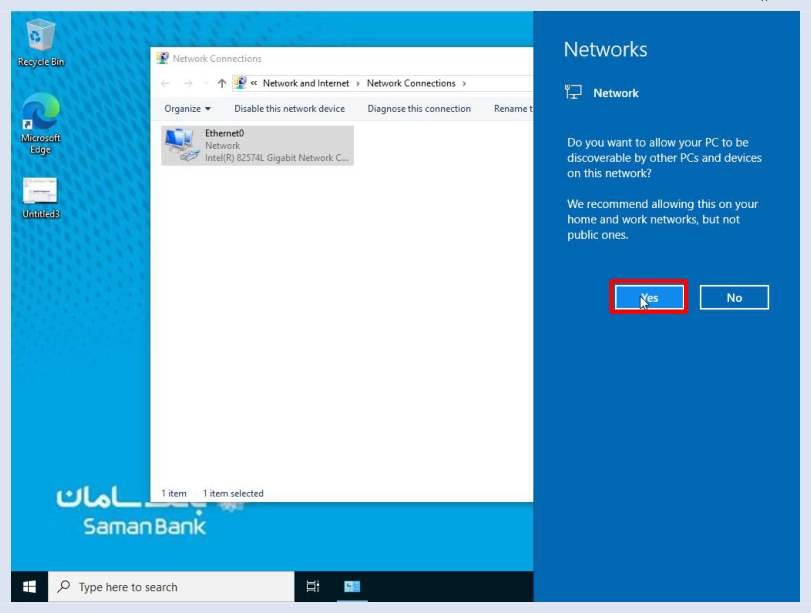

**Image analysis**

```json
{
 "image_name": "image90.png",
 "rId": "rId103",
 "image_path": "img_folder/image_089_image90.png",
 "caption": "پنجره Networks ویندوز برای قابل کشف بودن در شبکه با دکمه های Yes و No",
 "ocr_text": "Recycle Bin\nMicrosoft Edge\nUntitled3\nNetwork Connections\nNetwork and Internet > Network Connections\nOrganize\nDisable this network device\nDiagnose this connection\nRename t\nEthernet0\nNetwork\nIntel(R) 82574L Gigabit Network C...\nNetworks\nNetwork\nDo you want to allow your PC to be discoverable by other PCs and devices on this network?\nWe recommend allowing this on your home and work networks, but not public ones.\nYes\nNo\nسامان\nSamanBank\n1 item\n1 item selected\nType here to search",
 "visual_description": [
 "اسکرین شات ویندوز با پنجره Network Connections و یک آداپتور Ethernet0 نمایش داده شده است",
 "پنل سمت راست با عنوان Networks سؤال discoverable بودن سیستم را نشان می دهد",
 "دو دکمه Yes و No در پنل Networks وجود دارد و دکمه Yes با کادر قرمز مشخص شده است",
 "در دسکتاپ آیکن های Recycle Bin و Microsoft Edge دیده می شود",
 "نوار وظیفه شامل کادر جستجو با متن Type here to search است"
 ],
 "image_type": "screenshot"
}
```

پس از تنظیم IP های اعلام شده، جهت اطمینان از برقراری ارتباط، دستور Ping یکی از IPهای DNS را اجرا و پاسخ را بررسی کنید.

## 5. کارت گرافیک

1. **درصورتی که IPC دستگاه از نوع 5G می باشد (دستگاه Eastcom 285 DZ)**، عدد 2 را جهت نصب درایور کارت گرافیک در منوی Set Tools Config، وارد و سپس کلیدEnter را فشار دهید:


**Image analysis**

```json
{
 "image_name": "image80.png",
 "rId": "rId93",
 "image_path": "img_folder/image_079_image80.png",
 "caption": "صفحه تنظیمات ابزار با گزینه های تنظیم IP ویندوز و نصب درایور گرافیک PC5G",
 "ocr_text": "Administrator: ::Bank Saman ATM Config::\n\n::Set Tools Config::\n\n1- Windows IP Config 2- Install PC5G Graphic Driver\n\nType x and Press Enter to go Main Menu\n\nType Number and Press Enter:",
 "visual_description": [
 "پنجره کنسولی با عنوان «Administrator: ::Bank Saman ATM Config::» نمایش داده شده است",
 "عنوان منو «::Set Tools Config::» در مرکز صفحه دیده می شود",
 "دو گزینه منو وجود دارد: «1- Windows IP Config» و «2- Install PC5G Graphic Driver»",
 "دستور «Type x and Press Enter to go Main Menu» برای بازگشت به منوی اصلی نمایش داده شده است",
 "پرامپت «Type Number and Press Enter:» در پایین صفحه دیده می شود",
 "یک فلش قرمز به سمت گزینه «1- Windows IP Config» اشاره می کند"
 ],
 "image_type": "screenshot"
}
```

2. پس از گذشت چند ثانیه، مراحل نصب با نمایش پنجره زیر آغاز خواهد شد؛ مراحل نصب را همانند تصاویر زیر ادامه دهید:

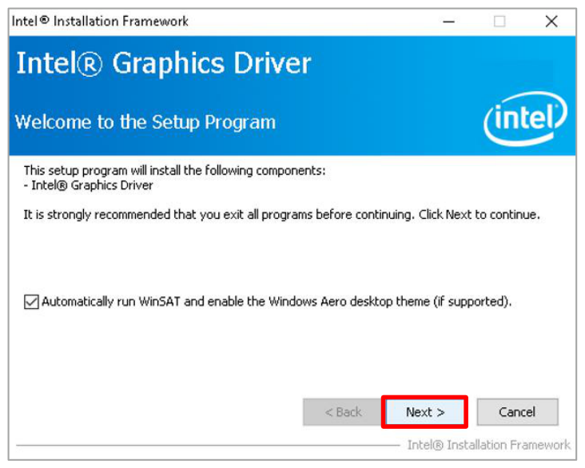

**Image analysis**

```json
{
 "image_name": "image91.tmp",
 "rId": "rId104",
 "image_path": "img_folder/image_090_image91.png",
 "caption": "صفحه خوش آمدگویی نصب درایور گرافیک اینتل با دکمه Next مشخص شده",
 "ocr_text": "Intel® Installation Framework\nIntel® Graphics Driver\nWelcome to the Setup Program\nThis setup program will install the following components:\n- Intel® Graphics Driver\nIt is strongly recommended that you exit all programs before continuing. Click Next to continue.\nAutomatically run WinSAT and enable the Windows Aero desktop theme (if supported).\n< Back\nNext >\nCancel\nIntel® Installation Framework",
 "visual_description": [
 "پنجره نصب با عنوان Intel® Installation Framework نمایش داده شده است",
 "تیتر اصلی Intel® Graphics Driver و متن Welcome to the Setup Program قابل مشاهده است",
 "لیست مؤلفه های نصب شامل Intel® Graphics Driver است",
 "یک چک باکس با متن Automatically run WinSAT and enable the Windows Aero desktop theme (if supported). دیده می شود",
 "دکمه های < Back، Next > و Cancel در پایین پنجره وجود دارد",
 "دکمه Next > با کادر قرمز برجسته شده است",
 "لوگوی intel در سمت راست نوار آبی نمایش داده شده است"
 ],
 "image_type": "screenshot"
}
```

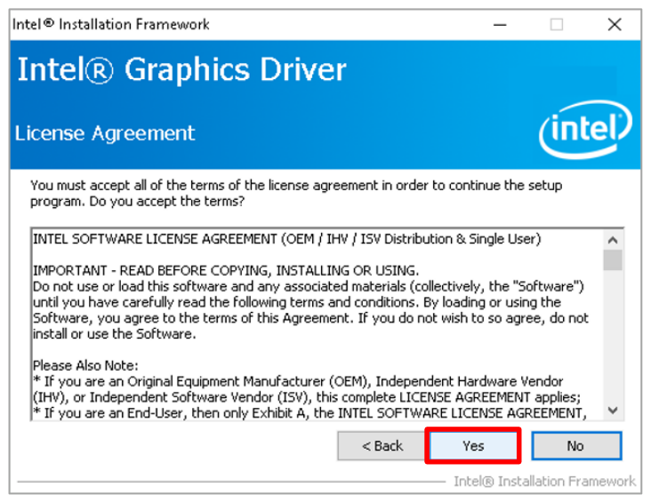

**Image analysis**

```json
{
 "image_name": "image92.tmp",
 "rId": "rId105",
 "image_path": "img_folder/image_091_image92.png",
 "caption": "پنجره توافق نامه مجوز نصب درایور گرافیک اینتل با دکمه های Yes و No",
 "ocr_text": "Intel® Installation Framework\nIntel® Graphics Driver\nLicense Agreement\nYou must accept all of the terms of the license agreement in order to continue the setup program. Do you accept the terms?\nINTEL SOFTWARE LICENSE AGREEMENT (OEM / IHV / ISV Distribution & Single User)\nIMPORTANT - READ BEFORE COPYING, INSTALLING OR USING.\nDo not use or load this software and any associated materials (collectively, the \"Software\")\nuntil you have carefully read the following terms and conditions. By loading or using the\nSoftware, you agree to the terms of this Agreement. If you do not wish to so agree, do not\ninstall or use the Software.\nPlease Also Note:\n* If you are an Original Equipment Manufacturer (OEM), Independent Hardware Vendor\n(IHV), or Independent Software Vendor (ISV), this complete LICENSE AGREEMENT applies;\n* If you are an End-User, then only Exhibit A, the INTEL SOFTWARE LICENSE AGREEMENT,\n< Back\nYes\nNo\nIntel® Installation Framework",
 "visual_description": [
 "اسکرین شات پنجره Intel Installation Framework برای Intel Graphics Driver",
 "بخش License Agreement و متن قرارداد مجوز در کادر اسکرول دار نمایش داده شده است",
 "سه دکمه پایین پنجره: < Back، Yes، No",
 "دکمه Yes با کادر قرمز برجسته شده است",
 "لوگوی intel در سمت راست بالای پنجره قرار دارد"
 ],
 "image_type": "screenshot"
}
```

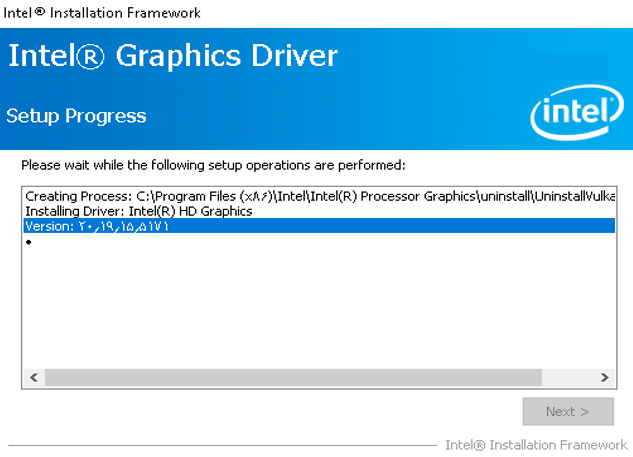

**Image analysis**

```json
{
 "image_name": "image93.tmp",
 "rId": "rId106",
 "image_path": "img_folder/image_092_image93.png",
 "caption": "پنجره نصب درایور گرافیک اینتل با نمایش روند نصب و نسخه درایور",
 "ocr_text": "Intel® Installation Framework\nIntel® Graphics Driver\nSetup Progress\nPlease wait while the following setup operations are performed:\nCreating Process: C:\\Program Files (x86)\\Intel\\Intel(R) Processor Graphics\\uninstall\\UninstallVulke\nInstalling Driver: Intel(R) HD Graphics\nVersion: 20.19.15.4531\nNext >\nIntel® Installation Framework",
 "visual_description": [
 "اسکرین شات یک پنجره نصب با عنوان Intel® Graphics Driver و بخش Setup Progress است",
 "متن وضعیت شامل Creating Process با مسیر C:\\Program Files (x86)\\Intel\\Intel(R) Processor Graphics\\uninstall\\UninstallVulke نمایش داده شده است",
 "خط Installing Driver: Intel(R) HD Graphics در لیست عملیات دیده می شود",
 "شماره نسخه Version: 20.19.15.4531 نمایش داده شده است",
 "دکمه Next > در پایین سمت راست غیرفعال (خاکستری) دیده می شود",
 "نوار پیمایش افقی در پایین کادر لیست عملیات وجود دارد"
 ],
 "image_type": "screenshot"
}
```

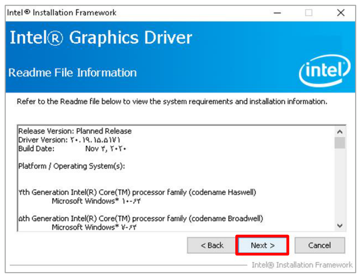

**Image analysis**

```json
{
 "image_name": "image94.tmp",
 "rId": "rId107",
 "image_path": "img_folder/image_093_image94.png",
 "caption": "پنجره نصب Intel Graphics Driver با اطلاعات Readme و دکمه Next مشخص شده",
 "ocr_text": "Intel® Installation Framework\nIntel® Graphics Driver\nReadme File Information\nintel\nRefer to the Readme file below to view the system requirements and installation information.\nRelease Version: Planned Release\nDriver Version: ٢٠.١٩.١٥.٤١٧١\nBuild Date: Nov ٤, ٢٠١٥\nPlatform / Operating System(s):\n4th Generation Intel(R) Core(TM) processor family (codename Haswell)\nMicrosoft Windows* 10-64\n5th Generation Intel(R) Core(TM) processor family (codename Broadwell)\nMicrosoft Windows* 7-64\n< Back\nNext >\nCancel\nIntel® Installation Framework",
 "visual_description": [
 "پنجره نصب با عنوان Intel® Installation Framework نمایش داده شده است",
 "هدر آبی شامل متن Intel® Graphics Driver و لوگوی intel است",
 "بخش Readme File Information و توضیح مشاهده نیازمندی ها و اطلاعات نصب دیده می شود",
 "کادر متنی اسکرول دار شامل Release Version، Driver Version و Build Date است",
 "مقادیر قابل مشاهده: Driver Version: ٢٠.١٩.١٥.٤١٧١ و Build Date: Nov ٤, ٢٠١٥",
 "لیست Platform/Operating System(s) شامل Haswell و Broadwell و Microsoft Windows* 10-64 و 7-64 است",
 "دکمه های < Back، Next > و Cancel در پایین پنجره وجود دارد",
 "دکمه Next > با کادر قرمز برجسته شده است"
 ],
 "image_type": "screenshot"
}
```

در این مرحله نصب، هر دو مانیتور دستگاه، شناسایی و فعال خواهند شد و ممکن است ادامه عملیات نصب، در مانیتور دیگر نمایش داده شود.

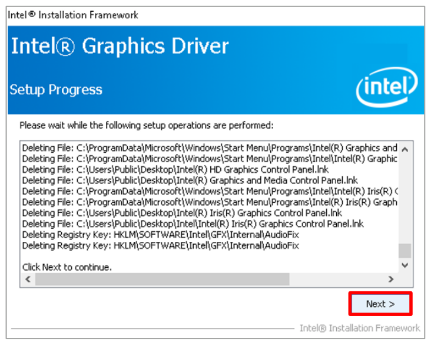

**Image analysis**

```json
{
 "image_name": "image95.tmp",
 "rId": "rId108",
 "image_path": "img_folder/image_094_image95.png",
 "caption": "پنجره Setup Progress نصب/حذف درایور Intel Graphics با فهرست فایل ها و کلیدهای رجیستری",
 "ocr_text": "Intel® Installation Framework\nIntel® Graphics Driver\nSetup Progress\nPlease wait while the following setup operations are performed:\nDeleting File: C:\\ProgramData\\Microsoft\\Windows\\Start Menu\\Programs\\Intel(R) Graphics and\nDeleting File: C:\\ProgramData\\Microsoft\\Windows\\Start Menu\\Programs\\Intel\\Intel(R) Graphic\nDeleting File: C:\\Users\\Public\\Desktop\\Intel(R) HD Graphics Control Panel.lnk\nDeleting File: C:\\Users\\Public\\Desktop\\Intel(R) Graphics and Media Control Panel.lnk\nDeleting File: C:\\ProgramData\\Microsoft\\Windows\\Start Menu\\Programs\\Intel\\Intel(R) Iris(R) G\nDeleting File: C:\\ProgramData\\Microsoft\\Windows\\Start Menu\\Programs\\Intel\\Intel(R) Iris(R) Graphi\nDeleting File: C:\\Users\\Public\\Desktop\\Intel(R) Iris(R) Graphics Control Panel.lnk\nDeleting File: C:\\Users\\Public\\Desktop\\Intel(R) Iris(R) Graphics Control Panel.lnk\nDeleting Registry Key: HKLM\\SOFTWARE\\Intel\\GFX\\Internal\\AudioFix\nDeleting Registry Key: HKLM\\SOFTWARE\\Intel\\GFX\\Internal\\AudioFix\nClick Next to continue.\nNext >\nIntel® Installation Framework\nintel",
 "visual_description": [
 "پنجره Intel® Installation Framework برای Intel® Graphics Driver نمایش داده شده است",
 "بخش Setup Progress لیست عملیات حذف فایل ها و حذف کلیدهای رجیستری را نشان می دهد",
 "مسیرهای ویندوز مانند C:\\ProgramData\\Microsoft\\Windows\\Start Menu\\Programs\\ و C:\\Users\\Public\\Desktop\\ دیده می شوند",
 "دکمه Next > در پایین سمت راست وجود دارد"
 ],
 "image_type": "screenshot"
}
```

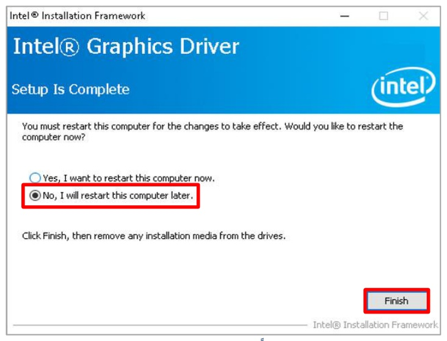

**Image analysis**

```json
{
 "image_name": "image96.jpg",
 "rId": "rId109",
 "image_path": "img_folder/image_095_image96.jpg",
 "caption": "پنجره پایان نصب درایور گرافیک اینتل با گزینه های راه اندازی مجدد و دکمه Finish",
 "ocr_text": "Intel® Installation Framework\nIntel® Graphics Driver\nSetup Is Complete\nYou must restart this computer for the changes to take effect. Would you like to restart the computer now?\nYes, I want to restart this computer now.\nNo, I will restart this computer later.\nClick Finish, then remove any installation media from the drives.\nFinish\nIntel® Installation Framework",
 "visual_description": [
 "پنجره نصب «Intel® Graphics Driver» با وضعیت «Setup Is Complete» نمایش داده شده است.",
 "پیام نیاز به Restart برای اعمال تغییرات قابل مشاهده است.",
 "دو گزینه رادیویی برای ریستارت اکنون یا بعداً وجود دارد.",
 "گزینه «No, I will restart this computer later.» با کادر قرمز مشخص شده است.",
 "دکمه «Finish» در پایین سمت راست با کادر قرمز مشخص شده است."
 ],
 "image_type": "screenshot"
}
```

***در پنجره فوق حتماً باید گزینه ی دوم را انتخاب کنید.***

3. در منوی اصلی نرم افزار Set ATM Config، عدد 4 یعنی 4- Set Config and Reset را جهت اعمال تنظیمات نهایی و سپس Restart دستگاه وارد و سپس کلید Enter را فشار دهید:

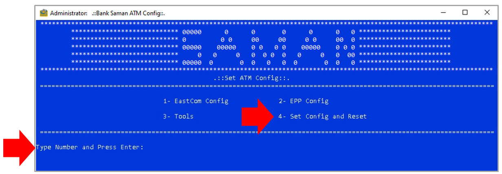

**Image analysis**

```json
{
 "image_name": "image97.jpg",
 "rId": "rId110",
 "image_path": "img_folder/image_096_image97.jpg",
 "caption": "منوی تنظیمات ATM بانک سامان با گزینه های EastCom، EPP، Tools و Set Config and Reset",
 "ocr_text": "Administrator: ::Bank Saman ATM Config::\n\n:::Set ATM Config::\n\n1- EastCom Config 2- EPP Config\n\n3- Tools 4- Set Config and Reset\n\nType Number and Press Enter:",
 "visual_description": [
 "پنجره کنسولی با پس زمینه آبی و عنوان «Administrator: ::Bank Saman ATM Config::» نمایش داده شده است",
 "بخش مرکزی عنوان «:::Set ATM Config::» دارد",
 "چهار گزینه منو با شماره های 1 تا 4 شامل «EastCom Config»، «EPP Config»، «Tools»، «Set Config and Reset» دیده می شود",
 "پایین صفحه پیام «Type Number and Press Enter:» برای ورود شماره گزینه نمایش داده شده است",
 "دو فلش قرمز روی تصویر قرار دارد: یکی سمت چپ پایین و دیگری به سمت گزینه 4 اشاره می کند"
 ],
 "image_type": "screenshot"
}
```

با انجام تنظیمات فوق دستگاه Restart می شود و سپس سیستم عامل لود خواهد شد.

4. پس از انجام Restart و نمایش پنجره زیر با فشار کلیدهای Ctrl+Alt+Delete وارد محیطی خواهید شد که امکان درج یوزر اکانت و پسورد فراهم خواهد بود:

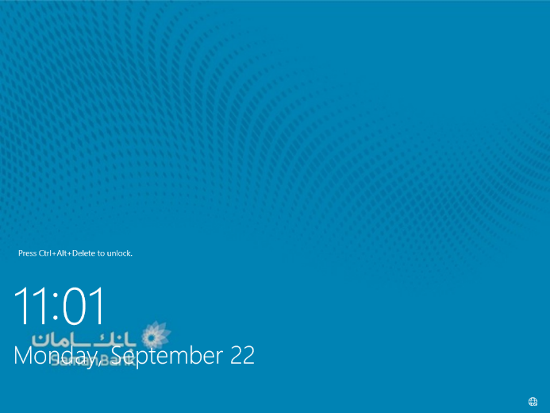

**Image analysis**

```json
{
 "image_name": "image98.png",
 "rId": "rId111",
 "image_path": "img_folder/image_097_image98.png",
 "caption": "صفحه قفل ویندوز با نمایش ساعت و تاریخ و پیام Ctrl+Alt+Delete",
 "ocr_text": "Press Ctrl+Alt+Delete to unlock.\n11:01\nMonday, September 22",
 "visual_description": [
 "نمایش پیام «Press Ctrl+Alt+Delete to unlock.» در بالای سمت چپ",
 "نمایش ساعت «11:01» در پایین سمت چپ",
 "نمایش تاریخ «Monday, September 22» در پایین سمت چپ",
 "پس زمینه آبی با الگوی نقطه ای موج دار",
 "آیکون کوچک در گوشه پایین راست دیده می شود"
 ],
 "image_type": "screenshot"
}
```

5. جهت ورود به محیط سیستم عامل لازم است نام کاربری و رمز عبور زیر را وارد نمایید:

<!-- TABLE_START -->
| | |
| --- | --- |
| نام کاربری | ATMUser |
| رمز عبور | ZXCvbn@123 |
<!-- TABLE_END -->

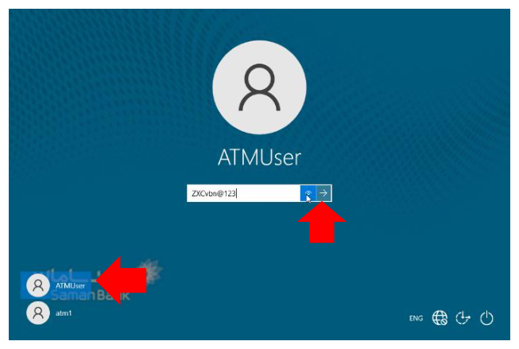

**Image analysis**

```json
{
 "image_name": "image99.png",
 "rId": "rId112",
 "image_path": "img_folder/image_098_image99.png",
 "caption": "صفحه ورود ویندوز با نام کاربری ATMUser و وارد کردن گذرواژه",
 "ocr_text": "ATMUser\nZXCvbn@123|\nATMUser\natm1\nENG",
 "visual_description": [
 "نمای صفحه ورود با آیکون کاربر و نام کاربری «ATMUser» در مرکز",
 "یک کادر ورود گذرواژه با متن «ZXCvbn@123|» قابل مشاهده است",
 "دکمه پیکان (→) در انتهای کادر گذرواژه دیده می شود",
 "دو حساب کاربری در پایین چپ نمایش داده شده اند: «ATMUser» و «atm1»",
 "برچسب زبان «ENG» در پایین راست دیده می شود",
 "آیکون های شبکه، دسترسی پذیری و پاور در پایین راست وجود دارند",
 "دو فلش قرمز روی دکمه ورود و بخش انتخاب کاربر اشاره می کنند"
 ],
 "image_type": "screenshot"
}
```

نکته مهم: پس از ورود به سیستم عامل، ProBase اجرا می شود و عملیات
به روزرسانی Firmware قطعات را به اجرا خواهد گذاشت؛ حتماً جهت ادامه فرایند نصب نرم افزار لازم است تا پایان عملیات فوق و بسته شدن پنجره ی زیر صبر کنید:

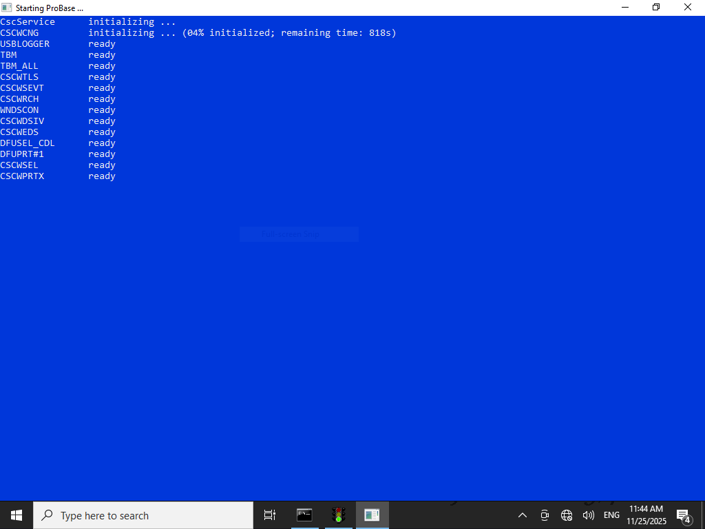

**Image analysis**

```json
{
 "image_name": "image100.PNG",
 "rId": "rId113",
 "image_path": "img_folder/image_099_image100.png",
 "caption": "نمایش وضعیت راه اندازی ProBase و سرویس ها با درصد پیشرفت و زمان باقی مانده",
 "ocr_text": "Starting ProBase ...\n\nCSCService initializing ...\nCSCWCFG initializing ... (04% initialized; remaining time: 818s)\nUSBLOGGER ready\nTBM ready\nTBM_ALL ready\nCSCCTLS ready\nCSCWSEVT ready\nCSCWRCH ready\nWNDSCON ready\nCSCWSDIV ready\nCSCWSDS ready\nDFUSEL_CDL ready\nDFUDRTH1 ready\nCSCWSEL ready\nCSCWPRTY ready\nCSCWPRTX ready\n\nFull-screen Snip\n\nType here to search\nENG\n11:44 AM\n5/14/2020",
 "visual_description": [
 "پنجره کنسول با پس زمینه آبی و متن سفید برای راه اندازی ProBase",
 "نمایش درصد پیشرفت 04% و زمان باقی مانده 818s برای CSCWCFG",
 "فهرست چند سرویس با وضعیت ready و چند مورد initializing",
 "نوار وظیفه ویندوز با ساعت 11:44 AM و تاریخ 5/14/2020 و زبان ENG"
 ],
 "image_type": "screenshot"
}
```

# تنظیم صفحه نمایش در خودپردازهای دارای پنل اپراتوری تاچ

SOP جدید با نام «پنل اپراتوری (SOP مدل BA80) جدید» شناخته می شود. در صورت نصب این مدل روی دستگاه های خودپرداز مدل EastCom 285 و 8050، در حین راه اندازی لازم است فایل نصب درایور آن که SOP\_BA80\_eGalaxy Touch نام دارد را از مسیر C:\ATM\UTILITY\Driver در حالت
Run as administrator اجرا و با مراجعه به دستورالعمل SOPBA80 نصب کنید. درصورتی که مدل نصب شده، از نوع قدیمی بود نیازی به نصب درایور نخواهد بود.

<!-- TABLE_START -->
| | |
| --- | --- |
|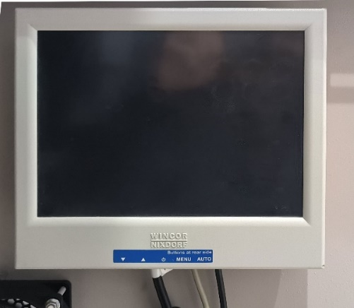

**Image analysis**

```json
{
 "image_name": "image101.jpeg",
 "rId": "rId114",
 "image_path": "img_folder/image_100_image101.jpg",
 "caption": "نمایشگر خاموش با لوگوی WINCOR NIXDORF و برچسب دکمه های MENU و AUTO",
 "ocr_text": "WINCOR\nNIXDORF\nButtons at rear side\nMENU AUTO",
 "visual_description": [
 "نمایشگر با قاب نقره ای و صفحه خاموش/تیره",
 "لوگوی «WINCOR NIXDORF» در مرکز پایین قاب دیده می شود",
 "برچسب آبی در پایین با متن «Buttons at rear side» و گزینه های «MENU» و «AUTO»",
 "دو کابل از پایین دستگاه خارج شده اند"
 ],
 "image_type": "photo"
}
``` |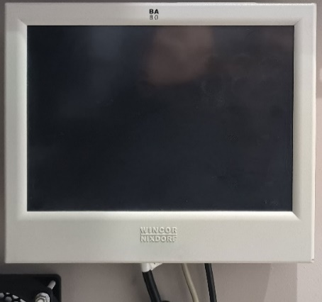

**Image analysis**

```json
{
 "image_name": "image102.jpeg",
 "rId": "rId115",
 "image_path": "img_folder/image_101_image102.jpg",
 "caption": "نمایشگر صنعتی وینکور نیکسدورف با برچسب BA 80",
 "ocr_text": "BA\n80\nWINCOR\nNIXDORF",
 "visual_description": [
 "قاب نمایشگر با حاشیه سفید و صفحه خاموش/تیره دیده می شود",
 "متن «BA» و «80» در بالای قاب چاپ شده است",
 "لوگوی برجسته «WINCOR NIXDORF» در پایین قاب قرار دارد",
 "چند کابل از زیر نمایشگر خارج شده اند"
 ],
 "image_type": "photo"
}
``` |
| **مدل قدیمی** | **مدل جدید** |
<!-- TABLE_END -->

**تفاوت مدل SOPBA80 قدیمی و جدید:** در SOPBA80 جدید در قسمت بالایی پنل اپراتوری عبارت BA80 درج گردیده است. این در حالی است که در مدل قدیمی این عبارت وجود ندارد:

<!-- TABLE_START -->
| |
| --- |
|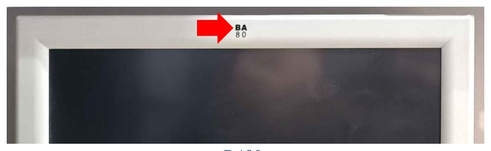

**Image analysis**

```json
{
 "image_name": "image103.jpg",
 "rId": "rId116",
 "image_path": "img_folder/image_102_image103.jpg",
 "caption": "نشانگر با فلش قرمز و متن BA 80 روی قاب نمایشگر",
 "ocr_text": "BA\n80",
 "visual_description": [
 "فلش قرمز به یک برچسب کوچک روی قاب بالایی نمایشگر اشاره می کند",
 "متن «BA» در بالا و «80» زیر آن روی قاب سفید دیده می شود",
 "قسمت داخلی تصویر یک پنل/نمایشگر تیره رنگ است"
 ],
 "image_type": "photo"
}
``` |
| **مدل جدید: درج عبارت BA80 در قسمت فوقانی پنل** |
|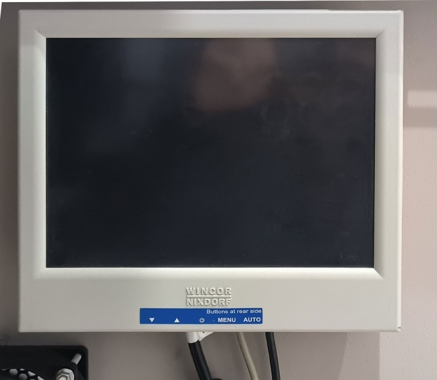

**Image analysis**

```json
{
 "image_name": "image104.jpeg",
 "rId": "rId117",
 "image_path": "img_folder/image_103_image104.jpg",
 "caption": "نمایشگر صنعتی با برچسب WINCOR NIXDORF و دکمه های MENU و AUTO",
 "ocr_text": "WINCOR\nNIXDORF\nButtons at rear side\nMENU\nAUTO",
 "visual_description": [
 "یک مانیتور با قاب خاکستری و صفحه نمایش خاموش/تیره دیده می شود",
 "روی بدنه زیر نمایشگر متن برجسته «WINCOR NIXDORF» وجود دارد",
 "برچسب آبی زیر نمایشگر شامل متن «Buttons at rear side» و کلمات «MENU» و «AUTO» است",
 "چند کابل از زیر نمایشگر خارج شده اند"
 ],
 "image_type": "photo"
}
``` |
| **مدل قدیمی** |
<!-- TABLE_END -->

در صورت تعویض SOP لازم است تنظیمات مانیتور را مجدداً انجام دهید.

## تنظیم مانیتور: سری Eastcom 285DY و Eastcom 285DZ

2. جهت تنظیم مانیتور های دستگاه، از طریق یکی از مسیر های زیر، پنجره Display Settings را بگشایید:

* در منوی Start کلمه ی display settings را تایپ و همانند تصویر زیر در قسمت بالایی منوی استارت، روی Display Settings کلیک کنید:

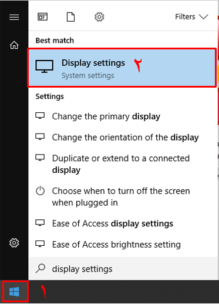

**Image analysis**

```json
{
 "image_name": "image105.tmp",
 "rId": "rId118",
 "image_path": "img_folder/image_104_image105.png",
 "caption": "پنجره جستجوی تنظیمات ویندوز با نتیجه «Display settings» هایلایت شده",
 "ocr_text": "Filters\nBest match\nDisplay settings\nSystem settings\nSettings\nChange the primary display\nChange the orientation of the display\nDuplicate or extend to a connected display\nChoose when to turn off the screen when plugged in\nEase of Access display settings\nEase of Access brightness setting\ndisplay settings",
 "visual_description": [
 "اسکرین شات منوی Start/جستجوی ویندوز با بخش Best match",
 "گزینه «Display settings» با پس زمینه آبی انتخاب شده و زیرنویس «System settings» دارد",
 "فهرست نتایج شامل مواردی مانند Change the primary display و Duplicate or extend to a connected display است",
 "کادرهای قرمز دور نتیجه انتخاب شده و آیکون ویندوز پایین چپ دیده می شود",
 "یک عدد «۲» قرمز و یک علامت/نشان قرمز نزدیک پایین چپ روی تصویر وجود دارد"
 ],
 "image_type": "screenshot"
}
```

* روی قسمتی خالی از دسکتاپ راست کلیک کنید و از منویی که گشوده می شود،
 Display Settings را انتخاب نمایید:

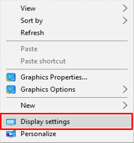

**Image analysis**

```json
{
 "image_name": "image106.tmp",
 "rId": "rId119",
 "image_path": "img_folder/image_105_image106.png",
 "caption": "منوی راست کلیک ویندوز با گزینه های Display settings و Personalize مشخص شده",
 "ocr_text": "View\nSort by\nRefresh\nPaste\nPaste shortcut\nGraphics Properties...\nGraphics Options\nNew\nDisplay settings\nPersonalize",
 "visual_description": [
 "اسکرین شات منوی زمینه ویندوز با گزینه های View، Sort by، Refresh، Paste، Paste shortcut، Graphics Properties...، Graphics Options، New، Display settings و Personalize",
 "گزینه «Display settings» داخل یک کادر مستطیلی قرمز هایلایت شده است",
 "بین برخی گزینه ها خطوط جداکننده افقی خاکستری دیده می شود",
 "در سمت راست گزینه های View، Sort by، Graphics Options و New فلش زیرمنو وجود دارد"
 ],
 "image_type": "screenshot"
}
```

پنجره ی Display Settings گشوده خواهد شد:

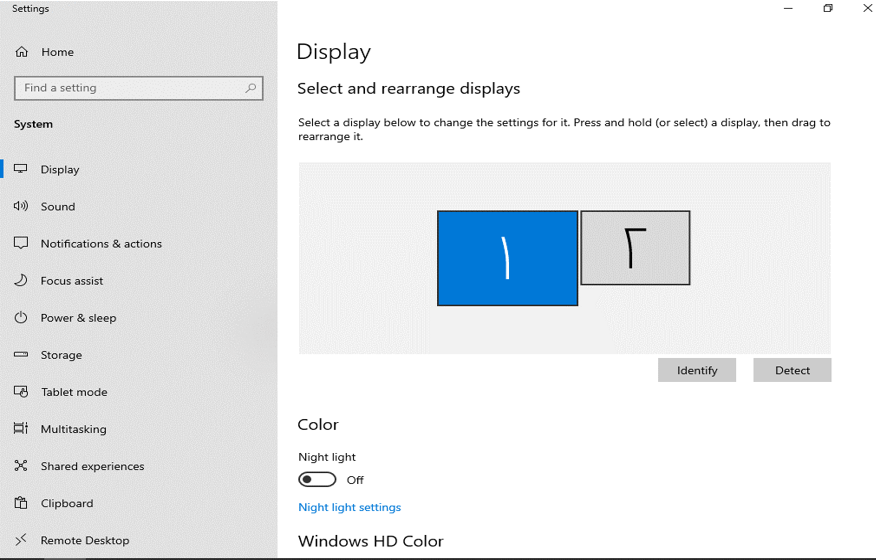

**Image analysis**

```json
{
 "image_name": "image107.tmp",
 "rId": "rId120",
 "image_path": "img_folder/image_106_image107.png",
 "caption": "صفحه تنظیمات نمایش ویندوز برای چیدمان مانیتورها و گزینه Night light",
 "ocr_text": "Settings\nHome\nFind a setting\nSystem\nDisplay\nSound\nNotifications & actions\nFocus assist\nPower & sleep\nStorage\nTablet mode\nMultitasking\nShared experiences\nClipboard\nRemote Desktop\nDisplay\nSelect and rearrange displays\nSelect a display below to change the settings for it. Press and hold (or select) a display, then drag to rearrange it.\nIdentify\nDetect\nColor\nNight light\nOff\nNight light settings\nWindows HD Color",
 "visual_description": [
 "اسکرین شات پنجره Settings ویندوز در بخش System > Display",
 "نمایش دو مانیتور با برچسب های «1» و «2» برای چیدمان",
 "دکمه های «Identify» و «Detect» در بخش نمایشگرها دیده می شود",
 "بخش Color شامل گزینه Night light با وضعیت Off است",
 "لینک «Night light settings» و عنوان «Windows HD Color» قابل مشاهده است"
 ],
 "image_type": "screenshot"
}
```

در این پنجره، با کلیک روی دکمه ی Identify، شماره ی هر مانیتور روی صفحه ی آن به نمایش گذاشته خواهد شد.

<!-- TABLE_START -->
| | |
| --- | --- |
|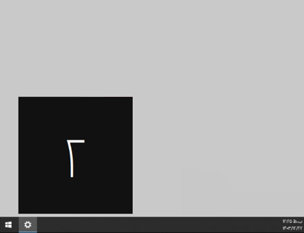

**Image analysis**

```json
{
 "image_name": "image108.jpg",
 "rId": "rId121",
 "image_path": "img_folder/image_107_image108.jpg",
 "caption": "نوار وظیفه ویندوز با ساعت و تاریخ و منوی استارت باز",
 "ocr_text": "10:52 AM\n5/20/2016",
 "visual_description": [
 "نمایش نوار وظیفه ویندوز در پایین تصویر",
 "منوی استارت در سمت چپ پایین باز است",
 "آیکن های ویندوز و تنظیمات در گوشه چپ نوار وظیفه دیده می شوند",
 "ساعت و تاریخ در گوشه راست نوار وظیفه نمایش داده شده است"
 ],
 "image_type": "screenshot"
}
``` **مانیتور SOP** |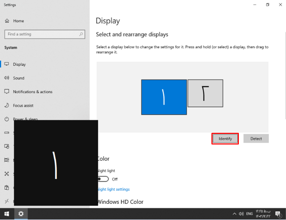

**Image analysis**

```json
{
 "image_name": "image109.tmp",
 "rId": "rId122",
 "image_path": "img_folder/image_108_image109.png",
 "caption": "پنجره تنظیمات نمایش ویندوز با دو مانیتور و دکمه های Identify و Detect",
 "ocr_text": "Settings\nHome\nFind a setting\nSystem\nDisplay\nSound\nNotifications & actions\nFocus assist\nPower & sleep\nDisplay\nSelect and rearrange displays\nSelect a display below to change the settings for it. Press and hold (or select) a display, then drag to rearrange it.\n1\n2\nIdentify\nDetect\nNight light\nOff\nNight light settings\nWindows HD Color\nENG",
 "visual_description": [
 "اسکرین شات از Settings ویندوز در بخش System > Display",
 "نمایش دو مستطیل مانیتور با برچسب های 1 و 2 برای چیدمان نمایشگرها",
 "وجود دکمه های Identify و Detect در سمت راست بخش نمایشگرها",
 "گزینه Night light با وضعیت Off و لینک Night light settings قابل مشاهده است",
 "عنوان Windows HD Color در پایین صفحه دیده می شود"
 ],
 "image_type": "screenshot"
}
``` **مانیتور مشتری** |
<!-- TABLE_END -->

2. مانیتور SOP را باید به عنوان مانیتور شماره 2 تعیین نمایید؛ برای این منظور، مانیتور **شماره 2** را انتخاب و سپس در انتهای صفحه، گزینه ی «Make This My Main Display» را فعال نمایید:

<!-- TABLE_START -->
| | |
| --- | --- |
|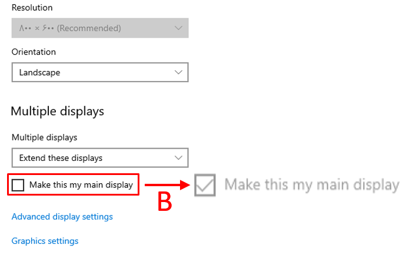

**Image analysis**

```json
{
 "image_name": "image110.tmp",
 "rId": "rId123",
 "image_path": "img_folder/image_109_image110.png",
 "caption": "اسکرین شات تنظیمات نمایش ویندوز با گزینه «Make this my main display» و فلش قرمز",
 "ocr_text": "Resolution\n8٠٠× 6٠٠ (Recommended)\nOrientation\nLandscape\nMultiple displays\nMultiple displays\nExtend these displays\nMake this my main display\nB\nMake this my main display\nAdvanced display settings\nGraphics settings",
 "visual_description": [
 "اسکرین شات از بخش Display settings ویندوز با گزینه های Resolution، Orientation و Multiple displays",
 "گزینه Orientation روی Landscape نشان داده شده است",
 "در بخش Multiple displays مقدار «Extend these displays» انتخاب شده است",
 "چک باکس «Make this my main display» در سمت چپ بدون تیک نمایش داده شده است",
 "فلش قرمز به سمت یک چک باکس تیک خورده خاکستری در سمت راست اشاره می کند",
 "حرف «B» قرمز زیر فلش برای برچسب گذاری دیده می شود",
 "لینک های «Advanced display settings» و «Graphics settings» در پایین قابل مشاهده اند"
 ],
 "image_type": "screenshot"
}
``` |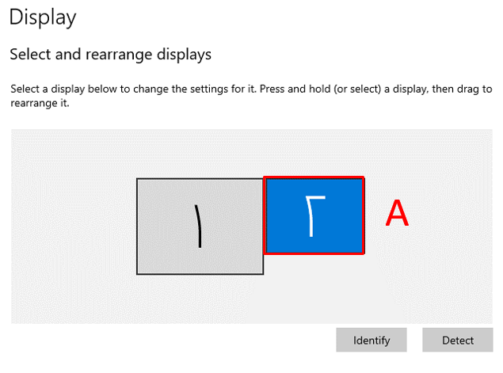

**Image analysis**

```json
{
 "image_name": "image111.tmp",
 "rId": "rId124",
 "image_path": "img_folder/image_110_image111.png",
 "caption": "صفحه تنظیمات Display ویندوز برای انتخاب و جابه جایی نمایشگرها",
 "ocr_text": "Display\n\nSelect and rearrange displays\n\nSelect a display below to change the settings for it. Press and hold (or select) a display, then drag to rearrange it.\n\nIdentify\nDetect\n\nA",
 "visual_description": [
 "اسکرین شات بخش Display با عنوان «Select and rearrange displays»",
 "دو مستطیل نمایشگر شماره 1 (خاکستری) و 2 (آبی) برای چینش نمایشگرها نمایش داده شده اند",
 "نمایشگر 2 با کادر قرمز مشخص شده است",
 "دو دکمه «Identify» و «Detect» در پایین سمت راست دیده می شود",
 "حرف «A» قرمز در سمت راست تصویر قرار دارد"
 ],
 "image_type": "screenshot"
}
``` |
<!-- TABLE_END -->

3. جهت نمایش پنجره های باز شده، روی منوی SOP، تصویر 2 را به سمت چپ و 1 را به سمت راست انتقال دهید:

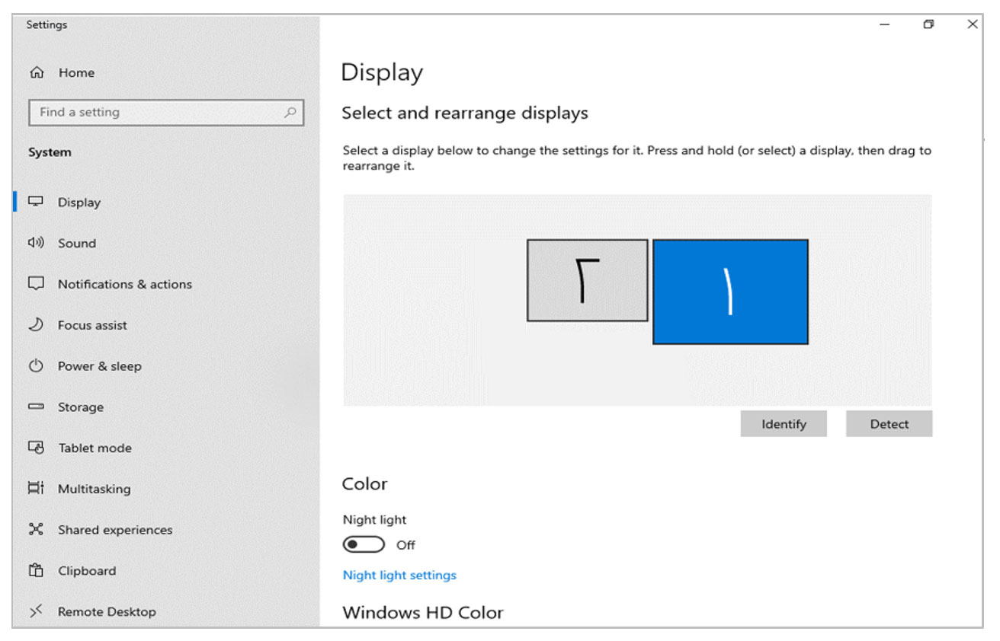

**Image analysis**

```json
{
 "image_name": "image112.jpg",
 "rId": "rId125",
 "image_path": "img_folder/image_111_image112.jpg",
 "caption": "صفحه تنظیمات Display ویندوز با دو نمایشگر و گزینه های Identify و Night light",
 "ocr_text": "Settings\nHome\nFind a setting\nSystem\nDisplay\nSound\nNotifications & actions\nFocus assist\nPower & sleep\nStorage\nTablet mode\nMultitasking\nShared experiences\nClipboard\nRemote Desktop\nDisplay\nSelect and rearrange displays\nSelect a display below to change the settings for it. Press and hold (or select) a display, then drag to rearrange it.\nIdentify\nDetect\nColor\nNight light\nOff\nNight light settings\nWindows HD Color",
 "visual_description": [
 "اسکرین شات از Settings ویندوز بخش System > Display",
 "دو مستطیل نمایشگر برای چیدمان نمایشگرها با برچسب های ۲ و ۱ نمایش داده شده اند",
 "دکمه های Identify و Detect زیر بخش چیدمان نمایشگرها وجود دارد",
 "در بخش Color گزینه Night light با وضعیت Off و لینک Night light settings دیده می شود",
 "عنوان Windows HD Color در پایین صفحه قابل مشاهده است",
 "نوار ناوبری سمت چپ شامل گزینه هایی مانند Display، Sound، Notifications & actions و Remote Desktop است"
 ],
 "image_type": "screenshot"
}
```

# ساخت درایو D

از کل ظرفیت هارددیسک دستگاه که سیستم عامل در آن نصب می باشد، باید 202 گیگابایت به پارتیشن C و مابقی به پارتیشن D - محل ذخیره سازی تصاویر و ... - اختصاص داده شده باشد. **لازم به ذکر است، در صورت وجود هارد دوم، لازم است لیبل پارتیشن حاوی تصاویر در هارد دوم را به F تغییر دهید و
System reserved و پاتیشنC هارد دوم را حذف نمایید.**

وجود پارتیشن D الزامی است.

حتماً لازم است فلش یا هارد اکسترنال آدونیسی را از دستگاه جدا کنید.

**فقط در صورت نبودن پارتیشن D مراحل زیر را انجام دهید، در غیر این صورت به قسمت بعد مراجعه نمایید:**

1. **نحوه ورود:** در گوشه ی پایین سمت چپ صفحه روی دکمه ی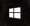

**Image analysis**

```json
{
 "image_name": "image113.tmp",
 "rId": "rId126",
 "image_path": "img_folder/image_112_image113.png",
 "caption": "آیکون سفید ویندوز روی پس زمینه تیره",
 "ocr_text": "",
 "visual_description": [
 "یک لوگوی چهارقسمتی شبیه پنجره در رنگ سفید دیده می شود",
 "پس زمینه تصویر یکدست و تیره است"
 ],
 "image_type": "unknown"
}
``` کلیک کنید تا منوی Start نمایان شود.
2. عبارت Computer Management را تایپ و همانند تصویر زیر، روی Computer Management کلیک نمایید:

**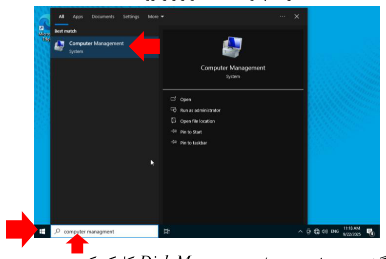

**Image analysis**

```json
{
 "image_name": "image114.png",
 "rId": "rId127",
 "image_path": "img_folder/image_113_image114.png",
 "caption": "نمای جستجوی ویندوز برای Computer Management و گزینه های اجرای آن",
 "ocr_text": "All\nApps\nDocuments\nSettings\nMore\nBest match\nComputer Management\nSystem\nComputer Management\nSystem\nOpen\nRun as administrator\nOpen file location\nPin to Start\nPin to taskbar\ncomputer managment\nENG\n11:18 AM\n8/22/2015",
 "visual_description": [
 "اسکرین شات از منوی Start ویندوز با نتیجه جستجوی «Computer Management» در بخش Best match",
 "پنل سمت راست گزینه های «Open»، «Run as administrator»، «Open file location»، «Pin to Start»، «Pin to taskbar» را نشان می دهد",
 "کادر جستجو در پایین شامل متن تایپ شده «computer managment» است",
 "سه فلش قرمز روی دکمه Start، کادر جستجو و نتیجه «Computer Management» قرار گرفته اند",
 "نوار وظیفه زبان «ENG» و زمان «11:18 AM» و تاریخ «8/22/2015» را نمایش می دهد"
 ],
 "image_type": "screenshot"
}
```**

3. در پنجره ای که گشوده می شود روی Disk Management کلیک کنید:

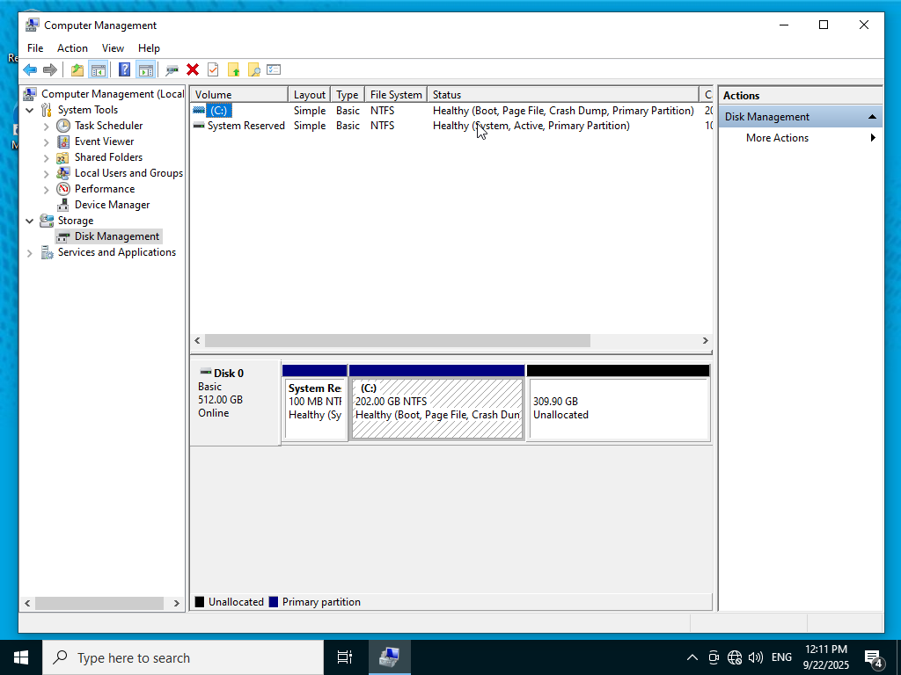

**Image analysis**

```json
{
 "image_name": "image115.png",
 "rId": "rId128",
 "image_path": "img_folder/image_114_image115.png",
 "caption": "نمای Disk Management در Computer Management با پارتیشن C و فضای Unallocated",
 "ocr_text": "Computer Management\nFile Action View Help\nComputer Management (Local)\nSystem Tools\nTask Scheduler\nEvent Viewer\nShared Folders\nLocal Users and Groups\nPerformance\nDevice Manager\nStorage\nDisk Management\nServices and Applications\nVolume\nLayout\nType\nFile System\nStatus\n(C:)\nSimple\nBasic\nNTFS\nHealthy (Boot, Page File, Crash Dump, Primary Partition)\nSystem Reserved\nSimple\nBasic\nNTFS\nHealthy (System, Active, Primary Partition)\nActions\nDisk Management\nMore Actions\nDisk 0\nBasic\n512.00 GB\nOnline\nSystem Re\n100 MB NTFS\nHealthy (Sy\n(C:)\n202.00 GB NTFS\nHealthy (Boot, Page File, Crash Du\n309.90 GB\nUnallocated\nUnallocated\nPrimary partition\nType here to search\nENG\n12:11 PM\n1/21/2019",
 "visual_description": [
 "پنجره Computer Management با بخش Storage > Disk Management انتخاب شده است",
 "Disk 0 با نوع Basic و ظرفیت 512.00 GB و وضعیت Online نمایش داده شده است",
 "پارتیشن System Reserved با اندازه 100 MB و فایل سیستم NTFS و وضعیت Healthy (System, Active, Primary Partition) دیده می شود",
 "درایو (C:) با اندازه 202.00 GB و فایل سیستم NTFS و وضعیت Healthy (Boot, Page File, Crash Dump, Primary Partition) نمایش داده شده است",
 "بخش 309.90 GB با وضعیت Unallocated در انتهای دیسک نشان داده شده است",
 "راهنمای رنگ پایین پنجره شامل Unallocated و Primary partition است"
 ],
 "image_type": "screenshot"
}
```

4. **در نصب اولیه نرم افزار،** درصورتی که به جای پارتیشن D، قسمتی از هارد به صورت Unallocated (همانند تصویر) مشخص شده است، روی آن راست کلیک کنید و از منویی که گشوده می شود،
 New Simple Volume … را انتخاب کنید:

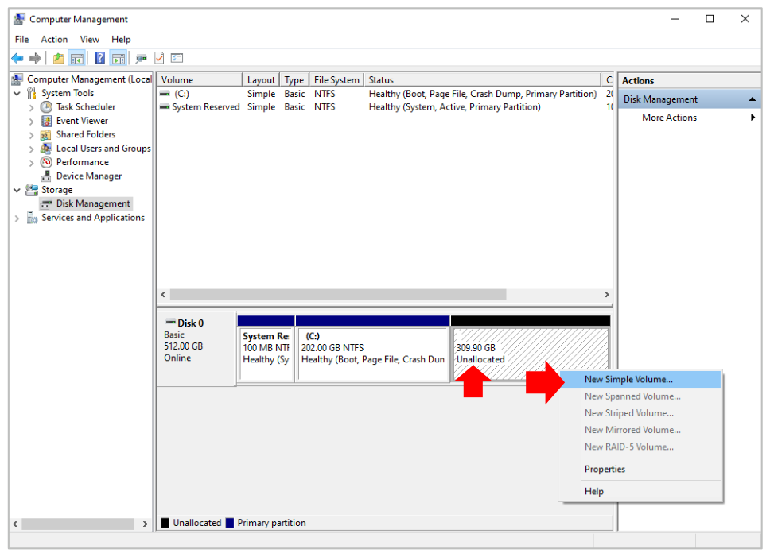

**Image analysis**

```json
{
 "image_name": "image116.png",
 "rId": "rId129",
 "image_path": "img_folder/image_115_image116.png",
 "caption": "نمای Disk Management ویندوز با فضای Unallocated و منوی ساخت New Simple Volume",
 "ocr_text": "Computer Management\nFile Action View Help\nComputer Management (Local)\nSystem Tools\nTask Scheduler\nEvent Viewer\nShared Folders\nLocal Users and Groups\nPerformance\nDevice Manager\nStorage\nDisk Management\nServices and Applications\nVolume\nLayout\nType\nFile System\nStatus\n(C:)\nSimple\nBasic\nNTFS\nHealthy (Boot, Page File, Crash Dump, Primary Partition)\nSystem Reserved\nSimple\nBasic\nNTFS\nHealthy (System, Active, Primary Partition)\nActions\nDisk Management\nMore Actions\nDisk 0\nBasic\n512.00 GB\nOnline\nSystem Re\n100 MB NT\nHealthy (Sy\n(C:)\n202.00 GB NTFS\nHealthy (Boot, Page File, Crash Dun\n309.90 GB\nUnallocated\nNew Simple Volume...\nNew Spanned Volume...\nNew Striped Volume...\nNew Mirrored Volume...\nNew RAID-5 Volume...\nProperties\nHelp\nUnallocated\nPrimary partition",
 "visual_description": [
 "پنجره Computer Management باز است و بخش Disk Management انتخاب شده است.",
 "Disk 0 با نوع Basic و ظرفیت 512.00 GB و وضعیت Online نمایش داده می شود.",
 "دو پارتیشن NTFS دیده می شود: System Reserved (100 MB) و (C:) (202.00 GB).",
 "یک بخش 309.90 GB با وضعیت Unallocated وجود دارد.",
 "منوی راست کلیک روی فضای Unallocated باز است و گزینه New Simple Volume... هایلایت شده است.",
 "دو فلش قرمز به سمت گزینه New Simple Volume... اشاره می کنند."
 ],
 "image_type": "screenshot"
}
```

در صورت انجام نصب مجدد نرم افزار، نیازی به انجام این مرحله و مراحل بعدی نخواهد بود؛ به مرحله ی 10 بروید.

اگر لیبل D به پارتیشن دیگری نظیر فلش، هارد اکسترنال آدونیسی یا هارد اینترنال دوم تخصیص داده شده است به مرحله 13 بروید و پس از انجام تغییرات مجدداً این مرحله را انجام دهید.

5. در پنجره ای که باز می شود روی Next کلیک کنید:

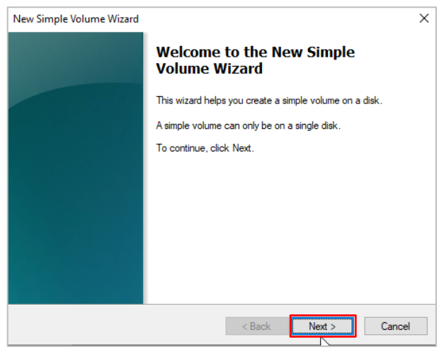

**Image analysis**

```json
{
 "image_name": "image117.png",
 "rId": "rId130",
 "image_path": "img_folder/image_116_image117.png",
 "caption": "پنجره New Simple Volume Wizard ویندوز با پیام خوش آمدگویی و دکمه Next هایلایت شده",
 "ocr_text": "New Simple Volume Wizard\nWelcome to the New Simple\nVolume Wizard\nThis wizard helps you create a simple volume on a disk.\nA simple volume can only be on a single disk.\nTo continue, click Next.\n< Back\nNext >\nCancel",
 "visual_description": [
 "اسکرین شات یک پنجره ویزارد با عنوان «New Simple Volume Wizard»",
 "متن راهنما درباره ایجاد simple volume روی یک دیسک و درخواست کلیک روی Next نمایش داده شده است",
 "دکمه های «< Back»، «Next >» و «Cancel» در پایین پنجره وجود دارند",
 "دکمه «Next >» با کادر قرمز مشخص شده است"
 ],
 "image_type": "screenshot"
}
```

6. در حالیکه همانند تصویر مقدار باقیمانده ی ظرفیت پارتیشن در کادر Simple volume size in MB به نمایش گذاشته شده است روی دکمه ی Next کلیک نمایید:

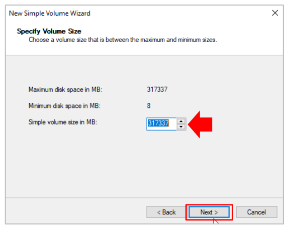

**Image analysis**

```json
{
 "image_name": "image118.png",
 "rId": "rId131",
 "image_path": "img_folder/image_117_image118.png",
 "caption": "پنجره New Simple Volume Wizard برای تعیین اندازه ولوم و دکمه Next",
 "ocr_text": "New Simple Volume Wizard\nSpecify Volume Size\nChoose a volume size that is between the maximum and minimum sizes.\n\nMaximum disk space in MB:\n317337\n\nMinimum disk space in MB:\n8\n\nSimple volume size in MB:\n317337\n\n< Back\nNext >\nCancel",
 "visual_description": [
 "پنجره تنظیم اندازه ولوم با عنوان New Simple Volume Wizard نمایش داده شده است",
 "بخش Specify Volume Size دارای توضیح انتخاب اندازه بین حداقل و حداکثر است",
 "مقدار Maximum disk space in MB برابر 317337 نمایش داده شده است",
 "مقدار Minimum disk space in MB برابر 8 نمایش داده شده است",
 "فیلد Simple volume size in MB مقدار 317337 را با اسپین باکس (فلش بالا/پایین) نشان می دهد",
 "یک پیکان قرمز به سمت فیلد اندازه ولوم اشاره می کند",
 "دکمه Next > در پایین پنجره با کادر قرمز برجسته شده است و کنار آن < Back و Cancel دیده می شود"
 ],
 "image_type": "screenshot"
}
```

7. در پنجره زیر حتماً باید در قسمت Assign the following drive letter: حرف D انتخاب شده باشد؛ در صورت مغایرت، حرف D را انتخاب و روی دکمه ی Next کلیک کنید:

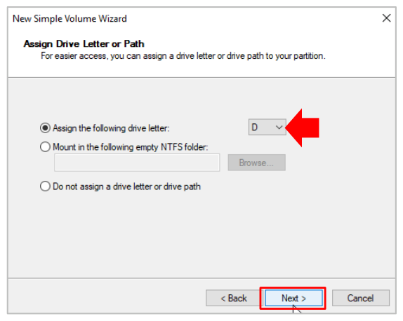

**Image analysis**

```json
{
 "image_name": "image119.png",
 "rId": "rId132",
 "image_path": "img_folder/image_118_image119.png",
 "caption": "پنجره New Simple Volume Wizard برای انتخاب حرف درایو و دکمه Next مشخص شده است.",
 "ocr_text": "New Simple Volume Wizard\nAssign Drive Letter or Path\nFor easier access, you can assign a drive letter or drive path to your partition.\nAssign the following drive letter:\nD\nMount in the following empty NTFS folder:\nBrowse...\nDo not assign a drive letter or drive path\n< Back\nNext >\nCancel",
 "visual_description": [
 "پنجره ویزارد ویندوز با عنوان New Simple Volume Wizard نمایش داده شده است.",
 "بخش Assign Drive Letter or Path شامل سه گزینه رادیویی است.",
 "گزینه Assign the following drive letter فعال است و منوی کشویی حرف درایو روی D قرار دارد.",
 "گزینه Mount in the following empty NTFS folder دارای کادر مسیر غیرفعال و دکمه Browse... غیرفعال است.",
 "گزینه Do not assign a drive letter or drive path قابل انتخاب است.",
 "فلش قرمز به منوی کشویی انتخاب حرف درایو اشاره می کند.",
 "دکمه Next > با کادر قرمز برجسته شده است و کنار آن < Back و Cancel وجود دارد."
 ],
 "image_type": "screenshot"
}
```

8. در این مرحله:

* در صورت انجام نصب اولیه نرم افزار حتماً باید گزینه ی
 Format this volume with the following setting: انتخاب شده باشد:

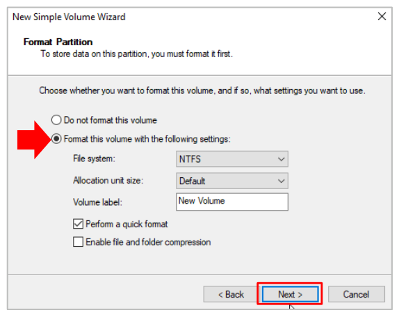

**Image analysis**

```json
{
 "image_name": "image120.png",
 "rId": "rId133",
 "image_path": "img_folder/image_119_image120.png",
 "caption": "مرحله Format Partition در ویزارد ساخت Volume با انتخاب NTFS و دکمه Next",
 "ocr_text": "New Simple Volume Wizard\nFormat Partition\nTo store data on this partition, you must format it first.\nChoose whether you want to format this volume, and if so, what settings you want to use.\nDo not format this volume\nFormat this volume with the following settings:\nFile system:\nNTFS\nAllocation unit size:\nDefault\nVolume label:\nNew Volume\nPerform a quick format\nEnable file and folder compression\n< Back\nNext >\nCancel",
 "visual_description": [
 "پنجره New Simple Volume Wizard در مرحله Format Partition نمایش داده شده است",
 "گزینه رادیویی «Format this volume with the following settings:» انتخاب شده است",
 "File system روی NTFS تنظیم شده است",
 "Allocation unit size روی Default تنظیم شده است",
 "Volume label برابر New Volume است",
 "چک باکس Perform a quick format تیک خورده است",
 "چک باکس Enable file and folder compression بدون تیک است",
 "فلش قرمز به گزینه فرمت کردن اشاره می کند",
 "دکمه Next > با کادر قرمز مشخص شده است"
 ],
 "image_type": "screenshot"
}
```

* در صورت نصب مجدد نرم افزار و وجود اطلاعات مهم در پارتیشن D نیازی به فعال نمودن این گزینه نیست.

روی دکمه ی Next کلیک نمایید.

9. روی دکمه ی Finish کلیک کنید تا عملیات ساخت پارتیشن D پایان پذیرد:

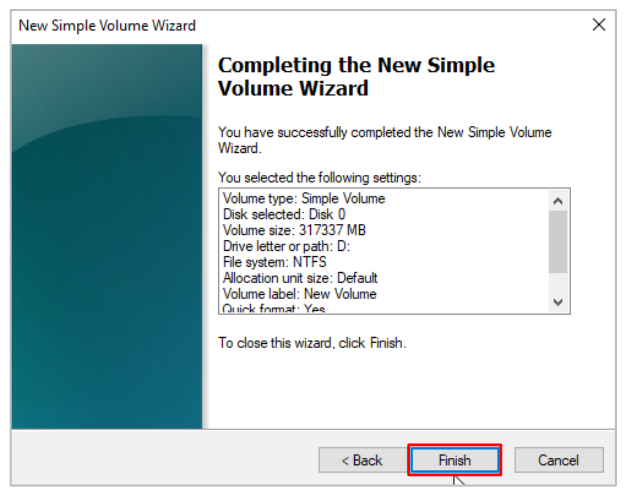

**Image analysis**

```json
{
 "image_name": "image121.png",
 "rId": "rId134",
 "image_path": "img_folder/image_120_image121.png",
 "caption": "پایان ویزارد ساخت Simple Volume با تنظیمات NTFS و درایو D:",
 "ocr_text": "New Simple Volume Wizard\nCompleting the New Simple\nVolume Wizard\nYou have successfully completed the New Simple Volume\nWizard.\nYou selected the following settings:\nVolume type: Simple Volume\nDisk selected: Disk 0\nVolume size: 317337 MB\nDrive letter or path: D:\nFile system: NTFS\nAllocation unit size: Default\nVolume label: New Volume\nQuick format: Yes\nTo close this wizard, click Finish.\n< Back\nFinish\nCancel",
 "visual_description": [
 "پنجره New Simple Volume Wizard در مرحله Completing نمایش داده شده است.",
 "لیست تنظیمات شامل Volume type: Simple Volume و Disk selected: Disk 0 است.",
 "Volume size برابر 317337 MB نمایش داده شده است.",
 "Drive letter یا path برابر D:\\ نمایش داده شده است.",
 "File system برابر NTFS و Allocation unit size برابر Default است.",
 "Volume label برابر New Volume و Quick format برابر Yes است.",
 "دکمه Finish با کادر قرمز برجسته شده و کنار آن دکمه های < Back و Cancel دیده می شوند."
 ],
 "image_type": "screenshot"
}
```

10. **در صورت انجام عملیات نصب مجدد نرم افزار** و عدم تخصیص لیبل به پارتیشن D، همانند تصویر زیر، روی پارتیشن بدون لیبل راست کلیک و سپس از منویی که گشوده می شود
 Change Drive Letter and Paths ... را انتخاب نمایید:

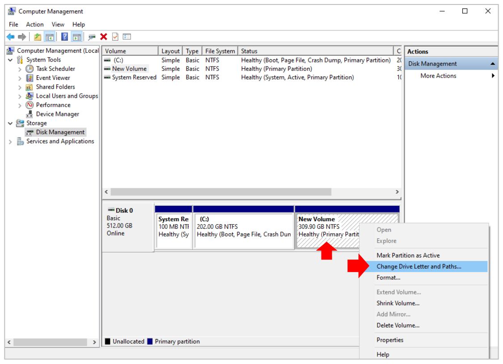

**Image analysis**

```json
{
 "image_name": "image122.png",
 "rId": "rId135",
 "image_path": "img_folder/image_121_image122.png",
 "caption": "نمای Disk Management ویندوز با منوی راست کلیک برای تغییر حرف درایو",
 "ocr_text": "Computer Management\nFile Action View Help\nComputer Management (Local)\nSystem Tools\nTask Scheduler\nEvent Viewer\nShared Folders\nLocal Users and Groups\nPerformance\nDevice Manager\nStorage\nDisk Management\nServices and Applications\nVolume\nLayout\nType\nFile System\nStatus\n(C:)\nSimple\nBasic\nNTFS\nHealthy (Boot, Page File, Crash Dump, Primary Partition)\nNew Volume\nSimple\nBasic\nNTFS\nHealthy (Primary Partition)\nSystem Reserved\nSimple\nBasic\nNTFS\nHealthy (System, Active, Primary Partition)\nActions\nDisk Management\nMore Actions\nDisk 0\nBasic\n512.00 GB\nOnline\nSystem Re\n100 MB NTFS\nHealthy (Sy\n(C:)\n202.00 GB NTFS\nHealthy (Boot, Page File, Crash Dun\nNew Volume\n309.90 GB NTFS\nHealthy (Primary Parti\nOpen\nExplore\nMark Partition as Active\nChange Drive Letter and Paths...\nFormat...\nExtend Volume...\nShrink Volume...\nAdd Mirror...\nDelete Volume...\nProperties\nHelp\nUnallocated\nPrimary partition",
 "visual_description": [
 "اسکرین شات از Computer Management > Storage > Disk Management",
 "Disk 0 با وضعیت Basic، ظرفیت 512.00 GB و حالت Online نمایش داده شده است",
 "پارتیشن ها شامل System Reserved (100 MB NTFS)، درایو (C:) (202.00 GB NTFS) و New Volume (309.90 GB NTFS) هستند",
 "منوی راست کلیک روی New Volume باز است و گزینه \"Change Drive Letter and Paths...\" هایلایت شده",
 "دو فلش قرمز به بخش New Volume و گزینه منو اشاره می کنند"
 ],
 "image_type": "screenshot"
}
```

11. در پنجره زیر روی Add کلیک نمایید:

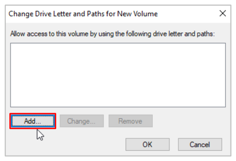

**Image analysis**

```json
{
 "image_name": "image123.png",
 "rId": "rId136",
 "image_path": "img_folder/image_122_image123.png",
 "caption": "پنجره تغییر حرف درایو و مسیرها در ویندوز با دکمه Add مشخص شده است",
 "ocr_text": "Change Drive Letter and Paths for New Volume\nAllow access to this volume by using the following drive letter and paths:\nAdd...\nChange...\nRemove\nOK\nCancel",
 "visual_description": [
 "پنجره محاوره ای ویندوز با عنوان «Change Drive Letter and Paths for New Volume» نمایش داده شده است",
 "یک کادر لیست خالی برای نمایش حرف درایو/مسیرها وجود دارد",
 "دکمه «Add...» با کادر قرمز مشخص شده و نشانگر ماوس نزدیک آن است",
 "دکمه های «Change...»، «Remove»، «OK» و «Cancel» قابل مشاهده اند"
 ],
 "image_type": "screenshot"
}
```

12. در پنجره ای که گشوده می شود در قسمت Assign the following drive letter:، لیبل D را انتخاب و سپس بر روی دکمه ی OK و مجدداً OK کلیک نمایید:

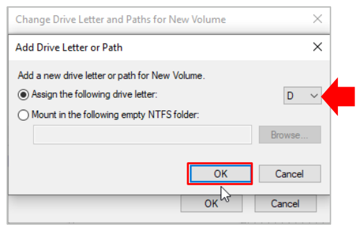

**Image analysis**

```json
{
 "image_name": "image124.png",
 "rId": "rId137",
 "image_path": "img_folder/image_123_image124.png",
 "caption": "پنجره تغییر حرف درایو با انتخاب D و دکمه OK مشخص شده",
 "ocr_text": "Change Drive Letter and Paths for New Volume\nAdd Drive Letter or Path\nAdd a new drive letter or path for New Volume.\nAssign the following drive letter:\nD\nMount in the following empty NTFS folder:\nBrowse...\nOK\nCancel\nOK\nCancel",
 "visual_description": [
 "پنجره ویندوز با عنوان «Change Drive Letter and Paths for New Volume» نمایش داده شده است",
 "گزینه رادیویی «Assign the following drive letter:» انتخاب شده است",
 "یک فهرست کشویی برای انتخاب حرف درایو با مقدار «D» دیده می شود",
 "گزینه «Mount in the following empty NTFS folder:» وجود دارد و انتخاب نشده است",
 "دکمه «Browse...» در حالت غیرفعال (خاکستری) نمایش داده شده است",
 "دکمه های «OK» و «Cancel» در پایین پنجره وجود دارند",
 "یک کادر قرمز دور دکمه «OK» کشیده شده است",
 "یک فلش قرمز به سمت فهرست کشویی حرف درایو اشاره می کند"
 ],
 "image_type": "screenshot"
}
```

13. در صورت تخصیص لیبل D به پارتیشن دیگری نظیر فلش، هارد اکسترنال آدونیسی یا هارد اینترنال دوم، همانند تصویر روی پارتیشن موردنظر راست کلیک کنید و از منویی که باز می شود،
 Change drive letter and paths... را انتخاب کنید:

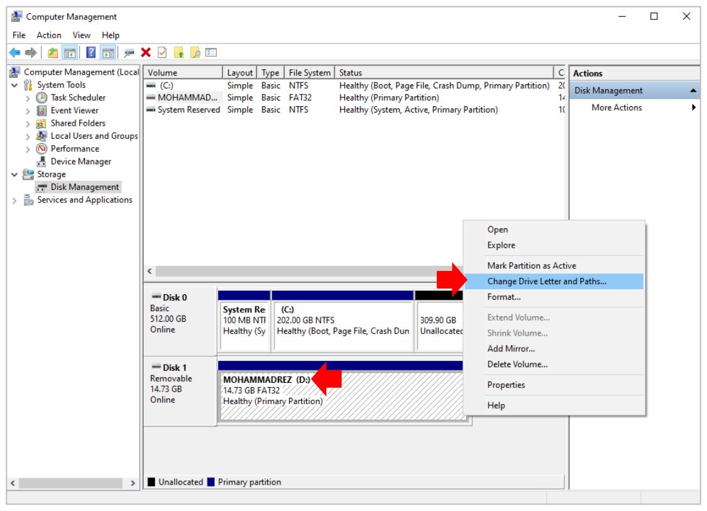

**Image analysis**

```json
{
 "image_name": "image125.png",
 "rId": "rId138",
 "image_path": "img_folder/image_124_image125.png",
 "caption": "پنجره Disk Management ویندوز با منوی راست کلیک برای تغییر حرف درایو",
 "ocr_text": "Computer Management\nFile Action View Help\nComputer Management (Local)\nSystem Tools\nTask Scheduler\nEvent Viewer\nShared Folders\nLocal Users and Groups\nPerformance\nDevice Manager\nStorage\nDisk Management\nServices and Applications\nVolume\nLayout\nType\nFile System\nStatus\n(C:)\nSimple\nBasic\nNTFS\nHealthy (Boot, Page File, Crash Dump, Primary Partition)\nMOHAMMAD...\nSimple\nBasic\nFAT32\nHealthy (Primary Partition)\nSystem Reserved\nSimple\nBasic\nNTFS\nHealthy (System, Active, Primary Partition)\nActions\nDisk Management\nMore Actions\nDisk 0\nBasic\n512.00 GB\nOnline\nSystem Re...\n100 MB NT\nHealthy (Sy\n(C:)\n202.00 GB NTFS\nHealthy (Boot, Page File, Crash Dun\n309.90 GB\nUnallocated\nDisk 1\nRemovable\n14.73 GB\nOnline\nMOHAMMADREZ (D:)\n14.73 GB FAT32\nHealthy (Primary Partition)\nOpen\nExplore\nMark Partition as Active\nChange Drive Letter and Paths...\nFormat...\nExtend Volume...\nShrink Volume...\nAdd Mirror...\nDelete Volume...\nProperties\nHelp\nUnallocated\nPrimary partition",
 "visual_description": [
 "اسکرین شات Computer Management با انتخاب Storage > Disk Management",
 "جدول Volume شامل (C:) با NTFS و وضعیت Healthy (Boot, Page File, Crash Dump, Primary Partition)",
 "یک پارتیشن با برچسب MOHAMMAD... با فایل سیستم FAT32 و وضعیت Healthy (Primary Partition)",
 "پارتیشن System Reserved با NTFS و وضعیت Healthy (System, Active, Primary Partition)",
 "Disk 0: Basic 512.00 GB Online با System Reserved، (C:) و 309.90 GB Unallocated",
 "Disk 1: Removable 14.73 GB Online با MOHAMMADREZ (D:) و FAT32",
 "منوی زمینه شامل گزینه Change Drive Letter and Paths... و Format... و سایر گزینه ها",
 "دو فلش قرمز به منوی زمینه و پارتیشن MOHAMMADREZ (D:) اشاره می کنند"
 ],
 "image_type": "screenshot"
}
```

14. در پنجره ای که باز می شود، در قسمت Assign the following drive letter:، لیبلی غیر از D را انتخاب و سپس روی دکمه ی OK کلیک نمایید:

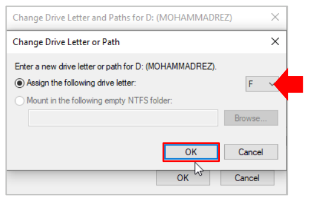

**Image analysis**

```json
{
 "image_name": "image126.png",
 "rId": "rId139",
 "image_path": "img_folder/image_125_image126.png",
 "caption": "پنجره ویندوز برای تغییر حرف درایو D به F با دکمه های OK و Cancel",
 "ocr_text": "Change Drive Letter and Paths for D: (MOHAMMADREZ)\nChange Drive Letter or Path\nEnter a new drive letter or path for D: (MOHAMMADREZ).\nAssign the following drive letter:\nMount in the following empty NTFS folder:\nBrowse...\nOK\nCancel",
 "visual_description": [
 "اسکرین شات از پنجره Change Drive Letter or Path در ویندوز",
 "گزینه Assign the following drive letter انتخاب شده است",
 "حرف درایو در کادر کشویی روی F قرار دارد",
 "گزینه Mount in the following empty NTFS folder غیرفعال/انتخاب نشده است و دکمه Browse... خاکستری است",
 "یک فلش قرمز به کادر حرف درایو اشاره می کند",
 "دکمه OK با کادر قرمز برجسته شده است"
 ],
 "image_type": "screenshot"
}
```

15. در کادر پیغامی که به نمایش درمی آید روی دکمه ی Yes کلیک کنید:

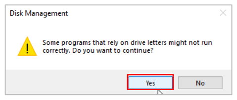

**Image analysis**

```json
{
 "image_name": "image127.png",
 "rId": "rId140",
 "image_path": "img_folder/image_126_image127.png",
 "caption": "هشدار Disk Management درباره اجرای برنامه ها پس از تغییر حروف درایو و درخواست ادامه",
 "ocr_text": "Disk Management\n\nSome programs that rely on drive letters might not run correctly. Do you want to continue?\n\nYes\nNo",
 "visual_description": [
 "پنجره هشدار ویندوز با عنوان Disk Management نمایش داده شده است",
 "آیکون مثلث زرد هشدار در سمت چپ پیام دیده می شود",
 "متن هشدار درباره برنامه های وابسته به حروف درایو و پرسش برای ادامه نمایش داده شده است",
 "دو دکمه Yes و No در پایین پنجره وجود دارد",
 "دکمه Yes با کادر قرمز مشخص شده است"
 ],
 "image_type": "screenshot"
}
```

در پایان بسته به نوع عملیات نصب نرم افزار (اولیه یا مجدد) در صورت نیاز مجدداً پارتیشن D را ایجاد نمایید (انجام مراحل 10، 11 و 12):

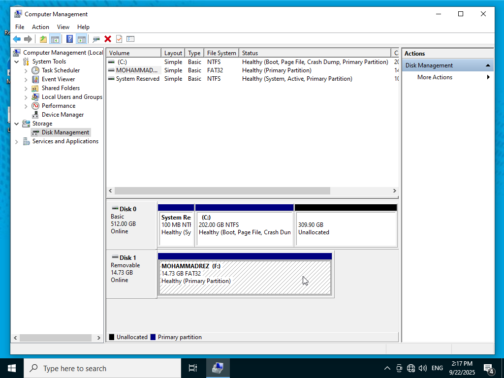

**Image analysis**

```json
{
 "image_name": "image128.png",
 "rId": "rId141",
 "image_path": "img_folder/image_127_image128.png",
 "caption": "نمای Disk Management ویندوز با پارتیشن های Disk 0 و یک دیسک Removable",
 "ocr_text": "Computer Management\nFile Action View Help\nComputer Management (Local)\nSystem Tools\nTask Scheduler\nEvent Viewer\nShared Folders\nLocal Users and Groups\nPerformance\nDevice Manager\nStorage\nDisk Management\nServices and Applications\nVolume\nLayout\nType\nFile System\nStatus\n(C:)\nSimple\nBasic\nNTFS\nHealthy (Boot, Page File, Crash Dump, Primary Partition)\nMOHAMMAD...\nSimple\nBasic\nFAT32\nHealthy (Primary Partition)\nSystem Reserved\nSimple\nBasic\nNTFS\nHealthy (System, Active, Primary Partition)\nActions\nDisk Management\nMore Actions\nDisk 0\nBasic\n512.00 GB\nOnline\nSystem Re...\n100 MB NT...\nHealthy (Sy...\n(C:)\n202.00 GB NTFS\nHealthy (Boot, Page File, Crash Dun...\n309.90 GB\nUnallocated\nDisk 1\nRemovable\n14.73 GB\nOnline\nMOHAMMADREZ (E:)\n14.73 GB FAT32\nHealthy (Primary Partition)\nUnallocated\nPrimary partition\nType here to search\nENG\n2:17 PM\n7/5/2020",
 "visual_description": [
 "پنجره Computer Management بخش Storage > Disk Management نمایش داده شده است",
 "Disk 0 با ظرفیت 512.00 GB و وضعیت Online نشان داده می شود",
 "روی Disk 0 پارتیشن System Reserved حدود 100 MB با فایل سیستم NTFS وجود دارد",
 "پارتیشن (C:) با اندازه 202.00 GB و فایل سیستم NTFS و وضعیت Healthy (Boot, Page File, Crash Dump, Primary Partition) دیده می شود",
 "بخش Unallocated با اندازه 309.90 GB در Disk 0 نمایش داده شده است",
 "Disk 1 به صورت Removable با ظرفیت 14.73 GB و وضعیت Online نمایش داده می شود",
 "روی Disk 1 ولوم MOHAMMADREZ (E:) با فایل سیستم FAT32 و وضعیت Healthy (Primary Partition) دیده می شود"
 ],
 "image_type": "screenshot"
}
```

# نصب درایورEPP

* چنانچه EPP دستگاه از نوع Sunson، مدل SE8098C است با استفاده از درایور
 SE8098C-EPP-Installer و مراجعه به دستورالعمل Sunson-SE8098C-EPP-Installation آن را نصب کنید.
* در صورتی که مدل EPP از نوع SE8098C6 است با استفاده از درایور
 SE8098C6-EPP-Installer و مراجعه به دستورالعمل
 Sunson-SE8098C6-EPP-Installation آن را راه اندازی نمایید.

نکته مهم: برای EPP SUNSON، مدل SE898C و SE8098C6، کابل FDK می باید به شکل مستقیم با استفاده از کابلی که توسط شرکت سازنده تهیه شده است به EPP متصل گردد.

# تعویض EPP

در صورت تعویض صفحه کلید، به غیر از مدل Sanson، مراحل زیر را جهت راه اندازی EPP انجام دهید:

1. با استفاده از کلیدهای ترکیبی Win+E پنجره Explorer را باز کنید.
2. به مسیر **C:\ATM\Tools** بروید.
3. روی فایل BANK\_SAMAN\_EPP\_CONFIG راست کلیک و از منویی که گشوده می شود
 Run as administrator را انتخاب نمایید:

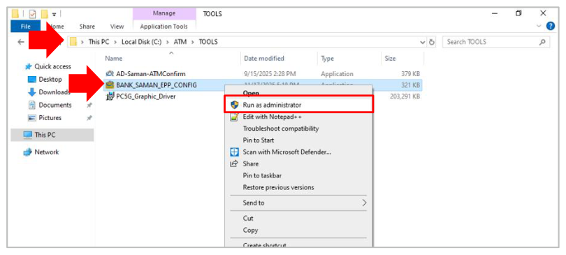

**Image analysis**

```json
{
 "image_name": "image129.tmp",
 "rId": "rId142",
 "image_path": "img_folder/image_128_image129.png",
 "caption": "اسکرین شات ویندوز اکسپلورر با منوی راست کلیک و گزینه Run as administrator",
 "ocr_text": "File\nHome\nShare\nView\nApplication Tools\nManage\nTOOLS\nThis PC > Local Disk (C:) > ATM > TOOLS\nSearch TOOLS\nQuick access\nDesktop\nDownloads\nDocuments\nPictures\nThis PC\nNetwork\nName\nDate modified\nType\nSize\nAD-Saman-ATMConfirm\n9/15/2025 2:28 PM\nApplication\n379 KB\nBANK_SAMAN_EPP_CONFIG\nApplication\n321 KB\nPCSG_Graphic_Driver\nApplication\n203,291 KB\nOpen\nRun as administrator\nEdit with Notepad++\nTroubleshoot compatibility\nPin to Start\nScan with Microsoft Defender...\nShare\nPin to taskbar\nRestore previous versions\nSend to\nCut\nCopy\nCreate shortcut",
 "visual_description": [
 "نمای Windows File Explorer در مسیر C:\\ATM\\TOOLS",
 "سه فایل اجرایی با نام های AD-Saman-ATMConfirm، BANK_SAMAN_EPP_CONFIG و PCSG_Graphic_Driver نمایش داده شده اند",
 "منوی راست کلیک باز است و گزینه «Run as administrator» با کادر قرمز مشخص شده",
 "دو فلش قرمز به پنل ناوبری سمت چپ (Quick access) و فایل انتخاب شده اشاره می کنند",
 "ستون های Name، Date modified، Type و Size در لیست فایل ها قابل مشاهده است"
 ],
 "image_type": "screenshot"
}
```

4. بسته به نوع EPP، عدد گزینه ی مربوط را وارد و کلید Enter را بزنید:

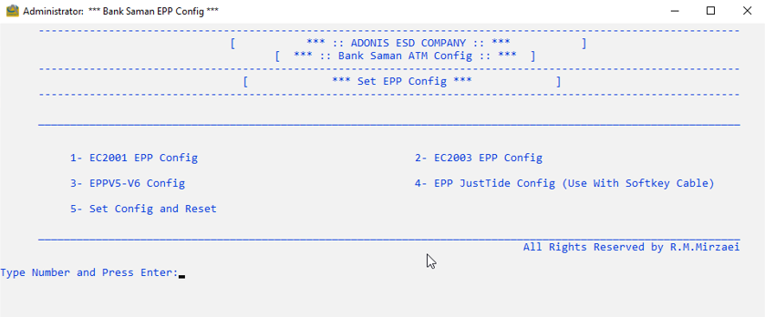

**Image analysis**

```json
{
 "image_name": "image130.tmp",
 "rId": "rId143",
 "image_path": "img_folder/image_129_image130.png",
 "caption": "اسکرین شات ابزار تنظیمات EPP بانک سامان با منوی انتخاب مدل های EC2001 و EC2003",
 "ocr_text": "Administrator: *** Bank Saman EPP Config ***\n\n[ *** : ADONIS ESD COMPANY : *** ]\n[ *** :: Bank Saman ATM Config :: *** ]\n[ *** Set EPP Config *** ]\n\n\n1- EC2001 EPP Config 2- EC2003 EPP Config\n\n3- EPPV5-V6 Config 4- EPP JustTide Config (Use With Softkey Cable)\n\n5- Set Config and Reset\n\n\nAll Rights Reserved by R.M.Mirzaei\n\nType Number and Press Enter:_",
 "visual_description": [
 "پنجره کنسولی با عنوان «Administrator: *** Bank Saman EPP Config ***» نمایش داده شده است",
 "سربرگ شامل عبارات «ADONIS ESD COMPANY» و «Bank Saman ATM Config» و «Set EPP Config» است",
 "منوی عددی 1 تا 5 برای انتخاب پیکربندی های EPP و گزینه «Set Config and Reset» وجود دارد",
 "گزینه 4 شامل توضیح «(Use With Softkey Cable)» است",
 "پایین صفحه پیام «Type Number and Press Enter:_» و متن حق کپی «All Rights Reserved by R.M.Mirzaei» دیده می شود"
 ],
 "image_type": "screenshot"
}
```

عملیات نصب با نمایش پنجره زیر آغاز خواهد شد:

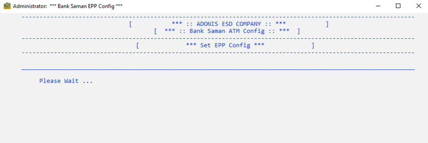

**Image analysis**

```json
{
 "image_name": "image131.tmp",
 "rId": "rId144",
 "image_path": "img_folder/image_130_image131.png",
 "caption": "پنجره تنظیمات EPP بانک سامان با پیام «Please wait ...»",
 "ocr_text": "Administrator: *** Bank Saman EPP Config ***\n\n[ *** :: ADONIS ESD COMPANY :: *** ]\n[ *** :: Bank Saman ATM Config :: *** ]\n[ *** Set EPP Config *** ]\n\nPlease wait ...",
 "visual_description": [
 "اسکرین شات یک پنجره ویندوز با عنوان «Administrator: *** Bank Saman EPP Config ***»",
 "نمایش متن های سربرگ شامل «ADONIS ESD COMPANY»، «Bank Saman ATM Config» و «Set EPP Config»",
 "نمایش پیام وضعیت «Please wait ...» در بخش پایین"
 ],
 "image_type": "screenshot"
}
```

پس از پایان عملیات مجدداً به پنجره ی قبل - مرحله چهارم - خواهید رفت.

5. جهت اعمال تنظیمات، گزینه ی 5- Set Config and Reset زا انتخاب کنید تا دستگاه Restart شود:

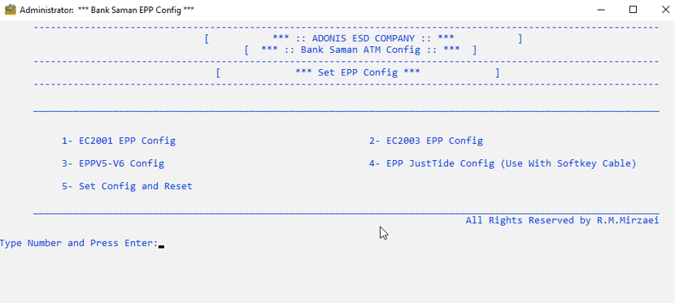

**Image analysis**

```json
{
 "image_name": "image132.tmp",
 "rId": "rId145",
 "image_path": "img_folder/image_131_image132.png",
 "caption": "اسکرین شات ابزار تنظیمات EPP بانک سامان با منوی انتخاب پیکربندی",
 "ocr_text": "Administrator: *** Bank Saman EPP Config ***\n\n[ *** :: ADONIS ESD COMPANY :: *** ]\n[ *** :: Bank Saman ATM Config :: *** ]\n[ *** Set EPP Config *** ]\n\n1- EC2001 EPP Config 2- EC2003 EPP Config\n3- EPPV5-V6 Config 4- EPP JustTide Config (Use With Softkey Cable)\n5- Set Config and Reset\n\nAll Rights Reserved by R.M.Mirzaei\n\nType Number and Press Enter: _",
 "visual_description": [
 "پنجره کنسولی با عنوان «Administrator: *** Bank Saman EPP Config ***» نمایش داده شده است",
 "هدر شامل نام شرکت «ADONIS ESD COMPANY» و عبارت «Bank Saman ATM Config» است",
 "منو دارای گزینه های شماره گذاری شده 1 تا 5 برای پیکربندی انواع EPP است",
 "گزینه ها شامل EC2001، EC2003، EPPV5-V6 و JustTide (با Softkey Cable) هستند",
 "در پایین صفحه پیام «Type Number and Press Enter: _» برای ورود شماره گزینه وجود دارد",
 "عبارت حق کپی «All Rights Reserved by R.M.Mirzaei» در پایین سمت راست دیده می شود"
 ],
 "image_type": "screenshot"
}
```

در صورت تعویض نوع صفحه کلید از Sunson بهEC2001 لازم است نصب نرم افزار به طور کامل انجام دهید.

# انجام تنظیمات Computer Name

1. در گوشه پایین سمت چپ صفحه روی دکمه ی

**Image analysis**

```json
{
 "image_name": "image113.tmp",
 "rId": "rId126",
 "image_path": "img_folder/image_112_image113.png",
 "caption": "آیکون سفید ویندوز روی پس زمینه تیره",
 "ocr_text": "",
 "visual_description": [
 "یک لوگوی چهارقسمتی شبیه پنجره در رنگ سفید دیده می شود",
 "پس زمینه تصویر یکدست و تیره است"
 ],
 "image_type": "unknown"
}
``` کلیک کنید تا منوی Start نمایان شود.
2. عبارت system setting را تایپ و همانند تصویر زیر، روی View advanced system settings کلیک نمایید:


**Image analysis**

```json
{
 "image_name": "image16.png",
 "rId": "rId29",
 "image_path": "img_folder/image_015_image16.png",
 "caption": "اسکرین شات جستجوی ویندوز برای گزینه View advanced system settings در Control Panel",
 "ocr_text": "All\nApps\nDocuments\nSettings\nMore\nBest match\nView advanced system settings\nControl panel\nView advanced system settings\nControl panel\nOpen\nsystem settin",
 "visual_description": [
 "پنجره جستجوی ویندوز با تب های All، Apps، Documents، Settings و More نمایش داده شده است.",
 "نتیجه Best match شامل گزینه «View advanced system settings» با زیرنویس «Control panel» است.",
 "در پنل سمت راست عنوان «View advanced system settings» و دکمه «Open» دیده می شود.",
 "کادر جستجو در نوار وظیفه شامل متن «system settin» است.",
 "سه فلش قرمز به دکمه استارت، کادر جستجو و نتیجه «View advanced system settings» اشاره می کنند."
 ],
 "image_type": "screenshot"
}
```

3. در پنجره ای که به نمایش درمی آید، ابتدا روی تب Computer Name و سپس دکمه ی Change کلیک کنید:


**Image analysis**

```json
{
 "image_name": "image17.png",
 "rId": "rId30",
 "image_path": "img_folder/image_016_image17.png",
 "caption": "پنجره System Properties ویندوز برای مشاهده نام کامل رایانه و Workgroup و دکمه Change",
 "ocr_text": "System Properties\nComputer Name Hardware Advanced System Protection Remote\nWindows uses the following information to identify your computer on the network.\nComputer description:\nFor example: \"Kitchen Computer\" or \"Mary's Computer\".\nFull computer name:\nXXX-ATMXX-XX-XX\nWorkgroup:\nSAMAN\nTo use a wizard to join a domain or workgroup, click Network ID.\nNetwork ID...\nTo rename this computer or change its domain or workgroup, click Change.\nChange...\nOK Cancel Apply",
 "visual_description": [
 "اسکرین شات پنجره System Properties در تب Computer Name با چند تب بالای پنجره",
 "نام کامل رایانه به صورت انتخاب شده: XXX-ATMXX-XX-XX",
 "Workgroup نمایش داده شده: SAMAN",
 "دو فلش قرمز به تب Computer Name و دکمه Change... اشاره می کنند",
 "دکمه های Network ID... و Change... در سمت راست پنجره دیده می شوند",
 "دکمه های OK، Cancel و Apply در پایین پنجره موجود است"
 ],
 "image_type": "screenshot"
}
```

4. در پنجره زیر در کادر Computer name، عبارت موردنظر برای Computer name را با قالب زیر تایپ و روی دکمه ی OK کلیک نمایید:

**قسمت آخر IP دستگاه-ترمینالATM-کد شعبه**

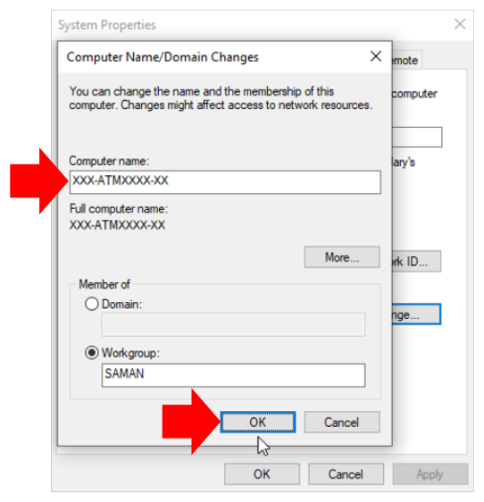

**Image analysis**

```json
{
 "image_name": "image133.tmp",
 "rId": "rId146",
 "image_path": "img_folder/image_132_image133.png",
 "caption": "پنجره تغییر نام کامپیوتر و ورک گروپ در ویندوز با دکمه OK مشخص شده است",
 "ocr_text": "System Properties\nComputer Name/Domain Changes\nYou can change the name and the membership of this computer. Changes might affect access to network resources.\nComputer name:\nXXX-ATMXXXX-XX\nFull computer name:\nXXX-ATMXXXX-XX\nMore...\nMember of\nDomain:\nWorkgroup:\nSAMAN\nOK\nCancel",
 "visual_description": [
 "اسکرین شات پنجره Windows با عنوان «Computer Name/Domain Changes»",
 "فیلد «Computer name» مقدار «XXX-ATMXXXX-XX» را نشان می دهد",
 "فیلد «Full computer name» مقدار «XXX-ATMXXXX-XX» را نشان می دهد",
 "بخش «Member of» شامل گزینه های «Domain» و «Workgroup» است",
 "گزینه «Workgroup» انتخاب شده و مقدار آن «SAMAN» است",
 "دکمه های «OK» و «Cancel» و همچنین «More...» قابل مشاهده اند",
 "دو فلش قرمز به فیلد نام کامپیوتر و دکمه OK اشاره می کنند"
 ],
 "image_type": "screenshot"
}
```

به عنوان مثال، Computer name خودپرداز شعبه تجریش:

<!-- TABLE_START -->
| | |
| --- | --- |
| کد شعبه | 847 |
| ترمینال | 1665 |
| IP | 10.10.59.20 |
| Computer name | **847-ATM1665-20** |
<!-- TABLE_END -->

لازم به ذکر است که مشخصات فوق انحصاری و مختص به یک دستگاه است.

**هم زمان اگر کد شعبه، چهار رقم و قسمت آخر IP، سه رقم باشد، Computer name دستگاه به شرح زیر خواهد بود:**

**قسمت آخر IP دستگاه، یک رقم کمتر - ترمینال- ATMکد شعبه**

به عنوان مثال:

<!-- TABLE_START -->
| | |
| --- | --- |
| کد شعبه | 1734 |
| ترمینال | 2223 |
| IP | 10.10.59.115 |
| Computer name | **1734-ATM2223-11** |
<!-- TABLE_END -->

5. در کادر پیغامی که باز می شود، روی دکمه ی OK کلیک کنید:

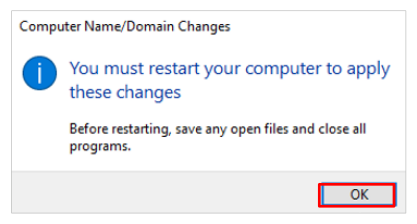

**Image analysis**

```json
{
 "image_name": "image134.tmp",
 "rId": "rId147",
 "image_path": "img_folder/image_133_image134.png",
 "caption": "پنجره پیام ویندوز درباره لزوم ری استارت برای اعمال تغییرات نام/دامنه رایانه",
 "ocr_text": "Computer Name/Domain Changes\n\nYou must restart your computer to apply\nthese changes\n\nBefore restarting, save any open files and close all\nprograms.\n\nOK",
 "visual_description": [
 "پنجره دیالوگ ویندوز با عنوان «Computer Name/Domain Changes» نمایش داده شده است",
 "آیکون اطلاعات (دایره آبی با حرف i) در سمت چپ پیام دیده می شود",
 "متن پیام درخواست ری استارت برای اعمال تغییرات را نشان می دهد",
 "دکمه «OK» در پایین سمت راست قرار دارد و با کادر قرمز مشخص شده است"
 ],
 "image_type": "screenshot"
}
```

6. در پنجره ی System Properties روی گزینه Close کلیک نمایید:

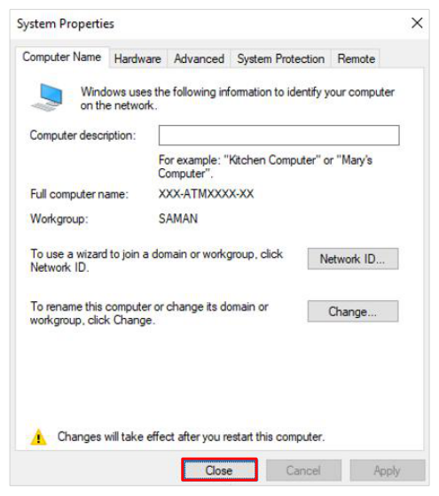

**Image analysis**

```json
{
 "image_name": "image135.tmp",
 "rId": "rId148",
 "image_path": "img_folder/image_134_image135.png",
 "caption": "پنجره System Properties ویندوز با تب Computer Name و دکمه Close مشخص شده",
 "ocr_text": "System Properties\nComputer Name Hardware Advanced System Protection Remote\nWindows uses the following information to identify your computer\non the network.\nComputer description:\nFor example: \"Kitchen Computer\" or \"Mary's\nComputer\".\nFull computer name:\nXXX-ATMIXXXX-X-XX\nWorkgroup:\nSAMAN\nTo use a wizard to join a domain or workgroup, click\nNetwork ID.\nNetwork ID...\nTo rename this computer or change its domain or\nworkgroup, click Change.\nChange...\nChanges will take effect after you restart this computer.\nClose\nCancel\nApply",
 "visual_description": [
 "پنجره «System Properties» با تب های Computer Name، Hardware، Advanced، System Protection و Remote نمایش داده شده است",
 "فیلدهای Full computer name و Workgroup قابل مشاهده هستند و مقدار Workgroup برابر SAMAN است",
 "دکمه های Network ID... و Change... در سمت راست قرار دارند",
 "پیغام هشدار پایین پنجره درباره اعمال تغییرات پس از راه اندازی مجدد نمایش داده شده است",
 "دکمه Close در پایین با کادر قرمز برجسته شده است"
 ],
 "image_type": "screenshot"
}
```

7. به منظور اعمال تنظیمات انجام شده، در کادر پیغامی که به نمایش گذاشته می شود روی دکمه ی Restrat now کلیک کنید تا دستگاه Restart شود:

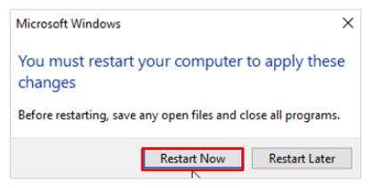

**Image analysis**

```json
{
 "image_name": "image136.tmp",
 "rId": "rId149",
 "image_path": "img_folder/image_135_image136.png",
 "caption": "پنجره ویندوز برای راه اندازی مجدد جهت اعمال تغییرات",
 "ocr_text": "Microsoft Windows\nYou must restart your computer to apply these changes\nBefore restarting, save any open files and close all programs.\nRestart Now\nRestart Later",
 "visual_description": [
 "پنجرهٔ محاوره ای Microsoft Windows پیام نیاز به ری استارت برای اعمال تغییرات را نمایش می دهد",
 "دو دکمه با برچسب «Restart Now» و «Restart Later» وجود دارد",
 "دکمه «Restart Now» با کادر قرمز برجسته شده است",
 "دکمه بستن (X) در گوشه بالا-راست پنجره دیده می شود"
 ],
 "image_type": "screenshot"
}
```

# Join to Domain

جهت انجام عملیات Join to Domain، مراحل زیر را انجام دهید:

1. در گوشه پایین سمت چپ صفحه روی دکمه ی

**Image analysis**

```json
{
 "image_name": "image113.tmp",
 "rId": "rId126",
 "image_path": "img_folder/image_112_image113.png",
 "caption": "آیکون سفید ویندوز روی پس زمینه تیره",
 "ocr_text": "",
 "visual_description": [
 "یک لوگوی چهارقسمتی شبیه پنجره در رنگ سفید دیده می شود",
 "پس زمینه تصویر یکدست و تیره است"
 ],
 "image_type": "unknown"
}
``` کلیک کنید تا منوی Start نمایان شود.
2. کلمه ی advanced system setting را تایپ و همانند تصویر زیر، روی
 View advanced system settings کلیک نمایید:

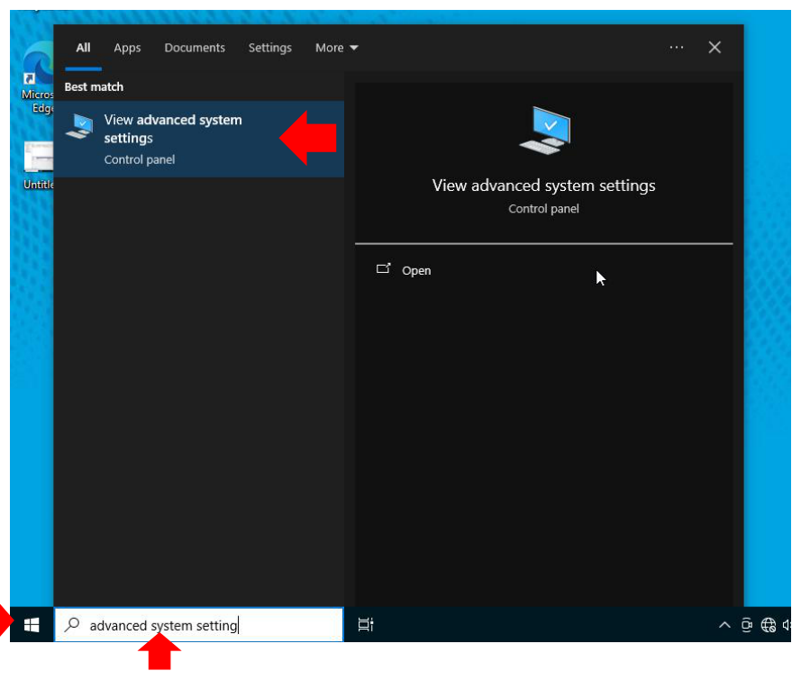

**Image analysis**

```json
{
 "image_name": "image137.png",
 "rId": "rId150",
 "image_path": "img_folder/image_136_image137.png",
 "caption": "جستجوی View advanced system settings در منوی استارت ویندوز",
 "ocr_text": "All\nApps\nDocuments\nSettings\nMore\nBest match\nView advanced system\nsettings\nControl panel\nView advanced system settings\nControl panel\nOpen\nadvanced system setting",
 "visual_description": [
 "پنجره جستجوی منوی Start ویندوز با تب های All، Apps، Documents، Settings و More نمایش داده شده است",
 "نتیجه Best match شامل گزینه View advanced system settings با برچسب Control panel است",
 "در پنل سمت راست عنوان View advanced system settings و گزینه Open دیده می شود",
 "یک فلش قرمز به گزینه View advanced system settings اشاره می کند",
 "نوار جستجو شامل عبارت advanced system setting است و فلش قرمز به آن اشاره دارد"
 ],
 "image_type": "screenshot"
}
```

3. پنجره ی System Properties در حالیکه زبانه Advanced در آن فعال است، به نمایش گذاشته خواهد شد:

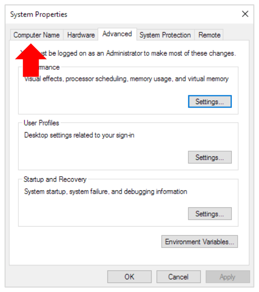

**Image analysis**

```json
{
 "image_name": "image138.tmp",
 "rId": "rId151",
 "image_path": "img_folder/image_137_image138.png",
 "caption": "پنجره System Properties ویندوز در تب Advanced با فلش قرمز روی Computer Name.",
 "ocr_text": "System Properties\nComputer Name Hardware Advanced System Protection Remote\nYou must be logged on as an Administrator to make most of these changes.\nPerformance\nVisual effects, processor scheduling, memory usage, and virtual memory\nSettings...\nUser Profiles\nDesktop settings related to your sign-in\nSettings...\nStartup and Recovery\nSystem startup, system failure, and debugging information\nSettings...\nEnvironment Variables...\nOK Cancel Apply",
 "visual_description": [
 "پنجره «System Properties» با تب های Computer Name، Hardware، Advanced، System Protection و Remote نمایش داده شده است.",
 "تب «Advanced» فعال است و بخش های Performance، User Profiles و Startup and Recovery هرکدام دکمه «Settings...» دارند.",
 "دکمه «Environment Variables...» در پایین پنجره دیده می شود.",
 "پیام نیاز به ورود به عنوان Administrator برای اعمال تغییرات نمایش داده شده است.",
 "فلش قرمز به سمت تب «Computer Name» اشاره می کند."
 ],
 "image_type": "screenshot"
}
```

4. در پنجره ی فوق روی Computer Name کلیک کنید.
5. روی دکمه ی Network ID کلیک کنید:

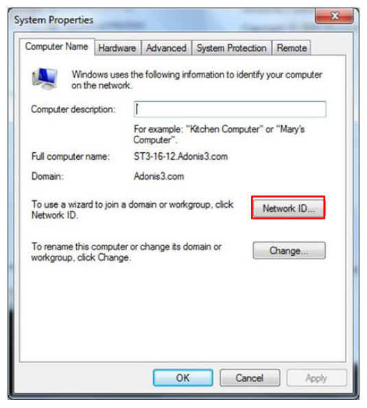

**Image analysis**

```json
{
 "image_name": "image139.png",
 "rId": "rId152",
 "image_path": "img_folder/image_138_image139.png",
 "caption": "پنجره System Properties ویندوز در تب Computer Name با دکمه Network ID و Change",
 "ocr_text": "System Properties\nComputer Name Hardware Advanced System Protection Remote\nWindows uses the following information to identify your computer\non the network.\nComputer description:\nFor example: \"Kitchen Computer\" or \"Mary's\nComputer\".\nFull computer name:\nST3-16-12.Adonis3.com\nDomain:\nAdonis3.com\nTo use a wizard to join a domain or workgroup, click\nNetwork ID.\nNetwork ID...\nTo rename this computer or change its domain or\nworkgroup, click Change.\nChange...\nOK Cancel Apply",
 "visual_description": [
 "اسکرین شات از پنجره System Properties با تب های: Computer Name، Hardware، Advanced، System Protection، Remote",
 "نمایش Full computer name: ST3-16-12.Adonis3.com",
 "نمایش Domain: Adonis3.com",
 "دکمه Network ID... با کادر قرمز برجسته شده است",
 "دکمه Change... و دکمه های OK، Cancel، Apply در پایین پنجره دیده می شوند"
 ],
 "image_type": "screenshot"
}
```
6. گزینه This computer is part of … را انتخاب و روی دکمه Next کلیک کنید:‬ 

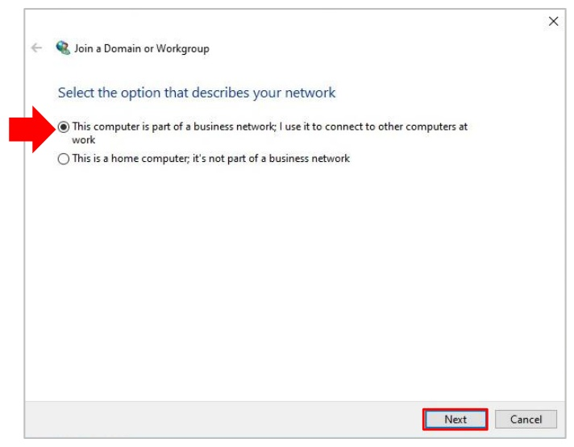

**Image analysis**

```json
{
 "image_name": "image140.jpg",
 "rId": "rId153",
 "image_path": "img_folder/image_139_image140.jpg",
 "caption": "پنجره Join a Domain or Workgroup با انتخاب گزینه شبکه کاری و دکمه Next",
 "ocr_text": "Join a Domain or Workgroup\nSelect the option that describes your network\nThis computer is part of a business network; I use it to connect to other computers at work\nThis is a home computer; it's not part of a business network\nNext\nCancel",
 "visual_description": [
 "اسکرین شات پنجره ویندوز «Join a Domain or Workgroup» با دو گزینه رادیویی برای نوع شبکه",
 "گزینه اول (شبکه کاری/تجاری) انتخاب شده است",
 "یک فلش قرمز به گزینه رادیویی انتخاب شده اشاره می کند",
 "دکمه Next با کادر قرمز مشخص شده و دکمه Cancel در پایین راست دیده می شود"
 ],
 "image_type": "screenshot"
}
```

7. گزینه ی My computer uses a … را انتخاب و سپس روی Next کلیک نمایید:

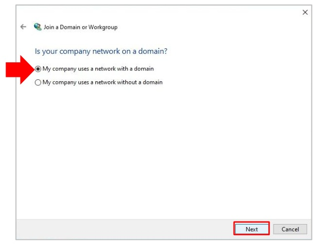

**Image analysis**

```json
{
 "image_name": "image141.jpg",
 "rId": "rId154",
 "image_path": "img_folder/image_140_image141.jpg",
 "caption": "پنجره اتصال به دامنه یا ورک گروپ با انتخاب گزینه شبکه دارای دامنه و دکمه Next",
 "ocr_text": "Join a Domain or Workgroup\nIs your company network on a domain?\nMy company uses a network with a domain\nMy company uses a network without a domain\nNext\nCancel",
 "visual_description": [
 "پنجره تنظیمات «Join a Domain or Workgroup» با دو گزینه رادیویی نمایش داده شده است",
 "گزینه «My company uses a network with a domain» انتخاب شده است",
 "یک فلش قرمز به گزینه انتخاب شده اشاره می کند",
 "دکمه «Next» در پایین سمت راست با کادر قرمز مشخص شده است",
 "دکمه «Cancel» در کنار دکمه Next دیده می شود"
 ],
 "image_type": "screenshot"
}
```

8. در این مرحله، با کلیک بر روی دکمه Next به مرحله بعد بروید:

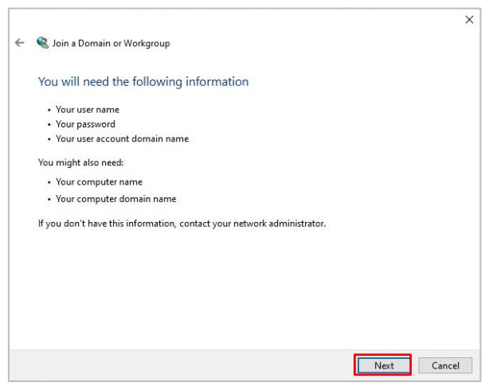

**Image analysis**

```json
{
 "image_name": "image142.jpg",
 "rId": "rId155",
 "image_path": "img_folder/image_141_image142.jpg",
 "caption": "پنجره Join a Domain or Workgroup با فهرست اطلاعات لازم و دکمه های Next و Cancel",
 "ocr_text": "Join a Domain or Workgroup\nYou will need the following information\n• Your user name\n• Your password\n• Your user account domain name\nYou might also need:\n• Your computer name\n• Your computer domain name\nIf you don't have this information, contact your network administrator.\nNext\nCancel",
 "visual_description": [
 "پنجره راهنمای «Join a Domain or Workgroup» نمایش داده شده است",
 "لیست بولت دار شامل نام کاربری، رمز عبور و نام دامنه حساب کاربری است",
 "بخش «You might also need» شامل نام کامپیوتر و نام دامنه کامپیوتر است",
 "در پایین پنجره دکمه های «Next» و «Cancel» وجود دارد و «Next» با کادر قرمز مشخص شده است"
 ],
 "image_type": "screenshot"
}
```

9. اطلاعات زیر را وارد و سپس روی دکمه Next کلیک نمایید:

<!-- TABLE_START -->
| | |
| --- | --- |
| همان COMPUTER NAME به غیراز بخش آخر که حاوی آی پی دستگاه است. | **Username** |
| ATMpa$$word | **Password** |
| SBATM.IR | **Domain** |
<!-- TABLE_END -->

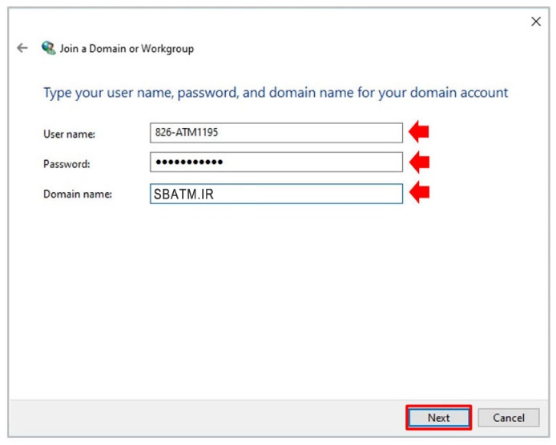

**Image analysis**

```json
{
 "image_name": "image143.jpeg",
 "rId": "rId156",
 "image_path": "img_folder/image_142_image143.jpg",
 "caption": "پنجره ورود به دامنه با فیلدهای نام کاربری، رمز عبور و نام دامنه",
 "ocr_text": "Join a Domain or Workgroup\n\nType your user name, password, and domain name for your domain account\n\nUser name:\n826-ATM1195\n\nPassword:\n\nDomain name:\nSBATM.IR\n\nNext\nCancel",
 "visual_description": [
 "پنجره «Join a Domain or Workgroup» با سه فیلد ورودی User name، Password و Domain name نمایش داده شده است",
 "مقدار فیلد User name برابر «826-ATM1195» است",
 "فیلد Password با کاراکترهای نقطه ای/بولت مخفی شده است",
 "مقدار فیلد Domain name برابر «SBATM.IR» است",
 "سه فلش قرمز به سمت فیلدهای ورودی اشاره می کنند",
 "دکمه «Next» با کادر قرمز برجسته شده و دکمه «Cancel» کنار آن قرار دارد"
 ],
 "image_type": "screenshot"
}
```

10. در این مرحله نیز پس از درج اطلاعات زیر، روی دکمه ی Next کلیک کنید:

<!-- TABLE_START -->
| | |
| --- | --- |
| همان COMPUTER NAME | **Computer name** |
| SBATM.IR | **Computer domain** |
<!-- TABLE_END -->

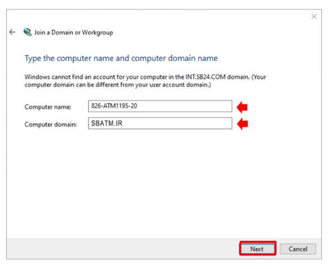

**Image analysis**

```json
{
 "image_name": "image144.jpeg",
 "rId": "rId157",
 "image_path": "img_folder/image_143_image144.jpg",
 "caption": "پنجره Join a Domain یا Workgroup با فیلدهای نام کامپیوتر و دامنه و دکمه Next",
 "ocr_text": "Join a Domain or Workgroup\n\nType the computer name and computer domain name\n\nWindows cannot find an account for your computer in the INT.SB24.COM domain. (Your computer domain can be different from your user account domain.)\n\nComputer name:\n826-ATM11195-20\n\nComputer domain:\nSBATM.IR\n\nNext\nCancel",
 "visual_description": [
 "پنجره تنظیمات «Join a Domain or Workgroup» نمایش داده شده است.",
 "دو کادر متنی برای «Computer name» و «Computer domain» وجود دارد.",
 "متن خطا درباره یافتن نکردن حساب کامپیوتر در دامنه INT.SB24.COM نمایش داده شده است.",
 "در کادر «Computer name» مقدار «826-ATM11195-20» وارد شده است.",
 "در کادر «Computer domain» مقدار «SBATM.IR» وارد شده است.",
 "دو فلش قرمز به سمت کادرهای ورودی اشاره می کنند.",
 "دکمه «Next» با کادر قرمز مشخص شده و کنار آن «Cancel» قرار دارد."
 ],
 "image_type": "screenshot"
}
```

11. اطلاعات زیر را وارد و روی دکمه OK کلیک کنید:

<!-- TABLE_START -->
| | |
| --- | --- |
| همان Computer Name، به غیر از فیلد آخر (IP دستگاه) | **User name** |
| ATMpa$$word | **Password** |
| SBATM.IR | **Domain** |
<!-- TABLE_END -->

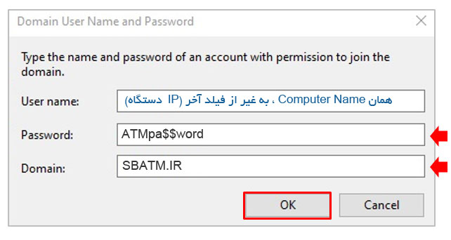

**Image analysis**

```json
{
 "image_name": "image145.jpg",
 "rId": "rId158",
 "image_path": "img_folder/image_144_image145.jpg",
 "caption": "پنجره ورود نام کاربری و رمز عبور برای Join کردن به دامنه",
 "ocr_text": "Domain User Name and Password\nType the name and password of an account with permission to join the\ndomain.\nUser name:\nهمان Computer Name به غیر از فیلد آخر IP دستگاه\nPassword:\nATMpa$$word\nDomain:\nSBATM.IR\nOK\nCancel",
 "visual_description": [
 "پنجره ویندوز با عنوان «Domain User Name and Password» نمایش داده شده است",
 "سه فیلد ورودی شامل User name، Password و Domain دیده می شود",
 "در فیلد Password مقدار «ATMpa$$word» وارد شده است",
 "در فیلد Domain مقدار «SBATM.IR» وارد شده است",
 "کنار فیلد User name یک متن راهنما به فارسی/انگلیسی نمایش داده شده است",
 "دکمه های «OK» و «Cancel» در پایین پنجره وجود دارند",
 "فلش های قرمز به سمت فیلدهای Password و Domain اشاره می کنند",
 "کادر قرمز دور دکمه «OK» قرار دارد"
 ],
 "image_type": "screenshot"
}
```

12. در پنجره بعدی، اطلاعات زیر را وارد و سپس روی دکمه Next کلیک کنید:

<!-- TABLE_START -->
| | |
| --- | --- |
| همان COMPUTER NAME به غیراز بخش آخر که حاوی آی پی دستگاه است. | **User name** |
| SBATM.IR | **User domain** |
<!-- TABLE_END -->

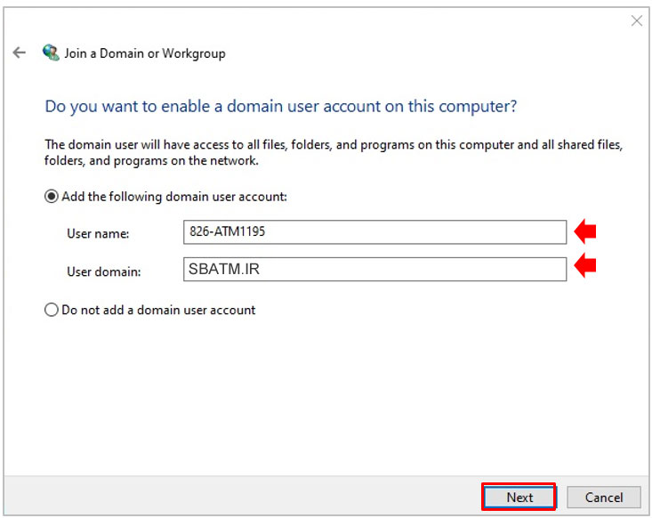

**Image analysis**

```json
{
 "image_name": "image146.jpg",
 "rId": "rId159",
 "image_path": "img_folder/image_145_image146.jpg",
 "caption": "پنجره Join a Domain یا Workgroup برای افزودن حساب کاربری دامنه با نام و دامنه مشخص",
 "ocr_text": "Join a Domain or Workgroup\n\nDo you want to enable a domain user account on this computer?\n\nThe domain user will have access to all files, folders, and programs on this computer and all shared files, folders, and programs on the network.\n\nAdd the following domain user account:\n\nUser name:\n826-ATM1195\n\nUser domain:\nSBATM.IR\n\nDo not add a domain user account\n\nNext\nCancel",
 "visual_description": [
 "اسکرین شات پنجره Windows با عنوان «Join a Domain or Workgroup»",
 "گزینه رادیویی «Add the following domain user account:» انتخاب شده است",
 "فیلد «User name» مقدار «826-ATM1195» را نشان می دهد",
 "فیلد «User domain» مقدار «SBATM.IR» را نشان می دهد",
 "گزینه «Do not add a domain user account» نیز قابل انتخاب است",
 "دکمه های «Next» و «Cancel» در پایین پنجره وجود دارند",
 "دو پیکان قرمز به سمت فیلدهای نام کاربری و دامنه اشاره می کنند"
 ],
 "image_type": "screenshot"
}
```

13. در این مرحله، ابتدا گزینه ی Other را انتخاب کنید و از منوی باز شونده ی آن، Administrators را برگزینید. سپس روی Next کلیک نمایید:

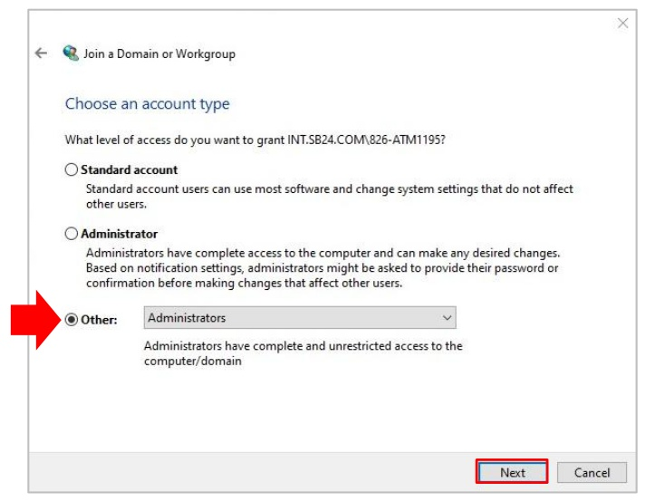

**Image analysis**

```json
{
 "image_name": "image147.jpg",
 "rId": "rId160",
 "image_path": "img_folder/image_146_image147.jpg",
 "caption": "پنجره انتخاب نوع حساب در ویندوز با گزینه Other و انتخاب Administrators",
 "ocr_text": "Join a Domain or Workgroup\nChoose an account type\nWhat level of access do you want to grant INT.SB24.COM\\826-ATM1195?\nStandard account\nStandard account users can use most software and change system settings that do not affect other users.\nAdministrator\nAdministrators have complete access to the computer and can make any desired changes.\nBased on notification settings, administrators might be asked to provide their password or confirmation before making changes that affect other users.\nOther:\nAdministrators\nAdministrators have complete and unrestricted access to the computer/domain\nNext\nCancel",
 "visual_description": [
 "پنجره «Join a Domain or Workgroup» نمایش داده شده است.",
 "بخش «Choose an account type» شامل سه گزینه رادیویی: Standard account، Administrator، و Other است.",
 "گزینه رادیویی «Other:» انتخاب شده و یک فهرست کشویی کنار آن مقدار «Administrators» را نشان می دهد.",
 "فلش قرمز به گزینه «Other» اشاره می کند.",
 "دکمه «Next» با کادر قرمز مشخص شده و دکمه «Cancel» در کنار آن قرار دارد.",
 "نام هدف در سوال: INT.SB24.COM\\826-ATM1195"
 ],
 "image_type": "screenshot"
}
```

14. در پنجره ی بعد بر روی Finish کلیک کنید:

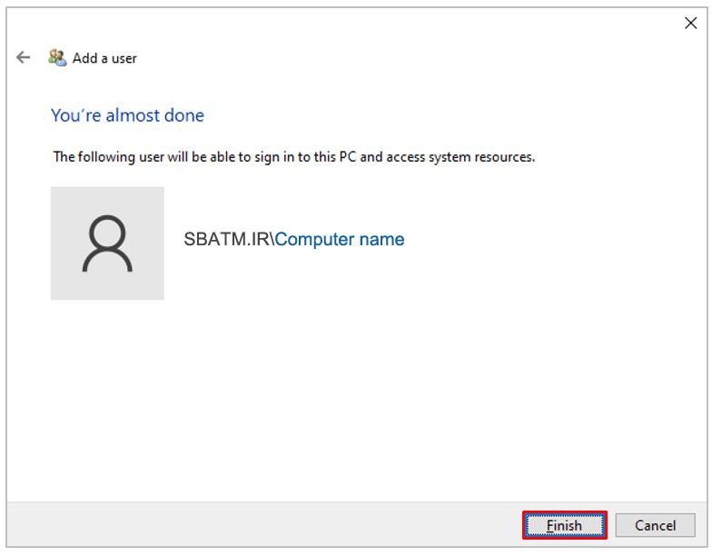

**Image analysis**

```json
{
 "image_name": "image148.jpg",
 "rId": "rId161",
 "image_path": "img_folder/image_147_image148.jpg",
 "caption": "پنجره افزودن کاربر در ویندوز با دکمه های Finish و Cancel",
 "ocr_text": "Add a user\nYou’re almost done\nThe following user will be able to sign in to this PC and access system resources.\nSBATM.IR\\Computer name\nFinish\nCancel",
 "visual_description": [
 "اسکرین شات پنجره «Add a user» برای افزودن کاربر در ویندوز",
 "نمایش پیام «You’re almost done» و توضیح دسترسی کاربر به این PC",
 "نمایش نام کاربر/دامنه به صورت «SBATM.IR\\Computer name»",
 "وجود آیکون کاربر در سمت چپ",
 "دکمه های پایین: «Finish» (هایلایت/کادر قرمز) و «Cancel»"
 ],
 "image_type": "screenshot"
}
```

15. در این مرحله حتماً می باید دستگاه را Restart نمایید. پس از راه اندازی، ویندوز از شما
 User Name و Password خواهد خواست؛ اطلاعات زیر را وارد نمایید:

<!-- TABLE_START -->
| | |
| --- | --- |
| **همان مقدار Computer Name است با این تفاوت که بخش آخر آن که حاوی فیلد آخر IP دستگاه است، حذف می شود. به عنوان مثال :** **899-ATM2305** | **User Name** |
| **ATMpa$$word** | **Password** |
<!-- TABLE_END -->

# اضافه نمودن یوزر ATM به یوزرهای ویندوز

به منظور اضافه کردن یوزر ATM مراحل زیر را انجام دهید:

1. در گوشه پایین سمت چپ صفحه روی دکمه ی

**Image analysis**

```json
{
 "image_name": "image113.tmp",
 "rId": "rId126",
 "image_path": "img_folder/image_112_image113.png",
 "caption": "آیکون سفید ویندوز روی پس زمینه تیره",
 "ocr_text": "",
 "visual_description": [
 "یک لوگوی چهارقسمتی شبیه پنجره در رنگ سفید دیده می شود",
 "پس زمینه تصویر یکدست و تیره است"
 ],
 "image_type": "unknown"
}
``` کلیک کنید تا منوی Start نمایان شود.
2. کلمه ی control panel را تایپ و همانند تصویر زیر، رویControl Panel کلیک نمایید:

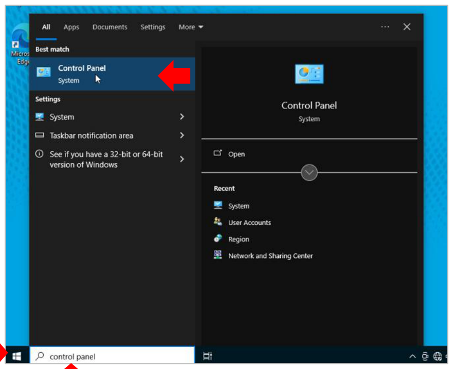

**Image analysis**

```json
{
 "image_name": "image149.tmp",
 "rId": "rId162",
 "image_path": "img_folder/image_148_image149.png",
 "caption": "نمایش جستجوی ویندوز برای Control Panel و بخش System",
 "ocr_text": "All\nApps\nDocuments\nSettings\nMore\nBest match\nControl Panel\nSystem\nSettings\nSystem\nTaskbar notification area\nSee if you have a 32-bit or 64-bit\nversion of Windows\nControl Panel\nSystem\nOpen\nRecent\nSystem\nUser Accounts\nRegion\nNetwork and Sharing Center\ncontrol panel",
 "visual_description": [
 "پنجره جستجوی منوی Start ویندوز با نتایج مربوط به Control Panel",
 "نتیجه Best match روی «Control Panel» با زیرعنوان «System» هایلایت شده است",
 "در پنل راست عنوان «Control Panel» و زیرعنوان «System» همراه دکمه «Open» دیده می شود",
 "بخش Recent شامل گزینه های System، User Accounts، Region و Network and Sharing Center است",
 "یک فلش قرمز به نتیجه «Control Panel» اشاره می کند",
 "نوار جستجو در پایین عبارت «control panel» را نشان می دهد"
 ],
 "image_type": "screenshot"
}
```

3. در پنجره Control Panel، روی User Accounts کلیک کنید:

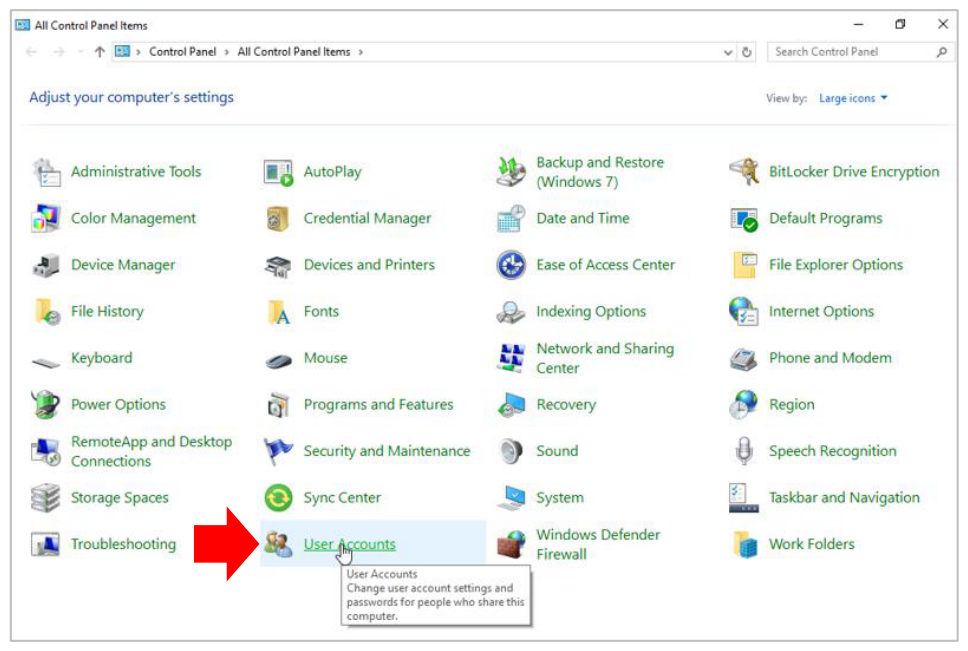

**Image analysis**

```json
{
 "image_name": "image150.tmp",
 "rId": "rId163",
 "image_path": "img_folder/image_149_image150.png",
 "caption": "نمای کنترل پنل ویندوز با انتخاب گزینه User Accounts",
 "ocr_text": "All Control Panel Items\nControl Panel > All Control Panel Items\nSearch Control Panel\nAdjust your computer’s settings\nView by: Large icons\nAdministrative Tools\nAutoPlay\nBackup and Restore (Windows 7)\nBitLocker Drive Encryption\nColor Management\nCredential Manager\nDate and Time\nDefault Programs\nDevice Manager\nDevices and Printers\nEase of Access Center\nFile Explorer Options\nFile History\nFonts\nIndexing Options\nInternet Options\nKeyboard\nMouse\nNetwork and Sharing\nCenter\nPhone and Modem\nPower Options\nPrograms and Features\nRecovery\nRegion\nRemoteApp and Desktop\nConnections\nSecurity and Maintenance\nSound\nSpeech Recognition\nStorage Spaces\nSync Center\nSystem\nTaskbar and Navigation\nTroubleshooting\nUser Accounts\nWindows Defender\nFirewall\nWork Folders\nUser Accounts\nChange user account settings and\npasswords for people who share this\ncomputer.",
 "visual_description": [
 "اسکرین شات بخش All Control Panel Items در Control Panel ویندوز با حالت View by: Large icons",
 "یک فلش قرمز به آیتم «User Accounts» اشاره می کند",
 "کادر راهنمای (tooltip) برای «User Accounts» نمایش داده شده است"
 ],
 "image_type": "screenshot"
}
```

4. در پنجره ی بعدی، روی Manage User Accounts کلیک نمایید:

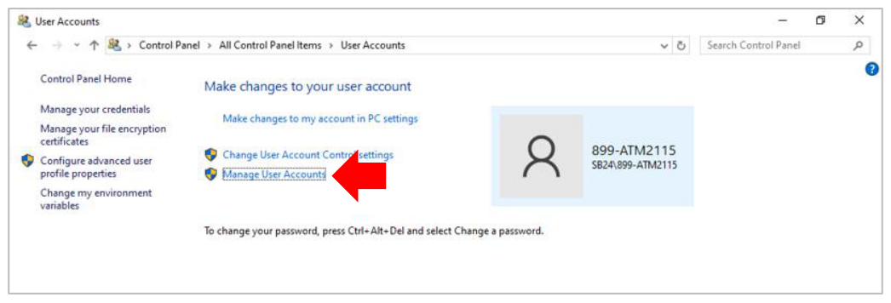

**Image analysis**

```json
{
 "image_name": "image151.tmp",
 "rId": "rId164",
 "image_path": "img_folder/image_150_image151.png",
 "caption": "صفحه User Accounts در کنترل پنل ویندوز با گزینه Manage User Accounts مشخص شده",
 "ocr_text": "User Accounts\nControl Panel > All Control Panel Items > User Accounts\nSearch Control Panel\nControl Panel Home\nManage your credentials\nManage your file encryption certificates\nConfigure advanced user profile properties\nChange my environment variables\nMake changes to your user account\nMake changes to my account in PC settings\nChange User Account Control settings\nManage User Accounts\nTo change your password, press Ctrl+Alt+Del and select Change a password.\n899-ATM2115\nS824/899-ATM2115",
 "visual_description": [
 "اسکرین شات از Control Panel مسیر User Accounts با لینک های Change User Account Control settings و Manage User Accounts",
 "فلش قرمز بزرگ به گزینه «Manage User Accounts» اشاره می کند",
 "در سمت راست کارت حساب کاربری با آیکن کاربر و متن «899-ATM2115» و «S824/899-ATM2115» نمایش داده شده است"
 ],
 "image_type": "screenshot"
}
```

5. در پنجره ی User Accounts، روی دکمه ی Add کلیک کنید:

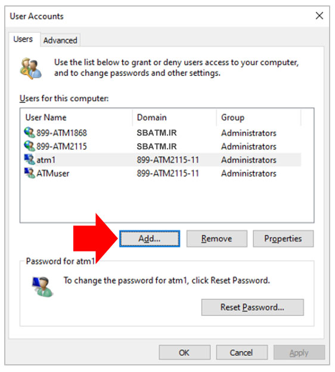

**Image analysis**

```json
{
 "image_name": "image152.jpg",
 "rId": "rId165",
 "image_path": "img_folder/image_151_image152.jpg",
 "caption": "پنجره User Accounts ویندوز با فهرست کاربران و دکمه های Add و Reset Password",
 "ocr_text": "User Accounts\nUsers Advanced\nUse the list below to grant or deny users access to your computer,\nand to change passwords and other settings.\nUsers for this computer:\nUser Name\nDomain\nGroup\n899-ATM1868\nSBATM.IR\nAdministrators\n899-ATM2115\nSBATM.IR\nAdministrators\natm1\n899-ATM2115-11\nAdministrators\nATMuser\n899-ATM2115-11\nAdministrators\nAdd...\nRemove\nProperties\nPassword for atm1\nTo change the password for atm1, click Reset Password.\nReset Password...\nOK\nCancel\nApply",
 "visual_description": [
 "پنجره «User Accounts» با تب های «Users» و «Advanced» نمایش داده شده است",
 "جدول کاربران با ستون های «User Name»، «Domain» و «Group» قابل مشاهده است",
 "چهار کاربر: 899-ATM1868، 899-ATM2115، atm1 و ATMuser در گروه Administrators فهرست شده اند",
 "دکمه های «Add...»، «Remove»، «Properties» و «Reset Password...» در پنجره وجود دارد",
 "یک فلش قرمز به دکمه «Add...» اشاره می کند"
 ],
 "image_type": "screenshot"
}
```

6. همانند شکل زیر، مقادیر User name و Domain را درج و سپس روی دکمه ی Next کلیک کنید:

<!-- TABLE_START -->
| | |
| --- | --- |
| atm | **Username** |
| SBATM.IR | **Domain** |
<!-- TABLE_END -->

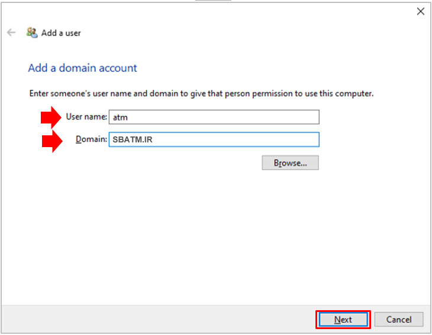

**Image analysis**

```json
{
 "image_name": "image153.jpg",
 "rId": "rId166",
 "image_path": "img_folder/image_152_image153.jpg",
 "caption": "پنجره افزودن حساب دامنه با نام کاربری atm و دامنه SBATM.IR",
 "ocr_text": "Add a user\nAdd a domain account\nEnter someone’s user name and domain to give that person permission to use this computer.\nUser name:\natm\nDomain:\nSBATM.IR\nBrowse...\nNext\nCancel",
 "visual_description": [
 "اسکرین شات پنجره «Add a user» با بخش «Add a domain account»",
 "فیلد «User name:» مقدار «atm» دارد",
 "فیلد «Domain:» مقدار «SBATM.IR» دارد",
 "دکمه های «Browse...»، «Next» و «Cancel» قابل مشاهده اند",
 "دو فلش قرمز به سمت فیلدهای User name و Domain اشاره می کنند"
 ],
 "image_type": "screenshot"
}
```

7. در پنجره ی زیر Administrator را انتخاب و روی دکمه ی Next کلیک کنید:

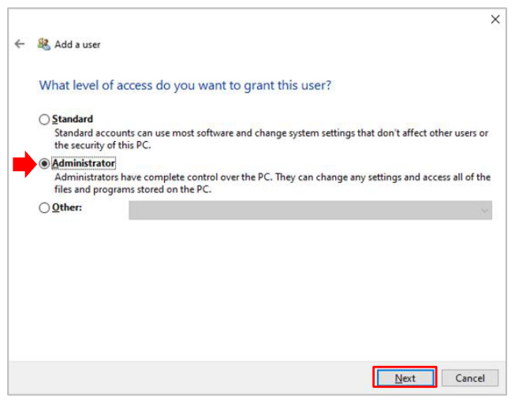

**Image analysis**

```json
{
 "image_name": "image154.tmp",
 "rId": "rId167",
 "image_path": "img_folder/image_153_image154.png",
 "caption": "پنجره افزودن کاربر ویندوز برای انتخاب سطح دسترسی استاندارد یا مدیر و دکمه Next",
 "ocr_text": "Add a user\nWhat level of access do you want to grant this user?\nStandard\nStandard accounts can use most software and change system settings that don't affect other users or\nthe security of this PC.\nAdministrator\nAdministrators have complete control over the PC. They can change any settings and access all of the\nfiles and programs stored on the PC.\nOther:\nNext\nCancel",
 "visual_description": [
 "اسکرین شات پنجره «Add a user» با سؤال انتخاب سطح دسترسی کاربر",
 "سه گزینه رادیویی: Standard، Administrator و Other",
 "گزینه Administrator انتخاب شده و با فلش قرمز به آن اشاره شده است",
 "پایین پنجره دکمه های Next و Cancel دیده می شود و Next با کادر قرمز مشخص شده است"
 ],
 "image_type": "screenshot"
}
```

8. روی دکمه ی Finish کلیک کنید تا عملیات اضافه نموده یوزر به پایان برسد:


**Image analysis**

```json
{
 "image_name": "image148.jpg",
 "rId": "rId161",
 "image_path": "img_folder/image_147_image148.jpg",
 "caption": "پنجره افزودن کاربر در ویندوز با دکمه های Finish و Cancel",
 "ocr_text": "Add a user\nYou’re almost done\nThe following user will be able to sign in to this PC and access system resources.\nSBATM.IR\\Computer name\nFinish\nCancel",
 "visual_description": [
 "اسکرین شات پنجره «Add a user» برای افزودن کاربر در ویندوز",
 "نمایش پیام «You’re almost done» و توضیح دسترسی کاربر به این PC",
 "نمایش نام کاربر/دامنه به صورت «SBATM.IR\\Computer name»",
 "وجود آیکون کاربر در سمت چپ",
 "دکمه های پایین: «Finish» (هایلایت/کادر قرمز) و «Cancel»"
 ],
 "image_type": "screenshot"
}
```

# اکتیو نمودن سیستم عامل

به منظور اکتیو نمودن سیستم عامل مراحل زیر را انجام دهید:

در صورت اکتیو نبودن سیستم عامل، عملکرد نرم افزار پردازشگران با اشکال مواجه خواهد شد.

1. کلیدهای ترکیبی Windows+E را بزنید تا پنجره Explorer باز شود.
2. به مسیر زیر بروید:

**C:\ATM\ ATM\_KMS\_LTSC**

3. روی فایل ATM\_KMS\_LTSC راست کلیک و از منویی که گشوده می شود
 Run As Administrator را انتخاب کنید:

**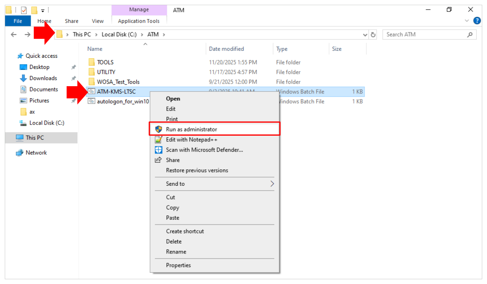

**Image analysis**

```json
{
 "image_name": "image155.png",
 "rId": "rId168",
 "image_path": "img_folder/image_154_image155.png",
 "caption": "اجرای فایل batch در ویندوز با گزینه Run as administrator در File Explorer",
 "ocr_text": "File\nHome\nShare\nView\nManage\nApplication Tools\nATM\nThis PC > Local Disk (C:) > ATM\nSearch ATM\nName\nDate modified\nType\nSize\nTOOLS\n11/20/2025 1:55 PM\nFile folder\nUTILITY\n11/17/2025 4:57 PM\nFile folder\nWOSA_Test_Tools\n9/21/2025 12:00 PM\nFile folder\nATM-KMS-LTSC\nWindows Batch File\n1 KB\nautologon_for_win10\nWindows Batch File\n1 KB\nQuick access\nDesktop\nDownloads\nDocuments\nPictures\nax\nLocal Disk (C:)\nThis PC\nNetwork\nOpen\nEdit\nPrint\nRun as administrator\nEdit with Notepad++\nScan with Microsoft Defender...\nShare\nRestore previous versions\nSend to\nCut\nCopy\nPaste\nCreate shortcut\nDelete\nRename\nProperties",
 "visual_description": [
 "پنجره File Explorer مسیر This PC > Local Disk (C:) > ATM را نشان می دهد",
 "فایل انتخاب شده ATM-KMS-LTSC با نوع Windows Batch File و اندازه 1 KB است",
 "منوی راست کلیک باز است و گزینه Run as administrator با کادر قرمز مشخص شده",
 "پوشه های TOOLS، UTILITY و WOSA_Test_Tools در لیست دیده می شوند",
 "فایل autologon_for_win10 نیز با نوع Windows Batch File و اندازه 1 KB نمایش داده شده"
 ],
 "image_type": "screenshot"
}
```**

4. در پنجره ی زیر روی Run کلیک نمایید:

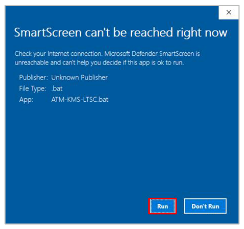

**Image analysis**

```json
{
 "image_name": "image156.tmp",
 "rId": "rId169",
 "image_path": "img_folder/image_155_image156.png",
 "caption": "پیغام Microsoft Defender SmartScreen درباره عدم دسترسی و اجرای فایل .bat",
 "ocr_text": "SmartScreen can't be reached right now\n\nCheck your Internet connection. Microsoft Defender SmartScreen is\nunreachable and can't help you decide if this app is ok to run.\n\nPublisher: Unknown Publisher\nFile Type: .bat\nApp: ATM-KMS-LTSC.bat\n\nRun\nDon't Run",
 "visual_description": [
 "پنجره هشدار SmartScreen با پس زمینه آبی و دکمه های «Run» و «Don't Run» در پایین",
 "نمایش مشخصات فایل: Publisher Unknown Publisher، File Type .bat، App ATM-KMS-LTSC.bat",
 "متن اعلام می کند SmartScreen قابل دسترسی نیست و برای تصمیم گیری اجرای برنامه کمک نمی کند"
 ],
 "image_type": "screenshot"
}
```

5. در مراحل بعدی، همانند تصاویر زیر در کادر پیغامی که باز می شود، روی دکمه ی OK کلیک کنید:

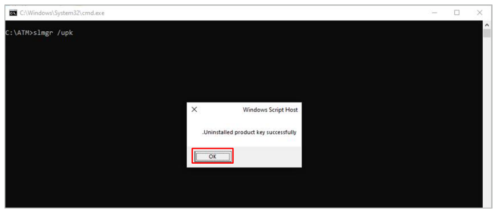

**Image analysis**

```json
{
 "image_name": "image157.tmp",
 "rId": "rId170",
 "image_path": "img_folder/image_156_image157.png",
 "caption": "پنجره CMD با دستور slmgr /upk و پیام موفقیت حذف کلید محصول",
 "ocr_text": "C:\\Windows\\System32\\cmd.exe\n\nC:\\ATM>slmgr /upk\n\nWindows Script Host\n\n.Uninstalled product key successfully\n\nOK",
 "visual_description": [
 "پنجره Command Prompt با عنوان C:\\Windows\\System32\\cmd.exe نمایش داده شده است.",
 "در خط فرمان مسیر C:\\ATM> و دستور slmgr /upk دیده می شود.",
 "یک پنجره Windows Script Host روی CMD باز است.",
 "متن پیام: .Uninstalled product key successfully",
 "دکمه OK در پنجره پیام وجود دارد و با کادر قرمز مشخص شده است."
 ],
 "image_type": "screenshot"
}
```

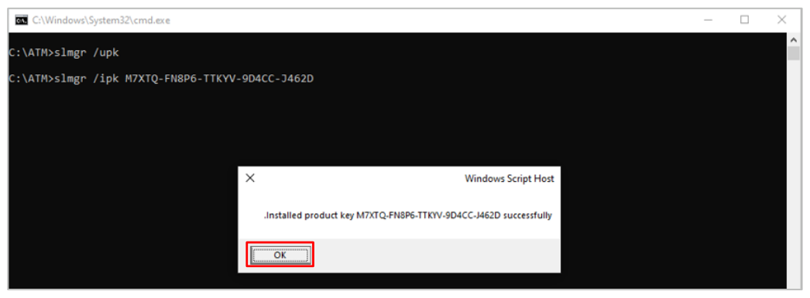

**Image analysis**

```json
{
 "image_name": "image158.tmp",
 "rId": "rId171",
 "image_path": "img_folder/image_157_image158.png",
 "caption": "نصب کلید محصول ویندوز با slmgr در CMD و پیام موفقیت Windows Script Host",
 "ocr_text": "C:\\Windows\\System32\\cmd.exe\n\nC:\\ATM>slmgr /upk\n\nC:\\ATM>slmgr /ipk M7XTQ-FN8P6-TTKYV-9D4CC-J462D\n\nWindows Script Host\n\nInstalled product key M7XTQ-FN8P6-TTKYV-9D4CC-J462D successfully.\n\nOK",
 "visual_description": [
 "پنجره Command Prompt در مسیر C:\\ATM نمایش داده شده است",
 "دو دستور اجرا شده اند: slmgr /upk و slmgr /ipk به همراه کلید محصول",
 "کادر محاوره ای Windows Script Host پیام نصب موفق کلید محصول را نشان می دهد",
 "دکمه OK در کادر پیام با کادر قرمز هایلایت شده است"
 ],
 "image_type": "screenshot"
}
```

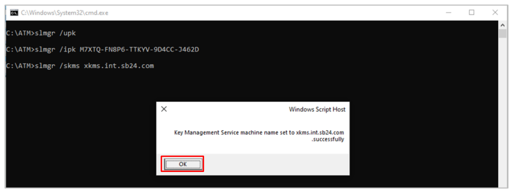

**Image analysis**

```json
{
 "image_name": "image159.tmp",
 "rId": "rId172",
 "image_path": "img_folder/image_158_image159.png",
 "caption": "تنظیم سرور KMS با دستور slmgr در Command Prompt ویندوز",
 "ocr_text": "C:\\Windows\\System32\\cmd.exe\n\nC:\\ATM>slmgr /upk\n\nC:\\ATM>slmgr /ipk M7XTQ-FN8P6-TTKYV-9D4CC-J462D\n\nC:\\ATM>slmgr /skms xkms.int.sb24.com\n\nWindows Script Host\n\nKey Management Service machine name set to xkms.int.sb24.com\nsuccessfully\n\nOK",
 "visual_description": [
 "پنجره Command Prompt مسیر C:\\ATM را نشان می دهد.",
 "سه دستور slmgr شامل /upk، /ipk و /skms اجرا شده اند.",
 "کلید محصول به صورت M7XTQ-FN8P6-TTKYV-9D4CC-J462D نمایش داده شده است.",
 "سرور KMS با مقدار xkms.int.sb24.com تنظیم شده است.",
 "پنجره Windows Script Host پیام موفقیت و دکمه OK دارد."
 ],
 "image_type": "screenshot"
}
```

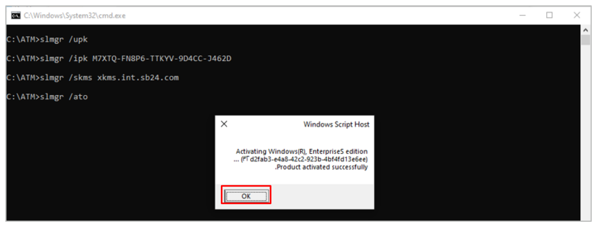

**Image analysis**

```json
{
 "image_name": "image160.tmp",
 "rId": "rId173",
 "image_path": "img_folder/image_159_image160.png",
 "caption": "اجرای دستورات slmgr در CMD و پیام موفقیت آمیز فعال سازی Windows Enterprise",
 "ocr_text": "C:\\Windows\\System32\\cmd.exe\n\nC:\\ATM>slmgr /upk\n\nC:\\ATM>slmgr /ipk M7XTQ-FN8P6-TTKVY-9D4CC-J462D\n\nC:\\ATM>slmgr /skms xkms.int.sb24.com\n\nC:\\ATM>slmgr /ato\n\nWindows Script Host\n\nActivating Windows(R), EnterpriseS edition\n... (f7d2fab3-e4a8-42c2-923b-4bf4fd13e6ee)\n.Product activated successfully\n\nOK",
 "visual_description": [
 "پنجره Command Prompt با مسیر C:\\ATM و اجرای دستورات slmgr /upk، /ipk، /skms و /ato نمایش داده شده است",
 "کلید محصول به صورت M7XTQ-FN8P6-TTKVY-9D4CC-J462D در خط فرمان دیده می شود",
 "سرور KMS با آدرس xkms.int.sb24.com در دستور /skms مشخص شده است",
 "پنجره Windows Script Host پیام «Product activated successfully» را نشان می دهد",
 "دکمه OK در پنجره Windows Script Host با کادر قرمز مشخص شده است"
 ],
 "image_type": "screenshot"
}
```

6. در گوشه پایین سمت چپ صفحه روی دکمه ی

**Image analysis**

```json
{
 "image_name": "image113.tmp",
 "rId": "rId126",
 "image_path": "img_folder/image_112_image113.png",
 "caption": "آیکون سفید ویندوز روی پس زمینه تیره",
 "ocr_text": "",
 "visual_description": [
 "یک لوگوی چهارقسمتی شبیه پنجره در رنگ سفید دیده می شود",
 "پس زمینه تصویر یکدست و تیره است"
 ],
 "image_type": "unknown"
}
``` کلیک کنید تا منوی Start نمایان شود.
7. کلمه ی system را تایپ و همانند تصویر زیر، رویSystem کلیک نمایید:

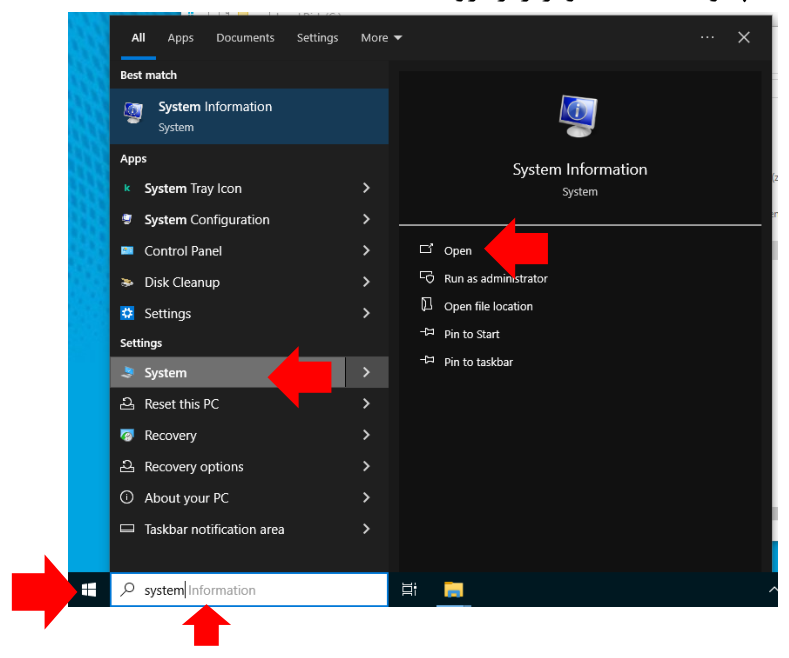

**Image analysis**

```json
{
 "image_name": "image161.png",
 "rId": "rId174",
 "image_path": "img_folder/image_160_image161.png",
 "caption": "اسکرین شات جستجوی ویندوز برای System Information با گزینه Run as administrator",
 "ocr_text": "All\nApps\nDocuments\nSettings\nMore\nBest match\nSystem Information\nSystem\nApps\nSystem Tray Icon\nSystem Configuration\nControl Panel\nDisk Cleanup\nSettings\nSettings\nSystem\nReset this PC\nRecovery\nRecovery options\nAbout your PC\nTaskbar notification area\nSystem Information\nSystem\nOpen\nRun as administrator\nOpen file location\nPin to Start\nPin to taskbar\nsystem\nInformation",
 "visual_description": [
 "منوی جستجوی ویندوز باز است و عبارت «system Information» در کادر جستجو وارد شده",
 "در بخش Best match، نتیجه «System Information» نمایش داده شده",
 "در پنل راست گزینه های «Open»، «Run as administrator»، «Open file location»، «Pin to Start»، «Pin to taskbar» دیده می شود",
 "دو فلش قرمز به گزینه «System» در فهرست Settings و به گزینه «Open» اشاره می کنند",
 "فلش قرمز در پایین به دکمه Start و کادر جستجو اشاره دارد"
 ],
 "image_type": "screenshot"
}
```

8. در پنجره ی زیر روی Change product key or upgrade your … مشخص شده در تصویر کلیک نمایید:

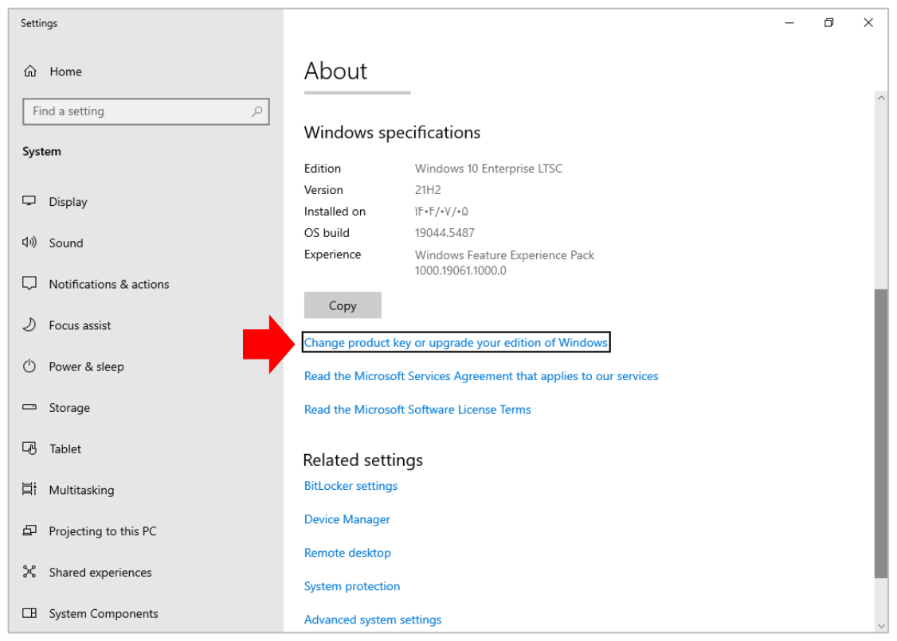

**Image analysis**

```json
{
 "image_name": "image162.png",
 "rId": "rId175",
 "image_path": "img_folder/image_161_image162.png",
 "caption": "اسکرین شات تنظیمات About ویندوز ۱۰ با مشخصات نسخه و لینک تغییر Product Key",
 "ocr_text": "Settings\nHome\nFind a setting\nSystem\nDisplay\nSound\nNotifications & actions\nFocus assist\nPower & sleep\nStorage\nTablet\nMultitasking\nProjecting to this PC\nShared experiences\nSystem Components\nAbout\nWindows specifications\nEdition\nWindows 10 Enterprise LTSC\nVersion\n21H2\nInstalled on\n۱۴۰۲/۰۷/۰۵\nOS build\n19044.5487\nExperience\nWindows Feature Experience Pack\n1000.19061.1000.0\nCopy\nChange product key or upgrade your edition of Windows\nRead the Microsoft Services Agreement that applies to our services\nRead the Microsoft Software License Terms\nRelated settings\nBitLocker settings\nDevice Manager\nRemote desktop\nSystem protection\nAdvanced system settings",
 "visual_description": [
 "صفحه Settings ویندوز در بخش System > About نمایش داده شده است",
 "مشخصات Windows specifications شامل Edition: Windows 10 Enterprise LTSC و Version: 21H2 است",
 "OS build برابر 19044.5487 و Windows Feature Experience Pack برابر 1000.19061.1000.0 نمایش داده شده است",
 "تاریخ Installed on به صورت ۱۴۰۲/۰۷/۰۵ درج شده است",
 "یک فلش قرمز به لینک «Change product key or upgrade your edition of Windows» اشاره می کند",
 "در بخش Related settings لینک های BitLocker settings، Device Manager، Remote desktop، System protection و Advanced system settings وجود دارد"
 ],
 "image_type": "screenshot"
}
```

درصورت انجام موفقیت آمیز عملیات اکتیوسازی ویندوز، عبارت زیر در قسمت Activation به نمایش گذاشته خواهد شد:

**Windows is activated using your organization’s activation service**

**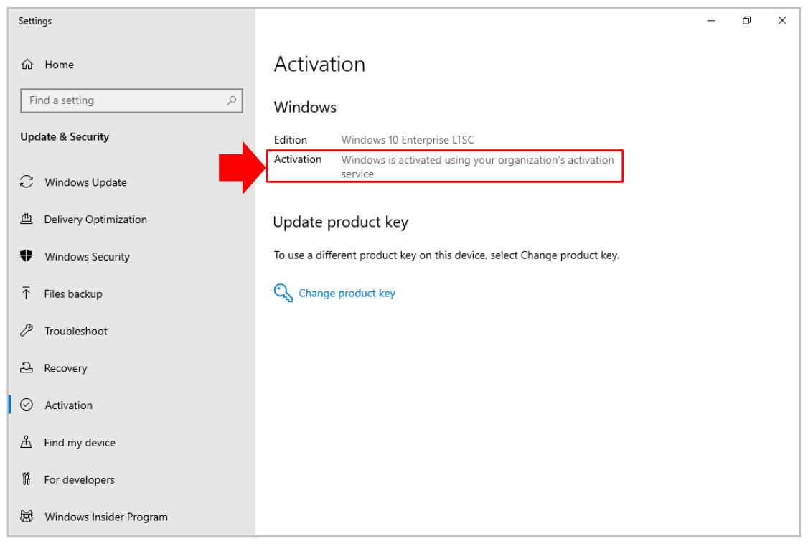

**Image analysis**

```json
{
 "image_name": "image163.png",
 "rId": "rId176",
 "image_path": "img_folder/image_162_image163.png",
 "caption": "صفحه Activation ویندوز ۱۰ و وضعیت فعال سازی با سرویس سازمانی",
 "ocr_text": "Settings\nHome\nFind a setting\nUpdate & Security\nWindows Update\nDelivery Optimization\nWindows Security\nFiles backup\nTroubleshoot\nRecovery\nActivation\nFind my device\nFor developers\nWindows Insider Program\nActivation\nWindows\nEdition\nWindows 10 Enterprise LTSC\nActivation\nWindows is activated using your organization's activation\nservice\nUpdate product key\nTo use a different product key on this device, select Change product key.\nChange product key",
 "visual_description": [
 "اسکرین شات Settings ویندوز در مسیر Update & Security > Activation",
 "نمایش Edition: Windows 10 Enterprise LTSC",
 "نمایش پیام فعال سازی: Windows is activated using your organization's activation service",
 "بخش Update product key و لینک Change product key قابل مشاهده است",
 "یک کادر قرمز دور متن وضعیت فعال سازی و یک فلش قرمز به آن اشاره می کند"
 ],
 "image_type": "screenshot"
}
```**

# انجام تنظیمات Autologon

جهت اعمال تنظیمات Autologon و برای اینکه در هر بار ورود به سیستم عامل، پنجره ی درخواست
User name و Password به نمایش گذاشته نشود، مراحل زیر را انجام دهید:

1. به مسیر زیر بروید:

**C:\ATM\autologon\_for\_win10**

1. روی فایل autologon\_for\_win10 راست کلیک و از منویی که گشوده می شود،
 Run As Administrator را انتخاب کنید:

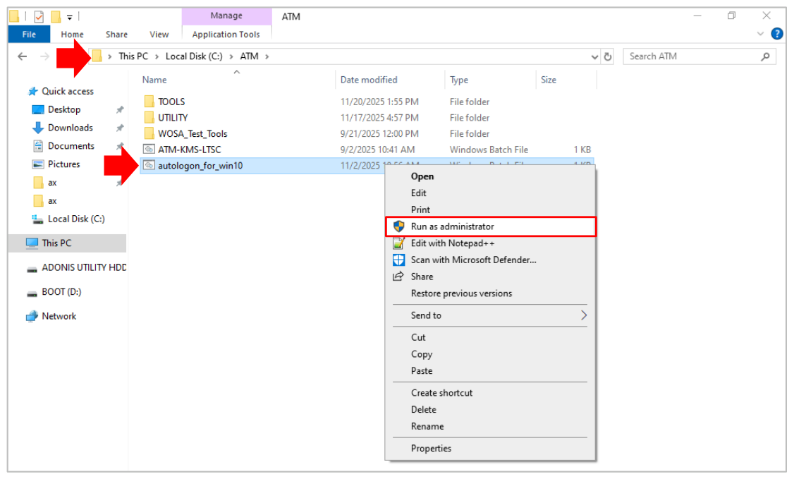

**Image analysis**

```json
{
 "image_name": "image164.png",
 "rId": "rId177",
 "image_path": "img_folder/image_163_image164.png",
 "caption": "منوی راست کلیک فایل autologon_for_win10 در ویندوز و گزینه Run as administrator",
 "ocr_text": "File\nHome\nShare\nView\nManage\nApplication Tools\nATM\nThis PC > Local Disk (C:) > ATM\nSearch ATM\nQuick access\nDesktop\nDownloads\nDocuments\nPictures\nax\nax\nLocal Disk (C:)\nThis PC\nADONIS UTILITY HDD\nBOOT (D:)\nNetwork\nName\nDate modified\nType\nSize\nTOOLS\nUTILITY\nWOSA_Test_Tools\nATM-KMS-LTSC\nautologon_for_win10\n11/20/2025 1:55 PM\nFile folder\n11/17/2025 4:57 PM\nFile folder\n9/21/2025 12:00 PM\nFile folder\n9/2/2025 10:41 AM\nWindows Batch File\n1 KB\n11/2/2025 1:55 PM\nOpen\nEdit\nPrint\nRun as administrator\nEdit with Notepad++\nScan with Microsoft Defender...\nShare\nRestore previous versions\nSend to\nCut\nCopy\nPaste\nCreate shortcut\nDelete\nRename\nProperties",
 "visual_description": [
 "اسکرین شات File Explorer در مسیر This PC > Local Disk (C:) > ATM",
 "فهرست پوشه ها: TOOLS، UTILITY، WOSA_Test_Tools",
 "فایل ATM-KMS-LTSC با نوع Windows Batch File و اندازه 1 KB نمایش داده شده است",
 "فایل autologon_for_win10 انتخاب شده و منوی راست کلیک باز است",
 "گزینه Run as administrator با کادر قرمز هایلایت شده است",
 "دو فلش قرمز به نوار بالا و ردیف فایل انتخاب شده اشاره می کنند"
 ],
 "image_type": "screenshot"
}
```

3. عملیات اعمال تنظیمات به شکل خودکار آغاز می شود و با نمایش پنجره ی زیر پایان می پذیرد:

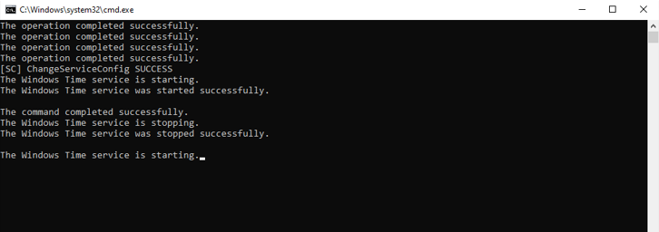

**Image analysis**

```json
{
 "image_name": "image165.tmp",
 "rId": "rId178",
 "image_path": "img_folder/image_164_image165.png",
 "caption": "خروجی Command Prompt از تغییر تنظیمات سرویس Windows Time و توقف/شروع سرویس",
 "ocr_text": "C:\\Windows\\system32\\cmd.exe\n\nThe operation completed successfully.\nThe operation completed successfully.\nThe operation completed successfully.\nThe operation completed successfully.\n[SC] ChangeServiceConfig SUCCESS\nThe Windows Time service is starting.\nThe Windows Time service was started successfully.\n\nThe command completed successfully.\nThe Windows Time service is stopping.\nThe Windows Time service was stopped successfully.\n\nThe Windows Time service is starting…",
 "visual_description": [
 "پنجره Command Prompt ویندوز با مسیر عنوان C:\\Windows\\system32\\cmd.exe نمایش داده شده است",
 "پیام های موفقیت آمیز متعدد شامل ChangeServiceConfig و شروع/توقف سرویس Windows Time دیده می شود"
 ],
 "image_type": "screenshot"
}
```

4. کلید Enter را بزنید تا پنجره ی فوق بسته شود.

# انجام تنظیمات مربوط به زبان محیط ویندوز

جهت تعیین زبان فارسی مراحل زیر را انجام دهید:

1. در گوشه پایین سمت چپ صفحه روی دکمه ی

**Image analysis**

```json
{
 "image_name": "image113.tmp",
 "rId": "rId126",
 "image_path": "img_folder/image_112_image113.png",
 "caption": "آیکون سفید ویندوز روی پس زمینه تیره",
 "ocr_text": "",
 "visual_description": [
 "یک لوگوی چهارقسمتی شبیه پنجره در رنگ سفید دیده می شود",
 "پس زمینه تصویر یکدست و تیره است"
 ],
 "image_type": "unknown"
}
``` کلیک کنید تا منوی Start نمایان شود. عبارت control panel را تایپ و همانند تصویر زیر، در قسمت فوقانی منو روی
 Control Panel کلیک نمایید:

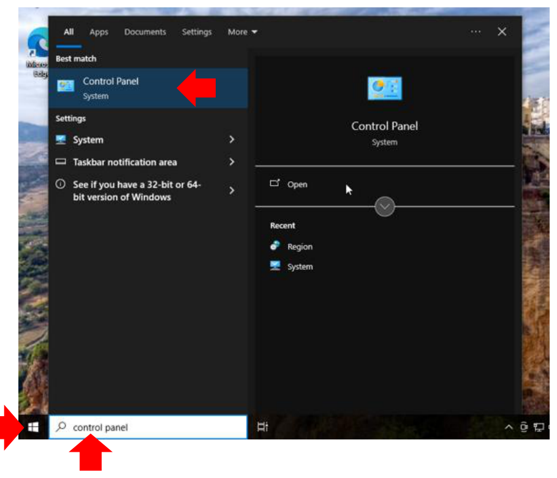

**Image analysis**

```json
{
 "image_name": "image166.tmp",
 "rId": "rId179",
 "image_path": "img_folder/image_165_image166.png",
 "caption": "جستجوی Control Panel در منوی Start ویندوز و نمایش نتیجه Best match",
 "ocr_text": "All\nApps\nDocuments\nSettings\nMore\nBest match\nControl Panel\nSystem\nSettings\nSystem\nTaskbar notification area\nSee if you have a 32-bit or 64-bit version of Windows\nControl Panel\nSystem\nOpen\nRecent\nRegion\nSystem\ncontrol panel",
 "visual_description": [
 "پنجره جستجوی Start ویندوز با برگه های All, Apps, Documents, Settings, More دیده می شود",
 "نتیجه Best match شامل گزینه «Control Panel» با زیرعنوان «System» هایلایت شده است",
 "بخش سمت راست جزئیات «Control Panel» و گزینه «Open» را نشان می دهد",
 "در قسمت Recent موارد «Region» و «System» نمایش داده شده اند",
 "در کادر جستجو پایین عبارت «control panel» تایپ شده است",
 "فلش های قرمز روی دکمه Start، کادر جستجو و نتیجه «Control Panel» قرار گرفته اند"
 ],
 "image_type": "screenshot"
}
```

2. در پنجره ی Control panel، روی Region کلیک نمایید تا به صفحه تنظیمات مربوطه بروید:

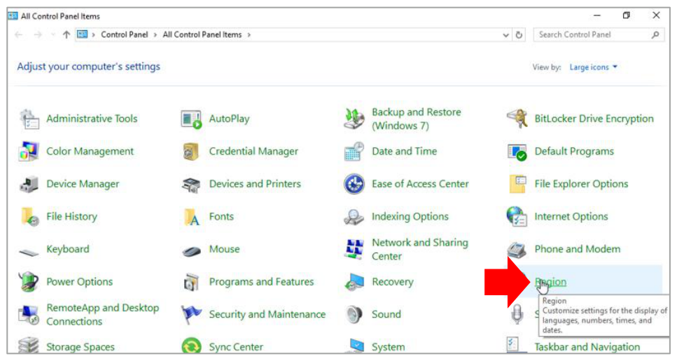

**Image analysis**

```json
{
 "image_name": "image167.tmp",
 "rId": "rId180",
 "image_path": "img_folder/image_166_image167.png",
 "caption": "اسکرین شات کنترل پنل ویندوز با فلش قرمز روی گزینه Region",
 "ocr_text": "All Control Panel Items\nControl Panel > All Control Panel Items\nSearch Control Panel\nView by: Large icons\nAdjust your computer's settings\nAdministrative Tools\nAutoPlay\nBackup and Restore\n(Windows 7)\nBitLocker Drive Encryption\nColor Management\nCredential Manager\nDate and Time\nDefault Programs\nDevice Manager\nDevices and Printers\nEase of Access Center\nFile Explorer Options\nFile History\nFonts\nIndexing Options\nInternet Options\nKeyboard\nMouse\nNetwork and Sharing\nCenter\nPhone and Modem\nPower Options\nPrograms and Features\nRecovery\nRegion\nRemoteApp and Desktop\nConnections\nSecurity and Maintenance\nSound\nStorage Spaces\nSync Center\nSystem\nRegion\nCustomize settings for the display of\nlanguages, numbers, times, and\ndates.\nTaskbar and Navigation",
 "visual_description": [
 "نمایش Control Panel در حالت All Control Panel Items با View by: Large icons",
 "فلش قرمز به آیتم «Region» در ستون راست اشاره می کند",
 "کادر راهنما (tooltip) برای Region با توضیح تنظیمات زبان ها، اعداد، زمان ها و تاریخ ها دیده می شود"
 ],
 "image_type": "screenshot"
}
```

3. در پنجره یRegion، از تب Formats و از کادر کشویی Format: گزینه ی Persian(Iran) را انتخاب و روی دکمه ی Applyکلیک کنید:

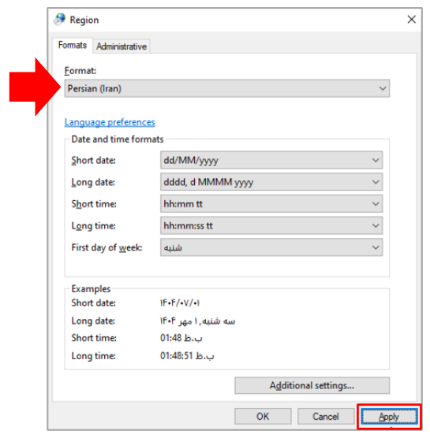

**Image analysis**

```json
{
 "image_name": "image168.tmp",
 "rId": "rId181",
 "image_path": "img_folder/image_167_image168.png",
 "caption": "پنجره تنظیمات Region ویندوز با انتخاب Persian (Iran) و نمایش فرمت تاریخ و زمان",
 "ocr_text": "Region\nFormats Administrative\nFormat:\nPersian (Iran)\nLanguage preferences\nDate and time formats\nShort date:\ndd/MM/yyyy\nLong date:\ndddd, d MMMM yyyy\nShort time:\nhh:mm tt\nLong time:\nhh:mm:ss tt\nFirst day of week:\nشنبه\nExamples\nShort date:\n۱۴۰۴/۰۷/۱\nLong date:\n۱۴۰۴ مهر ۱, سه شنبه\nShort time:\n01:48 ب.ظ\nLong time:\n01:48:51 ب.ظ\nAdditional settings...\nOK\nCancel\nApply",
 "visual_description": [
 "پنجره Region با تب های Formats و Administrative نمایش داده شده است.",
 "در بخش Format مقدار Persian (Iran) انتخاب شده است.",
 "فیلدهای Short date، Long date، Short time، Long time و First day of week با منوهای کشویی دیده می شوند.",
 "در Examples نمونه های تاریخ و زمان به ارقام فارسی و نشانه ب.ظ نمایش داده شده است.",
 "دکمه های OK، Cancel و Apply در پایین پنجره قرار دارند و دکمه Apply با کادر قرمز مشخص شده است.",
 "یک فلش قرمز در سمت چپ به ناحیه انتخاب Format اشاره می کند."
 ],
 "image_type": "screenshot"
}
```

4. در پنجره ی فوق روی تب Administrative کلیک کنید.
5. روی دکمه ی Change system locale… کلیک نمایید:

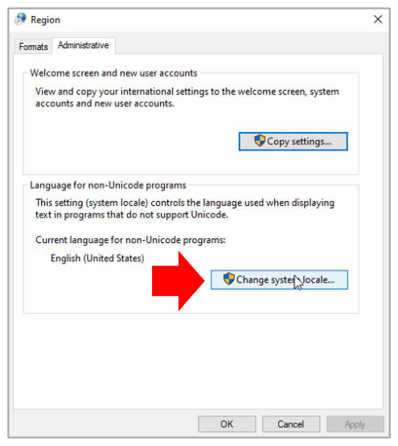

**Image analysis**

```json
{
 "image_name": "image169.tmp",
 "rId": "rId182",
 "image_path": "img_folder/image_168_image169.png",
 "caption": "پنجره Region ویندوز با گزینه Change system locale برای برنامه های غیر یونی کد",
 "ocr_text": "Region\nFormats Administrative\nWelcome screen and new user accounts\nView and copy your international settings to the welcome screen, system accounts and new user accounts.\nCopy settings...\nLanguage for non-Unicode programs\nThis setting (system locale) controls the language used when displaying text in programs that do not support Unicode.\nCurrent language for non-Unicode programs:\nEnglish (United States)\nChange system locale...\nOK Cancel Apply",
 "visual_description": [
 "پنجره تنظیمات Region با تب Administrative نمایش داده شده است",
 "بخش Welcome screen and new user accounts دارای دکمه Copy settings... است",
 "بخش Language for non-Unicode programs مقدار Current language را English (United States) نشان می دهد",
 "دکمه Change system locale... با کادر آبی برجسته شده و یک فلش قرمز به آن اشاره می کند",
 "پایین پنجره دکمه های OK، Cancel و Apply دیده می شوند"
 ],
 "image_type": "screenshot"
}
```

6. در پنجره ی Region Settings، از کادر کشویی Current System locale، زبان Persian(Iran) را انتخاب و روی دکمه ی OK کلیک کنید:

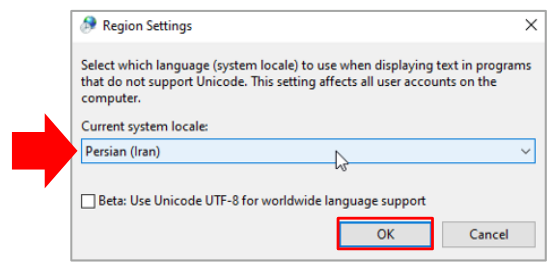

**Image analysis**

```json
{
 "image_name": "image170.tmp",
 "rId": "rId183",
 "image_path": "img_folder/image_169_image170.png",
 "caption": "پنجره Region Settings ویندوز با انتخاب Persian (Iran) برای Current system locale",
 "ocr_text": "Region Settings\nSelect which language (system locale) to use when displaying text in programs\nthat do not support Unicode. This setting affects all user accounts on the\ncomputer.\nCurrent system locale:\nPersian (Iran)\nBeta: Use Unicode UTF-8 for worldwide language support\nOK\nCancel",
 "visual_description": [
 "پنجره تنظیمات Region Settings نمایش داده شده است",
 "فهرست کشویی Current system locale روی Persian (Iran) تنظیم شده است",
 "گزینه Beta: Use Unicode UTF-8 for worldwide language support به صورت چک باکس دیده می شود و تیک نخورده است",
 "دکمه OK با کادر قرمز مشخص شده است",
 "یک فلش قرمز به سمت بخش انتخاب Persian (Iran) اشاره می کند",
 "دکمه های OK و Cancel در پایین پنجره وجود دارند"
 ],
 "image_type": "screenshot"
}
```

7. در کادر پیغامی که نمایان می شود، روی دکمه ی Restart now کلیک کنید تا دستگاه Restart شود:

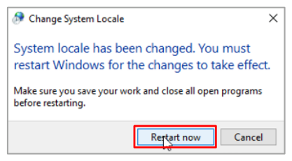

**Image analysis**

```json
{
 "image_name": "image171.tmp",
 "rId": "rId184",
 "image_path": "img_folder/image_170_image171.png",
 "caption": "پنجره تغییر System Locale با پیام نیاز به راه اندازی مجدد ویندوز",
 "ocr_text": "Change System Locale\n\nSystem locale has been changed. You must\nrestart Windows for the changes to take effect.\n\nMake sure you save your work and close all open programs\nbefore restarting.\n\nRestart now Cancel",
 "visual_description": [
 "پنجره گفتگوی ویندوز با عنوان «Change System Locale» نمایش داده شده است",
 "متن پیام اعلام می کند System locale تغییر کرده و برای اعمال تغییرات باید Windows ریستارت شود",
 "دو دکمه «Restart now» و «Cancel» در پایین پنجره وجود دارد",
 "دکمه «Restart now» با یک کادر قرمز برجسته شده است"
 ],
 "image_type": "screenshot"
}
```

دستگاه Restart خواهد شد.

# *راه اندازی دوربین* BNC

درصورتی که دوربین دستگاه از نوع BNC است لازم است ابتدا درایور را نصب کنید:

1. از مسیر زیر روی فایل Osprey\_AnalogPCI\_64bit\_5.0.1.93\_Installer راست کلیک کنید و از منویی که گشوده می شود Run as administrator را انتخاب کنید:

**C:\ATM\UTILITY\Driver\Osprey\_AnalogPCI\_64bit\_5.0.1.93\_Installer**

2. کادر زیر را تایید کنید:

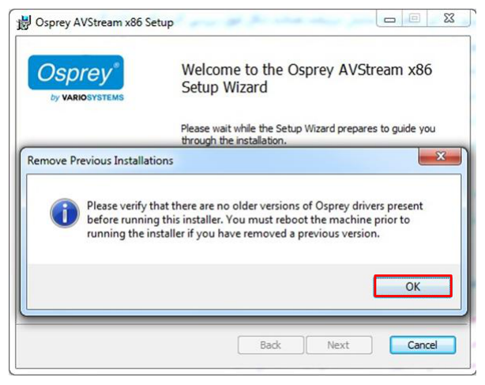

**Image analysis**

```json
{
 "image_name": "image172.png",
 "rId": "rId185",
 "image_path": "img_folder/image_171_image172.png",
 "caption": "پنجره نصب Osprey AVStream x86 با پیام حذف نسخه های قبلی و دکمه OK",
 "ocr_text": "Osprey AVStream x86 Setup\nOsprey\nby VARIOSYSTEMS\nWelcome to the Osprey AVStream x86\nSetup Wizard\nPlease wait while the Setup Wizard prepares to guide you\nthrough the installation.\nRemove Previous Installations\nPlease verify that there are no older versions of Osprey drivers present\nbefore running this installer. You must reboot the machine prior to\nrunning the installer if you have removed a previous version.\nOK\nBack\nNext\nCancel",
 "visual_description": [
 "اسکرین شات ویزارد نصب «Osprey AVStream x86 Setup» در ویندوز",
 "نمایش لوگوی Osprey و عبارت «by VARIOSYSTEMS» در بالای پنجره",
 "یک دیالوگ با عنوان «Remove Previous Installations» و آیکون اطلاعات آبی دیده می شود",
 "متن هشدار درباره نبود نسخه های قدیمی درایور و نیاز به ریبوت پس از حذف نسخه قبلی نمایش داده شده است",
 "دکمه «OK» در دیالوگ (با کادر قرمز) و دکمه های «Back»، «Next»، «Cancel» در پایین ویزارد وجود دارد"
 ],
 "image_type": "screenshot"
}
```

3. سپس با انتخابNext به مرحله بعد بروید:

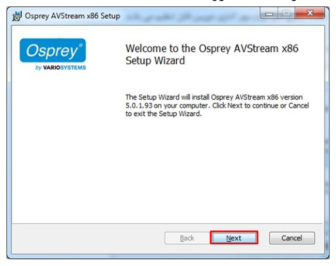

**Image analysis**

```json
{
 "image_name": "image173.png",
 "rId": "rId186",
 "image_path": "img_folder/image_172_image173.png",
 "caption": "پنجره خوش آمدگویی نصب Osprey AVStream x86 با دکمه Next مشخص شده",
 "ocr_text": "Osprey AVStream x86 Setup\nOsprey\nby VARIOSYSTEMS\nWelcome to the Osprey AVStream x86\nSetup Wizard\nThe Setup Wizard will install Osprey AVStream x86 version\n5.0.1.93 on your computer. Click Next to continue or Cancel\nto exit the Setup wizard.\nBack\nNext\nCancel",
 "visual_description": [
 "اسکرین شات ویزارد نصب با عنوان «Osprey AVStream x86 Setup»",
 "نمایش لوگوی Osprey و متن «by VARIOSYSTEMS» در سمت چپ",
 "متن توضیح نصب نسخه 5.0.1.93 در بدنه پنجره",
 "سه دکمه پایین: Back (غیرفعال)، Next، Cancel",
 "دکمه Next با کادر قرمز برجسته شده است"
 ],
 "image_type": "screenshot"
}
```

4. مطابق تصویر چک باکس را علامت زده و Next را انتخاب نمایید:

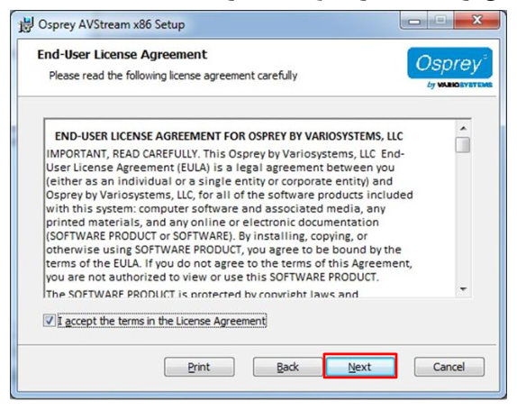

**Image analysis**

```json
{
 "image_name": "image174.png",
 "rId": "rId187",
 "image_path": "img_folder/image_173_image174.png",
 "caption": "پنجره نصب Osprey AVStream با متن توافق نامه و گزینه پذیرش و دکمه Next",
 "ocr_text": "Osprey AVStream x86 Setup\nEnd-User License Agreement\nPlease read the following license agreement carefully\nOsprey\nby VIASYSYSTEMS\nEND-USER LICENSE AGREEMENT FOR OSPREY BY VARIOSYSTEMS, LLC\nIMPORTANT, READ CAREFULLY. This Osprey by Variosystems, LLC End-\nUser License Agreement (EULA) is a legal agreement between you\n(either as an individual or a single entity or corporate entity) and\nOsprey by Variosystems, LLC, for all of the software products included\nwith this system: computer software and associated media, any\nprinted materials, and any online or electronic documentation\n(\"SOFTWARE PRODUCT or SOFTWARE\"). By installing, copying, or\notherwise using SOFTWARE PRODUCT, you agree to be bound by the\nterms of this EULA. If you do not agree to the terms of this Agreement,\nyou are not authorized to view or use this SOFTWARE PRODUCT.\nThe SOFTWARE PRODUCT is protected by copyright laws and\nI accept the terms in the License Agreement\nPrint\nBack\nNext\nCancel",
 "visual_description": [
 "پنجره نصب با عنوان «Osprey AVStream x86 Setup» نمایش داده شده است.",
 "بخش «End-User License Agreement» و یک جعبه متن اسکرول دار حاوی متن EULA دیده می شود.",
 "یک چک باکس با برچسب «I accept the terms in the License Agreement» وجود دارد و تیک خورده است.",
 "چهار دکمه پایین پنجره: Print، Back، Next، Cancel.",
 "دکمه «Next» با کادر قرمز برجسته شده است.",
 "لوگوی «Osprey by VIASYSYSTEMS» در گوشه بالا-راست قرار دارد."
 ],
 "image_type": "screenshot"
}
```

5. از منوی کشویی گزینه PAL را انتخاب کرده و با Next به مرحله بعد بروید:

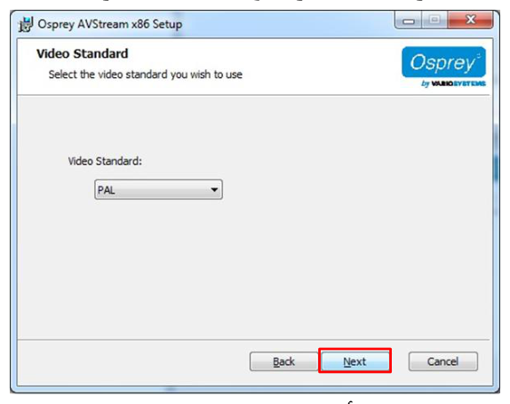

**Image analysis**

```json
{
 "image_name": "image175.png",
 "rId": "rId188",
 "image_path": "img_folder/image_174_image175.png",
 "caption": "پنجره نصب Osprey AVStream برای انتخاب استاندارد ویدئو (PAL) و دکمه Next",
 "ocr_text": "Osprey AVStream x86 Setup\nVideo Standard\nSelect the video standard you wish to use\nOsprey\nby VIDEO SYSTEMS\nVideo Standard:\nPAL\nBack\nNext\nCancel",
 "visual_description": [
 "پنجره نصب با عنوان Osprey AVStream x86 Setup نمایش داده شده است",
 "بخش Video Standard دارای متن راهنما برای انتخاب استاندارد ویدئو است",
 "یک فهرست کشویی با برچسب Video Standard: وجود دارد و مقدار PAL انتخاب شده است",
 "سه دکمه پایین پنجره: Back، Next و Cancel دیده می شود",
 "دکمه Next با کادر قرمز برجسته شده است",
 "لوگوی Osprey by VIDEO SYSTEMS در گوشه راست بالا قرار دارد"
 ],
 "image_type": "screenshot"
}
```

6. مسیر پیش فرض را با انتخاب Next تایید نمایید:

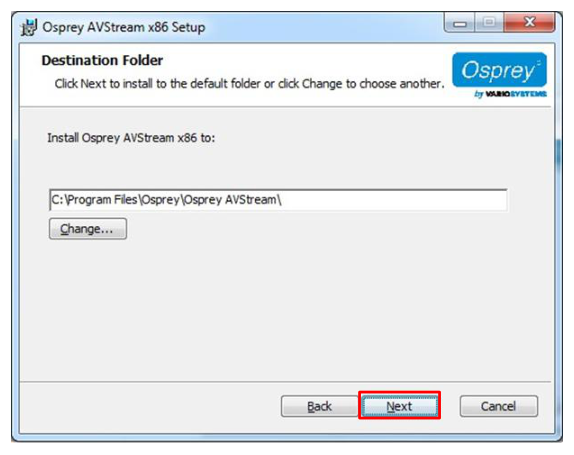

**Image analysis**

```json
{
 "image_name": "image176.png",
 "rId": "rId189",
 "image_path": "img_folder/image_175_image176.png",
 "caption": "پنجره نصب Osprey AVStream x86 برای انتخاب مسیر نصب و دکمه Next",
 "ocr_text": "Osprey AVStream x86 Setup\nDestination Folder\nClick Next to install to the default folder or click Change to choose another.\nOsprey\nby VIDEO SYSTEMS\nInstall Osprey AVStream x86 to:\nC:\\Program Files\\Osprey\\Osprey AVStream\\\nChange...\nBack\nNext\nCancel",
 "visual_description": [
 "پنجره Setup مربوط به Osprey AVStream x86 نمایش داده شده است",
 "بخش Destination Folder و کادر مسیر نصب با مقدار C:\\Program Files\\Osprey\\Osprey AVStream\\ دیده می شود",
 "دکمه Change... برای تغییر مسیر نصب وجود دارد",
 "دکمه های Back، Next و Cancel در پایین پنجره قرار دارند",
 "دکمه Next با کادر قرمز مشخص شده است",
 "لوگوی Osprey by VIDEO SYSTEMS در گوشه بالا-راست دیده می شود"
 ],
 "image_type": "screenshot"
}
```

7. با انتخاب دکمه Install نصب را ادامه دهید:

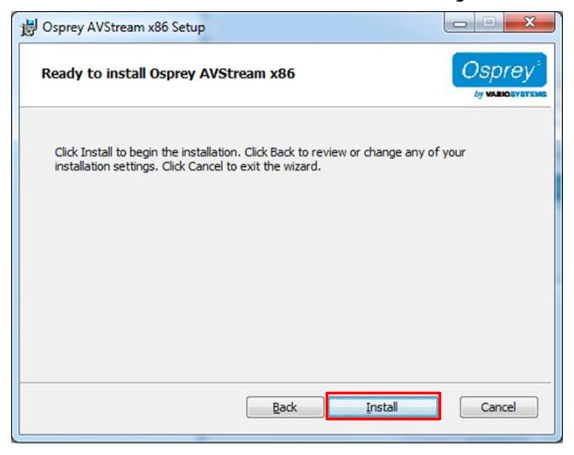

**Image analysis**

```json
{
 "image_name": "image177.png",
 "rId": "rId190",
 "image_path": "img_folder/image_176_image177.png",
 "caption": "پنجره نصب Osprey AVStream x86 با دکمه Install مشخص شده",
 "ocr_text": "Osprey AVStream x86 Setup\nReady to install Osprey AVStream x86\nClick Install to begin the installation. Click Back to review or change any of your installation settings. Click Cancel to exit the wizard.\nBack\nInstall\nCancel\nOsprey\nby VIDEO SYSTEMS",
 "visual_description": [
 "اسکرین شات یک ویزارد نصب با عنوان «Osprey AVStream x86 Setup»",
 "متن وضعیت «Ready to install Osprey AVStream x86» نمایش داده شده است",
 "سه دکمه پایین پنجره: Back، Install، Cancel",
 "دکمه «Install» با یک کادر قرمز برجسته شده است",
 "لوگوی «Osprey by VIDEO SYSTEMS» در گوشه بالا-راست قرار دارد"
 ],
 "image_type": "screenshot"
}
```

8. کادر زیر را با تیک زدن چک باکس “Always trust …” و انتخاب Install تایید نمایید:

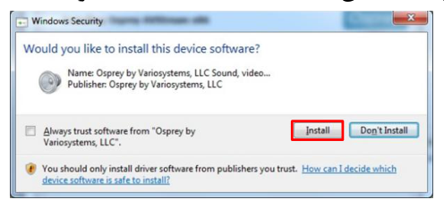

**Image analysis**

```json
{
 "image_name": "image178.png",
 "rId": "rId191",
 "image_path": "img_folder/image_177_image178.png",
 "caption": "پنجره Windows Security برای نصب نرم افزار دستگاه با دکمه های Install و Don't Install",
 "ocr_text": "Windows Security\n\nWould you like to install this device software?\n\nName: Osprey by Variosystems, LLC Sound, video...\nPublisher: Osprey by Variosystems, LLC\n\nAlways trust software from \"Osprey by Variosystems, LLC\".\n\nInstall\n\nDon't Install\n\nYou should only install driver software from publishers you trust. How can I decide which device software is safe to install?",
 "visual_description": [
 "پنجره امنیت ویندوز برای نصب درایور/نرم افزار دستگاه نمایش داده شده است",
 "نام نرم افزار: Osprey by Variosystems, LLC (Sound, video...)",
 "گزینه چک باکس اعتماد همیشه به ناشر «Osprey by Variosystems, LLC» وجود دارد",
 "دو دکمه عملیاتی «Install» و «Don't Install» در سمت راست قرار دارند و دکمه Install با کادر قرمز مشخص شده است",
 "پیوند راهنما با متن «How can I decide which device software is safe to install?» در پایین دیده می شود"
 ],
 "image_type": "screenshot"
}
```

9. عملیات نصب را با Finish پایان دهید:

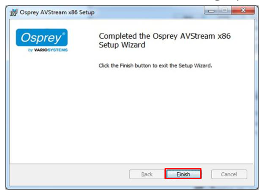

**Image analysis**

```json
{
 "image_name": "image179.png",
 "rId": "rId192",
 "image_path": "img_folder/image_178_image179.png",
 "caption": "صفحه پایان نصب Osprey AVStream x86 با پیام تکمیل و دکمه Finish",
 "ocr_text": "Osprey AVStream x86 Setup\nOsprey\nby VARIOSYSTEMS\nCompleted the Osprey AVStream x86 Setup Wizard\nClick the Finish button to exit the Setup Wizard.\nBack\nFinish\nCancel",
 "visual_description": [
 "پنجره Setup Wizard ویندوز با عنوان «Osprey AVStream x86 Setup» نمایش داده شده است.",
 "متن وضعیت «Completed the Osprey AVStream x86 Setup Wizard» در مرکز دیده می شود.",
 "دستور «Click the Finish button to exit the Setup Wizard.» نمایش داده شده است.",
 "سه دکمه پایین پنجره شامل Back، Finish و Cancel وجود دارد.",
 "دکمه «Finish» با کادر قرمز مشخص شده است."
 ],
 "image_type": "screenshot"
}
```

10. در کادر پیغام زیر روی دکمه ی No کلیک کنید؛ سیستم نباید Restart شود:

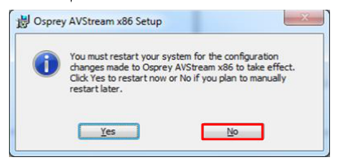

**Image analysis**

```json
{
 "image_name": "image180.png",
 "rId": "rId193",
 "image_path": "img_folder/image_179_image180.png",
 "caption": "پنجره راه اندازی Osprey AVStream x86 درخواست راه اندازی مجدد سیستم را نشان می دهد.",
 "ocr_text": "Osprey AVStream x86 Setup\nYou must restart your system for the configuration changes made to Osprey AVStream x86 to take effect.\nClick Yes to restart now or No if you plan to manually restart later.\nYes\nNo",
 "visual_description": [
 "پنجره پیام نصب با عنوان «Osprey AVStream x86 Setup» نمایش داده شده است.",
 "متن پیام درباره نیاز به ری استارت سیستم برای اعمال تغییرات پیکربندی است.",
 "دو دکمه «Yes» و «No» در پایین پنجره وجود دارد."
 ],
 "image_type": "screenshot"
}
```

# نصب نرم افزار پردازشگران

جهت نصب نرم افزار پردازشگران مراحل زیر را انجام دهید:

1. فایل نصب پردازشگران را روی هارد دستگاه کپی کنید.

اگر محل نصب دستگاه، مطابق جدول مندرج در پیوست 2 (در انتهای همین
دستورالعمل)، داخل شعبه یا In Branch است، حتماً لازم است نسخه 6.7.3.0 را نصب و جهت به روزرسانی تنظیماتFastcash با انفورماتیک تماس حاصل نمایید. ولی در دستگاه های خارج از شعبه یا Out of Branch، تنها کافی است جدیدترین نسخه ی ارائه شده را نصب کنید و نیازی به تماس با انفورماتیک نخواهد بود.

2. روی فایل ATMSetup راست کلیک کنید و از منویی که باز می شود، Run As Administrator را انتخاب نمایید:

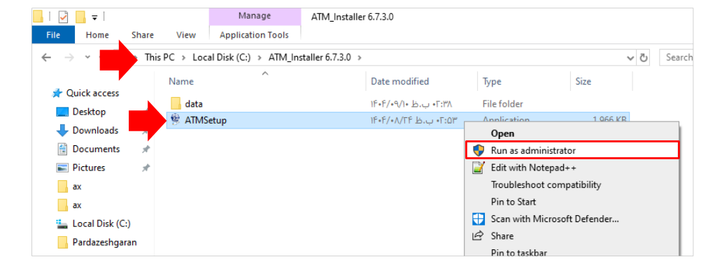

**Image analysis**

```json
{
 "image_name": "image181.png",
 "rId": "rId194",
 "image_path": "img_folder/image_180_image181.png",
 "caption": "اجرای فایل ATMSetup با گزینه Run as administrator در ویندوز",
 "ocr_text": "Manage\nApplication Tools\nATM_Installer 6.7.3.0\nFile\nHome\nShare\nView\nThis PC > Local Disk (C:) > ATM_Installer 6.7.3.0\nSearch\nQuick access\nDesktop\nDownloads\nDocuments\nPictures\nax\nax\nLocal Disk (C:)\nPardazeshgaran\nName\nDate modified\nType\nSize\ndata\nATMSetup\nFile folder\nApplication\nOpen\nRun as administrator\nEdit with Notepad++\nTroubleshoot compatibility\nPin to Start\nScan with Microsoft Defender...\nShare\nPin to taskbar",
 "visual_description": [
 "نمایش File Explorer ویندوز در مسیر This PC > Local Disk (C:) > ATM_Installer 6.7.3.0",
 "وجود آیتم های data (File folder) و ATMSetup (Application) در لیست فایل ها",
 "باز بودن منوی راست کلیک روی ATMSetup و برجسته بودن گزینه Run as administrator",
 "دو فلش قرمز روی نوار مسیر و روی فایل ATMSetup قرار گرفته اند"
 ],
 "image_type": "screenshot"
}
```

3. در پنجره ای که باز می شود، روی Run کلیک کنید:

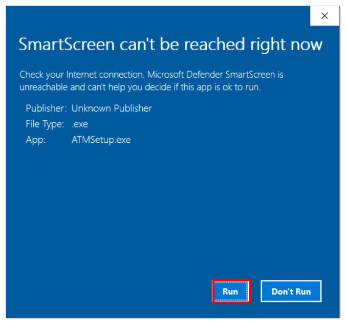

**Image analysis**

```json
{
 "image_name": "image182.png",
 "rId": "rId195",
 "image_path": "img_folder/image_181_image182.png",
 "caption": "هشدار Microsoft Defender SmartScreen برای اجرای فایل ATMSetup.exe",
 "ocr_text": "SmartScreen can't be reached right now\n\nCheck your Internet connection. Microsoft Defender SmartScreen is\nunreachable and can't help you decide if this app is ok to run.\n\nPublisher: Unknown Publisher\nFile Type: .exe\nApp: ATMSetup.exe\n\nRun\nDon't Run",
 "visual_description": [
 "پنجره هشدار SmartScreen با پس زمینه آبی نمایش داده شده است",
 "ناشر برنامه Unknown Publisher ذکر شده است",
 "نوع فایل .exe نمایش داده شده است",
 "نام برنامه ATMSetup.exe نمایش داده شده است",
 "دو دکمه Run و Don't Run در پایین پنجره وجود دارد",
 "دکمه Run با کادر قرمز برجسته شده است",
 "آیکون بستن (X) در گوشه بالا-راست دیده می شود"
 ],
 "image_type": "screenshot"
}
```

با انجام این کار آماده سازی عملیات نصب آغاز خواهد شد:

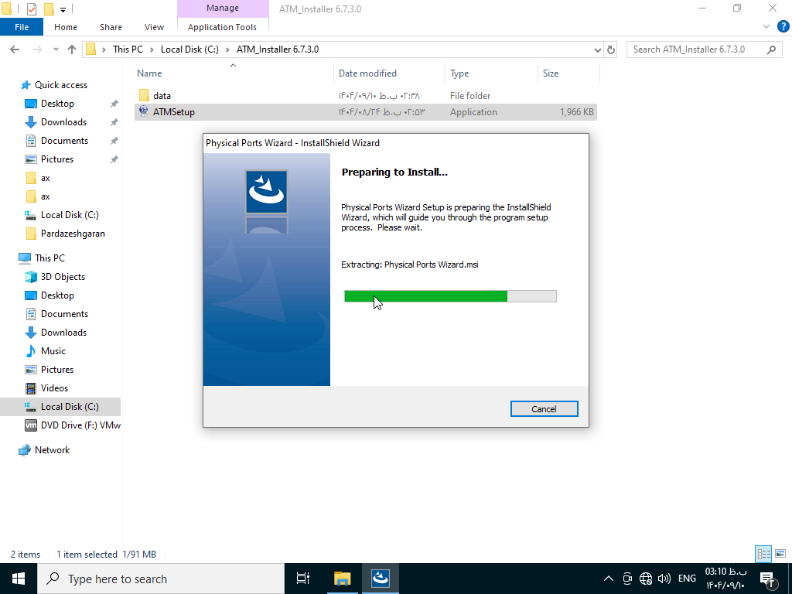

**Image analysis**

```json
{
 "image_name": "image183.png",
 "rId": "rId196",
 "image_path": "img_folder/image_182_image183.png",
 "caption": "آماده سازی نصب Physical Ports Wizard با InstallShield و نمایش نوار پیشرفت استخراج فایل MSI",
 "ocr_text": "File\nHome\nShare\nView\nApplication Tools\nManage\nThis PC > Local Disk (C:) > ATM_Installer 6.7.3.0\nSearch ATM_Installer 6.7.3.0\nName\nDate modified\nType\nSize\ndata\nATMSetup\nFile folder\nApplication\n1,966 KB\nPhysical Ports Wizard - InstallShield Wizard\nPreparing to Install...\nPhysical Ports Wizard Setup is preparing the InstallShield Wizard, which will guide you through the program setup process. Please wait.\nExtracting: Physical Ports Wizard.msi\nCancel\nQuick access\nDesktop\nDownloads\nDocuments\nPictures\nax\nax\nLocal Disk (C:)\nPardazesgharan\nThis PC\n3D Objects\nDesktop\nDocuments\nDownloads\nMusic\nPictures\nVideos\nLocal Disk (C:)\nDVD Drive (F:) VMw\nNetwork\n2 items\n1 item selected\n1/91 MB\nType here to search\nENG\n03:10 ب.ظ",
 "visual_description": [
 "نمایش فایل اکسپلورر ویندوز در مسیر Local Disk (C:) > ATM_Installer 6.7.3.0 با دو آیتم: پوشه data و فایل ATMSetup",
 "پنجره InstallShield Wizard با عنوان Physical Ports Wizard در حالت Preparing to Install و پیام Extracting: Physical Ports Wizard.msi",
 "نوار پیشرفت سبز برای عملیات استخراج و دکمه Cancel در پایین پنجره"
 ],
 "image_type": "screenshot"
}
```

طول مدت انجام عملیات فوق به سخت افزار دستگاه بستگی خواهد داشت لذا صبر کنید تا پنجره ی زیر نمایان گردد:

**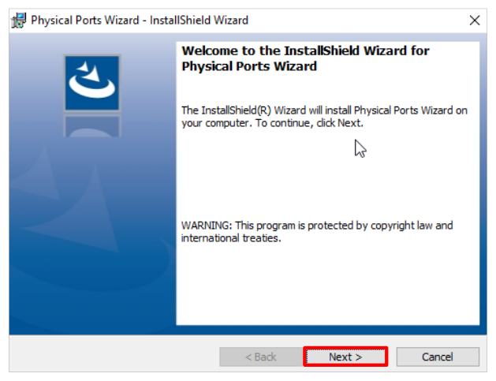

**Image analysis**

```json
{
 "image_name": "image184.png",
 "rId": "rId197",
 "image_path": "img_folder/image_183_image184.png",
 "caption": "صفحه خوش آمدگویی InstallShield برای نصب Physical Ports Wizard با دکمه Next",
 "ocr_text": "Physical Ports Wizard - InstallShield Wizard\nWelcome to the InstallShield Wizard for\nPhysical Ports Wizard\n\nThe InstallShield(R) Wizard will install Physical Ports Wizard\non your computer. To continue, click Next.\n\nWARNING: This program is protected by copyright law and\ninternational treaties.\n\n< Back\nNext >\nCancel",
 "visual_description": [
 "پنجره InstallShield Wizard با عنوان «Physical Ports Wizard - InstallShield Wizard» نمایش داده شده است",
 "متن خوش آمدگویی و توضیح نصب Physical Ports Wizard در بخش راست دیده می شود",
 "دکمه های پایین شامل «< Back»، «Next >» و «Cancel» هستند و «Next >» با کادر قرمز مشخص شده است",
 "آیکون InstallShield در سمت چپ پنجره قرار دارد"
 ],
 "image_type": "screenshot"
}
```**

1. روی دکمه ی Next کلیک کنید.
5. گزینه ی I accept the terms in the license agreement را انتخاب و سپس روی Next کلیک نمایید:

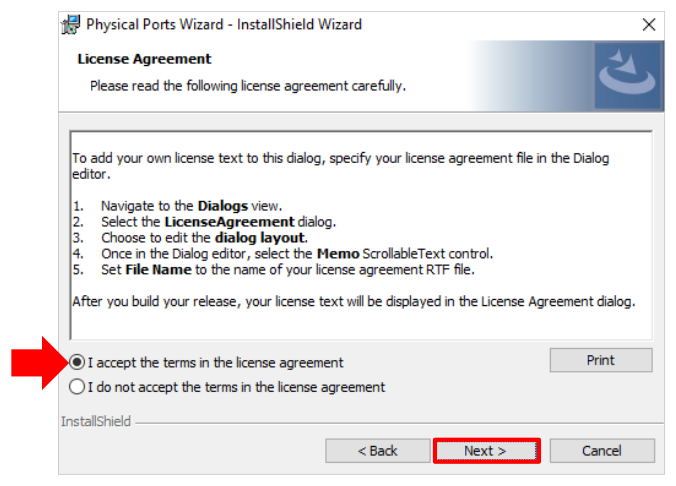

**Image analysis**

```json
{
 "image_name": "image185.png",
 "rId": "rId198",
 "image_path": "img_folder/image_184_image185.png",
 "caption": "پنجره نصب InstallShield با صفحه توافق نامه مجوز و گزینه پذیرش و دکمه Next",
 "ocr_text": "Physical Ports Wizard - InstallShield Wizard\n\nLicense Agreement\nPlease read the following license agreement carefully.\n\nTo add your own license text to this dialog, specify your license agreement file in the Dialog editor.\n\n1. Navigate to the Dialogs view.\n2. Select the LicenseAgreement dialog.\n3. Choose to edit the dialog layout.\n4. Once in the Dialog editor, select the Memo ScrollableText control.\n5. Set File Name to the name of your license agreement RTF file.\n\nAfter you build your release, your license text will be displayed in the License Agreement dialog.\n\nI accept the terms in the license agreement\nI do not accept the terms in the license agreement\n\nInstallShield\n\n< Back\nNext >\nCancel\n\nPrint",
 "visual_description": [
 "پنجره InstallShield Wizard با عنوان Physical Ports Wizard نمایش داده شده است",
 "بخش License Agreement شامل متن راهنما و مراحل شماره گذاری شده 1 تا 5 است",
 "دو گزینه رادیویی برای پذیرش یا عدم پذیرش شرایط مجوز وجود دارد",
 "دکمه های < Back، Next >، Cancel و Print در پایین/سمت راست دیده می شوند",
 "یک فلش قرمز به گزینه «I accept the terms in the license agreement» اشاره می کند",
 "کادر قرمز دور دکمه «Next >» قرار دارد"
 ],
 "image_type": "screenshot"
}
```

6. در پنجره ی زیر، بدون اعمال تغییر، روی Next کلیک کنید:

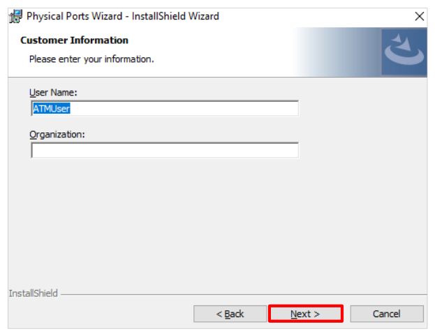

**Image analysis**

```json
{
 "image_name": "image186.png",
 "rId": "rId199",
 "image_path": "img_folder/image_185_image186.png",
 "caption": "پنجره InstallShield برای وارد کردن اطلاعات کاربر در Physical Ports Wizard",
 "ocr_text": "Physical Ports Wizard - InstallShield Wizard\nCustomer Information\nPlease enter your information.\nUser Name:\nATMUser\nOrganization:\nInstallShield\n< Back\nNext >\nCancel",
 "visual_description": [
 "پنجره نصب با عنوان \"Physical Ports Wizard - InstallShield Wizard\" نمایش داده شده است",
 "بخش \"Customer Information\" شامل دو فیلد \"User Name\" و \"Organization\" است",
 "فیلد \"User Name\" با مقدار \"ATMUser\" پر شده و هایلایت شده است",
 "فیلد \"Organization\" خالی است",
 "دکمه های \"< Back\"، \"Next >\" و \"Cancel\" در پایین پنجره وجود دارند",
 "دکمه \"Next >\" با کادر قرمز مشخص شده است"
 ],
 "image_type": "screenshot"
}
```

7. گزینه ی Complete را انتخاب و روی Next کلیک نمایید:

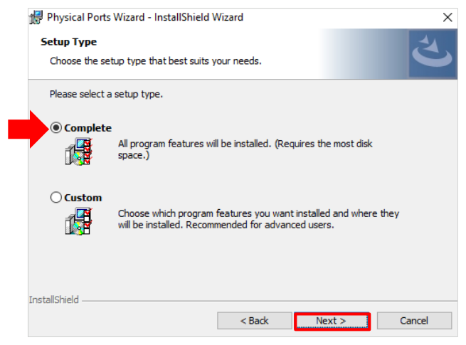

**Image analysis**

```json
{
 "image_name": "image187.png",
 "rId": "rId200",
 "image_path": "img_folder/image_186_image187.png",
 "caption": "پنجره InstallShield برای انتخاب نوع نصب Complete یا Custom و دکمه Next",
 "ocr_text": "Physical Ports Wizard - InstallShield Wizard\nSetup Type\nChoose the setup type that best suits your needs.\nPlease select a setup type.\nComplete\nAll program features will be installed. (Requires the most disk space.)\nCustom\nChoose which program features you want installed and where they will be installed. Recommended for advanced users.\nInstallShield\n< Back\nNext >\nCancel",
 "visual_description": [
 "پنجره نصب با عنوان «Physical Ports Wizard - InstallShield Wizard» نمایش داده شده است.",
 "بخش «Setup Type» دو گزینه رادیویی «Complete» و «Custom» دارد و «Complete» انتخاب شده است.",
 "توضیح زیر Complete نصب همه ویژگی ها و نیاز به فضای دیسک بیشتر را بیان می کند.",
 "توضیح زیر Custom انتخاب ویژگی ها و محل نصب و توصیه برای کاربران پیشرفته را بیان می کند.",
 "پایین پنجره دکمه های «< Back»، «Next >» و «Cancel» وجود دارد و دور «Next >» کادر قرمز کشیده شده است.",
 "یک فلش قرمز بزرگ سمت چپ به گزینه «Complete» اشاره می کند."
 ],
 "image_type": "screenshot"
}
```

8. روی دکمه Install کلیک کنید:

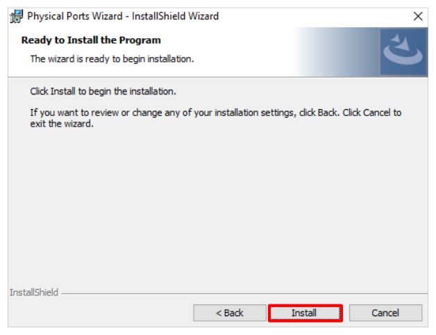

**Image analysis**

```json
{
 "image_name": "image188.png",
 "rId": "rId201",
 "image_path": "img_folder/image_187_image188.png",
 "caption": "پنجره نصب InstallShield برای Physical Ports Wizard با دکمه Install",
 "ocr_text": "Physical Ports Wizard - InstallShield Wizard\nReady to Install the Program\nThe wizard is ready to begin installation.\nClick Install to begin the installation.\nIf you want to review or change any of your installation settings, click Back. Click Cancel to exit the wizard.\nInstallShield\n< Back\nInstall\nCancel",
 "visual_description": [
 "اسکرین شات پنجره InstallShield Wizard برای نصب برنامه Physical Ports Wizard",
 "عنوان مرحله: Ready to Install the Program",
 "متن راهنما برای شروع نصب با کلیک روی Install و امکان بازگشت با Back یا خروج با Cancel",
 "سه دکمه پایین پنجره: < Back، Install، Cancel",
 "دکمه Install با کادر قرمز برجسته شده است"
 ],
 "image_type": "screenshot"
}
```

کمی صبر کنید تا فرآیند نصب به پایان برسد:

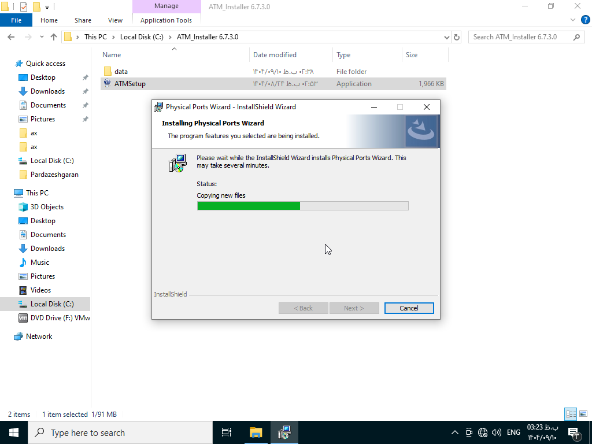

**Image analysis**

```json
{
 "image_name": "image189.png",
 "rId": "rId202",
 "image_path": "img_folder/image_188_image189.png",
 "caption": "نصب Physical Ports Wizard با InstallShield و نمایش پیشرفت کپی فایل ها در ویندوز",
 "ocr_text": "Manage\nApplication Tools\nFile\nHome\nShare\nView\nThis PC > Local Disk (C:) > ATM_Installer 6.7.3.0\nSearch ATM_Installer 6.7.3.0\nName\nDate modified\nType\nSize\ndata\nATMSetup\nFile folder\nApplication\n1,966 KB\nPhysical Ports Wizard - InstallShield Wizard\nInstalling Physical Ports Wizard\nThe program features you selected are being installed.\nPlease wait while the InstallShield Wizard installs Physical Ports Wizard. This may take several minutes.\nStatus:\nCopying new files\nInstallShield\n< Back\nNext >\nCancel\nQuick access\nDesktop\nDownloads\nDocuments\nPictures\nax\nLocal Disk (C:)\nPardazesgharan\nThis PC\n3D Objects\nVideos\nDVD Drive (F:) VMw\nNetwork\n1 item selected 1/91 MB\nType here to search\nENG\n03:23",
 "visual_description": [
 "پنجره «Physical Ports Wizard - InstallShield Wizard» در حالت Installing با نوار پیشرفت و وضعیت «Copying new files» نمایش داده شده است",
 "در پس زمینه پنجره File Explorer مسیر «C:\\ATM_Installer 6.7.3.0» را نشان می دهد",
 "فایل/برنامه «ATMSetup» با نوع Application و اندازه 1,966 KB در پوشه دیده می شود",
 "دکمه های «< Back» و «Next >» غیرفعال و «Cancel» فعال است"
 ],
 "image_type": "screenshot"
}
```

9. روی دکمه Finish کلیک نمایید:

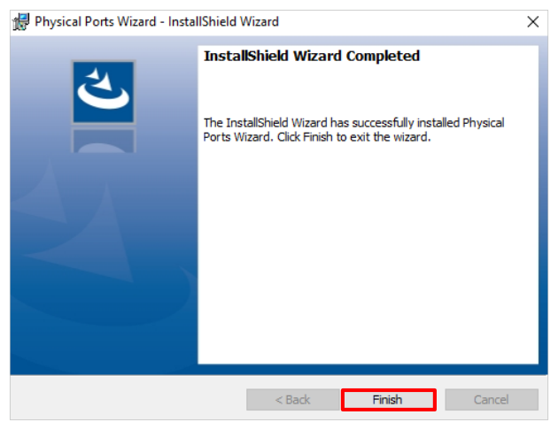

**Image analysis**

```json
{
 "image_name": "image190.png",
 "rId": "rId203",
 "image_path": "img_folder/image_189_image190.png",
 "caption": "اتمام نصب Physical Ports Wizard در InstallShield و نمایش دکمه Finish",
 "ocr_text": "Physical Ports Wizard - InstallShield Wizard\n\nInstallShield Wizard Completed\n\nThe InstallShield Wizard has successfully installed Physical Ports Wizard. Click Finish to exit the wizard.\n\n< Back\nFinish\nCancel",
 "visual_description": [
 "پنجره InstallShield Wizard با عنوان Physical Ports Wizard - InstallShield Wizard نمایش داده شده است",
 "متن وضعیت: InstallShield Wizard Completed",
 "پیام موفقیت نصب Physical Ports Wizard و درخواست کلیک روی Finish برای خروج",
 "سه دکمه پایین پنجره: < Back (غیرفعال)، Finish (هایلایت شده با کادر قرمز)، Cancel"
 ],
 "image_type": "screenshot"
}
```

10. در پنجره زیر مشخصات خواسته شده را مطابق با جدول زیر، تکمیل و سپس روی دکمه ی
 ذخیره (Save) کلیک نمایید:

مهم: تکمیل اطلاعات این پنجره باید با دقت انجام پذیرد چرا که مسئولیت درج اطلاعات نادرست و وجود مغایرت های احتمالی بر عهده مسئولین دفاتر و کارشناس مربوطه خواهد بود.

در دستگاه های 285، با توجه به اینکه تصویر زیر از کادر خارج می شود، جهت تکمیل فیلدهای جدول می توانید تصویر را به سمت مشتری انتقال دهید.

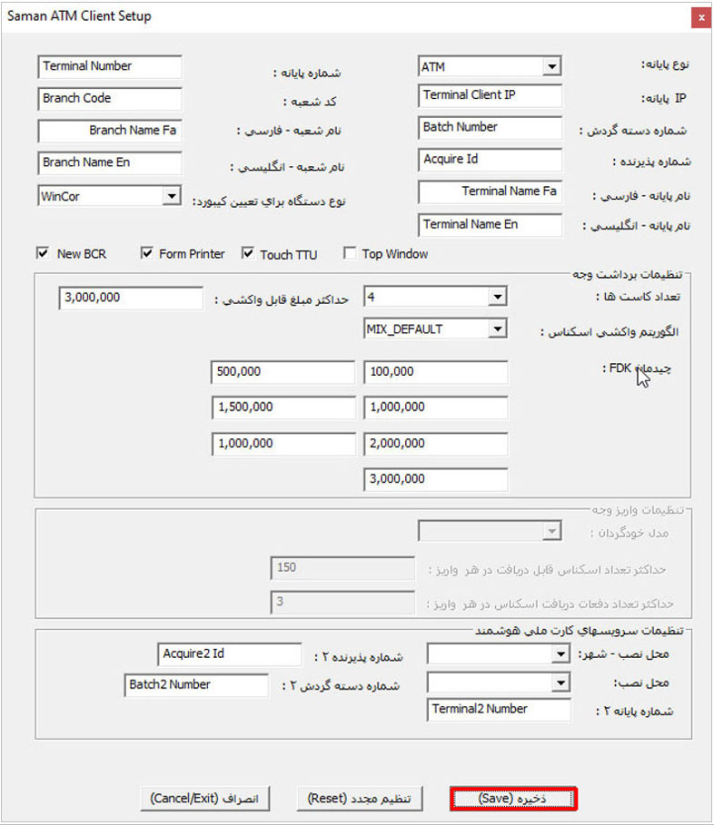

**Image analysis**

```json
{
 "image_name": "image191.jpg",
 "rId": "rId204",
 "image_path": "img_folder/image_190_image191.jpg",
 "caption": "اسکرین شات تنظیمات نرم افزار Saman ATM Client با فیلدهای پایانه، برداشت و واریز وجه",
 "ocr_text": "Saman ATM Client Setup\nTerminal Number\nBranch Code\nBranch Name Fa\nBranch Name En\nWinCor\nشماره پایانه :\nکد شعبه :\nنام شعبه - فارسی :\nنام شعبه - انگلیسی :\nنوع دستگاه برای تعیین کیبورد :\nنوع پایانه :\nATM\nIP پایانه :\nTerminal Client IP\nشماره دسته گردش :\nBatch Number\nشماره پذیرنده :\nAcquire Id\nنام پایانه - فارسی :\nTerminal Name Fa\nنام پایانه - انگلیسی :\nTerminal Name En\nNew BCR\nForm Printer\nTouch TTU\nTop Window\nتنظیمات برداشت وجه\nحداکثر مبلغ قابل واکنشی :\n3,000,000\nتعداد کاست ها :\n4\nالگوریتم واکنشی اسکناس :\nMIX_DEFAULT\nچیدمان FDK :\n500,000\n100,000\n1,500,000\n1,000,000\n1,000,000\n2,000,000\n3,000,000\nتنظیمات واریز وجه\nمدل خودگردان :\nحداکثر تعداد اسکناس قابل دریافت در هر واریز :\n150\nحداکثر تعداد دفعات دریافت اسکناس در هر واریز :\n3\nتنظیمات سرویسهای کارت مالی هوشمند\nAcquire2 Id\nBatch2 Number\nشماره پذیرنده 2 :\nشماره دسته گردش 2 :\nمحل نصب - شهر :\nمحل نصب :\nشماره پایانه 2 :\nTerminal2 Number\n(Cancel/Exit) انصراف\n(Reset) تنظیم مجدد\n(Save) ذخیره",
 "visual_description": [
 "پنجره تنظیمات با عنوان Saman ATM Client Setup شامل فیلدهای ورودی و چند فهرست کشویی",
 "بخش مشخصات پایانه شامل Terminal Number، Branch Code، Branch Name Fa/En و نوع دستگاه WinCor",
 "بخش نوع پایانه با مقدار انتخاب شده ATM و فیلدهای Terminal Client IP، Batch Number و Acquire Id",
 "چک باکس ها: New BCR، Form Printer، Touch TTU و Top Window",
 "بخش تنظیمات برداشت وجه با مقدار 3,000,000 برای حداکثر مبلغ و تعداد کاست ها 4",
 "فهرست کشویی الگوریتم واکنشی اسکناس با مقدار MIX_DEFAULT",
 "چیدمان FDK نمایش مقادیر: 500,000، 100,000، 1,500,000، 1,000,000، 1,000,000، 2,000,000، 3,000,000",
 "بخش تنظیمات واریز وجه با مقدار 150 برای حداکثر تعداد اسکناس و مقدار 3 برای حداکثر دفعات دریافت",
 "بخش تنظیمات سرویسهای کارت مالی هوشمند شامل Acquire2 Id، Batch2 Number و Terminal2 Number",
 "دکمه های پایین پنجره: (Cancel/Exit) انصراف، (Reset) تنظیم مجدد، (Save) ذخیره"
 ],
 "image_type": "screenshot"
}
```

بقیه در صفحه ی بعد

<!-- TABLE_START -->
| | |
| --- | --- |
| **نوع پایانه** | گزینه ATM را انتخاب کنید. |
| **IP پایانه** | IP خودپرداز را با الگوی X.X.X.X وارد نمایید. |
| **شماره دسته گردش** | این اطلاعات را می باید از فایل ارسالی استخراج یا از طریق تماس با انفورماتیک استعلام نمایید. |
| **شماره پذیرنده** | این اطلاعات را می باید از فایل ارسالی استخراج یا از طریق تماس با انفورماتیک استعلام نمایید. الگوی درج آن به شرح زیر است: عدد 1رقمی:0100000X عدد2رقمی:010000XX عدد3رقمی:01000XXX عدد4رقمی:0100XXXX |
| **نام پایانه-فارسی** | نام ترمینال را به فارسی وارد کنید. به هیچ عنوان شماره ترمینال را در این قسمت درج نکنید. |
| **نام پایانه-انگلیسی** | نام ترمینال را به انگلیسی وارد کنید. به هیچ عنوان شماره ترمینال را در این قسمت درج نکنید. |
| **شماره پایانه** | عددی چهاررقمی است که به ابتدای آن عدد 1 اضافه می شود.مانند:1XXXX |
| **کد شعبه** | کد شعبه را بی هیچ تغییری وارد نمایید. |
| **نام شعبه-فارسی** | نام شعبه را به فارسی تایپ کنید. به هیچ عنوان شماره ترمینال را در این قسمت درج نکنید. |
| **نام شعبه-انگلیسی** | نام شعبه را به انگلیسی درج نمایید. به هیچ عنوان شماره ترمینال را در این قسمت درج نکنید. |
| **نوع دستگاه برای تعیین کیبورد** | این گزینه را برای تمام EPPها، روی Wincor تنظیم کنید. |
| **New BCR** | این گزینه را فقط برای خودپرداز با بارکدخوانHonywell N4680، غیرفعال کنید. **توجه داشته باشید که در بقیه ی دستگاه ها حتماً باید فعال باشد.** |
| **Form Printer** | این گزینه را برای تمامی خودپردازها انتخاب نمایید. |
| **Touch TTU** | این گزینه را فقط برای خودپردازهای 285DZ، 285DY و 8050 فعال کنید. |
| **Top Window** | این گزینه را برای تمامی خودپردازها انتخاب کنید. |
| **تعداد کاست ها** | این پارامتر توسط نرم افزار پردازشگران شناسایی می شود؛ صورت وجود مغایرت، آن را تغییر دهید. |
| **حداکثر مبلغ قابل واکشی** | این گزینه را تغییر ندهید. |
| **الگوریتم واکشی اسکناس ها** | این گزینه را تغییر ندهید. |
| **چیدمان FDK** | این گزینه را تغییر ندهید. |
| **محل نصب-شهر** | اگر محل نصب دستگاه خودپرداز، **استان تهران** می باشد، گزینه ی Tehran و درصورتی که خودپرداز **خارج از استان تهران** نصب است، گزینه ی Other Cities را انتخاب نمایید. |
| **محل نصب** | در تمامی خودپردازها، به جز 20 مورد مندرج در فهرست پیوست 2 (انتهای سند)، محل نصب را «خارج از شعبه» (Out of Branch) انتخاب کنید (نیازی به تماس با انفورماتیک نیست). فهرست مندرج در پیوست 2، خودپردازهای سالنی داخل فضای شعب را شامل می شود که در مورد آنها حتماً لازم است محل نصب را «داخل شعبه» (In Branch) انتخاب و جهت به روزرسانی تنظیمات Fastcash با انفورماتیک تماس حاصل نمایید. |
| **شماره پایانه 2** | این گزینه را تغییر ندهید. |
| **شماره ی پذیرنده 2** | این گزینه را تغییر ندهید. |
| **شماره دسته گردش 2** | این گزینه را تغییر ندهید. |
<!-- TABLE_END -->

11. روی دکمه OK کلیک نمایید:

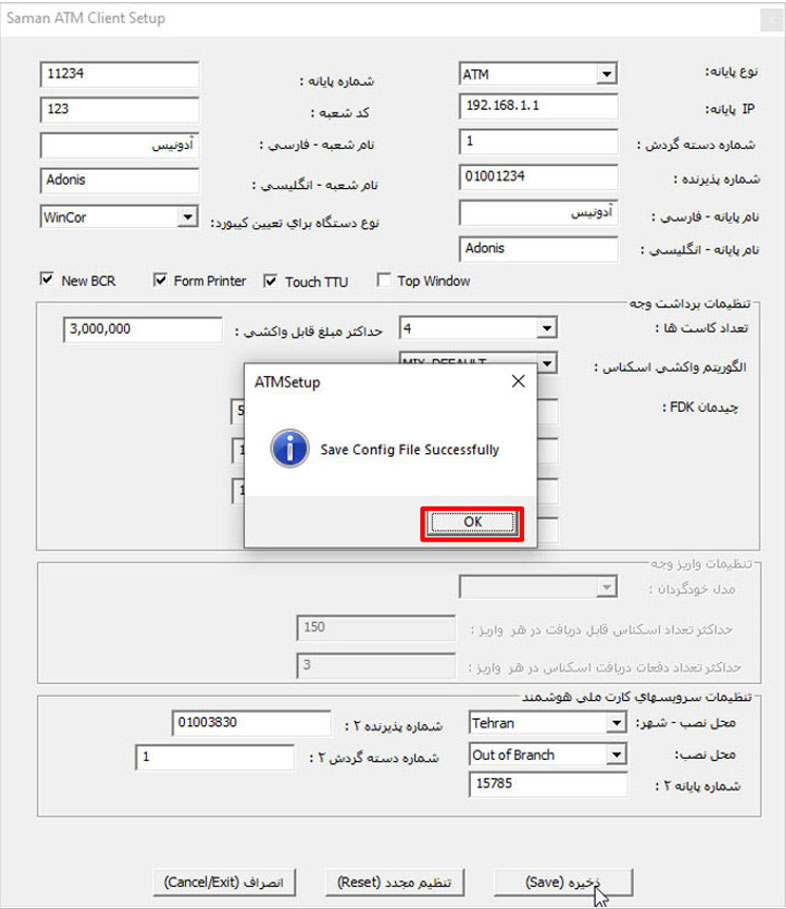

**Image analysis**

```json
{
 "image_name": "image192.jpg",
 "rId": "rId205",
 "image_path": "img_folder/image_191_image192.jpg",
 "caption": "نمای تنظیمات کلاینت ATM و پیام موفقیت ذخیره فایل پیکربندی",
 "ocr_text": "Saman ATM Client Setup\n11234\n123\nادونیس\nAdonis\nWinCor\nشماره پایانه :\nکد شعبه :\nنام شعبه - فارسی :\nنام شعبه - انگلیسی :\nنوع دستگاه برای تعیین کیبورد :\nنوع پایانه:\nATM\nIP پایانه:\n192.168.1.1\nشماره دسته گردش :\n1\nشماره پذیرنده :\n01001234\nنام پایانه - فارسی :\nادونیس\nنام پایانه - انگلیسی :\nAdonis\nNew BCR\nForm Printer\nTouch TTU\nTop Window\nتنظیمات برداشت وجه\nحداکثر مبلغ قابل واکشی :\n3,000,000\nتعداد کاست ها :\n4\nالگوریتم واکشی اسکناس :\nATV_DEFAULT\nچیدمان FDK :\nATMSetup\nSave Config File Successfully\nOK\nتنظیمات واریز وجه\nمدل خودگردان :\nحداکثر تعداد اسکناس قابل دریافت در هر واریز :\n150\nحداکثر تعداد دفعات دریافت اسکناس در هر واریز :\n3\nتنظیمات سرویسهای کارت مای هوشمند\nشماره پذیرنده ۲ :\n01003830\nشماره دسته گردش ۲ :\n1\nمحل نصب - شهر:\nTehran\nمحل نصب :\nOut of Branch\nشماره پایانه ۲ :\n15785\nانصراف (Cancel/Exit)\nتنظیم مجدد (Reset)\nذخیره (Save)",
 "visual_description": [
 "پنجره نرم افزار با عنوان «Saman ATM Client Setup» شامل فیلدهای شماره پایانه، IP پایانه و شماره پذیرنده",
 "گزینه های تیک دار/قابل انتخاب: New BCR، Form Printer، Touch TTU، Top Window",
 "بخش «تنظیمات برداشت وجه» با مقدار «حداکثر مبلغ قابل واکشی: 3,000,000» و «تعداد کاست ها: 4»",
 "پنجره پیام «ATMSetup» با متن «Save Config File Successfully» و دکمه «OK»",
 "بخش «تنظیمات واریز وجه» با مقادیر 150 و 3",
 "بخش «تنظیمات سرویسهای کارت مای هوشمند» شامل شهر Tehran و محل نصب Out of Branch",
 "دکمه های پایین پنجره: انصراف (Cancel/Exit)، تنظیم مجدد (Reset)، ذخیره (Save)"
 ],
 "image_type": "screenshot"
}
```

12. روی دکمه OK کلیک نمایید:

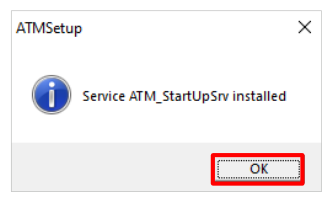

**Image analysis**

```json
{
 "image_name": "image193.png",
 "rId": "rId206",
 "image_path": "img_folder/image_192_image193.png",
 "caption": "پنجره پیام ATMSetup با اطلاع نصب سرویس ATM_StartUpSrv و دکمه OK",
 "ocr_text": "ATMSetup\nService ATM_StartUpSrv installed\nOK",
 "visual_description": [
 "پنجره پیام با عنوان ATMSetup نمایش داده شده است",
 "آیکون اطلاعات (دایره آبی با حرف i) در سمت چپ پیام وجود دارد",
 "متن پیام: Service ATM_StartUpSrv installed",
 "یک دکمه OK در پایین پنجره دیده می شود",
 "دکمه OK با کادر قرمز مشخص شده است",
 "دکمه بستن (X) در گوشه بالا سمت راست وجود دارد"
 ],
 "image_type": "screenshot"
}
```

13. به مسیر زیر بروید:

**C:\Program Files\atmapp\startup**

14. روی فایل ServiceManager راست کلیک کنید و از منویی که باز می شود
 Run as administrator را انتخاب نمایید:

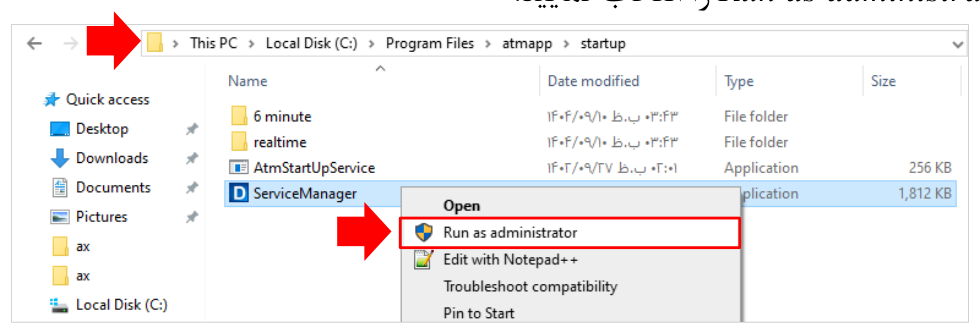

**Image analysis**

```json
{
 "image_name": "image194.png",
 "rId": "rId207",
 "image_path": "img_folder/image_193_image194.png",
 "caption": "اسکرین شات ویندوز از اجرای فایل ServiceManager با گزینه Run as administrator",
 "ocr_text": "This PC > Local Disk (C:) > Program Files > atmapp > startup\nQuick access\nDesktop\nDownloads\nDocuments\nPictures\nLocal Disk (C:)\nName\nDate modified\nType\nSize\n6 minute\nrealtime\nAtmStartUpService\nServiceManager\nOpen\nRun as administrator\nEdit with Notepad++\nTroubleshoot compatibility\nPin to Start",
 "visual_description": [
 "پنجره File Explorer مسیر This PC > Local Disk (C:) > Program Files > atmapp > startup را نشان می دهد",
 "فایل ServiceManager در لیست انتخاب شده و منوی راست کلیک باز است",
 "گزینه Run as administrator در منو با کادر قرمز مشخص شده است",
 "دو فلش قرمز به نوار مسیر و گزینه Run as administrator اشاره می کنند",
 "ستون های Name، Date modified، Type و Size در لیست فایل ها قابل مشاهده است"
 ],
 "image_type": "screenshot"
}
```

15. در پنجره ای که باز می شود، روی گزینه ی Install کلیک نمایید:

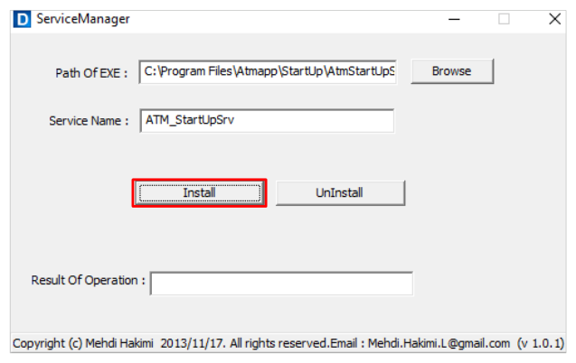

**Image analysis**

```json
{
 "image_name": "image195.png",
 "rId": "rId208",
 "image_path": "img_folder/image_194_image195.png",
 "caption": "پنجره ServiceManager برای نصب/حذف سرویس با مسیر فایل اجرایی و نام سرویس",
 "ocr_text": "ServiceManager\nPath Of EXE :\nC:\\Program Files\\Atmapp\\StartUp\\AtmStartUpS\nBrowse\nService Name :\nATM_StartUpSrv\nInstall\nUnInstall\nResult Of Operation :\nCopyright (c) Mehdi Hakimi 2013/11/17, All rights reserved.Email : Mehdi.Hakimi.L@gmail.com (v 1.0.1)",
 "visual_description": [
 "اسکرین شات یک برنامه ویندوزی با عنوان ServiceManager",
 "فیلد Path Of EXE شامل مسیر C:\\Program Files\\Atmapp\\StartUp\\AtmStartUpS",
 "دکمه Browse در کنار فیلد مسیر فایل اجرایی",
 "فیلد Service Name با مقدار ATM_StartUpSrv",
 "دو دکمه Install و UnInstall نمایش داده شده اند",
 "ناحیه Result Of Operation برای نمایش نتیجه عملیات وجود دارد",
 "در پایین پنجره متن کپی رایت، ایمیل و نسخه (v 1.0.1) دیده می شود"
 ],
 "image_type": "screenshot"
}
```

16. روی OK کلیک کنید:

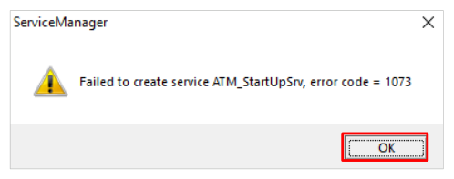

**Image analysis**

```json
{
 "image_name": "image196.png",
 "rId": "rId209",
 "image_path": "img_folder/image_195_image196.png",
 "caption": "پیام خطای ServiceManager درباره عدم ایجاد سرویس ATM_StartUpSrv با کد 1073",
 "ocr_text": "ServiceManager\nFailed to create service ATM_StartUpSrv, error code = 1073\nOK",
 "visual_description": [
 "پنجره پیام ویندوز با عنوان ServiceManager نمایش داده شده است",
 "آیکون هشدار زرد در سمت چپ پیام دیده می شود",
 "متن خطا شامل نام سرویس ATM_StartUpSrv و error code = 1073 است",
 "یک دکمه OK در پایین سمت راست پنجره وجود دارد"
 ],
 "image_type": "screenshot"
}
```

17. در پنجره ی بعدی، روی OK کلیک نمایید:

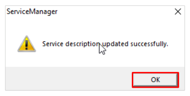

**Image analysis**

```json
{
 "image_name": "image197.png",
 "rId": "rId210",
 "image_path": "img_folder/image_196_image197.png",
 "caption": "پنجره پیام ServiceManager با هشدار و اعلام به روزرسانی موفق توضیحات سرویس",
 "ocr_text": "ServiceManager\nService description updated successfully.\nOK",
 "visual_description": [
 "پنجره محاوره ای با عنوان ServiceManager نمایش داده شده است",
 "آیکون هشدار زرد (مثلث با علامت تعجب) در سمت چپ پیام وجود دارد",
 "متن پیام «Service description updated successfully.» در وسط پنجره دیده می شود",
 "یک دکمه «OK» در پایین سمت راست قرار دارد و با کادر قرمز مشخص شده است",
 "نشانگر ماوس روی متن پیام قرار دارد"
 ],
 "image_type": "screenshot"
}
```

18. محتویات پوشه server\_socket را از مسیر C:\Program Files (x86)\server\_socket به مسیر
 C:\Program Files\server\_socket منتقل نمایید. (برای این منظور، پس از انتخاب تمامی فایل ها و پوشه های موجود در مسیر مبدا، روی آنها راست کلیک و گزینه ی Cut را انتخاب کنید. سپس در مسیر مقصد، راست کلیک نموده و از منویی که باز می شود گزینه ی Paste را انتخاب نمایید).

# هاتفیکس SamanPackageConfiguration

1. پوشه ی SamanPackageConfiguration را در هارد دستگاه کپی و از حالت فشرده خارج نمایید.
2. روی فایل SamanConfigStarter راست کلیک کنید و از منویی که گشوده می شود،
 Run as Administrtor را انتخاب نمایید:

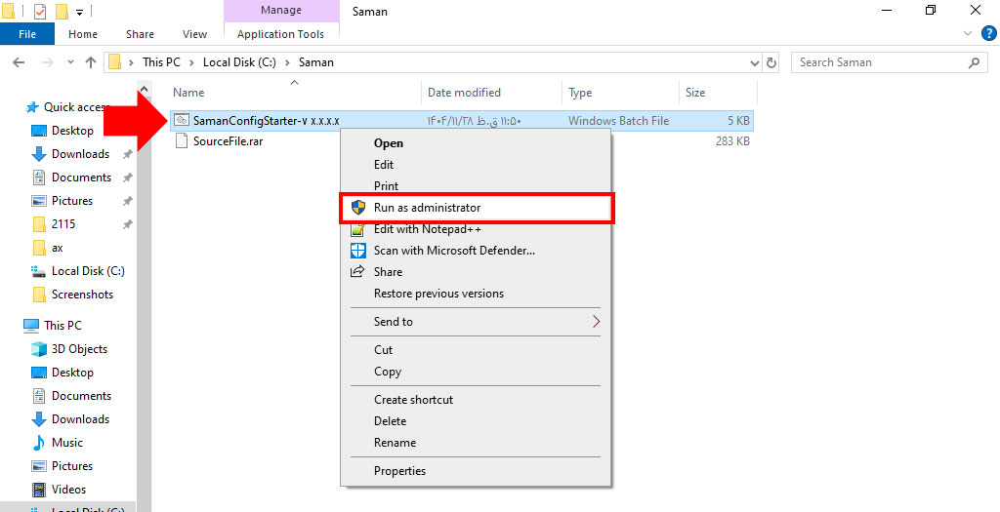

**Image analysis**

```json
{
 "image_name": "image198.jpg",
 "rId": "rId211",
 "image_path": "img_folder/image_197_image198.jpg",
 "caption": "اجرای فایل Batch با گزینه Run as administrator در ویندوز اکسپلورر",
 "ocr_text": "Manage\nApplication Tools\nSaman\nFile\nHome\nShare\nView\nThis PC > Local Disk (C:) > Saman\nSearch Saman\nQuick access\nDesktop\nDownloads\nDocuments\nPictures\n2115\nax\nLocal Disk (C:)\nScreenshots\nThis PC\n3D Objects\nDesktop\nDocuments\nDownloads\nMusic\nPictures\nVideos\nName\nDate modified\nType\nSize\nSamanConfigStarter-v x.x.x.x\nSourceFile.rar\nWindows Batch File\n283 KB\n5 KB\nOpen\nEdit\nPrint\nRun as administrator\nEdit with Notepad++\nScan with Microsoft Defender...\nShare\nRestore previous versions\nSend to\nCut\nCopy\nCreate shortcut\nDelete\nRename\nProperties",
 "visual_description": [
 "پنجره File Explorer در مسیر This PC > Local Disk (C:) > Saman نمایش داده شده است",
 "فایل SamanConfigStarter-v x.x.x.x با نوع Windows Batch File انتخاب شده است",
 "منوی راست کلیک باز است و گزینه Run as administrator با کادر قرمز مشخص شده",
 "یک پیکان قرمز به فایل انتخاب شده اشاره می کند",
 "فایل SourceFile.rar نیز در لیست با اندازه 283 KB دیده می شود"
 ],
 "image_type": "screenshot"
}
```

با انجام این کار پنجره ی زیر نمایان خواهد شد:

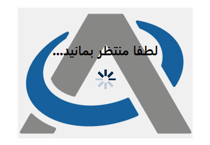

**Image analysis**

```json
{
 "image_name": "image199.jpg",
 "rId": "rId212",
 "image_path": "img_folder/image_198_image199.jpg",
 "caption": "پیام انتظار با نماد بارگذاری روی پس زمینه لوگوی خاکستری و آبی",
 "ocr_text": "لطفا منتظر بمانید...",
 "visual_description": [
 "متن فارسی «لطفا منتظر بمانید...» در مرکز تصویر دیده می شود",
 "یک آیکون بارگذاری (چرخان) زیر متن قرار دارد",
 "پس زمینه شامل اشکال لوگو/حروف با رنگ های خاکستری و آبی است"
 ],
 "image_type": "screenshot"
}
```

3. صبر کنید تا کادر پیغام زیر به نمایش گذاشته شود و سپس روی دکمه ی OK کلیک کنید تا تنظیمات اعمال شوند:

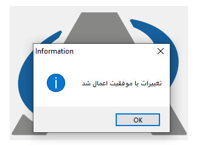

**Image analysis**

```json
{
 "image_name": "image200.jpg",
 "rId": "rId213",
 "image_path": "img_folder/image_199_image200.jpg",
 "caption": "پنجره پیام اطلاعات با متن موفقیت آمیز بودن اعمال تغییرات و دکمه OK",
 "ocr_text": "Information\nتغییرات با موفقیت اعمال شد\nOK",
 "visual_description": [
 "یک پنجره پیام ویندوز با عنوان Information نمایش داده شده است",
 "آیکون دایره ای آبی با حرف i در سمت چپ پیام دیده می شود",
 "متن فارسی «تغییرات با موفقیت اعمال شد» در پنجره وجود دارد",
 "یک دکمه با برچسب OK در پایین پنجره قرار دارد",
 "دکمه بستن (X) در گوشه بالا-راست پنجره دیده می شود"
 ],
 "image_type": "screenshot"
}
```

4. دستگاه را Restart نمایید.

نکته مهم: درصورتی که نرم افزار پردازشگران دارای فایل آپدیت می باشد محتویات پوشه atmapp را در مسیر زیر کپی نمایید:

C:\Program Files\atmapp

# اتصالات COM در PC های مدل ADIPC

ترتیب اتصال کابل سریال ماژول ها به پورت سریال ADIPC به شرح مندرج در جدول زیر می باشد:

<!-- TABLE_START -->
| | |
| --- | --- |
| ماژول | پورت |
| EPP | COM1 |
| BCR | COM2 |
| OP | COM3 |
| CDM | COM4 |
| SE | COM6 |
| IDC | COM8 |
<!-- TABLE_END -->

**لازم به ذکر است در صورت نداشتن ماژول اپراتور پنل، نیازی به نصب
 Mini Gender Changer روی COM3 نخواهد بود.**

درصورتی که پورت ماژولی مانند EPP و ... از نوع USB است، نیازی به نصب
Mini Gender Changer به پورت مذکور در جدول نخواهد بود.

# بررسی عملکرد دوربین

* به منظور بررسی عملکرد دوربین های USB و BNC مراحل زیر را انجام دهید:

در حال حاضر عملیات ثبت تصاویر توسط نرم افزار پردازشگران انجام می شود.

1. به مسیر Control Panel\Device Manager بروید و وضعیت شناسایی دوربین را بررسی کنید.
2. تصویر دوربین را به صورت زنده مشاهده کنید.
3. دستگاه خودپرداز را Restart نمایید.
4. یک تراکنش انجام دهید.
5. با توجه به اینکه تصاویر ثبت شده توسط نرم افزار پردازشگران در درایو D ذخیره می شوند، لازم است پس از انجام تراکنش نسبت به بررسی کیفیت تصاویر و تنظیم زاویه دوربین اقدام نمایید.

# بررسی بارکدخوان Honeywell N4680 در Device Manager

1. از اتصال صحیح بارکدخوان به پورت USB2.0 مادربورد IPC دستگاه، اطمینان حاصل نمایید.
2. پنجره ی Computer Managemennt را باز کنید؛ برای این منظور، روی This PC، راست کلیک کنید و از منویی که باز می شود، Manage را انتخاب نمایید.
3. در سمت چپ پنجره ای که گشوده می شود روی Device Manager کلیک کنید.
4. دسته بندی Ports (COM & LPT) را باز کنید.
5. در صورتی که دیوایسی با نام Honeywell N4680 … را در این دسته بندی مشاهده نمی کنید، روی
 USB Serial Device (COM…) راست کلیک و در منویی که باز می شود رویUpdate driver کلیک نمایید:

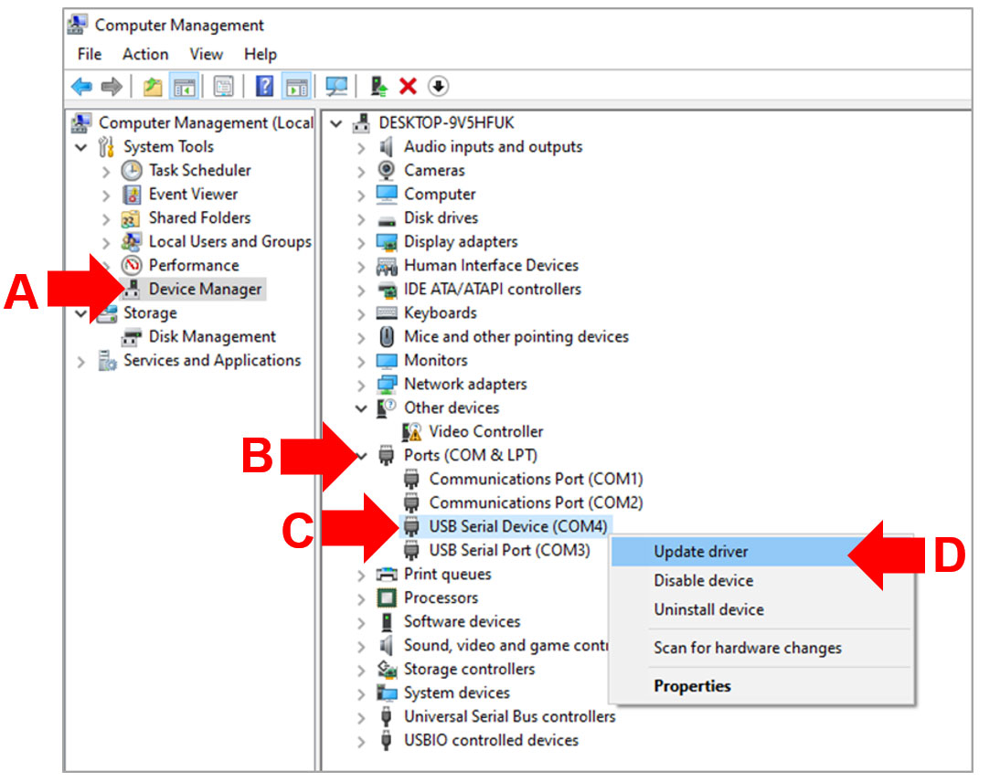

**Image analysis**

```json
{
 "image_name": "image201.jpg",
 "rId": "rId214",
 "image_path": "img_folder/image_200_image201.jpg",
 "caption": "اسکرین شات Device Manager ویندوز با انتخاب USB Serial Device (COM4) و منوی Update driver",
 "ocr_text": "Computer Management\nFile Action View Help\nComputer Management (Local)\nSystem Tools\nTask Scheduler\nEvent Viewer\nShared Folders\nLocal Users and Groups\nPerformance\nDevice Manager\nStorage\nDisk Management\nServices and Applications\nDESKTOP-9V5HFUK\nAudio inputs and outputs\nCameras\nComputer\nDisk drives\nDisplay adapters\nHuman Interface Devices\nIDE ATA/ATAPI controllers\nKeyboards\nMice and other pointing devices\nMonitors\nNetwork adapters\nOther devices\nVideo Controller\nPorts (COM & LPT)\nCommunications Port (COM1)\nCommunications Port (COM2)\nUSB Serial Device (COM4)\nUSB Serial Port (COM3)\nPrint queues\nProcessors\nSoftware devices\nSound, video and game cont\nStorage controllers\nSystem devices\nUniversal Serial Bus controllers\nUSBIO controlled devices\nUpdate driver\nDisable device\nUninstall device\nScan for hardware changes\nProperties\nA\nB\nC\nD",
 "visual_description": [
 "پنجره Computer Management با بخش Device Manager باز است",
 "درخت System Tools شامل Task Scheduler، Event Viewer، Shared Folders، Local Users and Groups، Performance و Device Manager دیده می شود",
 "سیستم با نام DESKTOP-9V5HFUK در لیست دستگاه ها نمایش داده شده است",
 "بخش Ports (COM & LPT) باز شده و موارد Communications Port (COM1)، Communications Port (COM2)، USB Serial Device (COM4) و USB Serial Port (COM3) دیده می شود",
 "روی USB Serial Device (COM4) راست کلیک شده و منوی زمینه شامل Update driver، Disable device، Uninstall device، Scan for hardware changes و Properties نمایش داده می شود",
 "فلش ها و برچسب های قرمز A، B، C، D به قسمت های مختلف رابط کاربری اشاره می کنند"
 ],
 "image_type": "screenshot"
}
```

6. در پنجره ای که باز می شود روی Browse my computer for drivers کلیک کنید:

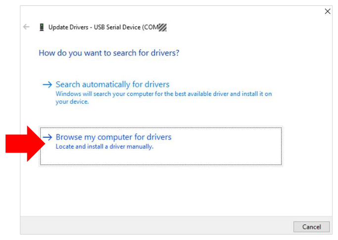

**Image analysis**

```json
{
 "image_name": "image202.tmp",
 "rId": "rId215",
 "image_path": "img_folder/image_201_image202.png",
 "caption": "پنجره Update Drivers ویندوز با گزینه جستجوی خودکار و مرور رایانه برای نصب دستی درایور",
 "ocr_text": "Update Drivers - USB Serial Device (COM\nHow do you want to search for drivers?\nSearch automatically for drivers\nWindows will search your computer for the best available driver and install it on your device.\nBrowse my computer for drivers\nLocate and install a driver manually.\nCancel",
 "visual_description": [
 "اسکرین شات پنجره Windows Update Drivers برای USB Serial Device (COM...)",
 "دو گزینه انتخاب درایور نمایش داده شده: Search automatically for drivers و Browse my computer for drivers",
 "کادر نقطه چین دور گزینه Browse my computer for drivers دیده می شود",
 "فلش قرمز به گزینه Browse my computer for drivers اشاره می کند",
 "دکمه Cancel در پایین سمت راست پنجره قرار دارد"
 ],
 "image_type": "screenshot"
}
```

7. روی Let me pick from a list of available drivers on my computer کلیک کنید:

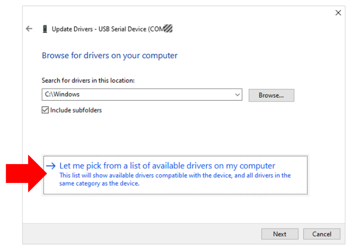

**Image analysis**

```json
{
 "image_name": "image203.tmp",
 "rId": "rId216",
 "image_path": "img_folder/image_202_image203.png",
 "caption": "پنجره Update Drivers در ویندوز با گزینه انتخاب از فهرست درایورها",
 "ocr_text": "Update Drivers - USB Serial Device (COM\nBrowse for drivers on your computer\nSearch for drivers in this location:\nC:\\Windows\nBrowse...\nInclude subfolders\nLet me pick from a list of available drivers on my computer\nThis list will show available drivers compatible with the device, and all drivers in the\nsame category as the device.\nNext\nCancel",
 "visual_description": [
 "پنجره «Update Drivers - USB Serial Device (COM» با عنوان «Browse for drivers on your computer» نمایش داده شده است.",
 "فیلد مسیر جستجوی درایور روی «C:\\Windows» قرار دارد و دکمه «Browse...» کنار آن است.",
 "گزینه تیک خورده «Include subfolders» قابل مشاهده است.",
 "لینک آبی «Let me pick from a list of available drivers on my computer» وجود دارد.",
 "یک فلش قرمز بزرگ به لینک آبی اشاره می کند.",
 "دکمه های «Next» و «Cancel» در پایین پنجره دیده می شوند."
 ],
 "image_type": "screenshot"
}
```

8. از فهرست موجود همانند شکل زیر، Honeywell N4680 را انتخاب و روی Next کلیک کنید:

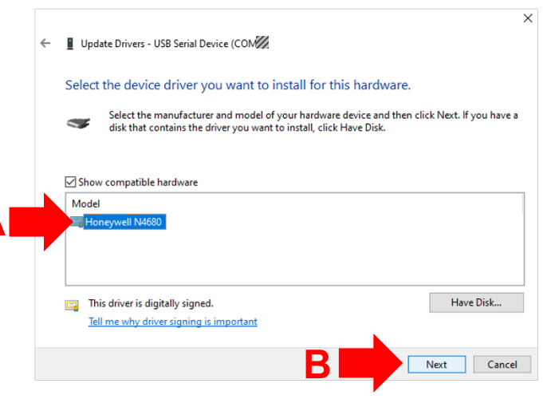

**Image analysis**

```json
{
 "image_name": "image204.tmp",
 "rId": "rId217",
 "image_path": "img_folder/image_203_image204.png",
 "caption": "پنجره Update Drivers ویندوز با انتخاب مدل Honeywell N4680 و دکمه Next",
 "ocr_text": "Update Drivers - USB Serial Device (COM\nSelect the device driver you want to install for this hardware.\nSelect the manufacturer and model of your hardware device and then click Next. If you have a disk that contains the driver you want to install, click Have Disk.\nShow compatible hardware\nModel\nHoneywell N4680\nThis driver is digitally signed.\nTell me why driver signing is important\nHave Disk...\nNext\nCancel\nB",
 "visual_description": [
 "اسکرین شات پنجره Windows Update Drivers برای USB Serial Device (COM...)",
 "گزینه Show compatible hardware تیک خورده است",
 "در لیست Model مورد Honeywell N4680 انتخاب شده است",
 "پیام This driver is digitally signed نمایش داده می شود",
 "لینک Tell me why driver signing is important وجود دارد",
 "دکمه های Have Disk..., Next و Cancel در پایین پنجره دیده می شوند",
 "فلش قرمز به گزینه Honeywell N4680 اشاره می کند",
 "فلش قرمز دیگر به دکمه Next اشاره می کند و حرف B کنار آن دیده می شود"
 ],
 "image_type": "screenshot"
}
```

**B**

**A**

عدم مشاهده ی Honeywell N4680 در فهرست مدل به منزله ی این است که
در مرحله ی 5 روی دیوایس اشتباه راست کلیک و گزینه ی Update driver را انتخاب کرده اید. بدون انجام هیچ تغییری، در پنجره ی فوق روی Cancel کلیک کنید و مجدداً به مرحله 5 بروید.

9. روی Close کلیک کنید:

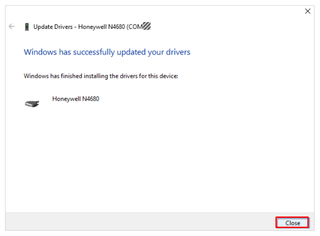

**Image analysis**

```json
{
 "image_name": "image205.tmp",
 "rId": "rId218",
 "image_path": "img_folder/image_204_image205.png",
 "caption": "پنجره به روزرسانی درایور ویندوز برای Honeywell N4680 با پیام موفقیت",
 "ocr_text": "Update Drivers - Honeywell N4680 (COM\nWindows has successfully updated your drivers\nWindows has finished installing the drivers for this device:\nHoneywell N4680\nClose",
 "visual_description": [
 "اسکرین شات پنجره Windows Update Drivers برای دستگاه Honeywell N4680",
 "نمایش پیام موفقیت آمیز بودن به روزرسانی درایورها",
 "ذکر نام دستگاه: Honeywell N4680",
 "وجود دکمه «Close» در پایین سمت راست"
 ],
 "image_type": "screenshot"
}
```

با انجام مراحل فوق، دیوایس بارکدخوان Honeywell N4680 (COM…) در دسته بندی
 Ports (COM & LPT) در دسترس قرار خواهد گرفت:

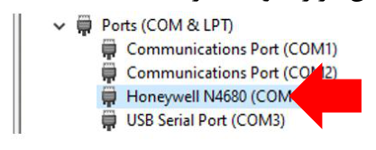

**Image analysis**

```json
{
 "image_name": "image206.tmp",
 "rId": "rId219",
 "image_path": "img_folder/image_205_image206.png",
 "caption": "فهرست پورت های سریال در Device Manager با انتخاب Honeywell N4680",
 "ocr_text": "Ports (COM & LPT)\nCommunications Port (COM1)\nCommunications Port (COM2)\nHoneywell N4680 (COM\nUSB Serial Port (COM3)",
 "visual_description": [
 "اسکرین شات Device Manager ویندوز بخش Ports (COM & LPT) با لیست COMها و یک فلش قرمز اشاره گر به ردیف Honeywell N4680"
 ],
 "image_type": "screenshot"
}
```

# اطمینان از عملکرد درست سیستم

برای اطمینان از کارکرد صحیح سیستم، موارد زیر را انجام دهید:

* انجام پول گذاری
* بررسی تراکنش برداشت وجه
* بررسی تراکنش انتقال به کارت
* در صورت وجود ماژول 1×4، بررسی تراکنش انتقال به کارت با احراز هویت
* بررسی تراکنش انتقال به حساب
* بررسی تراکنش مانده حساب
* بررسی تراکنش صورت حساب
* بررسی تراکنش خرید شارژ
* بررسی تراکنش پرداخت قبض (دستی و بارکدخوان)
* بررسی تراکنش تغییر رمز کارت
* بررسی تراکنش تغییر رمز اینترنتی کارت
* بررسی تمامی تراکنش ها برای یکی از حساب های غیر اصلی در کارت های دارنده حساب های متصل
* بررسی درستی سیستم مانیتورینگ و درستی ارسال و دریافت فایل‌ها به سرور و گرفتن و 
اجرا کردن ‫دستورات ارسالی از سرور
* در پایان، پس از انجام تراکنش، تصویر دوربین بررسی گردد.

پس از نصب کامل نرم افزار، به منظور ورود به محیط ویندوز:

از طریق SOP وارد منوی Supervisor شوید (رمز ورود ۶۵۴۳۲۱ می باشد). منوی Exit و بعدازآن، Terminate Application را انتخاب کنید و سپس بلافاصله چند بار کلیدهای Ctrl+C را بر روی صفحه کلید بزنید تا پنجره مشکی رنگ در مانیتور اصلی بسته شود. پنجره ی Task Manager را بازکنید و در تب Processes گزینه یATM Startup Service را End Task کنید.

# پیوست 1: چک لیست نصب نرم افزار

<!-- TABLE_START -->
| | | |
| --- | --- | --- |
| **1** | بررسی اقلام موردنیاز | 🞏 |
| **2** | بررسی سخت افزار موردنیاز | 🞏 |
| **3** | انجام اقدامات پیش از نصب | 🞏 |
| **4** | تنظیمات اولیه در ADIPC | 🞏 |
| **5** | نصب ویندوز با استفاده از نرم افزار آکرونیس | 🞏 |
| **6** | انجام تنظیمات راه اندازی ویندوز | 🞏 |
| **7** | انجام تنظیمات کانفیگ سخت افزاری | 🞏 |
| **8** | تنظیم صفحه نمایش | 🞏 |
| **9** | ساخت درایو D | 🞏 |
| **10** | نصب درایورEPP | 🞏 |
| **11** | انجام تنظیمات Computer Name | 🞏 |
| **12** | Join to Domain | 🞏 |
| **13** | اضافه نمودن یوزر ATM به یوزرهای ویندوز | 🞏 |
| **14** | اکتیو نمودن سیستم عامل | 🞏 |
| **15** | انجام تنظیمات Autologon | 🞏 |
| **16** | انجام تنظیمات مربوط به زبان محیط ویندوز | 🞏 |
| **17** | راه اندازی دوربین BNC | 🞏 |
| **18** | نصب نرم افزار پردازشگران | 🞏 |
| **19** | نصب هاتفیکس SamanPackageConfiguration | 🞏 |
| **20** | بررسی اتصالات COM در PC های مدل ADIPC | 🞏 |
| **21** | بررسی عملکرد دوربین | 🞏 |
| **22** | بررسی بارکدخوان Honeywell N4680 در Device Manager | 🞏 |
| **23** | اطمینان از عملکرد درست سیستم | 🞏 |
<!-- TABLE_END -->

# پیوست 2: موارد بیست گانه ی داخل شعبه (In Branch)

<!-- TABLE_START -->
| | | | | | | | |
| --- | --- | --- | --- | --- | --- | --- | --- |
| ردیف | مدل | نوع دستگاه | شماره ترمینال | نام ترمینال | شماره سریال | آدرس | IP Address |
| **1** | **Wincor 1500 PrBs** | سالنی | **1787** | شعبه نیاوران، 2 | **5300861030** | شعبه نیاوران | **10.10.84.22** |
| **2** | **Wincor 1500 PrBs** | سالنی | **1432** | شعبه آفریقا 3 | **5300863761** | شعبه آفریقا | **10.10.2.23** |
| **3** | **Wincor 1500 PrBs** | سالنی | **1784** | قم، شعبه قم 2 | **5300863792** | قم، بلوار امین، نبش کوچه 41 | **10.32.0.23** |
| **4** | **Wincor 1500 PrBs** | سالنی | **1541** | شعبه بازار کفاشها 2 | **5300863994** | تهران، بازار بزرگ، انتهای بازار کفاشها، مقابل سرای مشکوۀ | **10.10.49.20** |
| **5** | **Wincor 1500 PrBs** | سالنی | **1369** | شعبه بازار، 2 | **5300863879** | خ 15 خرداد غربی، مقابل بانک ملی ایران، شعبه بازار | **10.10.11.22** |
| **6** | **Wincor 1500 PrBs** | سالنی | **1469** | مشهد، شعبه سجاد 3 | **5300861514** | مشهد، بلوار سجاد، نبش سجاد8 (خ لاله جنوبی) | **10.36.0.23** |
| **7** | **Wincor 1500 PrBs** | سالنی | **2272** | کرج، شعبه توحید 2 | **5300863997** | کرج، خ شاه عباسی، بین میدان توحید و میدان قدس | **10.10.31.21** |
| **8** | **Wincor 1500 PrBs** | سالنی | **1816** | همدان، شعبه همدان 3 | **5300860680** | همدان، خ جهان نما، مقابل خ آزادی، برج شهباز، طبقه همکف | **10.37.0.23** |
| **9** | **Wincor 1500 PrBs** | سالنی | **1829** | تبریز، شعبه تبریز 3 | **5300860922** | تبریز خ امام نرسیده به چهارراه بهشتی جنب دبیرستان | **10.22.0.22** |
| **10** | **Wincor 1500 PrBs** | سالنی | **2058** | شعبه خ ملت اکباتان، 2 | **5300863731** | خ سعدی جنوبی،خ اکباتان،پ14 | **10.10.34.21** |
| **11** | **Wincor 1500 PrBs** | سالنی | **1688** | شعبه میدان آرژانتین 3 | **5300864078** | خ بیهقی ضلع غربی محوطه شهروند پ 103 | **10.10.4.22** |
| **12** | **Wincor 1500 PrBs** | سالنی | **2494** | اردبیل، شعبه اردبیل 2 | **5300863669** | اردبیل، خیابان شیخ صفی، پلاک 160 | **10.12.0.21** |
| **13** | **Wincor 1500 PrBs** | سالنی | **2507** | کرج، شعبه جهانشهر، 3 | **5300860798** | کرج، م سپاه، ابتدای بلوار جمهوری شمالی، نبش نیلوفر | **10.10.32.22** |
| **14** | **Wincor 1500 PrBs** | سالنی | **1080** | باجه بازار سیگارفروشها | **5300861466** | مولوی، باجه سیگار فروشها | **10.90.21.20** |
| **15** | **Wincor 1500 PrBs** | سالنی | **1136** | شعبه برج سامان 1 | **5300860600** | خیابان شریعتی بالاتر از سید خندان نبش اتوبانک برج سامان | **10.10.5.20** |
| **16** | **Wincor 1500 PrBs** | سالنی | **1137** | شعبه برج سامان 2 | **5300863809** | خیابان شریعتی بالاتر از سید خندان نبش اتوبانک برج سامان | **10.10.5.21** |
| **17** | **Wincor 280** | سالنی | **1902** | شعبه جام جم، 1 | **56DW512982** | خ ولیعصر نرسیده به چهارراه پارک وی نبش ک ترکش دوز | **10.10.14.20** |
| **18** | **Wincor 280** | سالنی | **1271** | شعبه ف اول تهرانپارس 2 | **56DW512946** | خ تهرانپارس، فلکه اول تهرانپارس،نبش خ 148غربی،پ76 | **10.10.45.21** |
| **19** | **Wincor 280** | سالنی | **1213** | شعبه میرداماد 2 | **56DW512877** | بلوارمیرداماد، روبروی مسجدالغدیر، ادارات مرکزی، ساختمان شماره 2 | **10.10.36.21** |
| **20** | **Wincor 280** | سالنی | **1577** | شعبه بهشتی، قائم مقام | **56DW512945** | تهران، خ بهشتی، بعد از مدرس به سمت غرب، پ 275، ساختمان شفا یاب | **10.10.136.20** |
<!-- TABLE_END -->