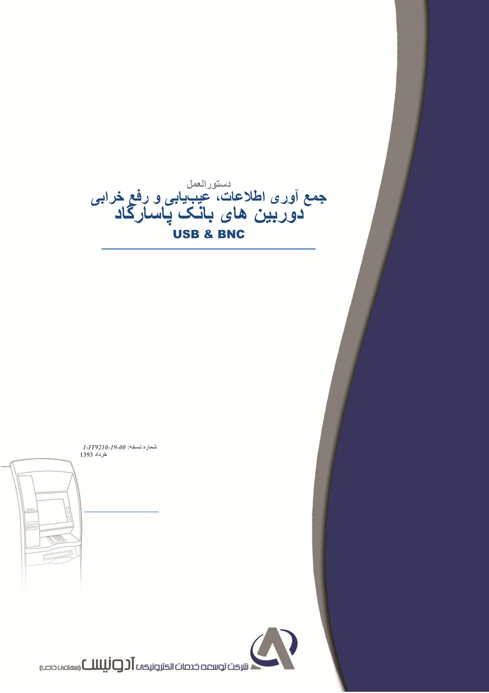
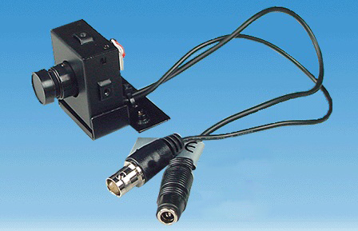
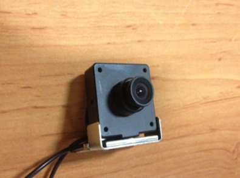
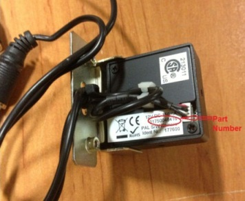
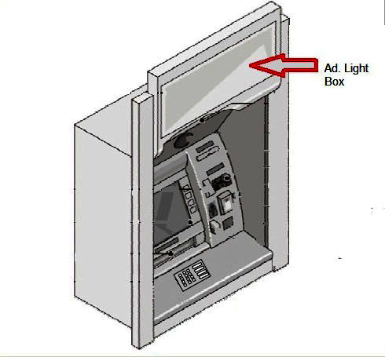
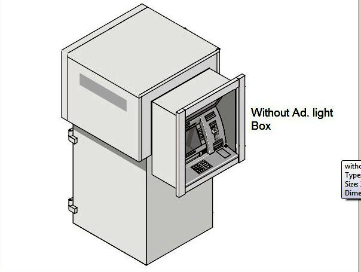

# Document metadata

- **Title:** جمع آوری اطلاعات، عیب یابی و رفع خرابی
- **Author:** Arash Tighbor
- **Last Modified By:** Arash Tighbor
- **Created:** 2014-05-28T04:40:00Z
- **Modified:** 2015-11-15T11:27:00Z
- **Document Name:** 1-IT9210-19-00_CameraTroubleshooting_Pasargad.docx
- **Source File:** C:\Users\aa.eskandari\Desktop\input\1-IT9210-19-00_CameraTroubleshooting_Pasargad.docx

---



**Image analysis**

```json
{
 "image_name": "image1.jpg",
 "rId": "rId8",
 "image_path": "img_folder/image_001_image1.jpg",
 "caption": "جلد دستورالعمل جمع آوری اطلاعات و عیب یابی دوربین های بانک پاسارگاد با رابط USB و BNC",
 "ocr_text": "دستورالعمل\nجمع آوری اطلاعات، عیب یابی و رفع خرابی\nدوربین های بانک پاسارگاد\nUSB & BNC\nشماره نسخه : 1-IT9210-19-00\nخرداد 1393\nشرکت توسعه خدمات الکترونیکی آدونیس (سهامی خاص)",
 "visual_description": [
 "صفحه جلد یک سند با عنوان فارسی و عبارت انگلیسی «USB & BNC»",
 "وجود شماره نسخه «1-IT9210-19-00» و تاریخ «خرداد 1393» در پایین صفحه",
 "نمایش نام شرکت «شرکت توسعه خدمات الکترونیکی آدونیس (سهامی خاص)» و لوگو در پایین",
 "تصویر خطی یک دستگاه شبیه خودپرداز/ترمینال در گوشه پایین چپ",
 "پس زمینه سفید با نوار عمودی تیره در سمت راست و یک خط افقی آبی زیر عنوان"
 ],
 "image_type": "scan"
}
```

**دستورالعمل
جمع آوری اطلاعات، عیب یابی و رفع خرابی**

**دوربین های بانک پاسارگاد**

**USB & BNC**

**شماره نسخه: 1-IT9210-19-00**

**خرداد 1393**


**Image analysis**

```json
{
 "image_name": "image2.png",
 "rId": "rId9",
 "image_path": "img_folder/image_002_image2.png",
 "caption": "لوگوی شرکت توسعه خدمات الکترونیکی آدونیس",
 "ocr_text": "شرکت توسعه خدمات الکترونیکی آدونیس",
 "visual_description": [
 "لوگوی متنی فارسی در کنار یک نماد گرافیکی شبیه حرف A خاکستری با دو قوس آبی",
 "پس زمینه مشکی و نوشته ها به رنگ های خاکستری و آبی تیره"
 ],
 "image_type": "diagram"
}
```

این سند با عنوان «دستورالعمل جمع آوری اطلاعات، شناسایی خرابی و رفع عیب دوربین های
بانک پاسارگاد-Camera (USB&BNC)» در تاریخ 16/10/92 در گروه پشتیبانی فنی لایه دوم شرکت توسعه خدمات الکترونیکی آدونیس توسط آقایان کریمی و کهنسال تهیه و تنظیم شده است. این دستورالعمل در خرداد ماه 93 در واحد آموزش امور فناوری اطلاعات توسط آرش تیغ بر ویرایش و با شماره نسخه ی 1-IT9210-19-00 منتشر گردید.

سابقه ویرایش:

<!-- TABLE_START -->
| | | |
| --- | --- | --- |
| **نام** **ویرایشگر** | **تاریخ** | **نام / سمت تاییدکننده** |
| | | |
| | | |
| | | |
| | | |
| | | |
<!-- TABLE_END -->


**Image analysis**

```json
{
 "image_name": "image4.png",
 "rId": "rId14",
 "image_path": "img_folder/image_003_image4.png",
 "caption": "متن خوشنویسی «به نام خدا» روی پس زمینه سفید",
 "ocr_text": "به نام خدا",
 "visual_description": [
 "متن فارسی به صورت خوشنویسی سیاه روی زمینه سفید نمایش داده شده است"
 ],
 "image_type": "scan"
}
```

# پیشگفتار

در راستای اجرای پروژه جمع آوری اطلاعات، عیب یابی و رفع اشکال دوربین های خودپرداز بانک پاسارگاد[[1]](#footnote-1)، لازم است کارشناسان بعد از مراجعه به محل و انجام سرویس های مورد درخواست، فرمی را که به همین منظور طراحی شده است، تکمیل نمایند.

لذا خواهشمند است تمامی فیلدهای فرم مذکور را طبق این دستورالعمل تکمیل نمایید.

# هدف پروژه

جمع آوری اطلاعات کامل، شناسایی خرابی و رفع عیب - تا حد امکان - دوربین های بانک پاسارگاد[[2]](#footnote-2)

# فرم جمع آوری اطلاعات دوربین خودپرداز

1. **مشخصات کامل**: شامل نام شعبه یا باجه، مدل دستگاه، شماره سریال و شماره خودپرداز که می باید آنها را با دقت وارد نمایید.
2. **دوربین**:پس از مراجعه، مدل دوربین را مشخص کنید:

<!-- TABLE_START -->
| | |
| --- | --- |
|

**Image analysis**

```json
{
 "image_name": "image5.jpg",
 "rId": "rId15",
 "image_path": "img_folder/image_004_image5.jpg",
 "caption": "ماژول دوربین صنعتی با کابل و کانکتورهای اتصال",
 "ocr_text": "",
 "visual_description": [
 "یک ماژول دوربین مکعبی شکل با لنز استوانه ای در جلوی دستگاه دیده می شود",
 "کابل متصل به دوربین به دو کانکتور در انتها می رسد",
 "یکی از کانکتورها فلزی استوانه ای با قفل چرخشی شبیه BNC است",
 "کانکتور دیگر مشکی با بدنه فنردار و فیش گرد است",
 "دوربین روی پایه فلزی با سوراخ های نصب قرار دارد"
 ],
 "image_type": "photo"
}
``` | |
| BNC | |
|

**Image analysis**

```json
{
 "image_name": "image6.jpeg",
 "rId": "rId16",
 "image_path": "img_folder/image_005_image6.jpg",
 "caption": "ماژول دوربین کوچک با لنز روی میز چوبی",
 "ocr_text": "",
 "visual_description": [
 "یک ماژول دوربین الکترونیکی کوچک با لنز استوانه ای مشکی",
 "بدنه فلزی/پلاستیکی خاکستری با چهار پیچ در گوشه ها",
 "کابل متصل در سمت چپ ماژول",
 "قرارگیری ماژول روی سطح چوبی"
 ],
 "image_type": "photo"
}
``` |

**Image analysis**

```json
{
 "image_name": "image7.jpeg",
 "rId": "rId17",
 "image_path": "img_folder/image_006_image7.jpg",
 "caption": "نمای نزدیک یک سوئیچ/میکروسوئیچ صنعتی با برچسب های استاندارد و شماره قطعه",
 "ocr_text": "UL\nLISTED\n21Y01\nCE\nPAL STOP\nAu LS 17630\nThis Item Is\nPart\nNumber",
 "visual_description": [
 "یک قطعه الکترومکانیکی مشکی با پایه فلزی نصب شده روی سطح چوبی دیده می شود",
 "برچسب سفید شامل علائم UL LISTED، CE و متن «PAL STOP» روی بدنه وجود دارد",
 "یک برچسب خاکستری با متن «UL LISTED 21Y01» در گوشه بالایی قطعه دیده می شود",
 "فلش قرمز و متن «Part Number» به یک برچسب مستطیلی با شماره «Au LS 17630» اشاره می کند",
 "چند سیم/کابل متصل به قطعه مشاهده می شود"
 ],
 "image_type": "photo"
}
``` |
| USB | |
<!-- TABLE_END -->

پس از تشخیص نوع دوربین اطلاعات مربوط به آن را به دست آورید.

اگر دوربین از نوعBNC است، وجود کارت کپچر در PC را بررسی کنید. در صورت وجود کارت کپچر، نوع آن را نیز مشخص نمایید؛ اگر از نوع 3INPUT باشد، کابل Data باید به سوکت آخر متصل باشد.

اگر دوربین BNC است ولی پس از مسیریابی، مشخص شد که کابل Data وارد BOX DVR شده است[[3]](#footnote-3) باید نوع آن را مشخص کنید. کابل Data ممکن است وارد BOX SD RECORDER[[4]](#footnote-4) شده باشد و یا به کف گاوصندوق رفته و وارد رک بانک شده باشد.

3. **Ad. Light Box** : همان تابلوی تبلیغات خودپرداز است. با در نظر گرفتن اینکه تونل فریم، قسمت تبلیغات را شامل می شود یا خیر گزینه مناسب را انتخاب کنید. دستگاه های 2050 و 2150 دارای این تابلو می باشند.



**Image analysis**

```json
{
 "image_name": "image8.jpeg",
 "rId": "rId18",
 "image_path": "img_folder/image_007_image8.jpg",
 "caption": "نمای شماتیک دستگاه خودپرداز با فلش به جعبه نور تبلیغات",
 "ocr_text": "Ad. Light\nBox",
 "visual_description": [
 "تصویر سه بعدی یک خودپرداز داخل قاب/محفظه",
 "وجود فلش قرمز که به پنل بالایی اشاره می کند",
 "برچسب متنی «Ad. Light Box» کنار فلش",
 "پنل بالایی به شکل جعبه نور/تابلوی تبلیغاتی نمایش داده شده است"
 ],
 "image_type": "diagram"
}
```

**Image analysis**

```json
{
 "image_name": "image9.jpeg",
 "rId": "rId19",
 "image_path": "img_folder/image_008_image9.jpg",
 "caption": "نمای سه بعدی محفظه دستگاه با درِ باز و برچسب Without Ad. light Box",
 "ocr_text": "Without Ad. light\nBox",
 "visual_description": [
 "تصویر سه بعدی یک کابین/محفظه مستطیلی با درِ لولایی باز در سمت راست",
 "داخل محفظه یک پنل با چند ماژول مستطیلی و یک صفحه کلید کوچک دیده می شود",
 "متن برچسب در سمت راست تصویر قرار دارد: Without Ad. light Box"
 ],
 "image_type": "diagram"
}
```

نوع چراغ دستگاه های WINCOR 2050 را با توجه به کابل ورودی و Part Number مشخص نمایید؛ در چراغ های LED، نوع کابل ورودی 2 Pin و مقدار Part Number معادل 01750171417 می باشد. در غیر اینصورت اگر چراغ برچسب تعمیرات نداشته باشد از نوع فلورسنت خواهد بود. در دستگاه های EASTCOM تمامی چراغ ها از نوع LED هستند؛ اگر اشکالی – نظیر سوختگی قسمتی از آن یا کم نور بودن و ... - در این قطعه مشاهده می کنید حتماً باید آن را در قسمت توضیحات درج نمایید.

4. **سایبان**: اگر دستگاه سایبان دارد ولی مشکلاتی از قبیل کوتاه بودن، پارگی و یا ایراداتی از این قبیل در آن
 می بینید حتماً اشکال یا اشکالات موجود را به طور کامل در قسمت توضیحات شرح دهید.

در این فرم به چند نمونه از خطاهای رایج به همراه راهکار رفع آنها اشاره شده است. در صورتیکه راهکارهای مذکور مثمر ثمر واقع نشدند، می باید اقدامات دیگری را در جهت رفع خرابی انجام دهید و شرح آن را در قسمت توضیحات چگونگی رفع خرابی درج نمایید.

5. **کنترل عکس های دوربین**:
 1. اولین گام در جهت تست دوربین، وجود درایو D می باشد. سپس از صحت عملکرد نرم افزار دوربین (SP و Driver) اطمینان حاصل نمایید[[5]](#footnote-5).
 2. پس از اطمینان از نصب درست نرم افزار و تست آن، می باید عکس ها را بررسی و اشکالات موجود را طبق جدول زیر برطرف نمایید:

<!-- TABLE_START -->
| | |
| --- | --- |
| **اشکال** | **راه حل** |
| عکس آبی است | قطعاً مشکلی در قسمت کابل بندی و اتصالات وجود دارد. پس از اطمینان از درست بودن اتصالات و کابل بندی، اقدامات بعدی را انجام دهید. |
| دوربین سالم و نرم افزار نصب شده است ولی از یک تاریخ مشخص به بعد عکسی ذخیره نشده است | فضای خالی درایوD را بررسی کنید؛ اگر فضای موجود پرشده است با هماهنگی مسئول دفتر نسبت به رفع خرابی اقدام نمایید. |
| عکس فریز شده است | در این حالت، یک عکس مشابه دائماً ذخیره می شود و شماره کارت آن تغییر می کند. برای رفع این اشکال، نرم افزار دوربین (SP) را یک بار حذف و مجدداً نصب کنید. |
| عکس واضح نیست | اگر نویز وجود دارد – وجود یک خط در تصویر – کابل بندی و اتصالات را به طور کامل بررسی کنید. اگر تصویر تار است، توسط پیچ کنار لنز دوربین می توانید وضوح تصویر را تنظیم کنید. |
| عکس زرد است | پیشنهاد می شود در ابتدا تمامی کابل بندی و اتصالات را بررسی کنید و سپس نرم افزار دوربین را تعویض نمایید. |
| کیفیت عکس ذخیره شده خوب است ولی در قسمت شماره کارت ثبت شده روی عکس، به جای عدد، ستاره درج می شود. | حتماً باید نرم افزار خودپرداز (ProCash) تعویض شود. |
| تصویر ثبت شده در شب سیاه و ناواضح است. | این اشکال ممکن است به دلایل زیر باشد: * تار بودن تلق جلوی دوربین : آن را تعویض کنید. * ناکافی بودن نور : چراغ Ad. Light Box را تعویض کنید. |
| سرور به تصاویر ذخیره شده دسترسی ندارد | به پوشه ایجادشده در درایو D مراجعه کنید. روی آن راست کلیک کنید و در منویی که نمایان می شودProperties را انتخاب کنید. در پنجره ای که گشوده می شود، در تب Sharing، گزینه مربوط به اشتراک گذاری فایل را فعال کنید تا پوشه Share شود. |
| تصویر چهره به طور کامل ثبت نمی شود. | Application و نرم افزار دوربین را با مراجعه به قسمت Services ببندید و دستگاه را در حالت تست دوربین قرار دهید. سپس زاویه دوربین را به میزان مطلوب تنظیم کنید. در صورتیکه با انجام این کار، اشکال برطرف نشد، با قرار دادن پله زیر دوربین آن را تنظیم نمایید. |
| در روز، عکس ضد نور است | گاهی به دلیل وجود نور بیش ازاندازه، تصویر ثبت شده واضح و قابل شناسایی نیست. در این حالت می باید تلق دوربین را تعویض کنید. |
| ذخیره کردن عکس | ذخیره سازی عکس ها، مهم ترین بخش کار تلقی می شود؛ کارشناس باید عکس های دو روز آخر را به همراه عکس هایی با وضعیتهای مختلف – در دو تاریخ خواسته شده - تهیه کند. عکسها می باید در پوشه ای با نام شماره ترمینال دستگاه قرار داده شوند و سپس در یک سی دی رایت و به مسئول دفتر ارجاع داده شود. لازم به ذکر است که پس از ذخیره عکس ها، صحت عملکرد دوربین می باید توسط دایره انفورماتیک بانک تائید شود و در قسمت توضیحات، نام کارشناس انفورماتیک و زمان دقیق ثبت گردد. |
<!-- TABLE_END -->

1. دوربین های USB و BNC [↑](#footnote-ref-1)
2. دوربین های USB و BNC [↑](#footnote-ref-2)
3. در دستگاه های 2050 در قسمت بالای PC قرار دارد. [↑](#footnote-ref-3)
4. در دستگاه های 1500 چسبیده به بدنه است. [↑](#footnote-ref-4)
5. برای این منظور از دستورالعملی که توسط آقای مهندس غریبی تهیه شده است استفاده کنید. [↑](#footnote-ref-5)