# Document metadata

- **Author:** Arash Tighbor
- **Last Modified By:** Arash Tighbor
- **Created:** 2015-04-25T08:46:00Z
- **Modified:** 2022-01-03T08:18:00Z
- **Document Name:** 1-IT9606-250-01_2D-BCR-Installation.docx
- **Source File:** C:\Users\aa.eskandari\Desktop\input\1-IT9606-250-01_2D-BCR-Installation.docx

---

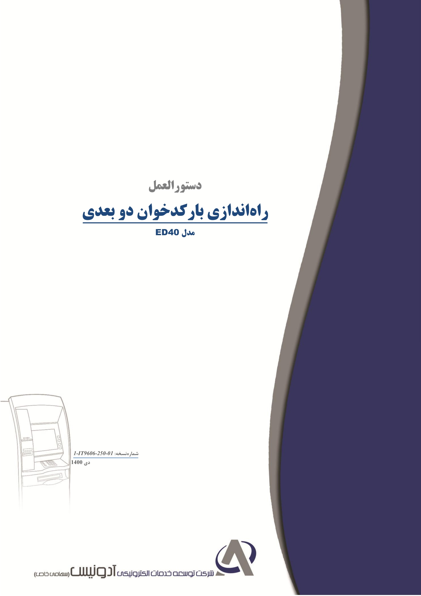

**Image analysis**

```json
{
 "image_name": "image1.jpg",
 "rId": "rId8",
 "image_path": "img_folder/image_001_image1.jpg",
 "caption": "جلد دستورالعمل راه اندازی بارکدخوان دو بعدی مدل ED40",
 "ocr_text": "دستورالعمل\nراه اندازی بارکدخوان دو بعدی\nمدل ED40\nشماره نسخه: 1-IT9606-250-01\nدی 1400\nشرکت توسعه خدمات الکترونیکی آرونیس (سهامی خاص)",
 "visual_description": [
 "جلد سند راهنما به زبان فارسی برای راه اندازی بارکدخوان دو بعدی با عنوان مدل ED40",
 "شماره نسخه و تاریخ انتشار (دی 1400) روی جلد درج شده است",
 "تصویر خطی یک دستگاه شبیه ترمینال/کیوسک در پایین صفحه دیده می شود",
 "لوگوی شرکت توسعه خدمات الکترونیکی آرونیس در پایین صفحه قرار دارد"
 ],
 "image_type": "scan"
}
```

**دستورالعمل**

**راه اندازی بارکدخوان دو بعدی
مدل** ED40

**شماره نسخه: 1-IT9606-250-01**

**دی 1400**


**Image analysis**

```json
{
 "image_name": "image2.png",
 "rId": "rId9",
 "image_path": "img_folder/image_002_image2.png",
 "caption": "لوگوی شرکت آدونیس و عبارت شرکت توسعه خدمات الکترونیکی",
 "ocr_text": "آدونیس شرکت توسعه خدمات الکترونیکی",
 "visual_description": [
 "تصویر شامل لوگوتایپ فارسی و نماد گرافیکی حرف A به رنگ خاکستری با قوس آبی است",
 "متن فارسی در سمت چپ لوگو قرار دارد و نماد گرافیکی در سمت راست است",
 "پس زمینه تصویر مشکی است"
 ],
 "image_type": "unknown"
}
```

سند «دستورالعمل راه اندازی بارکدخوان دو بعدی مدل ED40» در شهریور 96 توسط مصطفی کهنسال در گروه پشتیبانی لایه دوم شرکت توسعه خدمات الکترونیکی آدونیس تهیه و تنظیم شده است. این دستورالعمل
 در واحد آموزش امور فناوری اطلاعات، توسط آرش تیغ بر ویرایش و آماده ی انتشار گردید.

سابقه ویرایش، در جدول زیر قابل پیگیری می باشد:

<!-- TABLE_START -->
| | | | |
| --- | --- | --- | --- |
| **نام** **ویرایشگر** | **تاریخ** | **نام / سمت تاییدکننده** | **شماره نسخه قبلی\*** |
| آرش تیغ بر | دی 1400 | ولی الله حلال خور/کارشناس واحد پشتیبانی سطح 2 | 1-IT9606-250-00 |
| | | | |
| | | | |
| | | | |
| | | | |
<!-- TABLE_END -->

\* با انتشار نسخه ی جدید یک سند، کلیه نسخه های قبلی فاقد اعتبار خواهند شد.

<!-- TABLE_OF_CONTENTS_START -->
**فهرست**

[نصب فیزیکی ماژول بارکدخوان دو بعدی مدل ED40 1](#_Toc491853234)

[پیش نیاز نصب 2](#_Toc491853235)

[بررسی عملکرد بارکدخوان 4](#_Toc491853236)

[مرحله اول: بارگذاری Firmware 4](#_Toc491853237)

[مرحله دوم: بارگذاری Firmware در محیط CSCW32 15](#_Toc491853238)

[تست در محیط WOSA 18](#_Toc491853240)
<!-- TABLE_OF_CONTENTS_END -->


**Image analysis**

```json
{
 "image_name": "image4.png",
 "rId": "rId15",
 "image_path": "img_folder/image_003_image4.png",
 "caption": "عبارت خوشنویسی «به نام خدا» با متن سیاه روی پس زمینه سفید",
 "ocr_text": "به نام خدا",
 "visual_description": [
 "متن فارسی خوشنویسی شده با رنگ مشکی روی زمینه سفید",
 "هیچ نمودار، جدول، دیاگرام یا برچسب فنی دیگری دیده نمی شود"
 ],
 "image_type": "scan"
}
```

این دستورالعمل به منظور آموزش نحوه ی راه اندازی بارکدخوان دوبعدی مدل ED40 تهیه شده است.

# نصب فیزیکی ماژول بارکدخوان دو بعدی مدل ED40

این ماژول ازنظر فیزیکی با ماژول بارکدخوان MS954 کمی فرق دارد و به منظور یکسان سازی محل نصب آن بر روی خودپرداز، قابی طراحی شده که به وسیله آن می توانید هر دو ماژول را بر روی تمامی مدل های خودپردازWINCOR نصب نمایید.

ازاین رو لازم است حتماً قبل از راه اندازی این ماژول در هر مدل خودپرداز، از نحوه نصب بودن سخت افزاری این قطعه اطلاعات لازم کسب گردد.

<!-- TABLE_START -->
| | |
| --- | --- |
|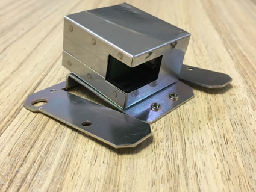

**Image analysis**

```json
{
 "image_name": "image5.png",
 "rId": "rId16",
 "image_path": "img_folder/image_004_image5.png",
 "caption": "مجموعه قطعه فلزی با براکت نصب و دو سوراخ پیچ روی سطح چوبی",
 "ocr_text": "",
 "visual_description": [
 "یک مجموعه مکانیکی از ورق/پروفیل فلزی با پوشش براق دیده می شود",
 "براکت پایه دارای دو زبانه جانبی با سوراخ های نصب است",
 "دو سوراخ رزوه دار یا جای پیچ روی صفحه مرکزی پایه قابل مشاهده است",
 "بین بخش بالایی و پایه یک قطعه/فاصله دهنده مشکی مستطیلی قرار دارد",
 "گوشه ها و لبه ها خم کاری و اتصال با پیچ/پرچ روی بدنه بالایی دیده می شود"
 ],
 "image_type": "photo"
}
``` |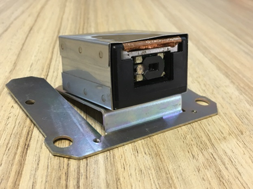

**Image analysis**

```json
{
 "image_name": "image6.png",
 "rId": "rId17",
 "image_path": "img_folder/image_005_image6.png",
 "caption": "ماژول فلزی نصب شده روی براکت با یک دهانه مستطیلی و کانکتور داخلی",
 "ocr_text": "",
 "visual_description": [
 "یک قطعه فلزی مکعبی روی یک براکت فلزی با دو سوراخ نصب شده است",
 "در جلوی قطعه یک دهانه مستطیلی مشکی دیده می شود",
 "داخل دهانه، یک کانکتور/سوکت کوچک و چند پین فلزی قابل مشاهده است",
 "در بالای دهانه یک نوار مسی/رنگ مسی دیده می شود"
 ],
 "image_type": "photo"
}
``` |
<!-- TABLE_END -->

باید توجه گردد جهت نصب بارکد دوبعدی کابل USB آن می باید به صورت شکل زیر باشد لذا قبل از نصب فیزیکی از بودن این نوع کابل اطمینان حاصل نمایید:

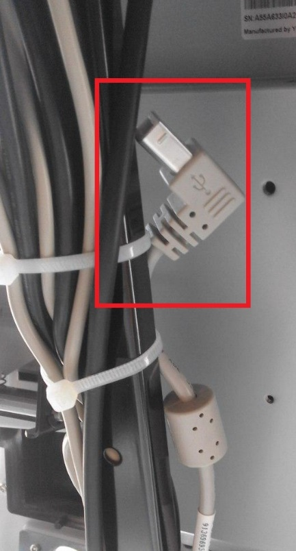

**Image analysis**

```json
{
 "image_name": "image7.jpeg",
 "rId": "rId18",
 "image_path": "img_folder/image_006_image7.jpg",
 "caption": "نمای نزدیک از کانکتور USB و کابل های بسته شده با بست کمربندی",
 "ocr_text": "SN: AS8A6139A2\nManufactured by",
 "visual_description": [
 "کانکتور USB با نماد USB روی بدنه دیده می شود",
 "یک کادر مستطیلی قرمز دور کانکتور قرار دارد",
 "چند کابل با بست کمربندی پلاستیکی سفید بسته شده اند",
 "روی پس زمینه، برچسبی با متن «SN: AS8A6139A2» و «Manufactured by» قابل مشاهده است",
 "یک قطعه استوانه ای روی کابل با چند سوراخ ریز دیده می شود"
 ],
 "image_type": "photo"
}
```

راه اندازی بارکدخوان دوبعدی در دو مرحله انجام می شود؛ مرحله اول بارگذاری Firmware، مرحله دوم شناسایی ماژول در نرم افزار ProBase .

اما قبل از پرداختن به این مراحل ابتدا می باید مواردی که در قسمت «پیش نیاز نصب» به آن ها اشاره شده است را به دقت موردبررسی و اجرا نمایید.

# پیش نیاز نصب

* قبل از آغاز عملیات، از نصب بودن نرم افزار.Net Framework نسخه ی 4 و یا بالاتر بر روی سیستم عامل PC اطمینان حاصل نمایید. برای این منظور می توانید درControl Panel به قسمت
 Programs and Features بروید:

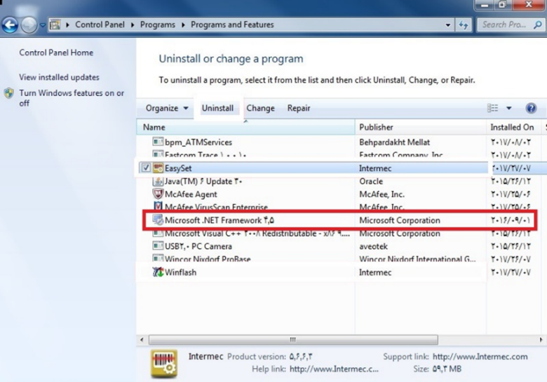

**Image analysis**

```json
{
 "image_name": "image8.png",
 "rId": "rId19",
 "image_path": "img_folder/image_007_image8.png",
 "caption": "اسکرین شات «Programs and Features» ویندوز با برجسته شدن Microsoft .NET Framework 4.5",
 "ocr_text": "Control Panel > Programs > Programs and Features\nControl Panel Home\nView installed updates\nTurn Windows features on or off\nUninstall or change a program\nTo uninstall a program, select it from the list and then click Uninstall, Change, or Repair.\nOrganize\nUninstall\nChange\nRepair\nName\nPublisher\nInstalled On\nbpm_ATMServices\nBehpardakht Mellat\nFastrom Trace 1.0.0.0\nFastrom Company Inc.\nEasySet\nIntermec\nJava(TM) 6 Update 20\nOracle\nMcAfee Agent\nMcAfee, Inc.\nMcAfee VirusScan Enterprise\nMcAfee, Inc.\nMicrosoft .NET Framework 4.5\nMicrosoft Corporation\nMicrosoft Visual C++ 2008 Redistributable - x86 ...\nMicrosoft Corporation\nUSB2.0 PC Camera\naveotek\nWincor Nixdorf ProBase\nWincor Nixdorf International G...\nWinflash\nIntermec\nIntermec\nProduct version: 5.5.2.2\nHelp link: http://www.Intermec.c...\nSupport link: http://www.Intermec.com\nSize: 9.3 MB",
 "visual_description": [
 "پنجره Control Panel مسیر Programs > Programs and Features نمایش داده شده است",
 "فهرست برنامه های نصب شده با ستون های Name، Publisher و Installed On دیده می شود",
 "ردیف «Microsoft .NET Framework 4.5» با کادر قرمز و انتخاب مشخص شده است",
 "نوار ابزار شامل گزینه های Organize، Uninstall، Change و Repair است",
 "پنل پایین اطلاعات برنامه انتخاب شده Intermec شامل Product version، Help link، Support link و Size را نشان می دهد"
 ],
 "image_type": "screenshot"
}
```

نیازی به بارگذاری فرم ور در همه ی بارکدخوان های دوبعدی نمی باشد. به منظور تشخیص اینکه آیا لازم است فرم ور را بارگذاری کنید یا خیر، ابتدا باید از طریق نرم افزار WOSA اطلاعات بارکدخوان های دوبعدی را استخراج و سپس بر اساس پارامتر های آن، اقدام به بارگذاری
فرم ور نمایید. (نحوه استخراج اطلاعات در قسمت بررسی عملکرد بارکد توضیح داده شده است.)

* پس از نصب نرم افزار مربوط به بارگذاری Firmware و قبل از شروع عملیات بارگذاری آن، می باید توسط خود بارکدخوان بارکد کنترلی که توسط نرم افزار جهت دریافت و اعمال تنظیمات و پارامترهای موردنیاز ED40 ارائه می شود را اسکن نمایید (تصویر زیر)، لذا می باید قبل از مراجعه جهت ارتقاء Firmware بارکدخوان ED40، پرینتی از تصویر مربوطه همراه خود داشته باشید تا بتوانید پروسه بارگذاری را به طور کامل و صحیح، انجام دهید.

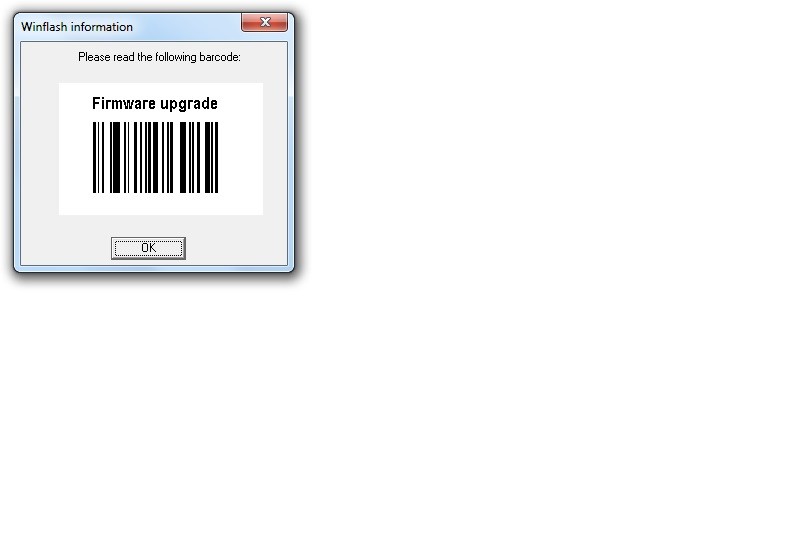

**Image analysis**

```json
{
 "image_name": "image9.jpg",
 "rId": "rId20",
 "image_path": "img_folder/image_008_image9.jpg",
 "caption": "پنجره Winflash با درخواست خواندن بارکد برای ارتقای فریمور",
 "ocr_text": "Winflash information\nPlease read the following barcode:\nFirmware upgrade\nOK",
 "visual_description": [
 "یک پنجره دیالوگ با عنوان «Winflash information» نمایش داده شده است",
 "متن راهنما «Please read the following barcode:» در بالای بارکد دیده می شود",
 "یک بارکد خطی با برچسب «Firmware upgrade» نمایش داده شده است",
 "یک دکمه «OK» در پایین پنجره قرار دارد"
 ],
 "image_type": "screenshot"
}
```

* نمونه بارکدهای استاندارد تک بعدی و دوبعدی جهت انجام تست و اطمینان از صحت عملکرد بارکدخوان پس از بارگذاری Firmware مربوطه می باشد، همراه داشتن نسخه چاپ شده آن جهت انجام تست پس از نصب، الزامی است.

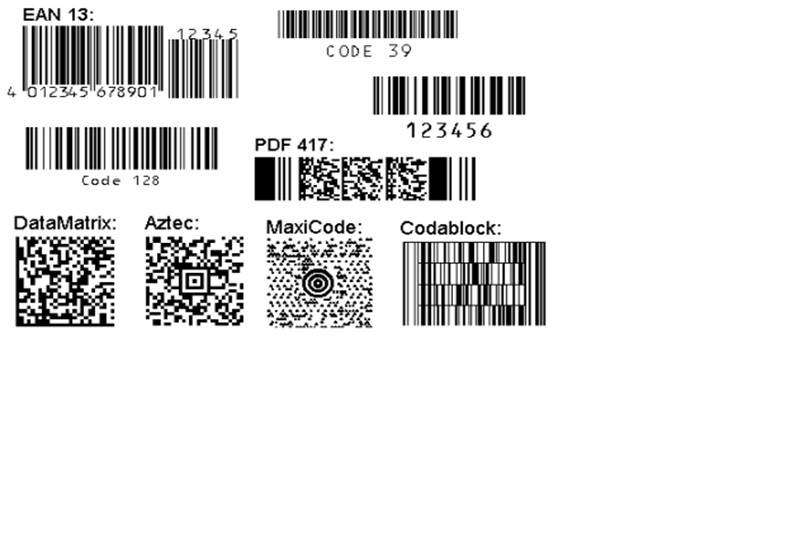

**Image analysis**

```json
{
 "image_name": "image10.jpg",
 "rId": "rId21",
 "image_path": "img_folder/image_009_image10.jpg",
 "caption": "نمونه انواع بارکدهای یک بعدی و دوبعدی با برچسب های نام گذاری شده",
 "ocr_text": "EAN 13:\n4 012345 678901\n12345\nCode 128\nCODE 39\n123456\nPDF 417:\nDataMatrix:\nAztec:\nMaxiCode:\nCodablock:",
 "visual_description": [
 "تصویر شامل چند نمونه بارکد 1بعدی و 2بعدی در یک صفحه است",
 "برچسب های متنی برای انواع بارکدها نمایش داده شده اند: EAN 13، Code 128، CODE 39، PDF 417، DataMatrix، Aztec، MaxiCode، Codablock",
 "زیر بارکد CODE 39 عدد «123456» چاپ شده است",
 "زیر بارکد EAN 13 رشته عددی «4 012345 678901» نمایش داده شده است"
 ],
 "image_type": "diagram"
}
```

* ازآنجاکه وجود نرم افزار ProBase با کانفیگ سخت افزاری مربوط به بارکد دوبعدی، جهت انجام ارتقاء Firmware ضروری است لذا قبل از آغاز عملیات می باید از نصب بودن آن بر روی سیستم عامل PC، اطمینان حاصل نمایید. (این نرم افزار با توجه به بانک مربوطه قبلاً به دفاتر عملیاتی ارسال گردیده است.)
* قبل از شروع به کار و پس از اتصال ماژول ED40 توسط کابل USB مربوطه به دستگاه، با مراجعه به قسمت Device Manager از شماره پورت اختصاص یافته به ماژول اطلاع حاصل نمایید.

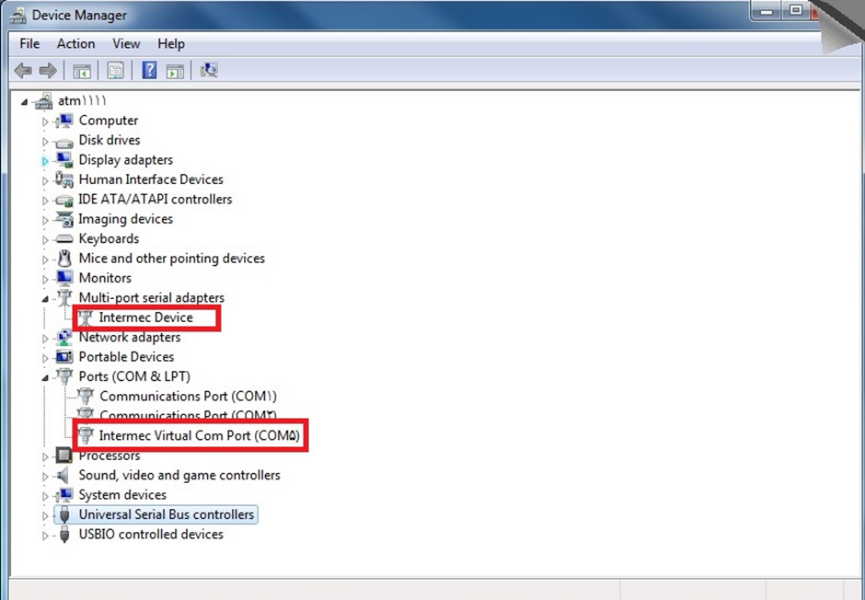

**Image analysis**

```json
{
 "image_name": "image11.png",
 "rId": "rId22",
 "image_path": "img_folder/image_010_image11.png",
 "caption": "نمای Device Manager با نمایش Intermec Device و Intermec Virtual Com Port (COM4)",
 "ocr_text": "Device Manager\nFile Action View Help\natm1)))\nComputer\nDisk drives\nDisplay adapters\nHuman Interface Devices\nIDE ATA/ATAPI controllers\nImaging devices\nKeyboards\nMice and other pointing devices\nMonitors\nMulti-port serial adapters\nIntermec Device\nNetwork adapters\nPortable Devices\nPorts (COM & LPT)\nCommunications Port (COM1)\nCommunications Port (COM3)\nIntermec Virtual Com Port (COM4)\nProcessors\nSound, video and game controllers\nSystem devices\nUniversal Serial Bus controllers\nUSBIO controlled devices",
 "visual_description": [
 "پنجره Device Manager ویندوز با نمای درختی دسته های سخت افزاری",
 "بخش Multi-port serial adapters باز شده و مورد Intermec Device با کادر قرمز مشخص شده است",
 "بخش Ports (COM & LPT) باز شده و مورد Intermec Virtual Com Port (COM4) با کادر قرمز مشخص شده است",
 "موارد Communications Port (COM1) و Communications Port (COM3) در لیست پورت ها دیده می شوند"
 ],
 "image_type": "screenshot"
}
```

# بررسی عملکرد بارکدخوان

با مراجعه به دستورالعمل IT9702-276-00\_WOSA\_KDIAG\_ 1 و استفاده از ابزار تست WOSA، می توانید وضعیت عملکرد ماژول بارکدخوان را بررسی نمایید:

<!-- TABLE_START -->
| | |
| --- | --- |
|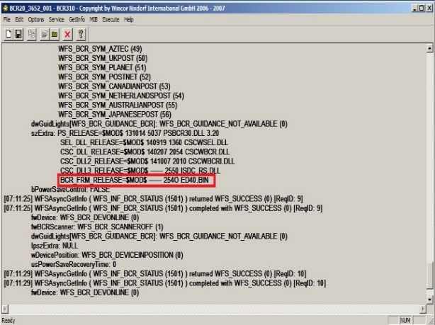

**Image analysis**

```json
{
 "image_name": "image12.jpeg",
 "rId": "rId23",
 "image_path": "img_folder/image_011_image12.jpg",
 "caption": "پنجره لاگ و تنظیمات BCR310 با وضعیت دستگاه و نسخه DLLها",
 "ocr_text": "BCR2D_3652_001 - BCR310 - Copyright by Wincor Nixdorf International GmbH 2006 - 2007\nFile Edit Options Service GetInfo MIB Execute Help\nWFS_BCR_SYM_AZTEC (49)\nWFS_BCR_SYM_UKPOST (50)\nWFS_BCR_SYM_PLANET (51)\nWFS_BCR_SYM_POSTNET (52)\nWFS_BCR_SYM_CANADIANPOST (53)\nWFS_BCR_SYM_NETHERLANDSPOST (54)\nWFS_BCR_SYM_AUSTRALIANPOST (55)\nWFS_BCR_SYM_JAPANESEPOST (56)\ndwGuidlights|WFS_BCR_GUIDANCE_BCR|: WFS_BCR_GUIDANCE_NOT_AVAILABLE (0)\nszExtra: PS_RELEASE=SMODS 131014 5307 PSBCR30.DLL 3.20\nSEL_DLL_RELEASE=SMODS 140919 1360 CSCWSELL.DLL\nCSC_DLL_RELEASE=SMODS 140207 2054 CSCWBCR.DLL\nCSC_DLL_RELEASE=SMODS 140207 2010 CSCWBCR.DLL\nCSC_DLL2_RELEASE=SMODS 2550 ISDC PS.DLL\nBCR_FRM_RELEASE=SMODS 2540 ED40.BIN\nbPowerSaveControl: FALSE\n[07:11:25] WFSAsyncGetInfo ( WFS_INF_BCR_STATUS (1501) ) returned WFS_SUCCESS (0) [ReqID: 9]\n[07:11:25] WFSAsyncGetInfo ( WFS_INF_BCR_STATUS (1501) ) completed with WFS_SUCCESS (0) [ReqID: 9]\nwDevice: WFS_BCR_DEVONLINE (0)\nwBCRScanner: WFS_BCR_SCANNERROFF (1)\ndwGuidlights|WFS_BCR_GUIDANCE_BCR|: WFS_BCR_GUIDANCE_NOT_AVAILABLE (0)\nlpszExtra: NULL\nwDevicePosition: WFS_BCR_DEVICEPOSITION (0)\nusPowerSaveRecoveryTime: 0\n[07:11:29] WFSAsyncGetInfo ( WFS_INF_BCR_STATUS (1501) ) returned WFS_SUCCESS (0) [ReqID: 10]\n[07:11:29] WFSAsyncGetInfo ( WFS_INF_BCR_STATUS (1501) ) completed with WFS_SUCCESS (0) [ReqID: 10]\nwDevice: WFS_BCR_DEVONLINE (0)\nReady\nNUM",
 "visual_description": [
 "اسکرین شات یک برنامه ویندوزی با لیست Symbologyهای بارکد (AZTEC, UKPOST, PLANET, POSTNET و ...)",
 "نمایش وضعیت درخواست های WFSAsyncGetInfo برای WFS_INF_BCR_STATUS با نتیجه WFS_SUCCESS و ReqIDهای 9 و 10",
 "نمایش wDevice برابر WFS_BCR_DEVONLINE (0) و wBCRScanner برابر WFS_BCR_SCANNERROFF (1)",
 "نمایش نسخه/ریلیز فایل ها در szExtra شامل PSBCR30.DLL، CSCWSELL.DLL، CSCWBCR.DLL، ISDC PS.DLL و ED40.BIN",
 "وجود یک خط هایلایت شده: BCR_FRM_RELEASE=SMODS 2540 ED40.BIN"
 ],
 "image_type": "screenshot"
}
``` |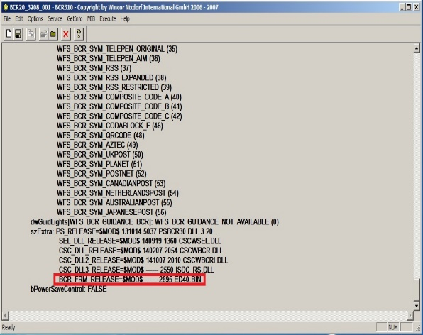

**Image analysis**

```json
{
 "image_name": "image13.jpeg",
 "rId": "rId24",
 "image_path": "img_folder/image_012_image13.jpg",
 "caption": "اسکرین شات برنامه BCR310 با فهرست سمبل های بارکد و اطلاعات نسخه DLL/FRM",
 "ocr_text": "BCR20_3208_001 - BCR310 - Copyright by Wincor Nixdorf International GmbH 2006 - 2007\nFile Edit Options Service GetInfo MDB Execute Help\nWFS_BCR_SYM_TELEPEN_ORIGINAL (35)\nWFS_BCR_SYM_TELEPEN_AIM (36)\nWFS_BCR_SYM_RSS (37)\nWFS_BCR_SYM_RSS_EXPANDED (38)\nWFS_BCR_SYM_RSS_RESTRICTED (39)\nWFS_BCR_SYM_COMPOSITE_CODE_A (40)\nWFS_BCR_SYM_COMPOSITE_CODE_B (41)\nWFS_BCR_SYM_COMPOSITE_CODE_C (42)\nWFS_BCR_SYM_CODABLOCK_F (46)\nWFS_BCR_SYM_QRCODE (48)\nWFS_BCR_SYM_AZTEC (49)\nWFS_BCR_SYM_UKPOST (50)\nWFS_BCR_SYM_PLANET (51)\nWFS_BCR_SYM_POSTNET (52)\nWFS_BCR_SYM_CANADIANPOST (53)\nWFS_BCR_SYM_NETHERLANDSPOST (54)\nWFS_BCR_SYM_AUSTRALIANPOST (55)\nWFS_BCR_SYM_JAPANESEPOST (56)\ndwGuidLights[WFS_BCR_GUIDLIGHTS_BCR]: WFS_BCR_GUIDANCE_NOT_AVAILABLE (0)\nszExtra: PS_RELEASE=SMOD3 131014 5037 PSBCR30.DLL 3.20\n SEL_DLL_RELEASE=SMOD5 140919 1360 CSCWSSEL.DLL\n CSC_DLL_RELEASE=SMOD5 140207 2054 CSCWBCDR.DLL\n CSC_DLL2_RELEASE=SMOD5 141007 2010 CSCWBCDR2.DLL\n CSC_DLL3_RELEASE=SMOD5 ----- 2550 ISDC_RS.DLL\n BCR_FRM_RELEASE=SMOD5 ----- 2695 ED40.BIN\nbPowerSaveControl: FALSE\nReady\nNUM",
 "visual_description": [
 "پنجره نرم افزار BCR310 با نوار منو File/Edit/Options/Service/GetInfo/MDB/Execute/Help نمایش داده شده است",
 "لیست سمبل های بارکد WFS_BCR_SYM شامل QRCODE، AZTEC، POSTNET و دیگر موارد با شماره های داخل پرانتز دیده می شود",
 "بخش szExtra نسخه و نام فایل ها را نشان می دهد: PSBCR30.DLL 3.20 و CSCWSSEL.DLL، CSCWBCDR.DLL، CSCWBCDR2.DLL، ISDC_RS.DLL",
 "سطر هایلایت شده «BCR_FRM_RELEASE=SMOD5 ----- 2695 ED40.BIN» با کادر قرمز مشخص شده است",
 "پارامتر bPowerSaveControl مقدار FALSE دارد و وضعیت پایین پنجره Ready است"
 ],
 "image_type": "screenshot"
}
``` |
| **Barcode Reader Firmware Version : 2540** | **Barcode Reader Firmware Version : 2695** |
<!-- TABLE_END -->

درصورتی که شماره نسخه ی Firmware بارکدخوان معادل 2695 است، نیازی به بارگذاری Firmware نخواهد بود. اگر شماره نسخه ی Firmware بارکدخوان، 2540 است، درصورت روشن ماندن لیزر و خوانده نشدن قبض،لازم است Firmware را بارگذاری کنید.

## مرحله اول: بارگذاری Firmware

ابتدا نرم افزارEasy Set را نصب نمایید و سپس بارگذاری Firmware را انجام دهید.

مراحل نصب نرم افزار به شرح زیر می باشد:

1. فایل Setup را از آدرس زیر اجرا کنید:

CD Drive:\Tools\BCR-ED4

2. در پنجره ای که گشوده می شود روی دکمه ی Next کلیک نمایید:

<!-- TABLE_START -->
| | |
| --- | --- |
|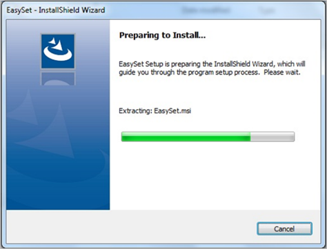

**Image analysis**

```json
{
 "image_name": "image14.png",
 "rId": "rId25",
 "image_path": "img_folder/image_013_image14.png",
 "caption": "پنجره InstallShield برای نصب EasySet در حال استخراج فایل EasySet.msi با نوار پیشرفت",
 "ocr_text": "EasySet - InstallShield Wizard\nPreparing to Install...\nEasySet Setup is preparing the InstallShield Wizard, which will guide you through the program setup process. Please wait.\nExtracting: EasySet.msi\nCancel",
 "visual_description": [
 "پنجره نصب با عنوان «EasySet - InstallShield Wizard» نمایش داده شده است",
 "متن وضعیت «Preparing to Install...» و توضیح آماده سازی InstallShield Wizard دیده می شود",
 "وضعیت استخراج فایل «Extracting: EasySet.msi» نمایش داده شده است",
 "یک نوار پیشرفت افقی با بخش سبز پرشده وجود دارد",
 "دکمه «Cancel» در پایین سمت راست قرار دارد"
 ],
 "image_type": "screenshot"
}
``` |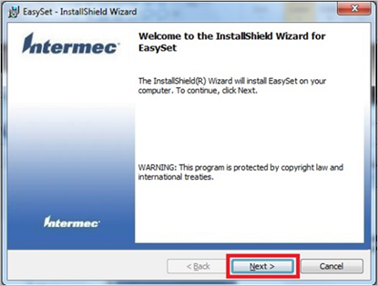

**Image analysis**

```json
{
 "image_name": "image15.png",
 "rId": "rId26",
 "image_path": "img_folder/image_014_image15.png",
 "caption": "پنجره خوش آمدگویی InstallShield برای نصب EasySet با دکمه Next مشخص شده",
 "ocr_text": "EasySet - InstallShield Wizard\nIntermec\nWelcome to the InstallShield Wizard for\nEasySet\nThe InstallShield(R) Wizard will install EasySet on your\ncomputer. To continue, click Next.\nWARNING: This program is protected by copyright law and\ninternational treaties.\nIntermec\n< Back\nNext >\nCancel",
 "visual_description": [
 "پنجره نصب با عنوان «EasySet - InstallShield Wizard» نمایش داده شده است",
 "لوگوی Intermec در سمت چپ پنجره قرار دارد",
 "متن توضیح نصب EasySet و هشدار کپی رایت در بخش مرکزی دیده می شود",
 "دکمه «Next >» با کادر قرمز برجسته شده است و کنار آن «< Back» و «Cancel» قرار دارند"
 ],
 "image_type": "screenshot"
}
``` |
<!-- TABLE_END -->

3. در پنجره ی زیر، بدون تغییر در آدرس محل نصب، روی دکمه ی Next کلیک کنید:

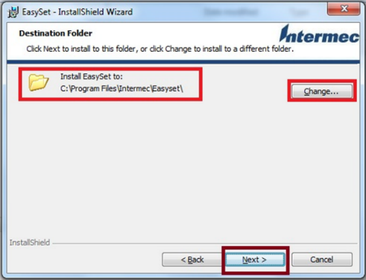

**Image analysis**

```json
{
 "image_name": "image16.png",
 "rId": "rId27",
 "image_path": "img_folder/image_015_image16.png",
 "caption": "پنجره نصب EasySet با مسیر نصب و دکمه های Change و Next",
 "ocr_text": "EasySet - InstallShield Wizard\nDestination Folder\nClick Next to install to this folder, or click Change to install to a different folder.\nInstall EasySet to:\nC:\\Program Files\\Intermec\\Easyset\\\nChange...\nIntermec\nInstallShield\n< Back\nNext >\nCancel",
 "visual_description": [
 "پنجره InstallShield Wizard بخش Destination Folder را نشان می دهد.",
 "مسیر نصب پیش فرض C:\\Program Files\\Intermec\\Easyset\\ نمایش داده شده است.",
 "دکمه Change... برای تغییر پوشه مقصد وجود دارد.",
 "دکمه های < Back، Next > و Cancel در پایین پنجره دیده می شوند.",
 "لوگوی Intermec در بالای سمت راست قرار دارد.",
 "کادرهای قرمز اطراف بخش مسیر نصب و دکمه Next > مشخص شده اند."
 ],
 "image_type": "screenshot"
}
```

4. روی دکمه ی Install کلیک کنید تا عملیات نصب نرم افزار انجام شود:

<!-- TABLE_START -->
| | |
| --- | --- |
|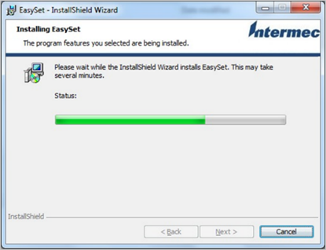

**Image analysis**

```json
{
 "image_name": "image17.png",
 "rId": "rId28",
 "image_path": "img_folder/image_016_image17.png",
 "caption": "پنجره InstallShield برای نصب EasySet با نوار پیشرفت و دکمه های Back، Next و Cancel",
 "ocr_text": "EasySet - InstallShield Wizard\nInstalling EasySet\nThe program features you selected are being installed.\nPlease wait while the InstallShield Wizard installs EasySet. This may take several minutes.\nStatus:\nIntermec\nInstallShield\n< Back\nNext >\nCancel",
 "visual_description": [
 "پنجره نصب «EasySet - InstallShield Wizard» با عنوان «Installing EasySet» نمایش داده شده است.",
 "متن راهنما می گوید نصب ممکن است چند دقیقه طول بکشد.",
 "برچسب «Status:» و یک نوار پیشرفت افقی سبز در حال پر شدن وجود دارد.",
 "لوگوی «Intermec» در گوشه بالا سمت راست دیده می شود.",
 "دکمه های پایین پنجره: «< Back»، «Next >» (غیرفعال)، و «Cancel» قابل مشاهده اند.",
 "عبارت «InstallShield» در پایین سمت چپ پنجره قرار دارد."
 ],
 "image_type": "screenshot"
}
``` |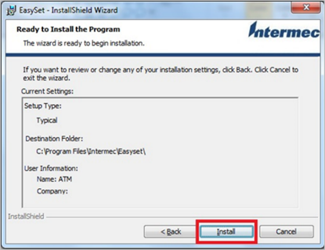

**Image analysis**

```json
{
 "image_name": "image18.png",
 "rId": "rId29",
 "image_path": "img_folder/image_017_image18.png",
 "caption": "پنجره نصب EasySet با دکمه Install برای شروع نصب",
 "ocr_text": "EasySet - InstallShield Wizard\nReady to Install the Program\nThe wizard is ready to begin installation.\nIf you want to review or change any of your installation settings, click Back. Click Cancel to exit the wizard.\nCurrent Settings:\nSetup Type:\nTypical\nDestination Folder:\nC:\\Program Files\\Intermec\\Easyset\\\nUser Information:\nName: ATM\nCompany:\nInstallShield\n< Back\nInstall\nCancel\nIntermec",
 "visual_description": [
 "اسکرین شات پنجره InstallShield Wizard با عنوان «Ready to Install the Program»",
 "نمایش تنظیمات نصب: Setup Type برابر Typical",
 "نمایش مسیر نصب: C:\\Program Files\\Intermec\\Easyset\\",
 "نمایش اطلاعات کاربر: Name: ATM و Company خالی",
 "دکمه های ناوبری < Back، Install و Cancel در پایین پنجره",
 "لوگوی Intermec در گوشه بالا-راست"
 ],
 "image_type": "screenshot"
}
``` |
<!-- TABLE_END -->

5. پس از نصب موفقیت آمیز نرم افزار، پنجره ی زیر به نمایش گذاشته خواهد شد؛ روی دکمه ی Finish کلیک کنید:

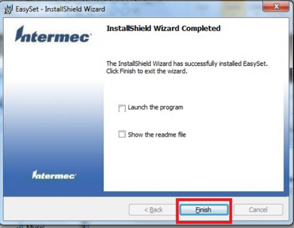

**Image analysis**

```json
{
 "image_name": "image19.png",
 "rId": "rId30",
 "image_path": "img_folder/image_018_image19.png",
 "caption": "پنجره تکمیل نصب EasySet با InstallShield و دکمه Finish مشخص شده",
 "ocr_text": "EasySet - InstallShield Wizard\nIntermec\nInstallShield Wizard Completed\nThe InstallShield Wizard has successfully installed EasySet.\nClick Finish to exit the wizard.\nLaunch the program\nShow the readme file\nIntermec\n< Back\nFinish\nCancel",
 "visual_description": [
 "پنجره InstallShield Wizard Completed برای نصب EasySet نمایش داده شده است.",
 "دو گزینه چک باکس «Launch the program» و «Show the readme file» وجود دارد و تیک نخورده اند.",
 "دکمه «Finish» در پایین با کادر قرمز برجسته شده است.",
 "دکمه های «< Back» و «Cancel» نیز در نوار پایین دیده می شوند.",
 "لوگوی Intermec در سمت چپ پنجره قرار دارد."
 ],
 "image_type": "screenshot"
}
```

6. نرم افزار EasySet را اجرا نمایید؛ در صورت نمایش پیغام زیر چند بار روی دکمه ی OK کلیک کنید:

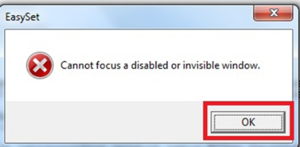

**Image analysis**

```json
{
 "image_name": "image20.png",
 "rId": "rId31",
 "image_path": "img_folder/image_019_image20.png",
 "caption": "پیغام خطای EasySet با متن «Cannot focus a disabled or invisible window.» و دکمه OK",
 "ocr_text": "EasySet\nCannot focus a disabled or invisible window.\nOK",
 "visual_description": [
 "پنجره پیام خطا با آیکون دایره قرمز و ضربدر سفید نمایش داده شده است",
 "عنوان پنجره «EasySet» است",
 "متن خطا «Cannot focus a disabled or invisible window.» در مرکز پنجره دیده می شود",
 "یک دکمه «OK» در پایین راست وجود دارد و با کادر قرمز مشخص شده است"
 ],
 "image_type": "screenshot"
}
```

7. در اولین اجرای نرم افزار، پیغامی مبنی بر نصب نرم افزار VCP Drivers به نمایش گذاشته می شود؛ با کلیک بر روی دکمه ی NO از نصب آن صرف نظر کنید.

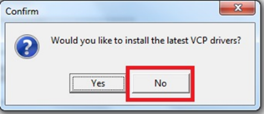

**Image analysis**

```json
{
 "image_name": "image21.png",
 "rId": "rId32",
 "image_path": "img_folder/image_020_image21.png",
 "caption": "پنجره تایید برای نصب جدیدترین درایورهای VCP با دکمه های Yes و No",
 "ocr_text": "Confirm\nWould you like to install the latest VCP drivers?\nYes\nNo",
 "visual_description": [
 "پنجره گفتگوی Windows با عنوان \"Confirm\" نمایش داده شده است",
 "متن پرسش: \"Would you like to install the latest VCP drivers?\"",
 "دو دکمه \"Yes\" و \"No\" وجود دارد",
 "دکمه \"No\" با کادر قرمز برجسته شده است",
 "آیکن علامت سؤال در سمت چپ پنجره دیده می شود",
 "دکمه بستن (X) در گوشه بالا-راست نوار عنوان وجود دارد"
 ],
 "image_type": "screenshot"
}
```

پس از اجرای نرم افزار مراحل بارگذاری را با انجام مراحل زیر انجام دهید:

* همانند شکل زیر از قسمت سمت چپ پنجره روی Scan engines کلیک کنید.
* از پنل سمت راست، مدل ED40 را انتخاب کنید
* روی دکمه ی OK کلیک کنید تا وارد پنل نرم افزار شوید:

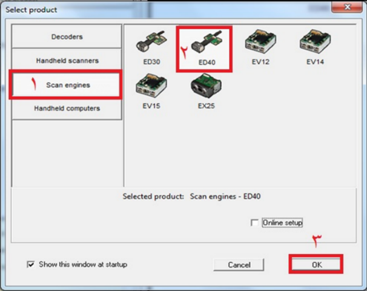

**Image analysis**

```json
{
 "image_name": "image22.png",
 "rId": "rId33",
 "image_path": "img_folder/image_021_image22.png",
 "caption": "پنجره انتخاب محصول با انتخاب Scan engines و مدل ED40 و دکمه OK مشخص شده",
 "ocr_text": "Select product\nDecoders\nHandheld scanners\nScan engines\nHandheld computers\nED30\nED40\nEV12\nEV14\nEV15\nEX25\nSelected product: Scan engines - ED40\nOnline setup\nShow this window at startup\nCancel\nOK",
 "visual_description": [
 "اسکرین شات یک پنجره نرم افزاری با عنوان Select product و فهرست دسته ها در ستون چپ",
 "دسته Scan engines در ستون چپ با کادر قرمز مشخص شده است",
 "آیتم ED40 در بخش Scan engines با کادر قرمز انتخاب شده است",
 "متن پایین پنجره: Selected product: Scan engines - ED40",
 "گزینه Online setup به صورت چک باکس/گزینه قابل انتخاب نمایش داده شده است",
 "چک باکس Show this window at startup در پایین سمت چپ نمایش داده شده است",
 "دکمه OK در پایین سمت راست با کادر قرمز مشخص شده و دکمه Cancel کنار آن قرار دارد"
 ],
 "image_type": "screenshot"
}
```

* در منوی Communication گزینه ی Select communication interface… را انتخاب نمایید:

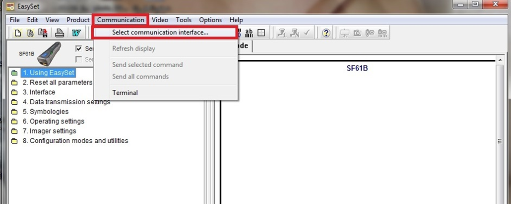

**Image analysis**

```json
{
 "image_name": "image23.png",
 "rId": "rId34",
 "image_path": "img_folder/image_022_image23.png",
 "caption": "نمای نرم افزار EasySet با منوی Communication باز و گزینه Select communication interface",
 "ocr_text": "EasySet\nFile Edit View Product Communication Video Tools Options Help\nSelect communication interface...\nRefresh display\nSend selected command\nSend all commands\nTerminal\nSF61B\n1. Using EasySet\n2. Reset all parameters\n3. Interface\n4. Data transmission settings\n5. Symbologies\n6. Operating settings\n7. Imager settings\n8. Configuration modes and utilities",
 "visual_description": [
 "پنجره برنامه EasySet با نوار منو شامل File, Edit, View, Product, Communication, Video, Tools, Options, Help",
 "منوی کشویی Communication باز است و گزینه Select communication interface... در بالای لیست دیده می شود",
 "گزینه های منو شامل Refresh display، Send selected command، Send all commands و Terminal",
 "پنل سمت چپ فهرست بخش ها را نشان می دهد: Using EasySet تا Configuration modes and utilities",
 "در پنل اصلی متن SF61B نمایش داده شده است",
 "کادر قرمز روی منوی Communication و گزینه Select communication interface... قرار دارد"
 ],
 "image_type": "screenshot"
}
```

* از پورت های مشخص شده، پورت مخصوص به بارکدخوان را انتخاب کنید تا عمل Conecting انجام شود:

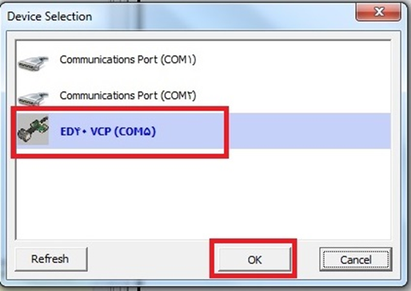

**Image analysis**

```json
{
 "image_name": "image24.png",
 "rId": "rId35",
 "image_path": "img_folder/image_023_image24.png",
 "caption": "پنجره انتخاب دستگاه با لیست پورت های COM و گزینه EDY• VCP (COM4) هایلایت شده",
 "ocr_text": "Device Selection\nCommunications Port (COM1)\nCommunications Port (COM7)\nEDY• VCP (COM4)\nRefresh\nOK\nCancel",
 "visual_description": [
 "پنجره نرم افزاری با عنوان Device Selection نمایش داده شده است",
 "سه مورد در لیست دستگاه ها/پورت ها دیده می شود: Communications Port (COM1)، Communications Port (COM7)، و EDY• VCP (COM4)",
 "ردیف EDY• VCP (COM4) انتخاب و با پس زمینه آبی مشخص شده است",
 "دو کادر قرمز دور ردیف EDY• VCP (COM4) و دکمه OK قرار دارد",
 "دکمه های Refresh، OK و Cancel در پایین پنجره موجود است"
 ],
 "image_type": "screenshot"
}
```

توجه داشته باشید ممکن است در هر بار اتصال، شماره پورت تغییر کند و ملاک شماره پورت نمی باشد.

* بعد از اتصال به ماژول، از سمت چپ پنجره گزینه Reset all parameter و سپس Reset Factory Defaults را انتخاب کنید.
* روی علامت اجرا (3) که در تصویر زیر مشخص شده است کلیک کنید تا تنظیمات بارکدخوان در حالت آماده دریافت Firmware قرار بگیرد:

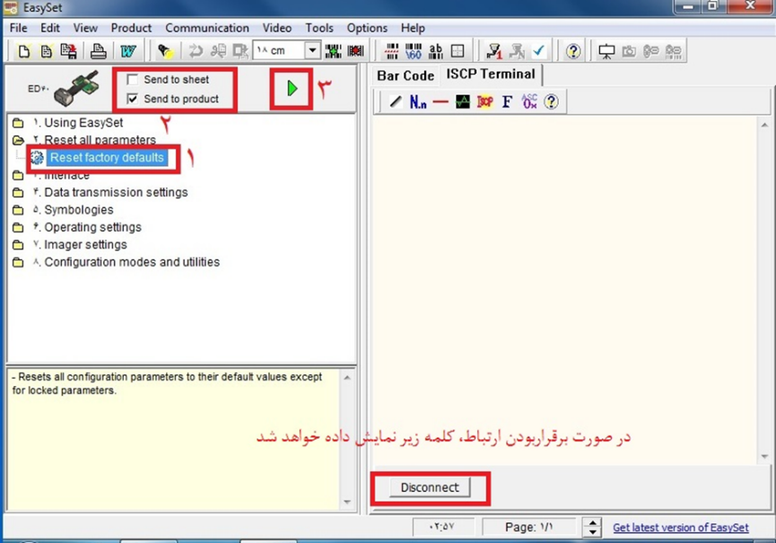

**Image analysis**

```json
{
 "image_name": "image25.png",
 "rId": "rId36",
 "image_path": "img_folder/image_024_image25.png",
 "caption": "اسکرین شات نرم افزار EasySet با گزینه Reset factory defaults و دکمه Disconnect",
 "ocr_text": "EasySet\nFile Edit View Product Communication Video Tools Options Help\nSend to sheet\nSend to product\nBar Code ISCP Terminal\nUsing EasySet\nReset all parameters\nReset factory defaults\nInterface\nData transmission settings\nSymbologies\nOperating settings\nImager settings\nConfiguration modes and utilities\n- Resets all configuration parameters to their default values except\nfor locked parameters.\nدر صورت برقرار نبودن ارتباط، کلمه زیر نمایش داده خواهد شد\nDisconnect\nPage: 1/1\nGet latest version of EasySet",
 "visual_description": [
 "پنجره نرم افزار EasySet با منوی بالایی و نوار ابزار قابل مشاهده است",
 "در پنل چپ، درخت تنظیمات شامل Reset factory defaults، Interface و سایر بخش ها نمایش داده شده است",
 "گزینه Reset factory defaults در پنل چپ هایلایت شده است",
 "در بالای پنل چپ چک باکس های Send to sheet و Send to product دیده می شود",
 "در پنل راست تب های Bar Code و ISCP Terminal وجود دارد و ناحیه اصلی خالی است",
 "متن فارسی قرمز در پایین پنل راست نمایش داده شده است",
 "دکمه Disconnect در پایین پنل راست قرار دارد"
 ],
 "image_type": "screenshot"
}
```

در تصویر فوق اگر دکمه ی اجرا که با شماره 3 مشخص شده است به رنگ سبز نباشد (غیرفعال باشد) بدین معنی است که ارتباط با ماژول برقرار نشده است؛ در این وضعیت مجدداً می باید جهت انتخاب ماژول مراحل قبلی را تکرار نمایید.

* پس از کلیک بر روی دکمه ی اجرا، هشداری مبنی بر ریست شدن پارامترهای ماژول نمایش داده می شود؛ روی OK کلیک نمایید.

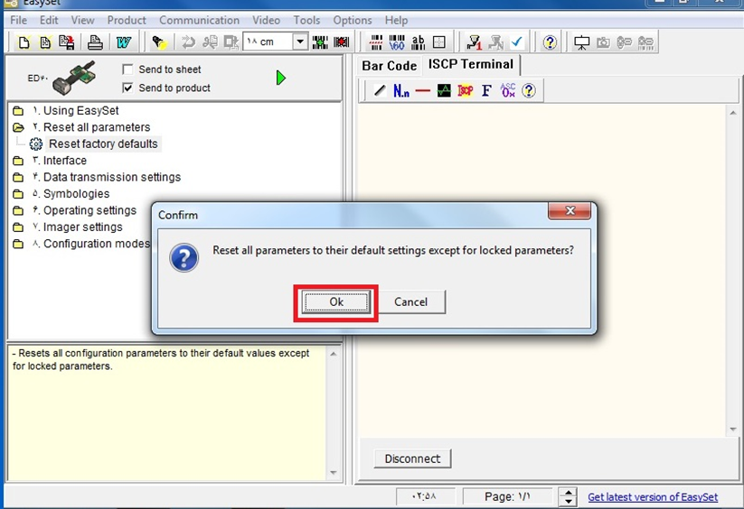

**Image analysis**

```json
{
 "image_name": "image26.png",
 "rId": "rId37",
 "image_path": "img_folder/image_025_image26.png",
 "caption": "پنجره تایید در EasySet برای ریست همه پارامترها به تنظیمات پیش فرض",
 "ocr_text": "EasySet\nFile Edit View Product Communication Video Tools Options Help\nSend to sheet\nSend to product\nED+ :\n1. Using EasySet\n2. Reset all parameters\nReset factory defaults\n3. Interface\n4. Data transmission settings\n5. Symbologies\n6. Operating settings\n7. Imager settings\n8. Configuration modes\n- Resets all configuration parameters to their default values except\nfor locked parameters.\nBar Code ISCP Terminal\nConfirm\nReset all parameters to their default settings except for locked parameters?\nOk\nCancel\nDisconnect\nPage: 1/1\nGet latest version of EasySet",
 "visual_description": [
 "اسکرین شات نرم افزار EasySet با پنجره Confirm و پیام ریست پارامترها",
 "گزینه Reset all parameters در منوی سمت چپ انتخاب شده است",
 "دو دکمه Ok و Cancel در پنجره تایید نمایش داده می شود",
 "پنل راست دارای تب های Bar Code و ISCP Terminal است",
 "دکمه Disconnect در پایین پنل راست دیده می شود"
 ],
 "image_type": "screenshot"
}
```

هم اکنون بارکدخوان آماده دریافت Firmware می باشد.

* از منوی Tools گزینه Upgrade product firmware را انتخاب کنید:

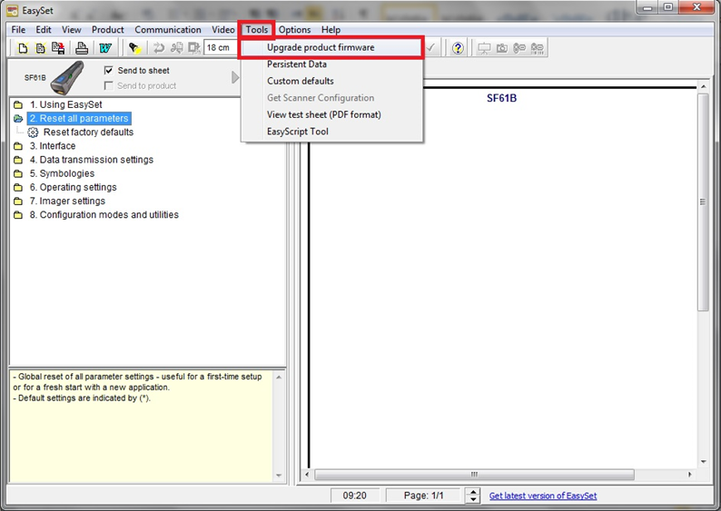

**Image analysis**

```json
{
 "image_name": "image27.png",
 "rId": "rId38",
 "image_path": "img_folder/image_026_image27.png",
 "caption": "منوی Tools در EasySet با گزینه Upgrade product firmware باز شده است",
 "ocr_text": "EasySet\nFile Edit View Product Communication Video Tools Options Help\nSF61B\nSend to sheet\nSend to product\n1. Using EasySet\n2. Reset all parameters\n3. Reset factory defaults\n4. Interface\n5. Data transmission settings\n6. Symbologies\n6. Operating settings\n7. Imager settings\n8. Configuration modes and utilities\nGlobal reset of all parameter settings - useful for a first-time setup\nor for a fresh start with a new application.\n- Default settings are indicated by (*).\n18 cm\nUpgrade product firmware\nPersistent Data\nCustom defaults\nGet Scanner Configuration\nView test sheet (PDF format)\nEasyScript Tool\nSF61B\n09:20\nPage: 1/1\nGet latest version of EasySet",
 "visual_description": [
 "اسکرین شات نرم افزار EasySet با منوی Tools باز",
 "گزینه Upgrade product firmware در منوی Tools نمایش داده شده و با کادر قرمز مشخص است",
 "پنل سمت چپ فهرست تنظیمات شامل Reset all parameters و Reset factory defaults را نشان می دهد",
 "نام دستگاه/پروفایل SF61B در پنجره و ناحیه محتوا دیده می شود",
 "نوار وضعیت پایین شامل زمان 09:20 و Page: 1/1 است",
 "لینک Get latest version of EasySet در پایین سمت راست نمایش داده شده است"
 ],
 "image_type": "screenshot"
}
```

* با انجام این کار سؤالی مبنی بر خروج از محیط برنامه نصب و ادامه کار در محیط نرم افزار
 WinFlash به نمایش گذاشته خواهد شد. جهت ادامه کار روی دکمه ی Yes کلیک کنید.

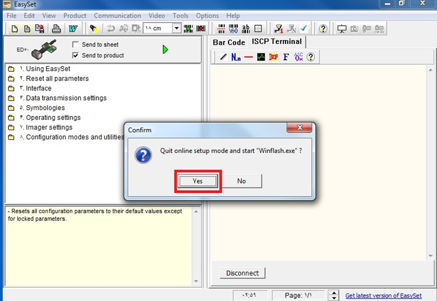

**Image analysis**

```json
{
 "image_name": "image28.png",
 "rId": "rId39",
 "image_path": "img_folder/image_027_image28.png",
 "caption": "پنجره تایید در نرم افزار EasySet برای اجرای Winflash.exe و انتخاب دکمه Yes/No",
 "ocr_text": "EasySet\nFile Edit View Product Communication Video Tools Options Help\nSend to sheet\nSend to product\nED+\n1. Using EasySet\n2. Reset all parameters\n3. Interface\n4. Data transmission settings\n5. Symbologies\n6. Operating settings\n7. Imager settings\n8. Configuration modes and utilities\nConfirm\nQuit online setup mode and start \"Winflash.exe\" ?\nYes\nNo\nDisconnect\n- Resets all configuration parameters to their default values except\nfor locked parameters.\nBar Code ISCP Terminal\nPage: 1/1\nGet latest version of EasySet",
 "visual_description": [
 "اسکرین شات نرم افزار EasySet با منوی بالا و نوار ابزار آیکون ها",
 "پنل سمت چپ شامل درخت تنظیمات: Using EasySet تا Configuration modes and utilities",
 "پنجره محاوره ای Confirm با پیام اجرای \"Winflash.exe\" و دو دکمه Yes و No",
 "دکمه Yes با یک کادر قرمز برجسته شده است",
 "پنل سمت راست دارای تب های Bar Code و ISCP Terminal و دکمه Disconnect در پایین"
 ],
 "image_type": "screenshot"
}
```

* درصورتی که اولین بار است که وارد این قسمت شده اید سؤالی مبنی بر نصب نرم افزار WinFlash پرسیده می شود؛ همانند آنچه در شکل های زیر نشان داده شده است مراحل نصب این نرم افزار را انجام دهید:

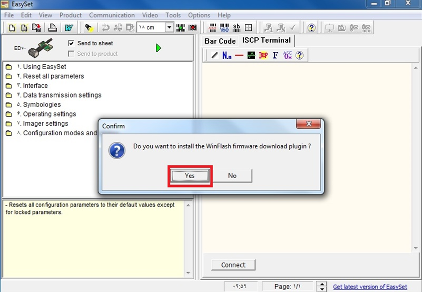

**Image analysis**

```json
{
 "image_name": "image29.png",
 "rId": "rId40",
 "image_path": "img_folder/image_028_image29.png",
 "caption": "پنجره تایید نصب افزونه WinFlash در نرم افزار EasySet با گزینه های Yes و No",
 "ocr_text": "EasySet\nFile Edit View Product Communication Video Tools Options Help\nSend to sheet\nSend to product\nED+:\n1. Using EasySet\n2. Reset all parameters\n3. Interface\n4. Data transmission settings\n5. Symbologies\n6. Operating settings\n7. Imager settings\n8. Configuration modes and\n- Resets all configuration parameters to their default values except\nfor locked parameters.\nBar Code ISCP Terminal\nConfirm\nDo you want to install the WinFlash firmware download plugin ?\nYes\nNo\nConnect\nPage: 1/1\nGet latest version of EasySet",
 "visual_description": [
 "اسکرین شات نرم افزار EasySet با منوی بالا (File، Edit، View، Product، Communication، Video، Tools، Options، Help)",
 "پنجره محاوره ای Confirm نمایش داده شده و سؤال نصب WinFlash firmware download plugin را دارد",
 "دو دکمه Yes و No در پنجره تایید وجود دارد و دکمه Yes با کادر قرمز برجسته شده است",
 "در سمت چپ درخت تنظیمات شامل Reset all parameters، Interface، Data transmission settings، Symbologies، Operating settings و Imager settings دیده می شود",
 "در سمت راست تب های Bar Code و ISCP Terminal و یک دکمه Connect در پایین وجود دارد",
 "در پایین عبارت Page: 1/1 و لینک Get latest version of EasySet نمایش داده شده است"
 ],
 "image_type": "screenshot"
}
```

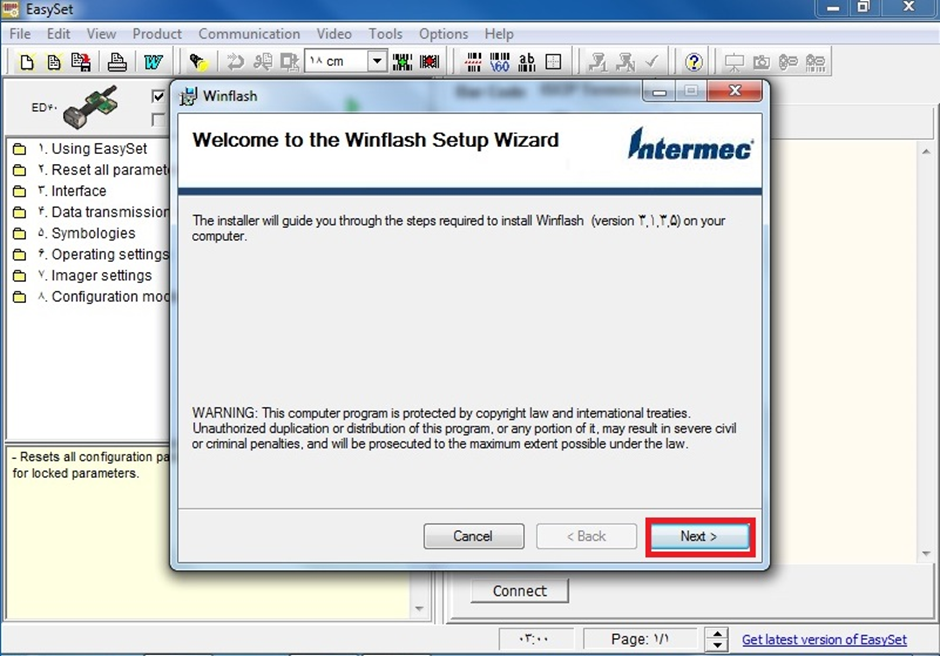

**Image analysis**

```json
{
 "image_name": "image30.png",
 "rId": "rId41",
 "image_path": "img_folder/image_029_image30.png",
 "caption": "پنجره راه انداز نصب Winflash با دکمه Next در نرم افزار EasySet",
 "ocr_text": "EasySet\nFile Edit View Product Communication Video Tools Options Help\nWinflash\nWelcome to the Winflash Setup Wizard\nIntermec\nThe installer will guide you through the steps required to install Winflash (version ۲.۲.۵) on your computer.\nWARNING: This computer program is protected by copyright law and international treaties.\nUnauthorized duplication or distribution of this program, or any portion of it, may result in severe civil\nor criminal penalties, and will be prosecuted to the maximum extent possible under the law.\nCancel\n< Back\nNext >\nConnect\nPage: ۱/۱\nGet latest version of EasySet",
 "visual_description": [
 "اسکرین شات ویندوز از پنجره «Winflash Setup Wizard» با لوگوی Intermec",
 "نمایش نسخه Winflash به صورت «۲.۲.۵» در متن توضیحی",
 "دکمه های «Cancel»، «< Back»، و «Next >» در پایین پنجره نصب",
 "کادر قرمز دور دکمه «Next >» برای تاکید",
 "در پس زمینه نرم افزار «EasySet» با نوار منو و گزینه «Get latest version of EasySet» دیده می شود"
 ],
 "image_type": "screenshot"
}
```

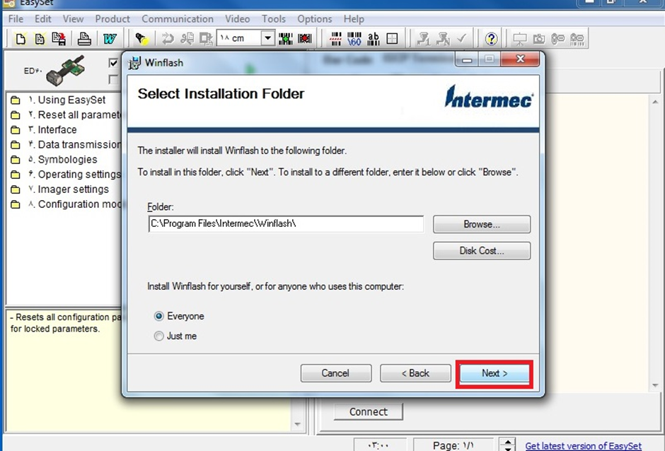

**Image analysis**

```json
{
 "image_name": "image31.png",
 "rId": "rId42",
 "image_path": "img_folder/image_030_image31.png",
 "caption": "پنجره نصب Winflash برای انتخاب پوشه نصب و گزینه های دسترسی کاربر",
 "ocr_text": "EasySet\nFile Edit View Product Communication Video Tools Options Help\nWinflash\nSelect Installation Folder\nIntermec\nThe installer will install Winflash to the following folder.\nTo install in this folder, click \"Next\". To install to a different folder, enter it below or click \"Browse\".\nFolder:\nC:\\Program Files\\Intermec\\Winflash\\\nBrowse...\nDisk Cost...\nInstall Winflash for yourself, or for anyone who uses this computer:\nEveryone\nJust me\nCancel\n< Back\nNext >\nUsing EasySet\nReset all parameters\nInterface\nData transmission\nSymbologies\nOperating settings\nImager settings\nConfiguration mode\nConnect\nGet latest version of EasySet\nPage: 1/1",
 "visual_description": [
 "پنجره نصب Winflash با عنوان «Select Installation Folder» نمایش داده شده است.",
 "مسیر نصب در کادر Folder برابر C:\\Program Files\\Intermec\\Winflash\\ است.",
 "دکمه های Browse... و Disk Cost... در سمت راست کادر مسیر وجود دارد.",
 "گزینه های رادیویی Everyone و Just me برای تعیین کاربران نصب قابل مشاهده است.",
 "دکمه Next > با کادر قرمز برجسته شده و کنار Cancel و < Back قرار دارد.",
 "در پس زمینه نرم افزار EasySet با منوی بالا و فهرست تنظیمات سمت چپ دیده می شود."
 ],
 "image_type": "screenshot"
}
```

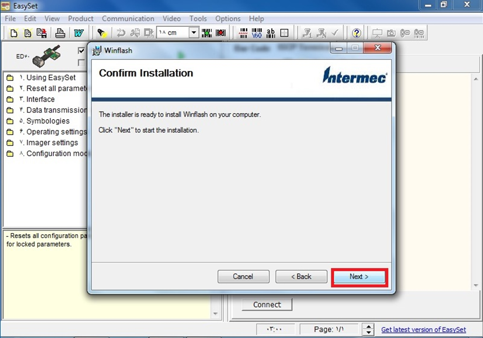

**Image analysis**

```json
{
 "image_name": "image32.png",
 "rId": "rId43",
 "image_path": "img_folder/image_031_image32.png",
 "caption": "پنجره تایید نصب Winflash در نرم افزار EasySet با دکمه Next مشخص شده",
 "ocr_text": "EasySet\nFile Edit View Product Communication Video Tools Options Help\nWinflash\nConfirm Installation\nIntermec\nThe installer is ready to install Winflash on your computer.\n\nClick \"Next\" to start the installation.\nCancel\n< Back\nNext >\nConnect\nPage: 1/1\nGet latest version of EasySet",
 "visual_description": [
 "پنجره نصب Winflash با عنوان Confirm Installation و لوگوی Intermec نمایش داده شده است.",
 "متن راهنما شامل آماده بودن نصب و درخواست کلیک روی \"Next\" است.",
 "دکمه Next > با کادر قرمز هایلایت شده است.",
 "دکمه های Cancel و < Back در پایین پنجره وجود دارند.",
 "در پس زمینه رابط برنامه EasySet با نوار منو و دکمه Connect دیده می شود."
 ],
 "image_type": "screenshot"
}
```

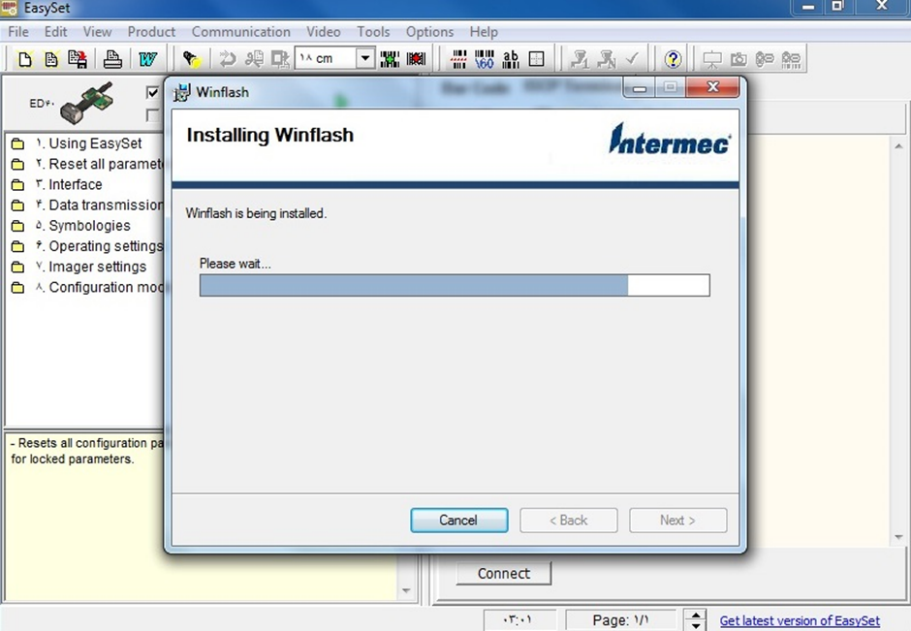

**Image analysis**

```json
{
 "image_name": "image33.png",
 "rId": "rId44",
 "image_path": "img_folder/image_032_image33.png",
 "caption": "پنجره نصب Winflash در نرم افزار EasySet با نوار پیشرفت و دکمه Cancel",
 "ocr_text": "EasySet\nFile Edit View Product Communication Video Tools Options Help\nWinflash\nInstalling Winflash\nIntermec\nWinflash is being installed.\nPlease wait...\nCancel\n< Back\nNext >\nConnect\nGet latest version of EasySet\nPage: 1/1\n- Resets all configuration pa\nfor locked parameters.",
 "visual_description": [
 "اسکرین شات نرم افزار EasySet با پنجره نصب «Installing Winflash» و نوار پیشرفت",
 "لوگوی «Intermec» در گوشه بالای پنجره نصب دیده می شود",
 "دکمه های «Cancel»، «< Back» و «Next >» در پایین پنجره نصب وجود دارد",
 "در پس زمینه، منوی بالای برنامه شامل «File, Edit, View, Product, Communication, Video, Tools, Options, Help» نمایش داده شده است"
 ],
 "image_type": "screenshot"
}
```

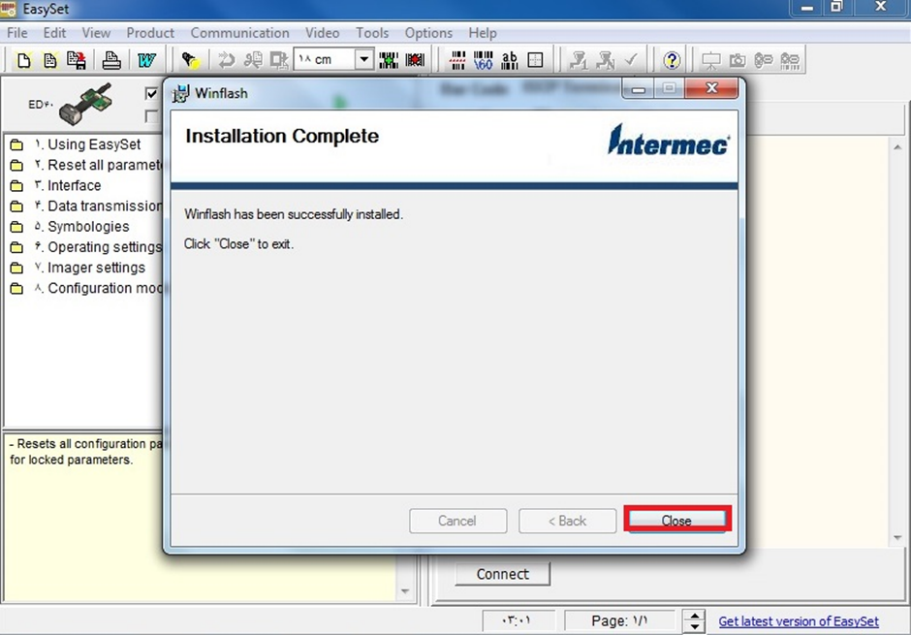

**Image analysis**

```json
{
 "image_name": "image34.png",
 "rId": "rId45",
 "image_path": "img_folder/image_033_image34.png",
 "caption": "پنجره نصب Winflash با پیام Installation Complete و دکمه Close در نرم افزار EasySet",
 "ocr_text": "EasySet\nFile Edit View Product Communication Video Tools Options Help\nWinflash\nInstallation Complete\nIntermec\nWinflash has been successfully installed.\nClick \"Close\" to exit.\nCancel\n< Back\nClose\nConnect\nPage: 1/1\nGet latest version of EasySet\n1. Using EasySet\n2. Reset all paramet\n3. Interface\n4. Data transmission\n5. Symbologies\n6. Operating settings\n7. Imager settings\n8. Configuration mod",
 "visual_description": [
 "اسکرین شات محیط ویندوز از نرم افزار EasySet با یک پنجره نصب Winflash روی آن",
 "پنجره Winflash عنوان Installation Complete و لوگوی Intermec را نمایش می دهد",
 "متن وضعیت نصب: Winflash has been successfully installed. و راهنما برای خروج با Close",
 "در پایین پنجره دکمه های Cancel، < Back و Close دیده می شود و Close با کادر قرمز مشخص شده است",
 "در سمت چپ نرم افزار فهرست تنظیمات شامل Using EasySet، Interface، Data transmission، Symbologies، Operating settings، Imager settings و Configuration mod دیده می شود"
 ],
 "image_type": "screenshot"
}
```

* پس از پایان مراحل نصب WinFlash، به منوی Communication بروید و مجدداً مراحل برقراری ارتباط را انجام دهید (مرحله ی 4)
* از منوی Tools گزینه Upgrade product firmware را انتخاب کنید؛ این بار پس از هشدار وارد شدن به محیط WinFlash، صفحه ی زیر به نمایش درخواهد آمد:

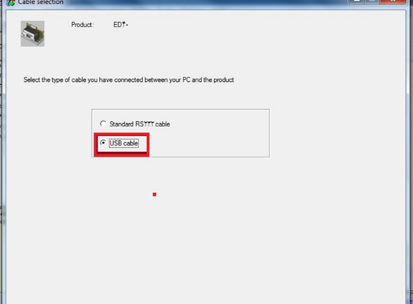

**Image analysis**

```json
{
 "image_name": "image35.png",
 "rId": "rId46",
 "image_path": "img_folder/image_034_image35.png",
 "caption": "پنجره انتخاب کابل برای محصول EDF+ با گزینه های RS232 و USB",
 "ocr_text": "Cable selection\nProduct: EDF+.\nSelect the type of cable you have connected between your PC and the product\nStandard RS232 cable\nUSB cable",
 "visual_description": [
 "نمای یک پنجره نرم افزاری با عنوان «Cable selection»",
 "نمایش محصول به صورت «Product: EDF+.»",
 "متن راهنما برای انتخاب نوع کابل بین رایانه و محصول",
 "دو گزینه رادیویی «Standard RS232 cable» و «USB cable» در یک کادر",
 "گزینه «USB cable» با کادر قرمز برجسته شده است"
 ],
 "image_type": "screenshot"
}
```

* گزینه USB cable را انتخاب نمایید تا به مرحله ی بعد بروید.
* روی دکمه ی Browse کلیک کنید:

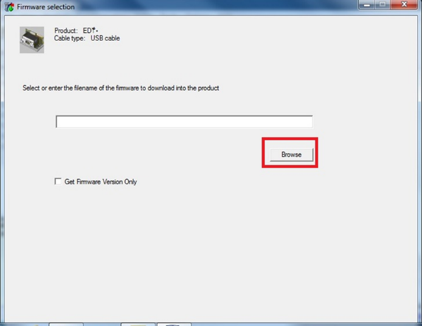

**Image analysis**

```json
{
 "image_name": "image36.png",
 "rId": "rId47",
 "image_path": "img_folder/image_035_image36.png",
 "caption": "پنجره انتخاب فریمور با دکمه Browse و گزینه Get Firmware Version Only",
 "ocr_text": "Firmware selection\n\nProduct: EDF+\nCable type: USB cable\n\nSelect or enter the filename of the firmware to download into the product\n\nBrowse\n\nGet Firmware Version Only",
 "visual_description": [
 "پنجره نرم افزاری با عنوان «Firmware selection» نمایش داده شده است.",
 "اطلاعات محصول شامل «Product: EDF+» و «Cable type: USB cable» درج شده است.",
 "یک کادر متنی برای وارد کردن/انتخاب نام فایل فریمور وجود دارد.",
 "یک دکمه با برچسب «Browse» کنار کادر متنی قرار دارد و با کادر قرمز مشخص شده است.",
 "یک چک باکس با برچسب «Get Firmware Version Only» زیر کادر متنی دیده می شود."
 ],
 "image_type": "screenshot"
}
```

* در پنجره ای که گشوده می شود از پوشه حاوی اطلاعات بارکد که در آدرس زیر قرار دارد، فایل Firmware را انتخاب کنید؛

**CD Drive:\Tools\BCR-ED4**

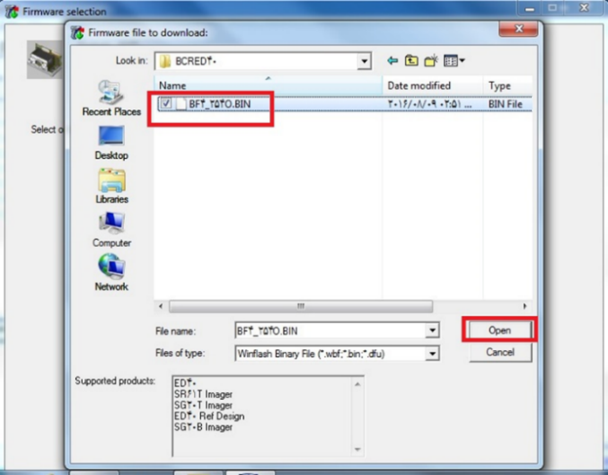

**Image analysis**

```json
{
 "image_name": "image37.png",
 "rId": "rId48",
 "image_path": "img_folder/image_036_image37.png",
 "caption": "پنجره انتخاب فایل فریمور با انتخاب BFT_7050.BIN و دکمه Open",
 "ocr_text": "Firmware selection\nFirmware file to download:\nLook in: BCREDT-\nName\nDate modified\nType\nBFT_7050.BIN\nBIN File\nRecent Places\nDesktop\nLibraries\nComputer\nNetwork\nFile name:\nBFT_7050.BIN\nFiles of type:\nWinflash Binary File (*.wbf;*.bin;*.dfu)\nSupported products:\nED+ \nSRT+ Imager\nSGT+ Imager\nED+ Ref Design\nSGT-B Imager\nOpen\nCancel",
 "visual_description": [
 "اسکرین شات پنجره انتخاب فایل با عنوان Firmware selection",
 "یک فایل با نام BFT_7050.BIN در لیست انتخاب شده است",
 "دکمه Open در سمت راست پایین پنجره دیده می شود",
 "فیلتر نوع فایل: Winflash Binary File (*.wbf;*.bin;*.dfu)",
 "بخش Supported products شامل ED+، SRT+ Imager، SGT+ Imager، ED+ Ref Design و SGT-B Imager است",
 "دو کادر قرمز دور نام فایل انتخاب شده و دکمه Open قرار دارد"
 ],
 "image_type": "screenshot"
}
```

* با این کار فایل تصویر بارکدخوان مربوطه روی صفحه مانیتور به نمایش گذاشته خواهد شد. در این مرحله می باید پرینت این تصویر - که در ابتدای این دستورالعمل به آن اشاره شد - را جلوی بارکدخوان قرار دهید تا به مرحله بعد بروید:

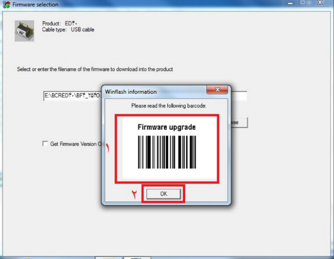

**Image analysis**

```json
{
 "image_name": "image38.png",
 "rId": "rId49",
 "image_path": "img_folder/image_037_image38.png",
 "caption": "پنجره انتخاب فریمور و پیام Winflash برای خواندن بارکد ارتقای فریمور",
 "ocr_text": "Firmware selection\n\nProduct: \nCable type: USB cable\n\nSelect or enter the filename of the firmware to download into the product\n\nGet Firmware Version 0\n\nWinflash information\n\nPlease read the following barcode:\n\nFirmware upgrade\n\nOK",
 "visual_description": [
 "اسکرین شات یک نرم افزار با عنوان «Firmware selection» و یک پنجره پاپ آپ «Winflash information»",
 "در پنجره پاپ آپ متن «Please read the following barcode:» و یک بارکد زیر عنوان «Firmware upgrade» دیده می شود",
 "دکمه «OK» در پایین پنجره پاپ آپ قرار دارد",
 "در پس زمینه گزینه «Cable type: USB cable» نمایش داده شده است"
 ],
 "image_type": "screenshot"
}
```

در زمان نمایش تصویر بالا کافی است تصویر بارکد توسط بارکدخوان خوانده شود؛ پس ازآن به صورت خودکار صفحه زیر به نمایش گذاشته خواهد شد:

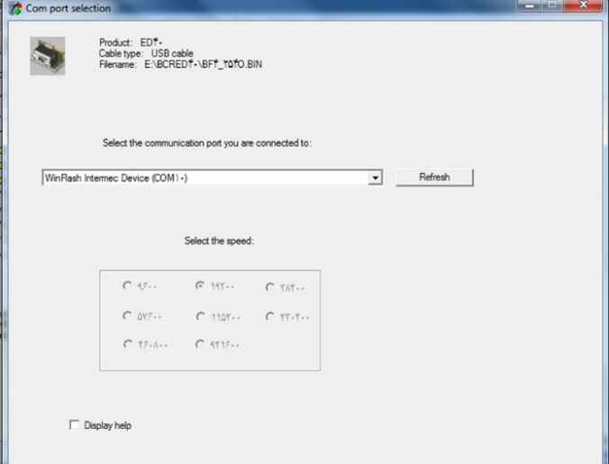

**Image analysis**

```json
{
 "image_name": "image39.png",
 "rId": "rId50",
 "image_path": "img_folder/image_038_image39.png",
 "caption": "پنجره انتخاب پورت COM و سرعت ارتباط برای دستگاه WinFlash Intermec",
 "ocr_text": "Com port selection\n\nProduct: EDT*\nCable type: USB cable\nFilename: E:\\BCRED*\\BF*_T0T0.BIN\n\nSelect the communication port you are connected to:\n\nWinFlash Intermec Device (COM1 -)\nRefresh\n\nSelect the speed:\n\n9600 19200 38400\n57600 115200 230400\n460800 921600\n\nDisplay help",
 "visual_description": [
 "پنجره نرم افزار با عنوان «Com port selection» نمایش داده شده است.",
 "اطلاعات Product، Cable type و Filename در بالای پنجره درج شده است.",
 "یک فهرست کشویی برای انتخاب پورت ارتباطی با گزینه «WinFlash Intermec Device (COM1 -)» وجود دارد.",
 "دکمه «Refresh» کنار فهرست کشویی دیده می شود.",
 "بخش «Select the speed» شامل گزینه های رادیویی سرعت: 9600، 19200، 38400، 57600، 115200، 230400، 460800، 921600 است.",
 "چک باکس «Display help» در پایین پنجره قرار دارد."
 ],
 "image_type": "screenshot"
}
```

* در پنجره فوق بدون هیچ تغییری کلید Enter واقع روی صفحه کلید را فشار دهید تا به مرحله ی بعد بروید.
* روی دکمه ی Start download کلیک کنید تا عملیات بارگذاری Firmware آغاز شود:

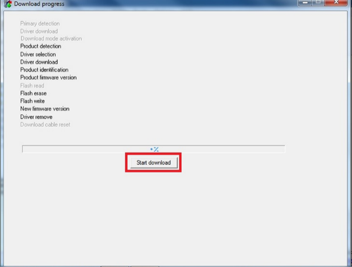

**Image analysis**

```json
{
 "image_name": "image40.png",
 "rId": "rId51",
 "image_path": "img_folder/image_039_image40.png",
 "caption": "پنجره پیشرفت دانلود با مراحل فلش و دکمه شروع دانلود",
 "ocr_text": "Download progress\n\nPrimary detection\nDriver download\nDownload mode activation\nProduct detection\nDriver selection\nDriver download\nProduct identification\nProduct firmware version\nFlash read\nFlash erase\nFlash write\nNew firmware version\nDriver remove\nDownload cable reset\n\n-%\n\nStart download",
 "visual_description": [
 "یک پنجره نرم افزاری با عنوان «Download progress» نمایش داده شده است",
 "فهرست مراحل شامل Primary detection تا Download cable reset در سمت چپ دیده می شود",
 "نوار پیشرفت افقی در پایین صفحه وجود دارد و مقدار «-%» نمایش داده شده است",
 "دکمه «Start download» در مرکز پایین قرار دارد و با کادر قرمز برجسته شده است"
 ],
 "image_type": "screenshot"
}
```

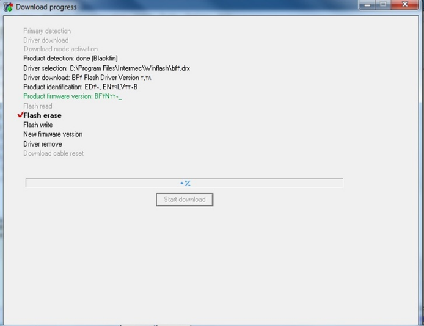

**Image analysis**

```json
{
 "image_name": "image41.png",
 "rId": "rId52",
 "image_path": "img_folder/image_040_image41.png",
 "caption": "پنجره پیشرفت دانلود با اطلاعات شناسایی محصول و گزینه Start download",
 "ocr_text": "Download progress\n\nPrimary detection\nDriver download\nDownload mode activation\nProduct detection: done (Blackfin)\nDriver selection: C:\\Program Files\\Intermec\\Winflash\\bf.drx\nDriver download: BF Flash Driver Version 2,14\nProduct identification: EDF+, EN92, LV7- B\nProduct firmware version: BF+N3? _\n\nFlash read\nFlash erase\nFlash write\nNew firmware version\nDriver remove\nDownload cable reset\n\n%\n\nStart download",
 "visual_description": [
 "پنجره نرم افزار با عنوان Download progress نمایش داده شده است",
 "مراحل فرآیند شامل Primary detection تا Download cable reset به صورت فهرست عمودی دیده می شود",
 "گزینه Flash erase با علامت فلش قرمز مشخص شده است",
 "مسیر فایل Driver selection برابر C:\\Program Files\\Intermec\\Winflash\\bf.drx نمایش داده شده است",
 "یک نوار پیشرفت با مقدار % (درصد) و دکمه Start download در پایین وجود دارد"
 ],
 "image_type": "screenshot"
}
```

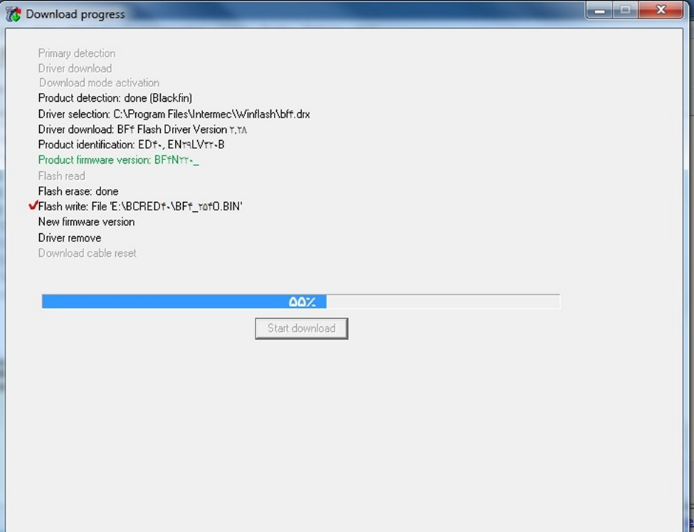

**Image analysis**

```json
{
 "image_name": "image42.png",
 "rId": "rId53",
 "image_path": "img_folder/image_041_image42.png",
 "caption": "پنجره پیشرفت دانلود/فلش با درصد ۵۵٪ و اطلاعات درایور و فایل فریمور",
 "ocr_text": "Download progress\n\nPrimary detection\nDriver download\nDownload mode activation\nProduct detection: done [Blackfin]\nDriver selection: C:\\Program Files\\Intermec\\Winflash\\bf.drx\nDriver download: BF Flash Driver Version ?.?A\nProduct identification: EDF1_, EN?LVT?-B\nProduct firmware version: BF?N?_- \nFlash read\nFlash erase: done\nFlash write: File 'E:\\BCRED\\-\\BF+_?0t0.BIN'\nNew firmware version\nDriver remove\nDownload cable reset\n\n55%\nStart download",
 "visual_description": [
 "پنجره نرم افزار با عنوان Download progress نمایش داده شده است",
 "فهرست مراحل شامل Primary detection تا Download cable reset در سمت چپ دیده می شود",
 "محصول با متن Product detection: done [Blackfin] مشخص شده است",
 "مسیر Driver selection برابر C:\\Program Files\\Intermec\\Winflash\\bf.drx نمایش داده شده است",
 "گزینه Flash erase: done و Flash write با مسیر فایل E:\\BCRED\\-\\BF+_?0t0.BIN نمایش داده شده است",
 "نوار پیشرفت در پایین روی 55% قرار دارد",
 "دکمه Start download در پایین پنجره وجود دارد"
 ],
 "image_type": "screenshot"
}
```

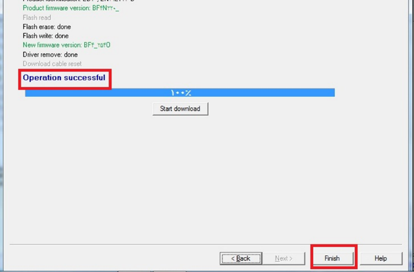

**Image analysis**

```json
{
 "image_name": "image43.png",
 "rId": "rId54",
 "image_path": "img_folder/image_042_image43.png",
 "caption": "نمایش موفقیت عملیات و پایان فرایند دانلود فریمور در پنجره نرم افزار",
 "ocr_text": "Flash read\nFlash erase: done\nFlash write: done\nNew firmware version: BFt_r0t0\nDriver remove: done\nDownload cable reset\nOperation successful\nStart download\n< Back\nNext >\nFinish\nHelp",
 "visual_description": [
 "پیغام «Operation successful» در کادر مشخص شده با حاشیه قرمز دیده می شود",
 "نوار پیشرفت آبی در میانه صفحه نمایش داده شده است",
 "دکمه «Start download» زیر نوار پیشرفت قرار دارد",
 "در پایین پنجره دکمه های «< Back»، «Next >» (غیرفعال)، «Finish» و «Help» دیده می شوند",
 "متن وضعیت شامل مراحل Flash read، Flash erase: done، Flash write: done و Driver remove: done نمایش داده شده است",
 "نسخه فریمور جدید «New firmware version: BFt_r0t0» نمایش داده شده است"
 ],
 "image_type": "screenshot"
}
```

* درصورتی که عملیات بارگذاری با موفقیت انجام شود عبارت Operation successful به نمایش گذاشته خواهد شد؛ روی دکمه ی Finish کلیک کنید.
* در نهایت دستگاه را Restart کنید.

در حال حاضر مرحله اول بارگذاری به اتمام رسیده است و می باید بارگذاری Firmware در محیط CSCW32 را انجام دهید.

## مرحله دوم: بارگذاری Firmware در محیط CSCW32

بعد از ریست کردن خودپرداز و در هنگام اجرای نرم افزار CSCW32، این نرم افزار ماژول ها را بررسی و در صورت عدم وجود مغایرت در Firmware موجود، عملیات بارگذاری را انجام می دهد. در این مرحله باید دقت کنید که بارگذاری بر روی ماژول بارکدخوان انجام شود؛ در محیط CSCW32 ماژول بارکدخوان با کد CSCWBCR مشخص می شود:

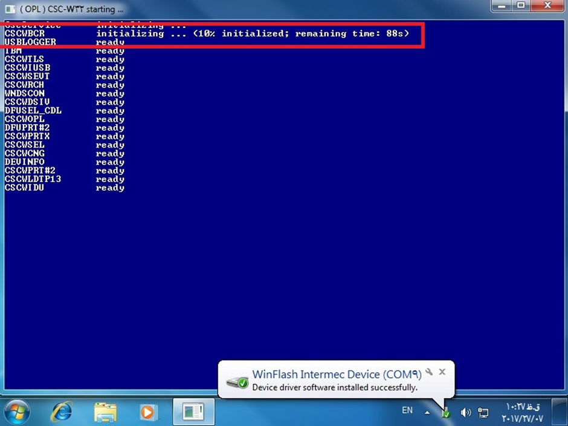

**Image analysis**

```json
{
 "image_name": "image44.png",
 "rId": "rId55",
 "image_path": "img_folder/image_043_image44.png",
 "caption": "پنجره کنسول با وضعیت initializing و پیام نصب موفق درایور WinFlash Intermec روی COM9",
 "ocr_text": "starting ...\ninitializing ... (10% initialized; remaining time: 88s>\nCSCWCBR\nUS BLOGGER\nIBL\nCSCVTLS\nCSCVIUSB\nCSCVUSFUT\nCSCWRCH\nWNDSCON\nCSCWDSIU\nDFUSEL_CDL\nCSCUPOL\nDFUPRT#2\nCSCWFPIX\nCSCWFSEL\nCSCWCNG\nDEVINFO\nCSCWFPRT#2\nCSCWLDTP13\nCSCWIDU\nWinFlash Intermec Device (COM9)\nDevice driver software installed successfully.\nEN",
 "visual_description": [
 "اسکرین شات ویندوز با پنجره کنسول آبی و فهرست ماژول ها که اکثرشان وضعیت ready دارند",
 "در بالای کنسول نوار قرمز دور متن «initializing ... (10% initialized; remaining time: 88s>» دیده می شود",
 "نوتیفیکیشن پایین صفحه: «WinFlash Intermec Device (COM9)» و «Device driver software installed successfully.»",
 "نوار وظیفه ویندوز و نشانگر زبان «EN» در پایین سمت راست قابل مشاهده است"
 ],
 "image_type": "screenshot"
}
```

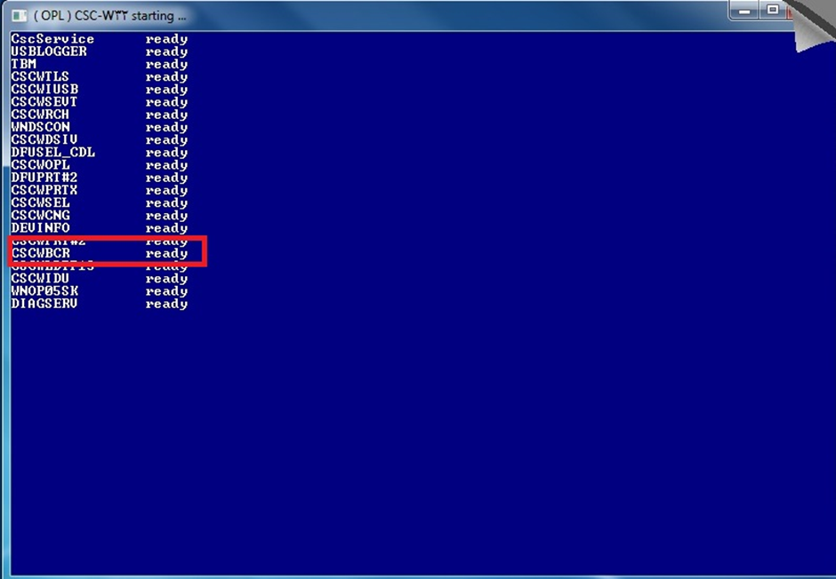

**Image analysis**

```json
{
 "image_name": "image45.png",
 "rId": "rId56",
 "image_path": "img_folder/image_044_image45.png",
 "caption": "اسکرین شات فهرست سرویس ها با وضعیت ready در محیط متنی",
 "ocr_text": "(OPL) CSC-W?? starting ...\n\nCscService ready\nUSLOGGER ready\nIBM ready\nCSCWTLS ready\nCSCVTUSB ready\nCSC VSEUT ready\nCSCWRCH ready\nWNDSCON ready\nCSCVDSIU ready\nDFUSEL_CDL ready\nCSC WOPL ready\nDFUPRT#2 ready\nCSCUPRTX ready\nCSC WSEL ready\nCSC WCHG ready\nDEVINFO ready\n\nDFUPRT#2 ready\nCSCWRCR ready\n\nCSCVIDU ready\nWNOP05SK ready\nDIAGSERV ready",
 "visual_description": [
 "پنجره کنسولی با پس زمینه آبی و فهرست سرویس ها که وضعیت آن ها «ready» است",
 "یک کادر قرمز دور خط «CSCWRCR ready» کشیده شده است",
 "نوار عنوان پنجره شامل متن «(OPL) CSC-W?? starting ...» است"
 ],
 "image_type": "screenshot"
}
```

### نکته مهم

در صورت مشاهده ی خطای این ماژول در CSCW32، اقدامات زیر را با دقت انجام دهید:

* با مراجعه به کنترل پنل نرم افزار EasySet و Winflash را حذف (Uninstall) نمایید:

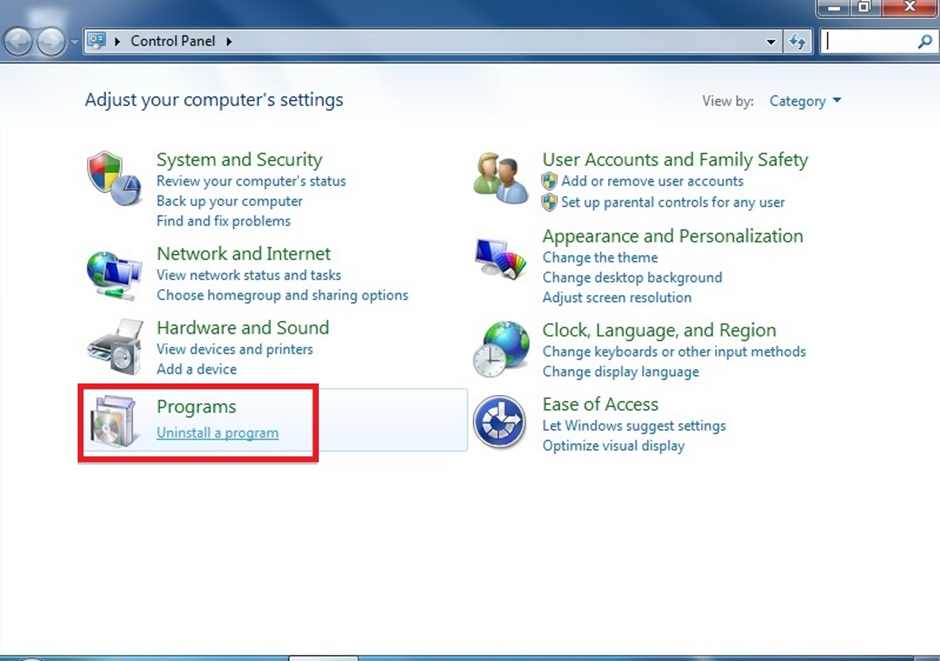

**Image analysis**

```json
{
 "image_name": "image46.png",
 "rId": "rId57",
 "image_path": "img_folder/image_045_image46.png",
 "caption": "نمای کنترل پنل ویندوز با برجسته سازی گزینه Programs و لینک Uninstall a program",
 "ocr_text": "Control Panel\nAdjust your computer's settings\nView by: Category\nSystem and Security\nReview your computer's status\nBack up your computer\nFind and fix problems\nNetwork and Internet\nView network status and tasks\nChoose homegroup and sharing options\nHardware and Sound\nView devices and printers\nAdd a device\nPrograms\nUninstall a program\nUser Accounts and Family Safety\nAdd or remove user accounts\nSet up parental controls for any user\nAppearance and Personalization\nChange the theme\nChange desktop background\nAdjust screen resolution\nClock, Language, and Region\nChange keyboards or other input methods\nChange display language\nEase of Access\nLet Windows suggest settings\nOptimize visual display",
 "visual_description": [
 "اسکرین شات کنترل پنل ویندوز در حالت Category",
 "بخش Programs با کادر قرمز برجسته شده است",
 "زیر گزینه Programs لینک Uninstall a program دیده می شود",
 "گزینه View by: Category در بالای سمت راست نمایش داده شده است"
 ],
 "image_type": "screenshot"
}
```

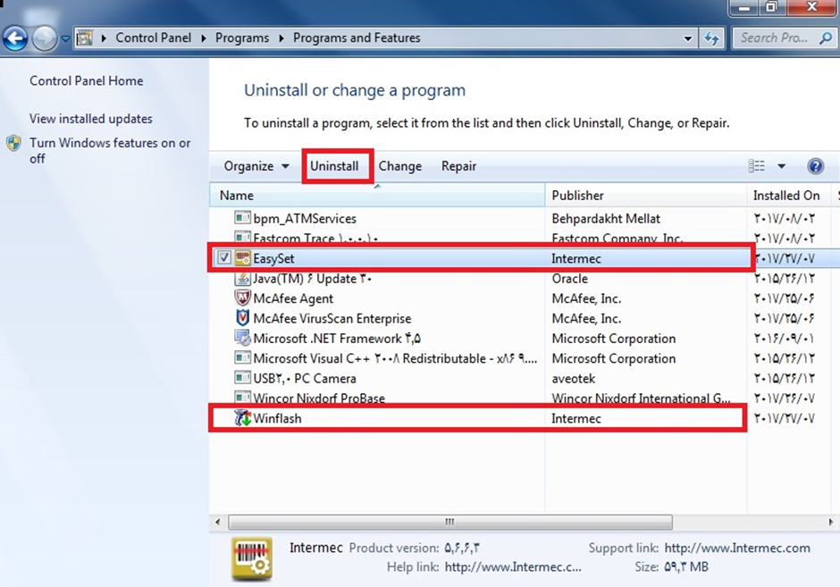

**Image analysis**

```json
{
 "image_name": "image47.png",
 "rId": "rId58",
 "image_path": "img_folder/image_046_image47.png",
 "caption": "صفحه Programs and Features ویندوز با انتخاب EasySet و دکمه Uninstall مشخص شده است",
 "ocr_text": "Control Panel > Programs > Programs and Features\nSearch Pro...\nControl Panel Home\nView installed updates\nTurn Windows features on or off\nUninstall or change a program\nTo uninstall a program, select it from the list and then click Uninstall, Change, or Repair.\nOrganize\nUninstall\nChange\nRepair\nName\nPublisher\nInstalled On\nbpm_ATMServices\nBehpardakht Mellat\nFastcom Trace 1.00.1\nFastcom Company Inc.\nEasySet\nIntermec\nJava(TM) 6 Update 20\nOracle\nMcAfee Agent\nMcAfee, Inc.\nMcAfee VirusScan Enterprise\nMcAfee, Inc.\nMicrosoft .NET Framework 4 Client Profile\nMicrosoft Corporation\nMicrosoft Visual C++ 2008 Redistributable - x86 9.0...\nMicrosoft Corporation\nUSB\\ PC Camera\naveotek\nWincor Nixdorf ProBase\nWincor Nixdorf International G...\nWinflash\nIntermec\nIntermec Product version: 6,6,3\nSupport link: http://www.Intermec.com\nHelp link: http://www.Intermec.c...\nSize: 59,2 MB",
 "visual_description": [
 "پنجره Control Panel > Programs > Programs and Features نمایش داده شده است",
 "دکمه Uninstall در نوار ابزار با کادر قرمز هایلایت شده است",
 "ردیف برنامه EasySet با ناشر Intermec با کادر قرمز مشخص شده است",
 "ردیف برنامه Winflash با ناشر Intermec با کادر قرمز مشخص شده است",
 "ستون های Name، Publisher و Installed On در جدول فهرست برنامه ها دیده می شود",
 "در نوار پایین اطلاعات Intermec شامل Product version: 6,6,3 و Size: 59,2 MB نمایش داده شده است"
 ],
 "image_type": "screenshot"
}
```

* اتصال کابل بارکدخوان را بررسی و وضعیت آن را با مراجعه به Device Manager مشاهده نمایید:


**Image analysis**

```json
{
 "image_name": "image11.png",
 "rId": "rId22",
 "image_path": "img_folder/image_010_image11.png",
 "caption": "نمای Device Manager با نمایش Intermec Device و Intermec Virtual Com Port (COM4)",
 "ocr_text": "Device Manager\nFile Action View Help\natm1)))\nComputer\nDisk drives\nDisplay adapters\nHuman Interface Devices\nIDE ATA/ATAPI controllers\nImaging devices\nKeyboards\nMice and other pointing devices\nMonitors\nMulti-port serial adapters\nIntermec Device\nNetwork adapters\nPortable Devices\nPorts (COM & LPT)\nCommunications Port (COM1)\nCommunications Port (COM3)\nIntermec Virtual Com Port (COM4)\nProcessors\nSound, video and game controllers\nSystem devices\nUniversal Serial Bus controllers\nUSBIO controlled devices",
 "visual_description": [
 "پنجره Device Manager ویندوز با نمای درختی دسته های سخت افزاری",
 "بخش Multi-port serial adapters باز شده و مورد Intermec Device با کادر قرمز مشخص شده است",
 "بخش Ports (COM & LPT) باز شده و مورد Intermec Virtual Com Port (COM4) با کادر قرمز مشخص شده است",
 "موارد Communications Port (COM1) و Communications Port (COM3) در لیست پورت ها دیده می شوند"
 ],
 "image_type": "screenshot"
}
```

این ماژول حتماً باید در فهرست Device Manager وجود داشته باشد؛ در غیر این صورت احتمالاً اتصالات آن به درستی انجام نشده است:

* + کابل بارکدخوان را جابجا کنید.
 + جهت تست کابل، ماژول را بازکنید و با استفاده از کابل USB یک ماژول دیگر اتصال را برقرار نمایید. در صورت برطرف شدن اشکال، نسبت به تعویض کابل اقدام نمایید.
* درصورتی که بارگذاری Firmware به درستی انجام نشده باشد نیز در محیط CSCW32، خطا مشاهده خواهد شد که برای رفع آن می باید مجدداً Firmware را بارگذاری نمایید.
* در هنگام بارگذاری Firmware، پس از نمایش صحیح تصویر بارکد، لیزر بارکدخوان می باید پس از خواندن بارکد خاموش شود؛ در غیر این صورت، یکی از دلایل زیر ممکن است باعث بروز اشکال باشد:
 + ریست پارامتر بارکدخوان که در مرحله اول بارگذاری به آن اشاره شد به درستی انجام نشده است.

**راه حل:** مجدداً گزینه Reset factory defaults را اجرا نمایید. سپس مراحل را دوباره تکرار کنید.

* + بارکد پرینت گرفته شده ناخوانا است؛ برای مثال کمرنگ است یا خط خوردگی یا تازدگی دارد.

**راه حل:** باکیفیت بالا پرینت بگیرید و از تا زدن نسخه چاپی خودداری نمایید.

* + طلق جلوی بارکدخوان کثیف یا خش دار شده است.

**راه حل:** ابتدا طلق را با ماده شوینده تمیز کنید؛ در صورت عدم رفع اشکال، بارکدخوان را باز کنید و بدون طلق آن را تست نمایید.

# تست در محیط WOSA

درنهایت پس از اتمام بارگذاری Firmware می باید با نمونه بارکدهایی که در انتهای دستورالعمل آورده شده است بارکدخوان را تست نمایید.

1. از داخل فلش مموری، به پوشه Tools و سپس به پوشه WOSA Test Tools بروید و یکی از پوشه های 2012، 2007 یا 2003 را باز و فایل BCR310 را اجرا کنید.

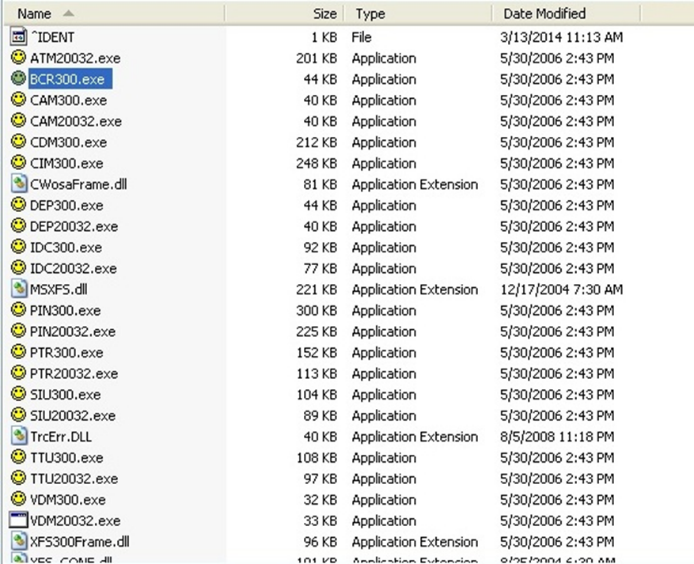

**Image analysis**

```json
{
 "image_name": "image48.png",
 "rId": "rId59",
 "image_path": "img_folder/image_047_image48.png",
 "caption": "نمایش لیست فایل های اجرایی و DLL در پنجره مدیریت فایل ویندوز",
 "ocr_text": "Name\nSize\nType\nDate Modified\n'IDENT\nATM20032.exe\nBCR300.exe\nCAM300.exe\nCAM20032.exe\nCDM300.exe\nCIM300.exe\nCWosaframe.dll\nDEP300.exe\nDEP20032.exe\nIDC300.exe\nIDC20032.exe\nMSXF5.dll\nPIN300.exe\nPIN20032.exe\nPTR300.exe\nPTR20032.exe\nSIU300.exe\nSIU20032.exe\nTrcErr.DLL\nTTU300.exe\nTTU20032.exe\nVDM300.exe\nVDM20032.exe\nXF5300Frame.dll",
 "visual_description": [
 "پنجره شبیه Windows Explorer با ستون های Name، Size، Type و Date Modified",
 "فایل BCR300.exe در لیست انتخاب/هایلایت شده است",
 "انواع فایل ها شامل Application و Application Extension نمایش داده شده اند",
 "نام چندین فایل اجرایی با پسوند .exe و کتابخانه با پسوند .dll قابل مشاهده است"
 ],
 "image_type": "screenshot"
}
```

2. از منوی Service گزینه Open+Register را انتخاب کنید:

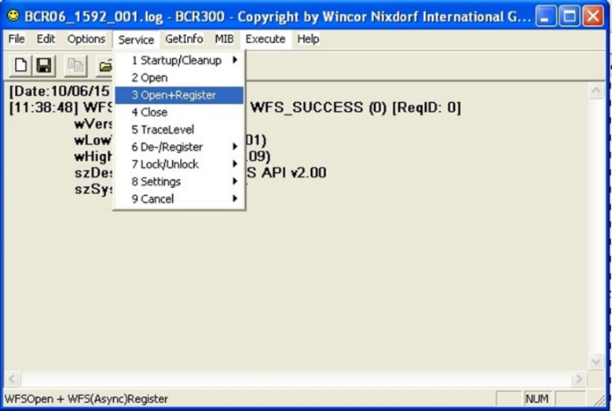

**Image analysis**

```json
{
 "image_name": "image49.png",
 "rId": "rId60",
 "image_path": "img_folder/image_048_image49.png",
 "caption": "اسکرین شات برنامه BCR300 با منوی Service و پیام WFS_SUCCESS در پنجره گزارش",
 "ocr_text": "BCR06_1592_001.log - BCR300 - Copyright by Wincor Nixdorf International G...\nFile Edit Options Service GetInfo MIB Execute Help\n1 Startup/Cleanup\n2 Open\n3 Open+Register\n4 Close\n5 TraceLevel\n6 De-/Register\n7 Lock/Unlock\n8 Settings\n9 Cancel\n[Date:10/06/15\n[11:38:48] WFS\nwVers\nwLow\nwHig\nszDe\nszSy\nWFS_SUCCESS (0) [ReqID: 0]\n01)\n09)\nS API v2.00\nWFSOpen + WFS(Async)Register\nNUM",
 "visual_description": [
 "پنجره برنامه با عنوان فایل لاگ BCR06_1592_001.log و نام BCR300 نمایش داده شده است",
 "نوار منو شامل File، Edit، Options، Service، GetInfo، MIB، Execute، Help است",
 "منوی کشویی Service باز است و گزینه های Startup/Cleanup، Open، Open+Register، Close، TraceLevel، De-/Register، Lock/Unlock، Settings، Cancel را نشان می دهد",
 "در پنجره اصلی متن وضعیت «WFS_SUCCESS (0) [ReqID: 0]» دیده می شود",
 "در پایین پنجره وضعیت «WFSOpen + WFS(Async)Register» و نشانگر «NUM» نمایش داده شده است"
 ],
 "image_type": "screenshot"
}
```

3. از منوی Execute، گزینه Read را انتخاب کنید:
4.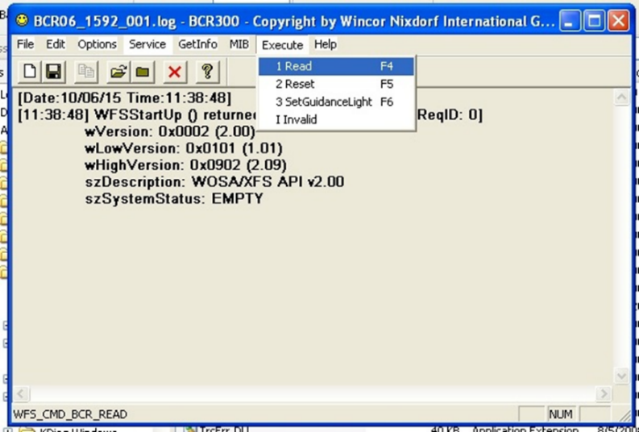

**Image analysis**

```json
{
 "image_name": "image50.png",
 "rId": "rId61",
 "image_path": "img_folder/image_049_image50.png",
 "caption": "اسکرین شات لاگ BCR300 با منوی Execute و اطلاعات نسخه WOSA/XFS",
 "ocr_text": "BCR06_1592_001.log - BCR300 - Copyright by Wincor Nixdorf International G...\nFile Edit Options Service GetInfo MIB Execute Help\n1 Read F4\n2 Reset F5\n3 SetGuidancelight F6\nI Invalid\nDate:10/06/15 Time:11:38:48\n[11:38:48] WFSStartUp 0 returned\nwVersion: 0x0002 (2.00)\nwLowVersion: 0x0101 (1.01)\nwHighVersion: 0x0902 (2.09)\nszDescription: WOSA/XFS API v2.00\nszSystemStatus: EMPTY\nReqID: 0]\nWFS_CMD_BCR_READ\nNUM",
 "visual_description": [
 "پنجره برنامه با عنوان BCR06_1592_001.log - BCR300 نمایش داده شده است",
 "منوی Execute باز است و گزینه های Read (F4)، Reset (F5)، SetGuidancelight (F6) و Invalid دیده می شوند",
 "در خروجی لاگ مقادیر wVersion، wLowVersion، wHighVersion و szDescription: WOSA/XFS API v2.00 نمایش داده شده است",
 "عبارت szSystemStatus: EMPTY و ReqID: 0] در پنجره قابل مشاهده است"
 ],
 "image_type": "screenshot"
}
```

4. گزینه accept all possible formats را انتخاب و سپس روی دکمه ی OK کلیک کنید:

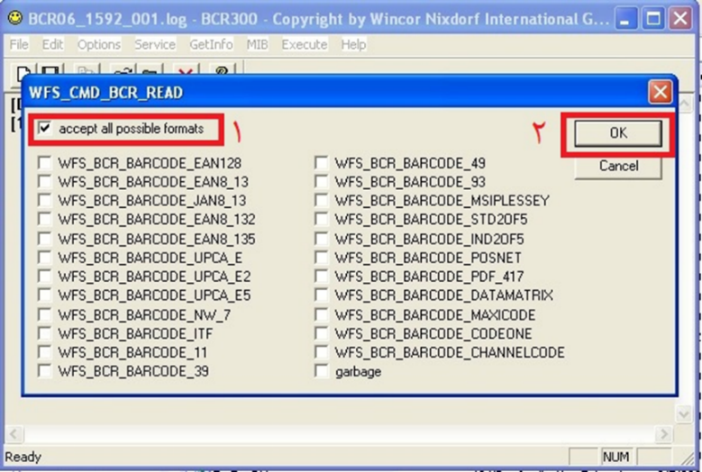

**Image analysis**

```json
{
 "image_name": "image51.png",
 "rId": "rId62",
 "image_path": "img_folder/image_050_image51.png",
 "caption": "پنجره تنظیمات WFS_CMD_BCR_READ با فهرست فرمت های بارکد و دکمه های OK و Cancel",
 "ocr_text": "BCR06_1592_001.log - BCR300 - Copyright by Wincor Nixdorf International G...\nFile Edit Options Service GetInfo MIB Execute Help\nWFS_CMD_BCR_READ\naccept all possible formats\nWFS_BCR_BARCODE_EAN128\nWFS_BCR_BARCODE_EAN8_13\nWFS_BCR_BARCODE_JAN8_13\nWFS_BCR_BARCODE_EAN8_132\nWFS_BCR_BARCODE_EAN8_135\nWFS_BCR_BARCODE_UPCA_E\nWFS_BCR_BARCODE_UPCA_E2\nWFS_BCR_BARCODE_UPCA_E5\nWFS_BCR_BARCODE_NW_7\nWFS_BCR_BARCODE_ITF\nWFS_BCR_BARCODE_11\nWFS_BCR_BARCODE_39\nWFS_BCR_BARCODE_49\nWFS_BCR_BARCODE_93\nWFS_BCR_BARCODE_MSIPLESSEY\nWFS_BCR_BARCODE_STD2OF5\nWFS_BCR_BARCODE_IND2OF5\nWFS_BCR_BARCODE_POSNET\nWFS_BCR_BARCODE_PDF_417\nWFS_BCR_BARCODE_DATAMATRIX\nWFS_BCR_BARCODE_MAXICODE\nWFS_BCR_BARCODE_CODEONE\nWFS_BCR_BARCODE_CHANNELNCODE\ngarbage\nOK\nCancel\nReady\nNUM",
 "visual_description": [
 "اسکرین شات نرم افزار BCR300 با پنجره WFS_CMD_BCR_READ و لیست گزینه های فرمت بارکد به صورت چک باکس",
 "گزینه «accept all possible formats» تیک خورده است",
 "دکمه های «OK» و «Cancel» در سمت راست پنجره دیده می شوند",
 "چند کادر قرمز برای برجسته سازی گزینه «accept all possible formats» و دکمه «OK» رسم شده است",
 "در نوار منو گزینه های File، Edit، Options، Service، GetInfo، MIB، Execute، Help دیده می شود"
 ],
 "image_type": "screenshot"
}
```

بعد از کلیک بر روی OK لیزر بارکدخوان روشن و آماده دریافت بارکد می گردد. توجه داشته باشید که در صورت دادن هر نوع بارکد، اطلاعات آن خوانده و به نمایش گذاشته می شود.

حتماً بعد از خواندن بارکد می باید لیزر را خاموش و عدد تصویر بارکد را بررسی نمایید:

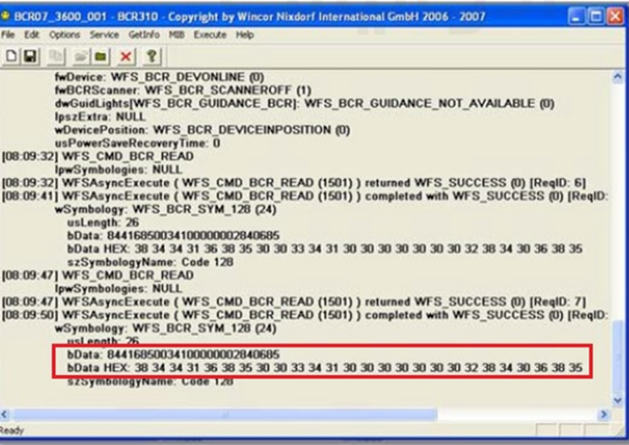

**Image analysis**

```json
{
 "image_name": "image52.png",
 "rId": "rId63",
 "image_path": "img_folder/image_051_image52.png",
 "caption": "اسکرین شات لاگ BCR310 با نتیجه خواندن بارکد Code 128 و نمایش bData و bData HEX",
 "ocr_text": "BCR07_3600_001 - BCR310 - Copyright by Wincor Nixdorf International GmbH 2006 - 2007\n\nfwDevice: WFS_BCR_DEVONLINE (0)\nfwBCRScanner: WFS_BCR_SCANNEROFF (1)\ndwGuidLights[WFS_BCR_GUIDANCE_BCR]: WFS_BCR_GUIDANCE_NOT_AVAILABLE (0)\nlpszExtra: NULL\nwDevicePosition: WFS_BCR_DEVICEINPOSITION (0)\ndwPowerSaveRecoveryTime: 0\nlpwSymbologies: NULL\n\n[08:09:32] WFS_CMD_BCR_READ\n[08:09:32] WFSAsyncExecute( WFS_CMD_BCR_READ (1501) ) returned WFS_SUCCESS (0) [ReqID: 6]\n[08:09:41] WFSAsyncExecute ( WFS_CMD_BCR_READ (1501) ) completed with WFS_SUCCESS (0) [ReqID: 6]\nwSymbology: WFS_BCR_SYM_128 (24)\nusLength: 26\nbData: 8441685003410000002840685\nbData HEX: 38 34 34 31 36 38 35 30 30 33 34 31 30 30 30 30 30 30 32 38 34 30 36 38 35\nszSymbologyName: Code 128\n\n[08:09:47] WFS_CMD_BCR_READ\nlpwSymbologies: NULL\n[08:09:47] WFSAsyncExecute( WFS_CMD_BCR_READ (1501) ) returned WFS_SUCCESS (0) [ReqID: 7]\n[08:09:50] WFSAsyncExecute ( WFS_CMD_BCR_READ (1501) ) completed with WFS_SUCCESS (0) [ReqID: 7]\nwSymbology: WFS_BCR_SYM_128 (24)\nusLength: 26\nbData: 8441685003410000002840685\nbData HEX: 38 34 34 31 36 38 35 30 30 33 34 31 30 30 30 30 30 30 32 38 34 30 36 38 35\nszSymbologyName: Code 128",
 "visual_description": [
 "پنجره نرم افزار BCR با لاگ اجرای WFS_CMD_BCR_READ و پیام های WFSAsyncExecute/complete با WFS_SUCCESS نمایش داده شده است",
 "نوع سمبلوجی بارکد WFS_BCR_SYM_128 (Code 128) و طول داده usLength: 26 درج شده است",
 "مقادیر bData و bData HEX نمایش داده شده و با یک کادر قرمز در پایین صفحه هایلایت شده اند"
 ],
 "image_type": "screenshot"
}
```