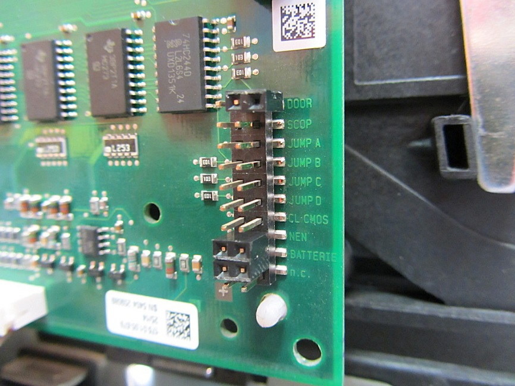
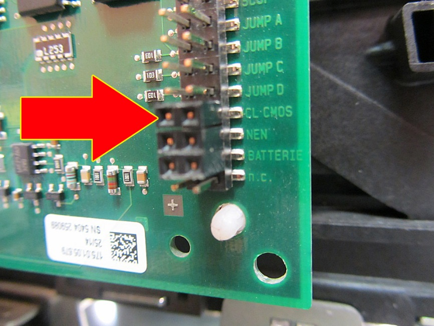
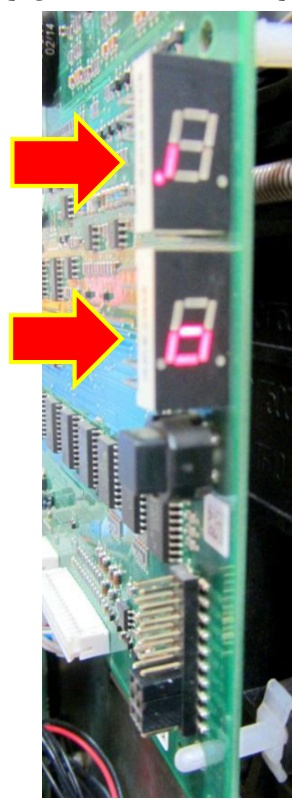
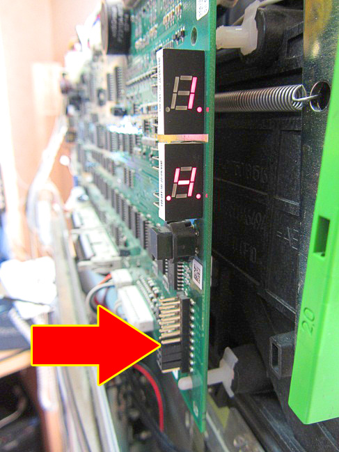
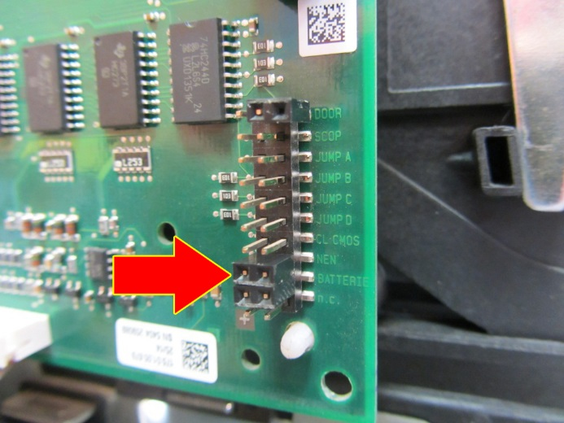
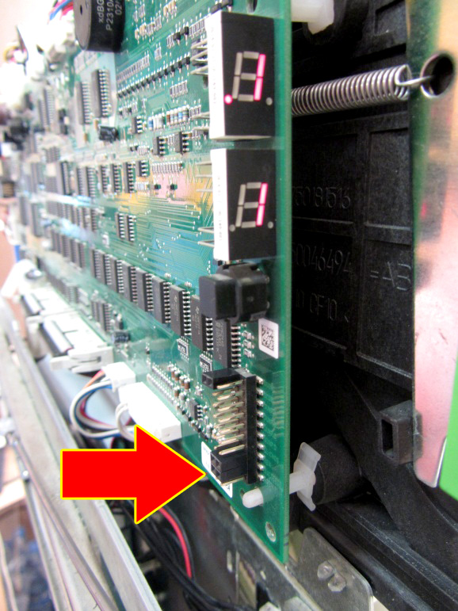
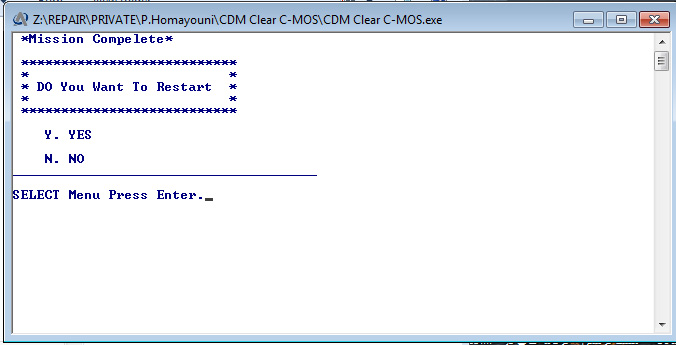
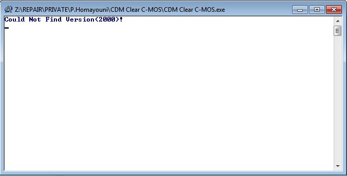

# Document metadata

- **Author:** Arash Tighbor
- **Last Modified By:** Arash Arash
- **Created:** 2018-01-16T06:17:00Z
- **Modified:** 2020-04-06T04:17:00Z
- **Document Name:** 1-IT9901-365-00_ZAC Clear CMOS Troubleshooting.docx
- **Source File:** C:\Users\aa.eskandari\Desktop\input\1-IT9901-365-00_ZAC Clear CMOS Troubleshooting.docx

---


**Image analysis**

```json
{
 "image_name": "image1.jpg",
 "rId": "rId8",
 "image_path": "img_folder/image_001_image1.jpg",
 "caption": "صفحه عنوان دستورالعمل رفع اشکال Clear CMOS در برد زک",
 "ocr_text": "دستورالعمل\nرفع اشکال Clear CMOS\nدر برد زک\nشماره نسخه :1-IT9901-365-00\nفروردین 1399\nشرکت توسعه خدمات الکترونیکی آرونیس (سهامی خاص)",
 "visual_description": [
 "صفحه عنوان یک سند فارسی با تیتر «رفع اشکال Clear CMOS» و زیرعنوان «در برد زک»",
 "در پایین صفحه شماره نسخه «1-IT9901-365-00» و تاریخ «فروردین 1399» درج شده است",
 "نام شرکت «شرکت توسعه خدمات الکترونیکی آرونیس (سهامی خاص)» و یک لوگو در پایین صفحه دیده می شود",
 "یک تصویر خطی از دستگاه خودپرداز/کیوسک در گوشه پایین چپ قرار دارد",
 "یک خط افقی زیر عنوان و یک نوار گرافیکی عمودی در سمت راست صفحه مشاهده می شود"
 ],
 "image_type": "scan"
}
```

**دستورالعمل**

**رفع اشکال Clear CMOS**

**دربرد زک**

**شماره نسخه: I1-IT9901-365-00**

**فروردین 1399**


**Image analysis**

```json
{
 "image_name": "image2.png",
 "rId": "rId9",
 "image_path": "img_folder/image_002_image2.png",
 "caption": "لوگوی شرکت توسعه خدمات الکترونیکی آدونیس",
 "ocr_text": "آدونیس\nشرکت توسعه خدمات الکترونیکی",
 "visual_description": [
 "لوگو شامل متن فارسی «آدونیس» و «شرکت توسعه خدمات الکترونیکی» است",
 "در سمت راست نماد گرافیکی شبیه حرف A با قوس های آبی دیده می شود",
 "پس زمینه تصویر مشکی و رنگ متن ها خاکستری و آبی است"
 ],
 "image_type": "diagram"
}
```

این سند با عنوان «دستورالعمل رفع اشکال Clear CMOS دربرد زک» در فروردین 99 با همکاری واحد تعمیرات امور تولید و تعمیر و واحد پشتیبانی سطح 2 امور عملیات شرکت توسعه خدمات الکترونیکی آدونیس تهیه و تنظیم شده است.

این دستورالعمل در واحد آموزش امور فناوری اطلاعات، توسط آرش تیغ بر ویرایش و با شماره نسخه ی
-I1-IT9901-365-00آماده انتشار گردید.

سابقه ویرایش :

<!-- TABLE_START -->
| | | | | |
| --- | --- | --- | --- | --- |
| **نام** **ویرایشگر** | **تاریخ** | **نام / سمت تاییدکننده** | **عنوان/عناوین ویرایش شده** | **شماره نسخه جدید** |
| | | | | |
| | | | | |
| | | | | |
| | | | | |
| | | | | |
<!-- TABLE_END -->


**Image analysis**

```json
{
 "image_name": "image4.png",
 "rId": "rId15",
 "image_path": "img_folder/image_003_image4.png",
 "caption": "متن خوشنویسی فارسی «به نام خدا» روی پس زمینه سفید",
 "ocr_text": "به نام خدا",
 "visual_description": [
 "تصویر شامل متن خوشنویسی سیاه رنگ به زبان فارسی روی پس زمینه سفید است"
 ],
 "image_type": "scan"
}
```

این دستورالعمل به منظور ارائه ی راهکار جهت رفع خطای عدم CL-CMOS شدن برد ZAC تهیه و تنظیم شده است.

# عملیات CLR-CMOS

در شرایط معمول، وضعیت جامپرهای برد ZAC همانند تصویر زیر می باشد:



**Image analysis**

```json
{
 "image_name": "image5.jpeg",
 "rId": "rId16",
 "image_path": "img_folder/image_004_image5.jpg",
 "caption": "برد الکترونیکی با هدر پین و برچسب های جامپر و CMOS",
 "ocr_text": "DOOR\nSCOP\nJUMP A\nJUMP B\nJUMP C\nJUMP D\nCL CMOS\nNEN\nBATTERIE\nn.c",
 "visual_description": [
 "یک برد PCB سبز با کانکتور هدر پین عمودی چندردیفه و جامپرهای نصب شده",
 "متن سیلک اسکرین کنار هدر شامل: DOOR، SCOP، JUMP A/B/C/D، CL CMOS، NEN، BATTERIE، n.c",
 "چند آی سی SMD و مقاومت/خازن های SMD روی برد قابل مشاهده است",
 "برچسب QR کد سفید روی برد دیده می شود"
 ],
 "image_type": "photo"
}
```

به منظور انجام عملیات CLR-CMOS مراحل زیر را انجام دهید:

1. پین های مربوط به CL-CMOS را همانند شکل زیر جامپر نمایید:



**Image analysis**

```json
{
 "image_name": "image6.jpeg",
 "rId": "rId17",
 "image_path": "img_folder/image_005_image6.jpg",
 "caption": "برد الکترونیکی با کانکتور جامپر و برچسب های JUMP A تا D و CL CMOS",
 "ocr_text": "U253\nE01\n103\nE01\nJUMP A\nJUMP B\nJUMP C\nJUMP D\nCL CMOS\nMEN\nBATTERIE\nn.c.\n+",
 "visual_description": [
 "یک پیکان قرمز به سمت بلوک جامپر/کانکتور مشکی روی برد اشاره می کند",
 "روی برد کنار کانکتور، نوشته های JUMP A, JUMP B, JUMP C, JUMP D دیده می شود",
 "متن های CL CMOS، MEN، BATTERIE و n.c. در سمت راست برد چاپ شده اند",
 "چند قطعه SMD با کدهای E01 و 103 قابل مشاهده است",
 "نماد + نزدیک یک پد/نقطه اتصال روی برد دیده می شود",
 "برچسب سفید دارای QR کد در پایین چپ برد قرار دارد"
 ],
 "image_type": "photo"
}
```

با انجام این کار، وضعیت نمایشگر برد ZAC همانند شکل زیر خواهد شد:



**Image analysis**

```json
{
 "image_name": "image7.jpeg",
 "rId": "rId18",
 "image_path": "img_folder/image_006_image7.jpg",
 "caption": "نمای نزدیک برد الکترونیکی با نمایشگرهای سون سگمنت و فلش های قرمز",
 "ocr_text": "",
 "visual_description": [
 "یک برد مدار چاپی سبزرنگ با چندین آی سی و قطعات SMD دیده می شود",
 "دو نمایشگر سون سگمنت تک رقمی روی برد نصب شده اند",
 "دو فلش قرمز با حاشیه زرد به سمت نمایشگرها اشاره می کنند",
 "یک کانکتور پین هدر و چند کانکتور/سوکت در پایین برد دیده می شود"
 ],
 "image_type": "photo"
}
```

2. اگر این شرایط به مدت یک دقیقه برقرار باشد، عملیات CLR-CMOSبه درستی انجام شده است.

اکنون جامپر مربوط به پین های CL-CMOSرا خارج نمایید.

درصورتی که باوجود جامپر مربوط به CL-CMOS پیغام بالا تغییر نماید، عملیات CL-CMOS به درستی انجام نشده است؛ جهت رفع این اشکال به قسمت «رفع اشکال عدم انجام
CL-CMOS مراجعه کنید:



**Image analysis**

```json
{
 "image_name": "image8.jpg",
 "rId": "rId19",
 "image_path": "img_folder/image_007_image8.jpg",
 "caption": "برد الکترونیکی با نمایشگر سون سگمنت و فلش اشاره به کانکتور پین",
 "ocr_text": "H.\nH.",
 "visual_description": [
 "برد مدار چاپی سبز داخل یک محفظه/رک نصب شده است",
 "دو نمایشگر سون سگمنت دو رقمی (هرکدام یک کاراکتر) روشن هستند و روی هر دو «H.» دیده می شود",
 "یک کانکتور/هدر پین عمودی روی برد دیده می شود",
 "فلش قرمز با حاشیه زرد به سمت ناحیه کانکتور پین اشاره می کند",
 "سیم ها و کابل ها در کنار برد قابل مشاهده اند"
 ],
 "image_type": "photo"
}
```

# رفع اشکال عدم انجام CL-CMOS

1. تغذیه برد ZAC را جدا کنید.
2. جامپر BATTERIE را بردارید و بعد از 30 ثانیه آن را در جایش قرار دهید:



**Image analysis**

```json
{
 "image_name": "image9.jpeg",
 "rId": "rId20",
 "image_path": "img_folder/image_008_image9.jpg",
 "caption": "برد الکترونیکی با کانکتور جامپر و برچسب های DOOR و JUMP A تا D",
 "ocr_text": "DOOR\nSCOP\nJUMP A\nJUMP B\nJUMP C\nJUMP D\nCL-CMOS\nNENT\nBATTERIE\nn.c",
 "visual_description": [
 "نمای نزدیک از یک برد PCB سبز با چند آی سی SMD و مقاومت/خازن های نصب سطحی",
 "یک ردیف پین هدر عمودی چندتایی در لبه برد دیده می شود",
 "در کنار پین ها متن های چاپ شده شامل DOOR، SCOP، JUMP A/B/C/D، CL-CMOS، NENT، BATTERIE و n.c قابل مشاهده است",
 "یک جامپر دوبل (2×2 پین) در بخش پایین پین هدر نصب شده است",
 "فلش قرمز با حاشیه زرد به ناحیه جامپر پایین اشاره می کند",
 "یک برچسب QR/دیتاماتریکس روی برد در بالا دیده می شود"
 ],
 "image_type": "photo"
}
```

3. تغذیه برد ZACرا وصل کنید و منتظر بمانید تا پیغام 1 .1 همانند تصویر زیر به نمایش درآید:



**Image analysis**

```json
{
 "image_name": "image10.jpg",
 "rId": "rId21",
 "image_path": "img_folder/image_009_image10.jpg",
 "caption": "برد مدار چاپی با نمایشگر هفت قسمتی و فلش برای نشان دادن یک کانکتور",
 "ocr_text": "3\n1",
 "visual_description": [
 "یک PCB سبزرنگ با چندین آی سی SMD و مسیرهای مسی قابل مشاهده",
 "دو نمایشگر هفت قسمتی روی برد که اعداد «3» و «1» را نشان می دهند",
 "یک فلش قرمز با حاشیه زرد در پایین تصویر به سمت یک بخش/کانکتور روی برد اشاره می کند",
 "در لبه برد یک ردیف کانکتور/پین هدر چندپایه عمودی دیده می شود",
 "یک فن/محفظه مشکی در سمت راست با فنر فلزی قابل مشاهده است"
 ],
 "image_type": "photo"
}
```

4. اپلیکشین بانک را Stop کنید.
5. فایل CDM Clear C-MOS.exe را اجرا کنید. (این فایل به همراه این دستورالعمل ارسال خواهد شد.)
6. در صورت نمایش پیغام زیر، گزینه ی Y را انتخاب کنید تا خودپرداز ریست شود:



**Image analysis**

```json
{
 "image_name": "image11.jpg",
 "rId": "rId22",
 "image_path": "img_folder/image_010_image11.jpg",
 "caption": "پنجره برنامه CDM Clear C-MOS با پیام پایان عملیات و پرسش برای ری استارت",
 "ocr_text": "Z:\\REPAIR\\PRIVATE\\P.Homayouni\\CDM Clear C-MOS\\CDM Clear C-MOS.exe\n*Mission Complete*\n\n****************************\n* *\n* DO You Want To Restart *\n* *\n****************************\n\nY. YES\n\nN. NO\n\n________________________________________\nSELECT Menu Press Enter._",
 "visual_description": [
 "اسکرین شات یک پنجره کنسولی ویندوز با عنوان مسیر فایل و نام CDM Clear C-MOS.exe",
 "نمایش پیام '*Mission Complete*' و منوی انتخاب ری استارت با گزینه های Y و N",
 "وجود خط جداکننده افقی و پیام راهنما برای فشردن Enter جهت انتخاب منو"
 ],
 "image_type": "screenshot"
}
```

نکته مهم: در این حالت تغذیه و کابل دیتا حتماً باید به برد Zac متصل شده باشد.

در صورت نمایش پیغام زیر، عملیات CL-CMOS به درستی انجام شده است:



**Image analysis**

```json
{
 "image_name": "image12.jpg",
 "rId": "rId23",
 "image_path": "img_folder/image_011_image12.jpg",
 "caption": "پنجره کنسول برنامه CDM Clear C-MOS با پیام خطا درباره یافت نشدن نسخه",
 "ocr_text": "Z:\\REPAIR\\PRIVATE\\P.Homayouni\\CDM Clear C-MOS\\CDM Clear C-MOS.exe\nCould Not Find Version<2000>?\n-",
 "visual_description": [
 "پنجره برنامه با نوار عنوان شامل مسیر فایل اجرایی CDM Clear C-MOS.exe",
 "نمایش پیام خطا در کنسول: Could Not Find Version<2000>?",
 "وجود یک خط تیره به عنوان پرامپت/ورودی در خط بعد"
 ],
 "image_type": "screenshot"
}
```

7. عملیات CL-CMOS را با مراجعه به قسمت «عملیات CLR-CMOS» انجام دهید و از صحت اجرای آن اطمینان حاصل نمایید.