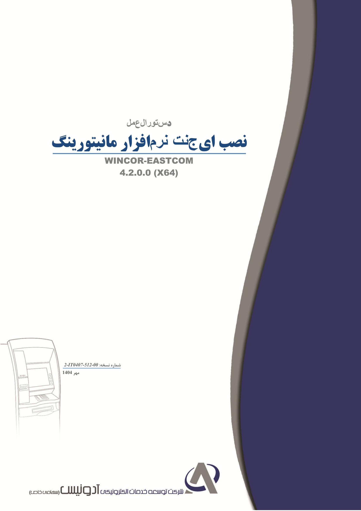
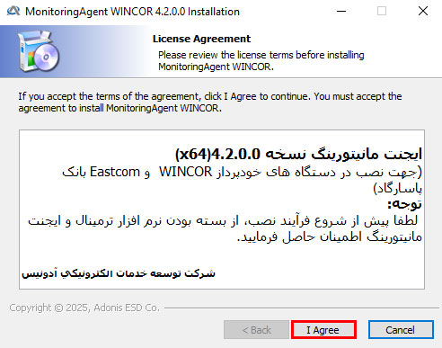
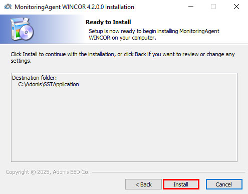
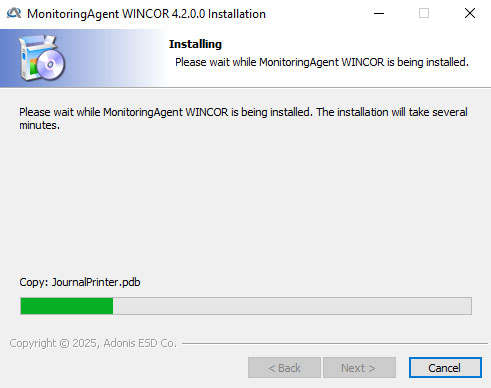
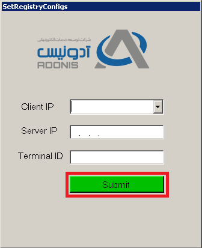

# Document metadata

- **Author:** Arash Tighbor
- **Last Modified By:** Arash Tighbor
- **Created:** 2019-08-24T03:24:00Z
- **Modified:** 2025-09-29T10:00:00Z
- **Document Name:** 2-IT0407-512-00_Pasargad-MonitoringAgent-WINCOR-EASTCOM_4.2.0.0 (X64).docx
- **Source File:** C:\Users\aa.eskandari\Desktop\input\2-IT0407-512-00_Pasargad-MonitoringAgent-WINCOR-EASTCOM_4.2.0.0 (X64).docx

---



**Image analysis**

```json
{
 "image_name": "image1.jpg",
 "rId": "rId8",
 "image_path": "img_folder/image_001_image1.jpg",
 "caption": "جلد دستورالعمل نصب ایجنت نرم افزار مانیتورینگ WINCOR-EASTCOM نسخه 4.2.0.0 x64",
 "ocr_text": "دستورالعمل\nنصب ایجنت نرم افزار مانیتورینگ\nWINCOR-EASTCOM\n4.2.0.0 (X64)\nشماره نسخه : 2-IT0407-512-00\nمهر 1404\nشرکت توسعه خدمات الکترونیکی آدونیس (سهامی خاص)",
 "visual_description": [
 "صفحه جلد یک سند فارسی با عنوان «نصب ایجنت نرم افزار مانیتورینگ»",
 "نام محصول/سیستم: WINCOR-EASTCOM",
 "نسخه نرم افزار: 4.2.0.0 (X64)",
 "شماره نسخه سند: 2-IT0407-512-00",
 "تاریخ: مهر 1404",
 "نام سازمان: شرکت توسعه خدمات الکترونیکی آدونیس (سهامی خاص)",
 "طرح گرافیکی شامل تصویر خطی یک دستگاه خودپرداز در پایین چپ و نوار عمودی در سمت راست"
 ],
 "image_type": "scan"
}
```

**دستورالعمل**

**نصب ایجنت نرم افزار مانیتورینگ**

**WINCOR-EASTCOM
4.2.0.0 (X64)**

**شماره نسخه: 2-IT0407-512-00**

**مهر 1404**


**Image analysis**

```json
{
 "image_name": "image2.png",
 "rId": "rId9",
 "image_path": "img_folder/image_002_image2.png",
 "caption": "لوگوی شرکت آدونیس و عبارت «شرکت توسعه خدمات الکترونیکی»",
 "ocr_text": "آدونیس شرکت توسعه خدمات الکترونیکی",
 "visual_description": [
 "لوگوی گرافیکی شامل یک حرف A خاکستری با دو قوس آبی پیرامون آن",
 "متن فارسی در سمت چپ تصویر: «آدونیس» و «شرکت توسعه خدمات الکترونیکی»"
 ],
 "image_type": "diagram"
}
```

این سند با عنوان «دستورالعمل نصب ایجنت نرم افزار مانیتورینگ WINCOR-EASTCOM 4.2.0.0 (X64)» در مهرماه 1404 در واحد تولید نرم افزار شرکت خدمات الکترونیکی آدونیس توسط خانم صغری شرافت تهیه و تنظیم تنظیم گردیده است.

این دستورالعمل در واحد آموزش، توسط آرش تیغ بر ویرایش و با شماره نسخه ی آماده انتشار گردید.

سابقه ویرایش :

<!-- TABLE_START -->
| | | | |
| --- | --- | --- | --- |
| **نام** **ویرایشگر** | **تاریخ** | **نام / سمت تاییدکننده** | **شماره نسخه قبلی** |
| | | | |
| | | | |
| | | | |
| | | | |
| | | | |
<!-- TABLE_END -->

<!-- TABLE_OF_CONTENTS_START -->
**فهرست**

[اقدامات لازم پیش از نصب نرم‌افزار مانیتورینگ 1](#_Toc85633665)

[نصب نرم افزار مانیتورینگ 1](#_Toc85633666)

<!-- TABLE_OF_CONTENTS_END -->

**حق طبع و نشر**

این سند در شرکت آدونیس تهیه و تنظیم گردیده است و انتشار محتویات آن و یا استفاده از آن در سایر مستندات، بدون کسب اجازه کتبی از شرکت آدونیس به هیچ عنوان مجاز نمی باشد.


**Image analysis**

```json
{
 "image_name": "image4.png",
 "rId": "rId17",
 "image_path": "img_folder/image_003_image4.png",
 "caption": "عبارت «بنام خدا» با خط فارسی روی پس زمینه سفید",
 "ocr_text": "بنام خدا",
 "visual_description": [
 "متن فارسی سیاه رنگ به صورت خوشنویسی روی پس زمینه سفید نمایش داده شده است",
 "هیچ نمودار، جدول، برچسب، فلش یا کادر متنی دیگری دیده نمی شود"
 ],
 "image_type": "scan"
}
```

مستند حاضر که مراحل نصب و بهره برداری از سامانه مانیتورینگ آدونیس را شامل می شود در امور توسعه محصول و جهت ارائه به امور پشتیبانی سطح دوم تهیه گردیده است[[1]](#footnote-1).

# اقدام لازم پیش از نصب نرم افزار مانیتورینگ

پیش از نصب نرم افزار مانیتورینگ لازم است وضعیت نصب نرم افزار مانیتورینگ را بررسی کنید؛ درصورتی که نرم افزار مانیتورینگ از قبل روی ترمینال نصب بوده است، ابتدا ProcessهایAppstart.exe، MonitoringService.exe و MonitoringAgent.exe را از Windows Task Manager ببندید. سپس از مسیر C:\Adonis\SSTApplication فایل اجرایی UninstallAD-AgentTerminal.exe را اجرا و منتظر بمانید تا عملیات Uninstall به صورت کامل انجام شود.

# نصب نرم افزار مانیتورینگ

به منظور نصب نرم افزار مانیتورینگ مراحل زیر را انجام دهید:

1. روی فایل MonitoringAgent\_WINCOR\_4.2.0.0(x64).exe دو کلیک کنید.
2. در پنجره ای که گشوده می شود روی دکمه ی I Agree کلیک کنید:



**Image analysis**

```json
{
 "image_name": "image5.jpg",
 "rId": "rId18",
 "image_path": "img_folder/image_004_image5.jpg",
 "caption": "پنجره نصب MonitoringAgent WINCOR با توافق نامه مجوز و دکمه I Agree",
 "ocr_text": "MonitoringAgent WINCOR 4.2.0.0 Installation\nLicense Agreement\nPlease review the license terms before installing MonitoringAgent WINCOR.\n\nIf you accept the terms of the agreement, click I Agree to continue. You must accept the agreement to install MonitoringAgent WINCOR.\n\nایجنت مانیتورینگ نسخه (x64)4.2.0.0\n(جهت نصب در دستگاه های خودپرداز WINCOR و Easstcom بانک پاسارگاد)\nتوجه:\nلطفا پیش از شروع فرآیند نصب، از بسته بودن نرم افزار ترمینال و ایجنت مانیتورینگ اطمینان حاصل فرمایید.\n\nشرکت توسعه خدمات الکترونیکی آدونیس\n\nCopyright © 2025, Adonis ESD Co.\n\n< Back\nI Agree\nCancel",
 "visual_description": [
 "پنجره نصب با عنوان MonitoringAgent WINCOR 4.2.0.0 Installation نمایش داده شده است",
 "بخش License Agreement با توضیحات انگلیسی درباره پذیرش توافق نامه وجود دارد",
 "یک کادر متن فارسی شامل نسخه (x64)4.2.0.0 و توضیح نصب برای WINCOR و Easstcom دیده می شود",
 "متن هشدار فارسی درباره بسته بودن نرم افزار ترمینال و ایجنت مانیتورینگ درج شده است",
 "نام شرکت «شرکت توسعه خدمات الکترونیکی آدونیس» و کپی رایت 2025 نمایش داده شده است",
 "دکمه های < Back (غیرفعال)، I Agree و Cancel در پایین پنجره قرار دارند"
 ],
 "image_type": "screenshot"
}
```

3. روی دکمه ی Install کلیک نمایید:



**Image analysis**

```json
{
 "image_name": "image6.jpg",
 "rId": "rId19",
 "image_path": "img_folder/image_005_image6.jpg",
 "caption": "پنجره نصب MonitoringAgent WINCOR با گزینه های Back، Install و Cancel",
 "ocr_text": "MonitoringAgent WINCOR 4.2.0.0 Installation\nReady to Install\nSetup is now ready to begin installing MonitoringAgent\nWINCOR on your computer.\n\nClick Install to continue with the installation, or click Back if you want to review or change any settings.\n\nDestination folder:\nC:\\Adonis\\SSTApplication\n\nCopyright © 2025, Adonis ESD Co.\n\n< Back\nInstall\nCancel",
 "visual_description": [
 "پنجره نصب با عنوان «MonitoringAgent WINCOR 4.2.0.0 Installation» نمایش داده شده است",
 "مرحله «Ready to Install» نشان می دهد نصب آماده شروع است",
 "مسیر نصب در بخش Destination folder برابر C:\\Adonis\\SSTApplication است",
 "سه دکمه پایین پنجره: < Back، Install، Cancel",
 "متن کپی رایت «Copyright © 2025, Adonis ESD Co.» در پایین دیده می شود"
 ],
 "image_type": "screenshot"
}
```

عملیات نصب با نمایش پنجره ی زیر آغاز خواهد شد:



**Image analysis**

```json
{
 "image_name": "image7.jpg",
 "rId": "rId20",
 "image_path": "img_folder/image_006_image7.jpg",
 "caption": "پنجره نصب MonitoringAgent WINCOR با نوار پیشرفت و مرحله کپی فایل JournalPrinter.pdb",
 "ocr_text": "MonitoringAgent WINCOR 4.2.0.0 Installation\nInstalling\nPlease wait while MonitoringAgent WINCOR is being installed\nPlease wait while MonitoringAgent WINCOR is being installed. The installation will take several minutes.\nCopy: JournalPrinter.pdb\nCopyright © 2025, Adonis ESD Co.,\n< Back\nNext >\nCancel",
 "visual_description": [
 "پنجره نصب ویندوز با عنوان «MonitoringAgent WINCOR 4.2.0.0 Installation» نمایش داده شده است",
 "مرحله نصب «Installing» و پیام انتظار برای اتمام نصب دیده می شود",
 "متن وضعیت شامل «Copy: JournalPrinter.pdb» است",
 "یک نوار پیشرفت افقی با بخش سبز پرشده نمایش داده شده است",
 "دکمه های «< Back»، «Next >» (غیرفعال) و «Cancel» در پایین پنجره وجود دارد",
 "متن کپی رایت «Copyright © 2025, Adonis ESD Co.,» در پایین دیده می شود"
 ],
 "image_type": "screenshot"
}
```

4. اطلاعات موردنیاز را با دقت در پنجره ی زیر درج نمایید:



**Image analysis**

```json
{
 "image_name": "image8.png",
 "rId": "rId21",
 "image_path": "img_folder/image_007_image8.png",
 "caption": "فرم تنظیمات رجیستری با فیلدهای IP کلاینت، IP سرور، شناسه ترمینال و دکمه Submit",
 "ocr_text": "SetRegistryConfigs\n\nآسان پرداخت امن\nادونیس\nADONIS\n\nClient IP\n\nServer IP\n\nTerminal ID\n\nSubmit",
 "visual_description": [
 "پنجره با عنوان SetRegistryConfigs نمایش داده شده است",
 "لوگوی ADONIS و متن فارسی «آسان پرداخت امن» و «ادونیس» در بالای فرم دیده می شود",
 "سه فیلد ورودی با برچسب های Client IP، Server IP و Terminal ID وجود دارد",
 "کنار فیلد Client IP یک دکمه کشویی (drop-down) دیده می شود",
 "دکمه سبز Submit با حاشیه قرمز در پایین فرم قرار دارد"
 ],
 "image_type": "screenshot"
}
```

<!-- TABLE_START -->
| | | |
| --- | --- | --- |
| **IP دستگاه** | = | **Client IP** |
| **شماره ترمینال دستگاه** | = | **Terminal ID** |
| **IP سرور مانیتورینگ** | = | **Server IP** |
<!-- TABLE_END -->

5. در پنجره ی فوق روی دکمه ی Submit کلیک کنید؛ بعد از گذشت 5 ثانیه، فرم به طور اتوماتیک بسته خواهد شد.
6. دستگاه را Restart نمایید.
7. پس از Inservice شدن وضعیت دستگاه با کارشناسان مستقر در بانک پاسارگاد به شماره **82898134-021** تماس حاصل نمایید.

مسیر نصب نرم افزار مانیتورینگ C:\Adonis و مسیر رجیستری آن به شرح زیر می باشد:

HKEY\_LOCAL\_MACHINE\SOFTWARE\WOW6432Node\Adonis

عملیات نصب تنها با دریافت تاییدیه از کارشناسان مستقر در بانک،
تمام شده در نظر گرفته خواهد شد.

1. **این سند در شرکت آدونیس تهیه و تنظیم گردیده است و انتشار محتویات آن و یا استفاده از آن در سایر مستندات، بدون کسب اجازه کتبی از شرکت آدونیس به هیچ عنوان مجاز نمی باشد.** [↑](#footnote-ref-1)