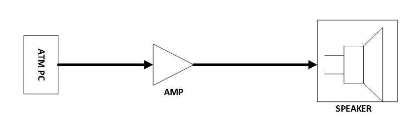
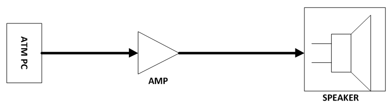
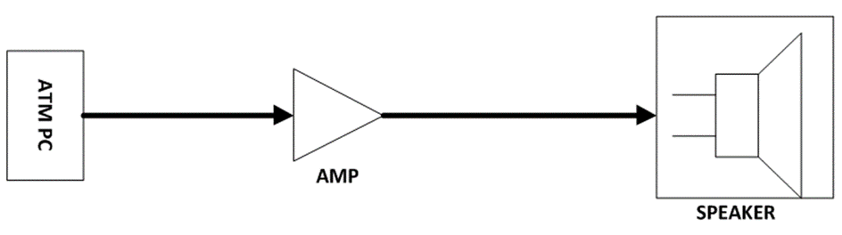

# Document metadata

- **Author:** Arash Tighbor
- **Last Modified By:** Arash Tighbor
- **Created:** 2014-05-28T10:52:00Z
- **Modified:** 2016-02-02T11:20:00Z
- **Document Name:** 2-IT9411-138-00_AudioSystem.docx
- **Source File:** C:\Users\aa.eskandari\Desktop\input\2-IT9411-138-00_AudioSystem.docx

---


**Image analysis**

```json
{
 "image_name": "image1.jpg",
 "rId": "rId8",
 "image_path": "img_folder/image_001_image1.jpg",
 "caption": "جلد مستندات سیستم صوتی در دستگاه های خودپرداز با مشخصات نسخه و تاریخ",
 "ocr_text": "مستندات\nسیستم صوتی\nدر دستگاه های خودپرداز\nشماره نسخه : 2-IT9411-138-00\nبهمن 1394\nشرکت توسعه خدمات الکترونیکی آدونیس (سهامی خاص)",
 "visual_description": [
 "صفحه عنوان یک سند فارسی با تیتر «سیستم صوتی در دستگاه های خودپرداز»",
 "ذکر شماره نسخه «2-IT9411-138-00» و تاریخ «بهمن 1394» در پایین صفحه",
 "نام سازمان «شرکت توسعه خدمات الکترونیکی آدونیس (سهامی خاص)» در پایین صفحه",
 "وجود تصویر خطی یک دستگاه خودپرداز در بخش پایین-چپ",
 "وجود نوارهای طراحی شده تیره در حاشیه راست صفحه و خطوط افقی آبی"
 ],
 "image_type": "scan"
}
```

**مستندات**

**سیستم صوتی**

**در دستگاه های خودپرداز**

**شماره نسخه: 2-IT9411-138-00**

**بهمن 1394**


**Image analysis**

```json
{
 "image_name": "image2.png",
 "rId": "rId9",
 "image_path": "img_folder/image_002_image2.png",
 "caption": "لوگوی شرکت توسعه خدمات الکترونیکی آدونیس",
 "ocr_text": "شرکت توسعه خدمات الکترونیکی\nآدونیس",
 "visual_description": [
 "متن فارسی «شرکت توسعه خدمات الکترونیکی» به رنگ آبی در مرکز تصویر قرار دارد",
 "متن «آدونیس» به رنگ خاکستری در سمت چپ دیده می شود",
 "یک نماد گرافیکی شبیه حرف A خاکستری با قوس های آبی در سمت راست قرار دارد",
 "پس زمینه تصویر مشکی است"
 ],
 "image_type": "diagram"
}
```

این سند با عنوان «مستندات سیستم صوتی در دستگاه های خودپرداز» در واحد پشتیبانی فنی تعمیرات شرکت توسعه خدمات الکترونیکی آدونیس تهیه و تنظیم شده است.

سند جاری در بهمن ماه 1394 در واحد آموزش امور فناوری اطلاعات تجمیع و شماره گذاری گردید؛
شماره نسخه : 2-IT9411-138-00 .

سابقه ویرایش:

<!-- TABLE_START -->
| | | |
| --- | --- | --- |
| **نام** **ویرایشگر** | **تاریخ** | **نام / سمت تاییدکننده** |
| | | |
| | | |
| | | |
| | | |
| | | |
<!-- TABLE_END -->

<!-- TABLE_OF_CONTENTS_START -->
فهرست

[راه اندازی سیستم صوتی در خودپرداز](#_Toc442175808) *[NCR](#_Toc442175808)**[5875](#_Toc442175808)* [1](#_Toc442175808)

[راه اندازی سیستم صوتی در خودپرداز](#_Toc442175815) *[NCR](#_Toc442175815)**[5886](#_Toc442175815)* [3](#_Toc442175815)

[راه اندازی سیستم صوتی در خودپرداز](#_Toc442175823) *[ProCash 2150/2050](#_Toc442175823)* [5](#_Toc442175823)

[راه اندازی سیستم صوتی در خودپرداز](#_Toc442175831) *[1500](#_Toc442175831)* [6](#_Toc442175831)

[راه اندازی سیستم صوتی در خودپرداز](#_Toc442175839) *[285](#_Toc442175839)* [7](#_Toc442175839)
<!-- TABLE_OF_CONTENTS_END -->


**Image analysis**

```json
{
 "image_name": "image5.png",
 "rId": "rId18",
 "image_path": "img_folder/image_003_image5.png",
 "caption": "متن خوشنویسی فارسی «به نام خدا» روی پس زمینه سفید",
 "ocr_text": "به نام خدا",
 "visual_description": [
 "تصویر شامل نوشته فارسی با خط خوشنویسی مشکی روی زمینه سفید است"
 ],
 "image_type": "scan"
}
```

# راه اندازی سیستم صوتی در خودپرداز NCR 5875

## اطلاعات عمومی

این ماژول باید دارای درگاه ورود اطلاعات از نرم افزار کنترل خودپرداز، درگاه تامین توان الکتریکی موردنیاز، سیستم مبدل صوتی، راه انداز و کنترل سخت افزاری آن (اسپیکر و آمپلی فایر) باشد.

در ذیل اجزای این ماژول به صورت شماتیک نشان داده شده اند:



**Image analysis**

```json
{
 "image_name": "image6.tmp",
 "rId": "rId19",
 "image_path": "img_folder/image_004_image6.png",
 "caption": "دیاگرام اتصال ATM PC به آمپلی فایر و سپس بلندگو",
 "ocr_text": "ATM PC\nAMP\nSPEAKER",
 "visual_description": [
 "یک بلوک مستطیلی با برچسب «ATM PC» در سمت چپ قرار دارد",
 "پیکان خروجی از «ATM PC» به یک نماد مثلثی آمپلی فایر می رود",
 "زیر نماد مثلثی متن «AMP» نوشته شده است",
 "یک پیکان از خروجی آمپلی فایر به یک نماد بلندگو در سمت راست متصل است",
 "زیر نماد بلندگو متن «SPEAKER» نوشته شده است"
 ],
 "image_type": "diagram"
}
```

## اطلاعات تخصصی

### PC

در نمونه طراحی شده جهت این پروژه اطلاعات ورودی به طبقه تقویت کننده (AMP) از طریق خروجی کارت صدای ATM تهیه می گردد. برای انتقال این داده، از کابل 3 رشته مخصوص انتقال صوت استریو (با حداقل توان موجود) درحالی که به دو سر آن جک استریو نری صدا {1/8" tip –ring-sleeve (TRS) 3.5mm} وصل شده استفاده می گردد.

### AMPLIFIRE

طبقه تقویت کننده تهیه شده علاوه بر ورودی اطلاعات از PC باید دارای اتصال به شبکه توان خودپرداز با ولتاژ 5VDC نیز باشد. این طبقه دارای توان خروجی 3W به صورت استریو و مناسب برای بلندگوهای با مقاومت ورودی 4Ω است.

### SPEAKER

بلندگو با مقاومت ورودی 4Ω و حداقل با توان 3W با اندازه 90mm×50mm تهیه شده است. ارتباط بلندگو و طبقه تقویت کننده از طریق کابل 2 رشته (با حداقل توان موجود) ترجیحاً سیم افشان درحالی که به یک سر آن فیش نری مونو {1/8" tip –ring- (RS) 3.5mm} و سر دیگر 2 عدد فیش تخت 3mm نصب گردیده میسر می گردد.

## جریان انجام فرآیند ساخت و نصب

این مستند با این روش که ماژول مذکور در محل سازمان تولید گردد، تهیه شده است. در محل شعبه براکت بلندگو به همراه باقی اجزای ماژول به روی دستگاه خودپرداز نصب می گردد و ارتباطات الکتریکی موردنیاز وصل می شوند. براکت موجود روی دستگاه بازمی گردد و جهت تجهیز به شرکت عودت می گردد . این روش با این رویکرد که حداقل زمان ممکن در محل شعبه صرف گردد انتخاب شده است.

# راه اندازی سیستم صوتی در خودپرداز NCR 5886

## اطلاعات عمومی

این ماژول باید دارای درگاه ورود اطلاعات از نرم افزار کنترل خودپرداز، درگاه تامین توان الکتریکی موردنیاز، سیستم مبدل صوتی، راه انداز و کنترل سخت افزاری آن (اسپیکر و آمپلی فایر) باشد.

در ذیل اجزای این ماژول به صورت شماتیک نشان داده شده اند:



**Image analysis**

```json
{
 "image_name": "image12.tmp",
 "rId": "rId25",
 "image_path": "img_folder/image_005_image12.png",
 "caption": "نمودار بلوکی اتصال ATM PC به آمپلی فایر و بلندگو",
 "ocr_text": "ATM PC\nAMP\nSPEAKER",
 "visual_description": [
 "سه بلوک با برچسب های ATM PC، AMP و SPEAKER نمایش داده شده اند",
 "یک پیکان ضخیم از ATM PC به سمت AMP و سپس به سمت SPEAKER کشیده شده است",
 "نماد AMP به شکل مثلث رو به راست (تقویت کننده) رسم شده است",
 "بلوک SPEAKER شامل نماد بلندگو با مستطیل و مخروط خروجی است"
 ],
 "image_type": "diagram"
}
```

## اطلاعات تخصصی

### ATM PC

در نمونه طراحی شده جهت این پروژه اطلاعات ورودی به طبقه تقویت کننده (AMP) از طریق خروجی کارت صدای ATM تهیه می گردد. برای انتقال این داده، از کابل 3 رشته مخصوص انتقال صوت استریو (با حداقل توان موجود) درحالی که به دو سر آن جک استریو نری صدا { 1/8" tip –ring-sleeve (TRS) 3.5mm } وصل شده استفاده می گردد.

### AMPLIFIRE

طبقه تقویت کننده تهیه شده علاوه بر ورودی اطلاعات از PC باید دارای اتصال به شبکه توان خودپرداز با ولتاژ 5VDC باشد. این طبقه دارای توان خروجی 3W به صورت استریو و مناسب برای بلندگوهای با مقاومت ورودی 4Ω می باشد.

### SPEAKER

بلندگو با مقاومت ورودی 4Ω و حداقل با توان 3W با اندازه 4 اینچ تهیه شده است. ارتباط بلندگو و طبقه
تقویت کننده از طریق کابل 2 رشته (با حداقل توان موجود) ترجیحاً سیم افشان درحالی که به یک سر آن فیش نری مونو { 1/8" tip –ring- (RS) 3.5mm } و سر دیگر 2 عدد فیش تخت 3mm نصب گردیده میسر می گردد.

### SPEAKER

بلندگو با مقاومت ورودی 4Ω و حداقل با توان 3W با اندازه 4 اینچ تهیه شده است. ارتباط بلندگو و طبقه تقویت کننده از طریق کابل 2 رشته (با حداقل توان موجود) ترجیحاً سیم افشان درحالی که به یک سر آن فیش نری مونو { 1/8" tip –ring- (RS) 3.5mm } و سر دیگر 2 عدد فیش تخت 3mm نصب گردیده میسر می گردد.

## جریان انجام فرآیند ساخت و نصب

این مستند با این روش که ماژول مذکور در محل سازمان تولید گردد، تهیه شده است. در محل شعبه براکت بلندگو به همراه باقی اجزای ماژول به روی دستگاه خودپرداز نصب می گردد و ارتباطات الکتریکی موردنیاز وصل می شوند. این روش با این رویکرد که حداقل زمان ممکن در محل شعبه صرف گردد انتخاب شده است.

# راه اندازی سیستم صوتی در خودپردازProCash

# 2050و 2150

## اطلاعات عمومی

این ماژول باید دارای درگاه ورود اطلاعات از نرم افزار کنترل خودپرداز، درگاه تامین توان الکتریکی موردنیاز، سیستم مبدل صوتی، راه انداز و کنترل سخت افزاری آن (اسپیکر و آمپلی فایر) باشد.

در ذیل اجزای این ماژول به صورت شماتیک نشان داده شده اند:


**Image analysis**

```json
{
 "image_name": "image13.png",
 "rId": "rId26",
 "image_path": "img_folder/image_006_image13.png",
 "caption": "نمودار بلوکی اتصال ATM PC به آمپلی فایر و سپس بلندگو",
 "ocr_text": "ATM PC\nAMP\nSPEAKER",
 "visual_description": [
 "سه بلوک با برچسب های ATM PC، AMP و SPEAKER نمایش داده شده اند",
 "پیکان جهت دار از ATM PC به AMP و سپس از AMP به SPEAKER کشیده شده است",
 "AMP به شکل نماد مثلثی تقویت کننده ترسیم شده است",
 "SPEAKER به شکل نماد بلندگو داخل یک قاب مستطیلی نمایش داده شده است"
 ],
 "image_type": "diagram"
}
```

## اطلاعات تخصصی

### ATM PC

در نمونه طراحی شده جهت این پروژه اطلاعات ورودی به طبقه تقویت کننده (AMP) از طریق خروجی کارت صدای ATM تهیه می گردد. برای انتقال این داده، از کابل 3 رشته مخصوص انتقال صوت استریو (با حداقل توان موجود) درحالی که به دو سر آن جک استریو نری صدا { 1/8" tip –ring-sleeve (TRS) 3.5mm } وصل شده استفاده می گردد.

### AMPLIFIRE

طبقه تقویت کننده تهیه شده علاوه بر ورودی اطلاعات از PC باید دارای اتصال به شبکه توان خودپرداز با ولتاژ 5VDC باشد. این طبقه دارای توان خروجی 3W به صورت استریو و مناسب برای بلندگوهای با مقاومت ورودی 4Ω می باشد.

### SPEAKER

بلندگو با مقاومت ورودی 4Ω و حداقل با توان 3W با اندازه 4 اینچ تهیه شده است. ارتباط بلندگو و طبقه تقویت کننده از طریق کابل 2 رشته (با حداقل توان موجود) ترجیحاً سیم افشان درحالی که به یک سر آن فیش نری مونو { 1/8" tip –ring- (RS) 3.5mm } و سر دیگر 2 عدد فیش تخت 3mm نصب گردیده میسر می گردد.

## جریان انجام فرآیند ساخت و نصب

این مستند با این روش که ماژول مذکور در محل سازمان تولید و روی پلیت بلندگو FASCIA نصب گردد تهیه شده است. در محل شعبه پلیت بلندگو FASCIA خودپرداز بازشده و با پلیت بلندگو FASCIA تجهیز شده تعویض
می گردد و ارتباطات الکتریکی موردنیاز وصل می شوند. این روش با این رویکرد که حداقل زمان ممکن در محل شعبه صرف گردد انتخاب شده است.

# راه اندازی سیستم صوتی در خودپرداز1500

# اطلاعات عمومی

این ماژول باید دارای درگاه ورود اطلاعات از نرم افزار کنترل خودپرداز، درگاه تامین توان الکتریکی موردنیاز، سیستم مبدل صوتی، راه انداز و کنترل سخت افزاری آن (اسپیکر و آمپلی فایر) باشد.

در ذیل اجزای این ماژول به صورت شماتیک نشان داده شده اند:


**Image analysis**

```json
{
 "image_name": "image13.png",
 "rId": "rId26",
 "image_path": "img_folder/image_006_image13.png",
 "caption": "نمودار بلوکی اتصال ATM PC به آمپلی فایر و سپس بلندگو",
 "ocr_text": "ATM PC\nAMP\nSPEAKER",
 "visual_description": [
 "سه بلوک با برچسب های ATM PC، AMP و SPEAKER نمایش داده شده اند",
 "پیکان جهت دار از ATM PC به AMP و سپس از AMP به SPEAKER کشیده شده است",
 "AMP به شکل نماد مثلثی تقویت کننده ترسیم شده است",
 "SPEAKER به شکل نماد بلندگو داخل یک قاب مستطیلی نمایش داده شده است"
 ],
 "image_type": "diagram"
}
```

## اطلاعات تخصصی

### ATM PC

در نمونه طراحی شده جهت این پروژه اطلاعات ورودی به طبقه تقویت کننده (AMP) از طریق خروجی کارت صدای ATM تهیه می گردد. برای انتقال این داده از کابل 3 رشته مخصوص انتقال صوت استریو (با حداقل توان موجود) درحالی که دو سر آن جک استریو نری صدا { 1/8" tip –ring-sleeve (TRS) 3.5mm } وصل شده استفاده می گردد.

### AMPLIFIRE

طبقه تقویت کننده تهیه شده علاوه بر ورودی اطلاعات از PC باید دارای اتصال به شبکه توان خودپرداز با ولتاژ 5VDC باشد. این طبقه دارای توان خروجی 3W به صورت استریو و مناسب برای بلندگوهای با مقاومت ورودی 4Ω می باشد.

### SPEAKER

بلندگو با مقاومت ورودی 4Ω و حداقل با توان 3W با اندازه بلندگو 70mm× 40mm تهیه شده است. ارتباط بلندگو و طبقه تقویت کننده از طریق کابل 2 رشته (با حداقل توان موجود) ترجیحاً سیم افشان درحالی که به یک سر آن فیش نری مونو { 1/8" tip –ring- (RS) 3.5mm } و سر دیگر 2 عدد فیش تخت 3mm نصب گردیده میسر می گردد.

## جریان انجام فرآیند ساخت و نصب

این مستند با این روش که ماژول مذکور در محل سازمان تولید گردد، تهیه شده است. در محل شعبه 2 عدد بلندگو روی خودپرداز نصب می گردد و ارتباطات الکتریکی موردنیاز وصل می شوند. این روش با این رویکرد که حداقل زمان ممکن در محل شعبه صرف گردد انتخاب شده است.

# راه اندازی سیستم صوتی در خودپرداز 285

## اطلاعات عمومی

این ماژول باید دارای درگاه ورود اطلاعات از نرم افزار کنترل خودپرداز، درگاه تامین توان الکتریکی موردنیاز، سیستم مبدل صوتی، راه انداز و کنترل سخت افزاری آن (اسپیکر و آمپلی فایر) باشد.

در ذیل اجزای این ماژول به صورت شماتیک نشان داده شده اند:



**Image analysis**

```json
{
 "image_name": "image14.png",
 "rId": "rId27",
 "image_path": "img_folder/image_007_image14.png",
 "caption": "نمودار بلوکی اتصال ATM PC به تقویت کننده و سپس بلندگو",
 "ocr_text": "ATM PC\nAMP\nSPEAKER",
 "visual_description": [
 "یک بلوک مستطیلی با برچسب «ATM PC» در سمت چپ قرار دارد",
 "یک فلش جهت دار از «ATM PC» به نماد تقویت کننده مثلثی می رود",
 "نماد مثلثی با برچسب «AMP» در وسط نمودار است",
 "یک خط/فلش از «AMP» به بلوک بلندگو در سمت راست متصل است",
 "بلوک سمت راست شامل نماد بلندگو و برچسب «SPEAKER» است"
 ],
 "image_type": "diagram"
}
```

## اطلاعات تخصصی

### ATM PC

در نمونه طراحی شده جهت این پروژه اطلاعات ورودی به طبقه تقویت کننده (AMP) از طریق خروجی کارت صدای ATM تهیه می گردد. برای انتقال این داده از کابل 3 رشته مخصوص انتقال صوت استریو (با حداقل توان موجود) درحالی که به دو سر آن جک استریو نری صدا { 1/8" tip –ring-sleeve (TRS) 3.5mm } وصل شده استفاده می گردد.

### AMPLIFIRE

طبقه تقویت کننده تهیه شده علاوه بر ورودی اطلاعات از PC باید دارای اتصال به شبکه توان خودپرداز با ولتاژ 5VDC باشد . این طبقه دارای توان خروجی 3W به صورت استریو و مناسب برای بلندگوهای با مقاومت ورودی 4Ω می باشد .

### SPEAKER

بلندگو با مقاومت ورودی 4Ω و حداقل با توان 3W با اندازه 2 اینچ تهیه شده است . ارتباط بلندها گو و طبقه تقویت کننده از طریق کابل 2 رشته ( با حداقل توان موجود ) ترجیحاً سیم افشان درحالی که به یک سر آن فیش نری مونو { 1/8" tip –ring- (RS) 3.5mm } و سر دیگر 2 عدد فیش تخت 3mm نصب گردیده میسر می گردد .

## جریان انجام فرآیند ساخت و نصب

این مستند با این روش که ماژول مذکور در محل سازمان تولید گردد تهیه شده است. در محل براکت های نصب به همراه 2 عدد بلندگو روی دستگاه خودپرداز نصب و ارتباطات الکتریکی موردنیاز وصل می شوند. این روش با این رویکرد که حداقل زمان ممکن در محل شعبه صرف گردد انتخاب شده است.